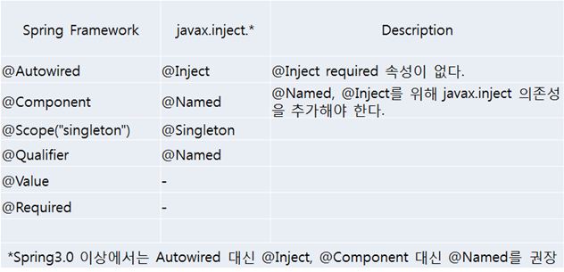
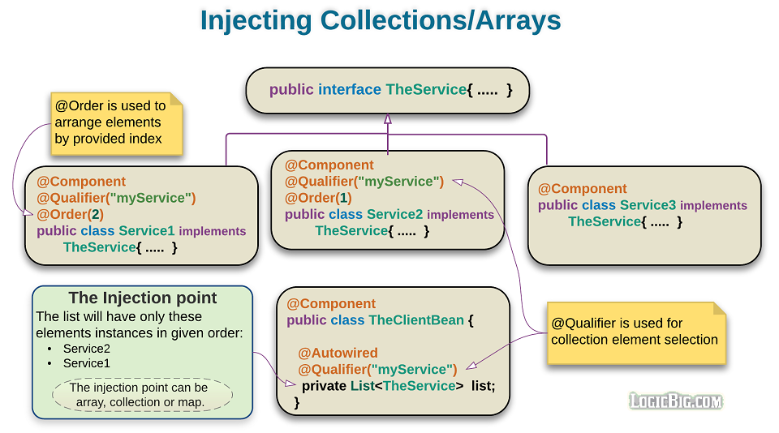

***

# 1.3. Annotation 살펴보기

## 빈 컨테이너 등록 용 애노테이션

스프링 컨테이너는 base-package의 클래스를 검색해서 자동으로 자바 빈으로 등록하는 데 이에 해당하는 것이 `@Component`, `@Repository`, `@Service`, `@Contoroller`, `@RestController`, `@Configuration` 애노테이션이다.

<p align="center"></p>

`@Controller`, `@Service`, `@Repository`는 Presentation, Service, Data Access 계층을 나타내기 위한 `@Component`의 특별한 형태이다.

자동스캔을 위해서 XML 기반의 설정에서는 `<context:component-scan base-package="a.b.c" />` 태그와 같이 base-package를 기술하며, 자바설정 기반인 경우 `@ComponentScan` 애노테이션을 사용하거나 AnnotationConfigApplicationContext#scan() 메소드를 이용하여 직접 스캐닝을 기술할 수 있다.

#### `@Component`

일반적인 용도의 컴포넌트들을 표시하는 기본 스테레오 타입, 멤버변수와 getter, setter만 가지고 있는 DTO, VO 같은 컴포넌트를 지칭한다. 스프링이 `@Component` 붙은 자바 클래스를 클래스패스 경로에서 자동으로 찾아 Application Context안에 이름을 부여하고 빈으로 등록한다. 빈의 기본 Scope는 songleton이며 `@Scope` 애노테이션으로 변경 가능하다.

#### `@Controller`, `@RestController`

프리젠테이션 레이어의 컨트롤러 컴포넌트, Spring MVC의 컨트롤러에 부여한다.

#### `@Service`

비즈니스 로직을 담고 있는 서비스 레이어의 컴포넌트를 가리키며 `@Component` 애노테이션과 동작은 같지만 서비스 계층의 클래스들은 `@Service` 애노테이션을 부여하는 것이 코드 가독성이 좋다.

#### `@Repository`

영속성 계층(Persistence Layer, Data Access Layer, 주로 DB와 관련된 작업을 수행)의 DAO 컴포넌트에 부여하는 애노테이션, `@Component`의 역할과 유사하며 DAO 메소드가 던지는 예외(Unckecked Exception)를 스프링의 DataAccessException으로 변환한다.

## 의존관계 설정 용 애노테이션

#### `@Scope`

일반적으로 `@Component`, `@Service`, `@Repository` 애노테이션이 붙어있어 스프링 IoC 컨테이너가 자동 스캐닝한 자바빈은 싱글톤 형태로 하나만 생성하는데 이를 변경하려면 `@Scope` 애노테이션을 사용하면 된다.

스프링에서 자바빈의 Scope : 스프링 프레임워크의 IoC 컨테이너는 개발자를 대신해서 빈을 생성, 생명주기를 관리해 주고, 스프링 애플리케이션에서 빈이 필요한 시점에 스프링이 빈을 주입(DI, 의존성 주입)해 준다는 것이다. 이 때 기본적으로 모든 빈을 싱글톤으로 컨테이너에 하나만 생성하여 관리한다. 그래서 스프링 컨테이너에게 빈을 제공받으면 언제나 주입받은 빈은 동일한 객체라는 것이다.

* **singleton**: IoC 컨테이너당 하나의 빈을 리턴

* **prototype**: IoC 컨테이너가 요청이 있을 때 마다 새로운 빈을 만들어 리턴

* **request**: HTTP request의 생명주기 안에 단 하나의 객체만 존재

* **session**: HTTP session의 생명주기 안에 단 하나의 객체만 존재

* **globalSession**: 전체 모든 세션에 대해 하나의 빈을 리턴

```
@Scope("prototype") 또는 @Scope(value = ConfigurableBeanFactory.SCOPE_PROTOTYPE)
```

#### `@Autowired`

Spring Framework에 종속적인 애노테이션 이다. 빈의 id, name로 아무거나 맞으면 적용(Type Driven Injection). 여러개의 빈이 검색될 경우 `@Qualifier(name="xxx")` 애노테이션으로 구분한다. 기본적으로 `@Autowired`된 속성은 모두 빈이 주입되어야 한다. 주입될 빈이 없는 경우가 있다면 required=false로 설정하면 오류는 발생하지 않는다. 멤버변수, setter 메소드, 생성자, 일반 메소드에 적용 가능하다.

#### `@Resource`

Spring2.5 이상에서 사용가능하며 Spring Framework에 비종속적으로 권장하는 방식이다. 빈의 name으로 주입될 빈을 찾는다. 멤버변수, setter 메소드에 적용가능. 사용하기 위해서는 jsr250-api.jar가 클래스패스에 추가되야 한다.



#### `@Required`

Setter 메소드 위에 기술하여 필수 프로퍼티를 설정하는 용도로 사용된다. `@Required` 애노테이션이 사용되기 위해서는 RequiredAnnotationBeanPostProcessor 클래스를 빈으로 등록하거나 `<context:annotation-config>` 설정을 추가하면 된다.

#### `@Order`

Spring4에서 새로 소개된 `@Order` 애노테이션은 같은 타입의 빈이 컬렉션(List등)에 Autowired 될 때 그 순서를 지정한다. 낮은 숫자가 우선순위가 높다.

#### `@PostConstruct`

객체가 생성된 후 별도의 초기화 작업을 위해 실행하는 메소드를 선언한다.
 CommonAnnotationBeanPostProcessor 클래스를 빈으로 등록시키거나 `<context:annotation-config>` 태그를 사용하면 된다.

#### `@ContextConfiguration`

Junit 테스트에서 애플리케이션 컨텍스트를 로딩할 때 주로 사용하는 애노테이션으로 설정파일의 위치를 지정한다.



위 그림을 보고 그대로 클래스를 작성하여 그림이 말하는 대로에 결과를 얻을 수 있는지 확인해 보자.
