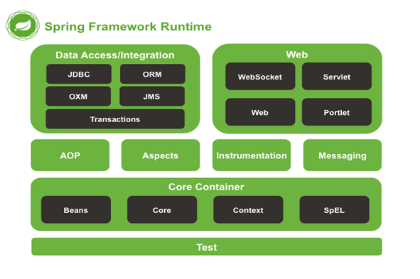

<style>
body, p, li {
   font-size: 15px;
}
</style>


---

# 1. Spring IoC/DI

## Spring Framework

스프링은 2004년 Rod Johnson이 만든 제어 역행과 관점지향 기술을 제공하는 경량의 오픈소스 프레임워크이다. 스프링은 Java 애플리케이션 개발을 위한 포괄적인 인프라 지원을 제공하는 Java 플랫폼으로써 성장했다. 지금은 자바가 필요해서 배우기보다는 스프링 프레임워크를 사용하기 위해서 자바를 배운다고 해도 과언이 아닌 시대가 되었다. 스프링은 인프라 스트럭처를 처리하므로 애플리케이션의 비즈니스 로직에 집중할 수 있도록 도와준다. 스프링을 사용하면 POJO(Plain Old Java Object)로 애플리케이션을 구축하고 비침투성 엔터프라이즈 서비스를 적용할 수 있기 때문에 기능의 확장에 편리함을 제공한다.

<p align="center"></p>

Spring Framework란 Aspect Oriented Programming, Portable Service Abstraction, Inversion of Control / Dependency Injectoin 기술을 바탕으로 Plain Old Java Object를 지향하는 경량의 오픈소스 프레임워크라고 정의할 수 있다. AOP, PSA, IoC/DI 기술은 스프링의 3대 핵심 기반기술이다. 스프링 프레임워크를 제대로 이해하기 위해서는 기반기술을 제대로 이해할 필요가 있다.

**POJO**
개발자가 필요로 하는 코드만 존재하는 순수한 객체다. 반드시 구성해야 하는 환경관련 코드가 없고 특정 기술을 위한 코드 또한 강제되지 않는 상태로써 개발자가 의도한 비즈니스 로직만이 존재하는 상태의 자바 객체를 포조라고 부른다.

**1. 서비스 추상화(Portable Service Abstractions)**
다른 프로그램과의 연동 부분에 추상화 레이어를 제공하여 공통 기능을 적용하거나 연동 프로그램과 관련한 변경작업 시 개발자의 코드를 보호하여 직접적인 코드의 변경을 막아준다.

**2. 객체관리 주체의 역전(Inversion of Control/Dependency Injection)**
개발자가 직접 객체를 생성, 관계설정을 행하는 대신 프레임워크가 개발자의 요청에 따라서 객체를 생성하여 빈 컨테이너에서 관리하고 객체가 사용해야 하는 `의존 객체를 주입(Dependency Injection)`해 주는 서비스를 제공한다. 객체가 의존하는 다른 객체의 변경이 있더라도 변화를 프로그램내 코드로 행하지 않고 외부로 분리한 선언적인 설정으로 처리하여 개발자의 코드의 변경을 막는다.

**3. 관점 지향 프로그래밍(Aspect Oriented Programming)**
전역적으로 다수의 메소드에서 수행해야 하는 공통적인 부가로직을 별도로 분리한다. 선언적인 설정으로 부가로직을 다수의 객체의 다수의 메소드와 엮는 작업을 통해서 적용한다. 이렇게 하면 부가로직의 적용/비적용 또는 변경 작업 시 직접적인 코드의 변경을 막을 수 있다.

* 스프링 프레임워크를 사용하면 연동 프로그램의 변경, 의존 객체의 변경, 공통적인 부가로직의 변경이 있어도 개발자의 코드를 변경하지 않고 이를 처리할 수 있다.

* 프레임워크를 이용하면 프로그램 코드의 작성 분량을 줄일 수 있으며 프로그램의 작성방법에 대한 관습을 강제로 제어할 수 있어서 협업에 유리하다. 가이드와 표준에 의한 개발을 따르도록 제어하며 읽기 쉬운 프로그램 코드를 얻을 수 있다.

* IoC 컨테이너를 사용하여 의존관계를 주입할 수 있으며 AOP를 이용하여 공통 기능을 소스코드 변경없이 필요한 곳에 적용할 수 있다.

* 복잡한 엔터프라이즈 애플리케이션 개발을 겨냥하여 자바빈즈를 사용한다. 선언적 트랜잭션 관리, 웹서비스, RMI등에 원격접근이 가능하며 데이터 영속성 관리를 위한 다양한 옵션을 제공한다.

* 단순성, 테스트 용이성, 느슨한 결합성의 측면에서 스프링을 사용하면 얻을 수 있는 이점이 상당하며 MVC Framework로써 필요한 모든 부분에 대해서 지원하고 있다.

* 최근에는 스프링 부트(Spring Boot)를 제공하여 복잡한 스프링 프로젝트의 구성을 간편화 하도록 지원하고 있어서 더욱 빠른 개발이 가능해졌다.

## 프레임워크 모듈

SpringFramework는 20개 정도의 모듈로 기능을 제공한다. 이러한 모듈은 다음 다이어그램과 같이 Core Container, Data Access/Integration, Web, AOP, Instrumentation, Messaging, and Test 등으로 그룹화되어 있다.




스프링의 선언적인 트랜잭션 관리 기능은 웹 어플리케이션이 EJB 컨테이너가 관리하는 트랜잭션처럼 완전한 트랙잭션 기능을 가지게 한다. 모든 커스텀 비즈니스 로직은 간단한 POJO로 구현할 수 있고 스프링의 IoC 컨테이너로 관리할 수 있다. 추가적인 서비스는 이메일을 보내는 기능을 지원하고 어디서 유효성 확인 규칙을 실행할 것인지 선택하는 웹 계층과는 독립적인 유효성 확인에 대한 지원을 포함한다. 스프링의 ORM 지원은 JPA, Hibernate, JDO, iBatis와 통합되었다. 예를 들면 하이버네이트를 사용할 때 이미 존재하는 매핑 파일과 표준 하이버네이트 SessionFactory 설정을 계속 사용할 수 있다. 폼(Form) 컨트롤러는 도메인 모델에 대한 값으로 HTTP 파라미터를 전달하는 ActionForms나 다른 클래스에 대한 필요성을 제거함으로써 도메인 모델과 웹 계층을 자연스럽게 통합한다.

## Spring Framework Artifacts

| GroupId | ArtifactId | Description |
| :--- | :--- | :--- |
| org.springframework | spring-aop | Proxy-based AOP support |
| org.springframework | spring-aspects | AspectJ based aspects |
| org.springframework | spring-beans | Beans support, including Groovy |
| org.springframework | spring-context | Application context runtime, including scheduling and remoting abstractions |
| org.springframework | spring-context-support | Support classes for integrating common third-party libraries into a Spring application context |
| org.springframework | spring-core | Core utilities, used by many other Spring modules |
| org.springframework | spring-expression | Spring Expression Language (SpEL) |
| org.springframework | spring-instrument | Instrumentation agent for JVM bootstrapping |
| org.springframework | spring-instrument-tomcat | Instrumentation agent for Tomcat |
| org.springframework | spring-jdbc | JDBC support package, including DataSource setup and JDBC access support |
| org.springframework | spring-jms | JMS support package, including helper classes to send/receive JMS messages |
| org.springframework | spring-messaging | Support for messaging architectures and protocols |
| org.springframework | spring-orm | Object/Relational Mapping, including JPA and Hibernate support |
| org.springframework | spring-oxm | Object/XML Mapping |
| org.springframework | spring-test | Support for unit testing and integration testing Spring components |
| org.springframework | spring-tx | Transaction infrastructure, including DAO support and JCA integration |
| org.springframework | spring-web | Foundational web support, including web client and web-based remoting |
| org.springframework | spring-webmvc | HTTP-based Model-View-Controller and REST endpoints for Servlet stacks |
| org.springframework | spring-websocket | WebSocket and SockJS infrastructure, including STOMP messaging support |

## 용어설명

#### IoC(Inversion of Control)

제어의 역전은 프로그래머가 작성한 프로그램이 재사용 라이브러리의 흐름제어를 받게되는 소프트웨어 디자인패턴을말한다. 줄여서 IoC라고 부른다. 전통적인 프로그래밍에서 흐름은 프로그래머가 작성한 프로그램이 외부 라이브러리의 코드를 호출하는 방식으로 이용한다. 하지만 제어의 역전이 적용된 구조에서는 외부 라이브러리의 코드가 프로그래머가 작성한 코드를 호출한다.

> 제어의 역전이라 객체의 생성 및 관계설정을 개발자가 직접하지 않고 대신 프레임워크가 맡아서 처리하는 것을 말한다. 

#### DI(Dependency Injection)

마틴파울러는 2004년 글에서 제어의 어떤측면이 역전되는 것인지에 대한 의문을 제기하고 의존하는 객체를 역행적으로 취득하는 것이라는 결론을 내렸다. 그는 그와 같은 정의에 기초하여 제어의 역전(IoC)이라는 용어에 좀 더 참신한 의존성 주입(DI)이라는 이름을 지어줬다.

모든 어플리케이션은 비지니스 로직을 수행하기 위해서 서로 협업하는 둘 또는 그 이상의 객체들로 이루어진다. 전통적으로 각 객체는 협업할 객체의 참조를 취득해야 하는 책임이 있다. 이것이 의존성이다.

IoC를 적용함으로써 객체들은 시스템 내의 각 객체를 조정하는 어떤 외부의 존재에 의해 생성 시점에서 의존성을 부여 받는데, 이를 의존성이 객체로 주입된다고 말한다. 따라서, IoC는 한 객체가 협업해야 하는 다른 객체의 참조를 취득하는 방법에 대한 제어의 역행이라는 의미를 갖는다.

<p align="center"></p>

> 의존성 주입이란 A가 객체가 사용하고자 하는 대상 객체를 스스로 선택하지 않고 대상 객체 B, C 중에서 무엇을 사용할지를 외부에서 결정한 후 선택된 객체를 A에게 주면 A는 수동적으로 받은 객체를 사용하는 방식을 말한다. A 객체는 코드적으로 자신이 사용하는 대상 객체가 무엇인지 알지 못하며 알게해서도 안 된다.

#### IoC 분류

일반적으로 IoC는 의존성 주입(DI), 의존성 룩업(DL) 두개의 하위 분류로 나눌 수 있으며 일반적으로 DI를 이야기 할 때는 IoC를 가리키지만 IoC를 이야기 할 때는 DI를 가리키는 것은 아니다. DI도 여러종류(세터주입, 생성자주입, 메소드주입)가 있지만 DL의 경우도 의존성풀(Dependency Pool)과 컨텍스트화된 의존성룩업(Contextualized Dependency Lookup) 두 종류가 있다.

<p align="center"></p>

## Dependency Injection

각 계층 사이, 각 객체 사이에 필요로 하는 의존관계가 있다면 이를 스프링 컨테이너가 자동 적으로 연결시켜 주는 것으로 각 객체 사이의 의존관계를 Bean 설정 정보 또는 애노테이션을 바탕으로 컨테이너가 자동적으로 연결해 주는 것이다.

**1. Setter Injection**
객체 사이의 의존관계를 연결시키기 위해 setter 메소드를 이용하는 방법.

**2. Constructor Injection**
객체 사이의 의존관계를 연결시키기 위해 생성자를 이용하는 방법.

**3. Method Injection**
Method Injection은 Setter Injection과 Constructor Injection이 가지고 있는 한계점을 극복하기 위하여 지원하고 있는 DI의 한 종류이다. 어떤 메소드의 실행을 다른 메소드로 대체한다든지 또는 메소드의 리턴형을 추상클래스로 지정한 후 필요에 따라 추상클래스를 상속받은 임의의 객체를 리턴 하도록 구성할 수 있다.

* 생성자 주입은 컴포넌트를 사용하기 전에 의존 해야하는 클래스의 인스턴스를 가지고 있어야 할 때 유용하며 세터주입은 부모 컴포넌트의 새 인스턴스를 생성하지 않고 동적으로 각기 다른 구현을 사용해 의존성을 대체할 수 있다. 생성자 주입이나 세터주입 모두 의존성을 인터페이스로 선언할 수 있다.

* 기본 생성자만 있는 클래스에 생성자 주입을 정의하면 비 IoC 환경에서 해당 클래스를 사용하는 모든 클래스에 영향을 주게 된다. 하지만 세터 주입의 경우 다른 클래스가 이 클래스와 상호작용 하는데 있어 영향을 덜 주게 된다.

* 일반적으로 세터 주입을 이용하는 것이 좋다. 이 방식은 비 IoC 설정에서 코드를 사용하는데 최소한의 영향만을 주기 때문이다. 생성자 주입은 컴포넌트로 항상 의존성이 전달되게 할 때 적합하다.

## Dependency Lookup

모든 IoC 컨테이너는 각 컨테이너에서 관리해야 하는 객체들을 관리하기 위한 별도의 저장소를 가진다. Bean에 접근하기 위하여 컨테이너에서 제공하는 API를 이용하여 사용하고자 하는 Bean을 Lookup 하는 것으로 컨테이너 API와 의존관계를 많이 가지면 가질수록 어플리케이션 컨테이너에 종속되는 단점이 있다.

#### Dependency Pull

IoC 타입중 가장 익숙한 타입으로 필요할 때 마다 레지스트리에서 의존성을 가지고 온다. EJB의 경우 JNDI API를 통해 EJB 컴포넌트를 룩업 한다.

<p align="center"></p>

#### Contextualized Dependency Lookup

컨테이너는 내부 WAS(톰캣, JBOSS 등)나 스프링 프레임워크에서 제공한다.

<p align="center"></p>

```java
ApplicationContext context = new ClassPathXmlApplicationContext("application-context.xml");
MyBean bean = context.getBean("myBean")
```

## Injection vs Lookup

어떤 IoC 방식을 사용할지는 별로 어렵지 않다. 스프링의 경우 초기 빈 Lookup을 제외하면 의존성이 항상 Injection 형태의 IoC를 사용하게 된다. 대부분의 환경에서 DI를 사용해서 모든 객체를 연결할 수는 없으며 초기 컴포넌트에 접근 시 DL을 사용해야 하는 경우가 많다. 예를 들어 일반 자바 APP에서는 main에서 스프링 컨테이너를 부트스트랩하고 ApplicationContext 인터페이스를 통해 의존객체를 가져와야 한다. 즉 스프링에서는 DI를 사용할 수 있으면 사용하고 그렇지 못한 경우라면 DL을 사용하면 된다.

의존성 풀 방식의 코드는 레지스트리에 대한 참조를 가지고 있어야 하고 레지스트리와 연동해서 의존성 객체를 가지고 와야 한다. 또한 CDL을 사용시 특정 인터페이스를 구현해야 하고 모든 의존성을 직접 가지고 와야 한다. 하지만 의존성 주입(Dependency Injection)을 사용하면 적절한 생성자, 메소드, 세터 등을 통해 의존성을 주입 받기만 하면 된다.

## BeanFactory

* 스프링의 의존성 주입의 핵심 인터페이스

* Bean의 생성과 소멸을 담당(의존성과 생명주기 및 관리 담당), 객체를 관리하는 고급 설정 기법 제공

* DI 지원 기능만 필요하다면 BeanFactory 인터페이스를 이용해 스프링 DI 컨테이너와 직접 연동할 수 있다. 이 경우 애플리케이션은 BeanFactory 인터페이스를 구현한 클래스의 인터페이스를 생성하고 이 인스턴스에 빈과 의존성 설정 정보를 저장해야 한다.

* BeanFactory를 프로그래밍적으로 설정할 수도 있지만 대부분 설정 파일을 통해 외부에서 설정하는 방식을 사용한다.

* 스프링에서 기본적으로 제공하는 두개의 메인 BeanFactory는 BeanDefinitionRegistry를 구현하고 있다. PropertiesBeanDefinitionReader는 프로퍼티 파일에서 Bean정의를 읽고 XmlBeanDefinition Reader는 XML 파일에서 Bean정의를 읽는다.

## ApplicationContext

* BeanFactory의 모든 기능 제공(BeanFactory 인터페이스를 상속)

* 권장하는 방식으로 스프링 DI 뿐 아니라 트랜잭션, AOP 서비스, 국제화를 위한 메시지 소스, 애플리케이션 이벤트 처리

* Spring Framework2.5 이상부터 ApplicationContext 설정시 자바 어노테이션을 지원

* XML 설정 방식을 쓰면 모든 설정을 자바코드로 부터 외부 XML에 둠

* Annotation  방식의 경우 자바코드 내에서 DI 설정을 정의

* XML/Annotation  둘 동시에 사용되는 경우 XML 설정이 우선  
  한다. 주로 데이터소스, 트랜잭션 매니저, JMX, JMS커넥션팩터리등 애플리케이션 인프라 스트럭처에는 XML 파일에 저장하고 DI 설정은 어노테이션에서 정의한다.

* Context 시작 시 모든 Singleton Bean을 미리 로딩(preloading) 시키므로 초기에 설정 및 환경에 대한 에러 발견 가능 함

* 다수의 ApplicationContext 구현 클래스 제공, 다양한 Resource 로딩 방법을 제공한다. XmlWebApplicationContext, FileSystemXmlApplicationContext, ClassPathXmlApplicationContext

* Spring의 AOP기능, 메시지 자원 핸들링, 이벤트 위임, 웹 어플리케이션에서 사용하기 위한 WebApplicationContext와 같은 특정 어플리케이션 컨텍스트를 이용한 통합과 같은 다른 기능을 추가 제공한다  

## Lazy Loading vs Pre Loading

#### Lazy Loading

메소드나 클래스가 요청을 받는 시점에 자바빈의 인스턴스를 만들고 로딩하는 방법이다.

```java
BeanFactory factory = new XmlBeanFactory(new InputStreamResource(
        new FileInputStream("config.xml"))); // 1

TestBean tb = (TestBean) factory.getBean("testBean"); // 2
```

1번에서 BeanFactory 컨테이너에 의해 config.xml 파일이 로드되더라도 어떠한 빈도 인스턴스화 되지 않고 2번에서 testBean이 요청을 받는시점에 인스턴스화 되고 로드된다. 즉, getBean 메소드 호출 시 빈이 로드된다.

#### Pre Loading

모든 빈들이 ApplicationContext 컨테이너에 의해 설정파일이 로드될 때 인스턴스로 만들어지고 로드 된다.

```java
ApplicationContext context = new ClassPathXmlApplicationContext("config.xml"); // 1

TestBean tb = (TestBean) factory.getBean("testBean"); // 2
```

1번에서 모든 싱글톤 빈들이 인스턴스화 된다. 그러므로, 빈이 여러 개라면 시간이 소요될 것이다. 2번에서는 미리 컨테이너에서 만들어진 빈들이 클라이언트로 리턴된다.

스프링 설정파일에 여러개의 자바빈이 정의되었다고 모두 자주 사용되는 것은 아닐 수 있다. 모두 자주 사용되지 않을 수도 있으니 이러한 경우라면 요청이 있을 때 자바 빈을 인스턴스로 만드는 것이 좋을 것이다. 물론, 모두 자주 사용되는 빈이라면 한번에 로드 하는 것이 좋은 방법이다.

## ApplicationContext(Bean Container) 구성

스프링은 개발자 대신 객체를 관리하기 위해서 컨테이너를 갖고 있다. 이를 빈 컨테이너라 부른다. 개발자는 사용하고자 하는 객체들을 스프링에게 미리 알려주어야 한다. 이러한 작업을 빈 설정이라 부르며 다음 세가지 방법이 있다. 

1. XML Configuration
2. Annotation Configuration
3. Java Configuration

일반적으로 세가지 설정방법을 섞어서 사용한다. XML설정은 빈 관리가 한 곳에 모여 있다는 장점이 있으며 애노테이션 방식의 설정은 빠르게 개발할 수 있는 장점을 제공하지만 빈 관리정보가 분산되어 관리성이 떨어진다는 단점이 있게 된다. 자바컨피그 방식은 설정정보를 클래스에서 바로 구현할 수 있다는 장점을 제공한다.

빈 설정은 스프링 프레임워크가 정한 설정방법을 학습하여 사용하면 되는데 그 전에 우리는 왜 객체관리를 개발자가 직접하지 않고 프레임워크에게 맡겨서 사용하는 것이 좋은지 그 필요성을 알아볼 필요가 있다.

---

# Spring Boot

기본적인 프로젝트 스캐폴딩 도구로 빠른개발을 위한 스프링 프레임워크 서브 프로젝트 중에 하나인 스프링 부트를 사용합니다. 스프링 부트는 CoC(Convention over Configuration)개념을 적용하여 개발자가 처리해야 하는 반복적인 성격의 설정작업을 대신 수행하여 개발자의 수고를 덜어주는 기술입니다.

개발 초기단계에서 바로 코드작성을 시작하지는 않습니다. 처음부터 코드를 작성하면 나중에 소스 코드 덩치가 커지거나 협업을 해야 하거나 배포를 해야 할 때 관리상의 문제가 많이 생긴다는 것을 개발자들은 이미 경험으로 알고 있기 때문입니다. 그러한 이유로 코드를 작성하기 전에 먼저 코드의 구조화, 리소스, 디펜던시, 연동환경, 테스팅 및 배포작업을 미리 염두에 두고 구조적으로 프로젝트를 구분하는 스캐폴딩 작업을 선행합니다.

프로젝트 관점에서 살펴보면 실제 코드를 작성하기 전에 해야 할 여러 설정 작업들이 도출됩니다. 스프링부트는 여러 설정작업들 중 개발자를 대신해 관습을 적용하여 자동화 할 수 있는 부분을 자동으로 처리하는 기술로써, 개발자의 수고를 덜어주어 보다 빠른 개발이 진행될 수 있도록 도와줍니다. 여러분이 스프링 핵심개념 학습에 보다 집중할 수 있도록 스프링 부트를 기본적인 스캐폴딩 도구로 사용하겠습니다.

하지만 때때로 수동적으로 환경을 구성해 보아야 무엇이 처리되고 있는지 이해하게 되는 경우도 있습니다. 따라서, 필요하다면 과거에 많이 사용하던 설정방식도 병행하도록 하겠습니다.

## 1. 프로젝트 생성

먼저 스프링 부트에 익숙해지기 위해서 간단한 프로젝트를 하나 만들어 보겠습니다. 프로그래밍 전통을 따라 브라우저가 서버에 요청하면 "Hello World" 메시지를 브라우저에게 보내주는 웹서비스를 만들어 보겠습니다.


#### 프로젝트명: spring-boot-basic

화면의 정보를 살펴봅니다. Maven을 디펜던시 및 빌드 도구로 사용하고 Jar로 패키징해서 배포합니다. 자바버전은 1.8이고 프로젝트 구성 시 패키지가 com.example로 만들어진다는 것있습니다. 기본 설정을 그대로 두고 "Next" 버튼을 클릭합니다.


패키징을 Jar로 선택하면 톰캣서버가 임베디드되어서 배포 시 별도의 WAS 구성없이 빠르게 배포할 수 있습니다. 기존의 구성된 WAS에 업로드하는 방식으로 배포하고자 하는 경우에는 패키징을 War로 선택하시면 됩니다.

War로 선택할 경우, 기존과 같이 외부 WAS에 디플로이 하는 구조로 만들어집니다. Jar로 선택해서 로컬개발 및 테스트를 하다가 나중에 배포할 경우 War로 변경해서 배포를 할 수도 있습니다.

## 2. 디펜던시 선택

화면에서 왼쪽부분 ▶ 대분류 메뉴를 클릭하면 선택할 수 있는 상세 메뉴가 표시됩니다.

`선택 디펜던시 : Web`

`Finish` 버튼을 눌러서 스프링 부트로 프로젝트를 생성하는 작업을 마칩니다. 처음에는 로컬 저장소의 디펜던시 파일들이 없을 것이므로 다운받는 시간이 필요하고 그에 따라 첫 프로젝트는 생성완료까지 시간이 다소 걸릴 수 있습니다. 


## 3. 디펜던시 확인

#### pom.xml

```xml
<?xml version="1.0" encoding="UTF-8"?>
<project xmlns="http://maven.apache.org/POM/4.0.0"
	xmlns:xsi="http://www.w3.org/2001/XMLSchema-instance"
	xsi:schemaLocation="http://maven.apache.org/POM/4.0.0 http://maven.apache.org/xsd/maven-4.0.0.xsd">
	<modelVersion>4.0.0</modelVersion>

	<groupId>com.example</groupId>
	<artifactId>spring-boot-basic</artifactId>
	<version>0.0.1-SNAPSHOT</version>
	<packaging>jar</packaging>

	<name>spring-boot-basic</name>
	<description></description>

	<parent>
		<groupId>org.springframework.boot</groupId>
		<artifactId>spring-boot-starter-parent</artifactId>
		<version>2.0.6.RELEASE</version>
		<relativePath /> <!-- lookup parent from repository -->
	</parent>

	<properties>
		<project.build.sourceEncoding>UTF-8</project.build.sourceEncoding>
		<project.reporting.outputEncoding>UTF-8</project.reporting.outputEncoding>
		<java.version>1.8</java.version>
	</properties>

	<dependencies>
		<dependency>
			<groupId>org.springframework.boot</groupId>
			<artifactId>spring-boot-starter-web</artifactId>
		</dependency>

		<dependency>
			<groupId>org.springframework.boot</groupId>
			<artifactId>spring-boot-starter-test</artifactId>
			<scope>test</scope>
		</dependency>
	</dependencies>

	<build>
		<plugins>
			<plugin>
				<groupId>org.springframework.boot</groupId>
				<artifactId>spring-boot-maven-plugin</artifactId>
			</plugin>
		</plugins>
	</build>
</project>
```

스프링 부트는 web 개발의 필요한 여러 디펜던시들을 하나의 대표 디펜던시 `spring-boot-starter-web`을 사용하는 것으로 한번에 모두 설정할 수 있게 해 줍니다. 더불어 디펜던시들의 버전관리도 스프링 부트가 직접 관리하므로 따로 명기할 필요가 없습니다. <parent> 태그설정으로 설정정보를 상속받습니다. 스프링 부트가 디펜던시들의 버전을 관리함으로써 개발자가 디펜던시의 충돌현상으로 머리 아플 일이 사라지게 되었습니다.

`<artifactId>spring-boot-starter-test</artifactId>`

개발 시 테스트는 항상 수행되어야 하는 업무이므로 자동으로 테스트 디펜던시가 추가됩니다.

`<artifactId>spring-boot-maven-plugin</artifactId>`

메이븐에게 스프링 부트 프로젝트를 빌드하여 실행할 수 있는 능력을 주는 설정이 자동으로 추가되어 있습니다.

#### Dependency Hierarchy

pom.xml의 Dependency Hierarchy 화면을 보면 `spring-boot-starter-web`, `spring-boot-starter-test` 2개의 대표 디펜던시 밑으로 해당 개발 카테고리에 필요한 다수의 디펜던시들이 설정되어 있는 것을 알 수 있습니다. `spring-core` 디펜던시 옆에 버전 부분을 살펴보면 사용하는 스프링 버전을 알 수 있습니다.


## 4. 프로젝트 환경설정

스프링 부트는 기본적으로 XML파일을 사용하지 않습니다. 스프링 부트는 Java-config와 애테이션 방식의 설정을 선호합니다. 스프링 부트는 application.properties 파일이나 application.yml 파일을 자주 사용하는 기술의 설정작업을 위한 설정파일로 제공합니다. 

application.properties 파일안에는 주로 스프링부트가 미리 정한 속성을 사용하여 설정을 합니다. 설정의 처리는 자동으로 수행됩니다. 정해진 속성의 관련한 정보는 다음 사이트를 참조하세요.

#### Appendix A. Common application properties
https://docs.spring.io/spring-boot/docs/current/reference/html/common-application-properties.html

추가로 개발자가 지정한 속성도 선언할 수 있지만 이 속성을 처리하는 것은 개발자가 직접 수행해야 합니다.

#### application.properties

프로퍼티 파일에서 #은 주석기호 입니다.

```properties
#java -jar yourapp.jar -Dserver.contextPath=/your/path/here
server.contextPath=/hello-world
server.port=8080
```

server.port 를 지정하지 않으면 디폴트로 8080 포트를 사용합니다. server.contextPath를 지정했으므로 웹서비스에 접속할 때 사용할 URL은 다음처럼 웹프로젝트를 구분하는 컨텍스트 패스까지 사용해야 합니다. 

http://localhost:8080/hello-world

컨텍스트 패스를 명시적으로 설정하지 않는다면 도메인만 URL로 사용해서 접근해야 합니다. 이는 프로젝트를 Jar로 패키징해서 배포하기 때문입니다. 스프링 부트의 Jar 패키징안에는 임베디드된 톰캣이 포함되어 있습니다. Jar 파일을 사용하여 기동 시 `-Dserver.contextPath=/your/path/here` 옵션을 사용하여 컨텍스트 패스를 변경할 수 있고 웹서버의 포트를 변경하고자 한다면 `-Dserver.port=8090` 처럼 사용하면 됩니다.

부트 프로젝트에서 설정파일로 XML을 사용하고 싶다면 @ImportResource 애노테이션을 사용합니다. 자바컨피그 클래스를 사용하고 싶다면 @Import 애노테이션을 사용합니다. 더불어서, application.properties 파일 외에 별도의 .properties 파일을 사용하고 싶다면 @PropertySource 애노테이션을 사용합니다. 설정한 값은 @Value 애노테이션과 `SpEL`을 사용하여 원하는 곳에서 직접 주입 받을 수 있습니다. 

## 5. Presentation Layer

사용자의 요청 URL을 처리할 URL Handler인 컨트롤러 클래스를 작성합니다. 스프링 프레임워크를 사용한다면 개발자는 URL에 따라 대응하는 메소드를 작성하는 작업에만 신경쓰고 나머지는 모두 스프링이 미리 만들어 놓은 로직을 그대로 이용하는 방식으로 개발이 진행됩니다. 여기서는 컨트롤러가 환영메시지 문자열을 브라우저에게 전달하는 기능을 추가합니다.

#### HomeRestController.java

```java
package com.example.common.controller;

import org.springframework.web.bind.annotation.RequestMapping;
import org.springframework.web.bind.annotation.RestController;

@RestController
public class HomeRestController {
	@RequestMapping("/")
	public String home(){
		return "welcome home";
	}
}
```

컨트롤러 클래스에 @RestController 어노테이션을 붙였으므로 해당 클래스는 빈 컨테이너에 등록되고 URL Handler 역할을 수행합니다. @RequestMapping("/") 어노테이션 설정으로 서버에 루트("/")로 접근 시 "welcome home" 문자열을 그대로 브라우저에 전달합니다.

@RestController는 클래스 내 모든 메소드에 @ResponseBody를 설정한 @Controller입니다.

## 6. TEST

스프링 부트로 프로젝트 생성 시 자동으로 만들어진 클래스 Application.java 파일을 살펴보면 자바의 기동메소드인 main 메소드가 존재합니다. 이 main 메소드가 전체 애플리케이션의 엔트리 포인트입니다. 즉, 프로젝트 시작을 담당하는 클래스가 노출되어 있으므로 웹서비스 시작 시 파라미터를 받을 수 있고 수행이 필요한 로직을 여기에 추가할 수 있습니다. 부트(Boot)라는 용어 자체가 시작이라는 의미를 갖고 있습니다.

`Run As > Java Application` 메뉴를 선택하여 웹서비스 프로그램을 기동합니다. 자바의 main 기동메소드를 사용해 커다란 애플리케이션을 부트하는 것 입니다.

http://localhost:8080/hello-world/ 으로 접근하여 `welcome home` 메시지를 볼 수 있는지 확인합니다.

실제로 개발자가 작업한 부분은 application.properties와 HomeRestController.java가 전부이므로 스프링 부트로 개발하면 빠르게 웹 서비스를 구축할 수 있다는 것을 알 수 있습니다.

부트 프로젝트를 기동하는 방법이 하나 더 있습니다. `프로젝트 > Run As > Spring Boot App` 메뉴를 선택해서 부트 기반 프로젝트를 시작할 수도 있습니다.

## 7. JSP 연동

최근에는 JSP를 대체할 수 있는 기술들이 많이 나와 있어서 전 세계적으로 JSP의 사용비율이 점점 떨어지고 있는 추세입니다. 그러나 JSP가 자바표준 HTML 템플릿 엔진임에는 틀림이 없으므로 학습적인 차원에서는 여전히 중요하다고 볼 수 있습니다. 

스프링 부트에서 JSP 연동작업을 해 보도록 하겠습니다.

#### pom.xml

다음 디펜던시 2개를 설정파일에 추가합니다. 버전은 스프링 부트 프로젝트인 경우 명시하지 않아도 됩니다.

```java
<!-- JSP를 처리한다. -->
<dependency>
	<groupId>org.apache.tomcat.embed</groupId>
	<artifactId>tomcat-embed-jasper</artifactId>
	<scope>provided</scope>
</dependency>
<!-- JSP 내에서 JSTL 확장 태그 라이브러리를 사용한다. -->
<dependency>
	<groupId>javax.servlet</groupId>
	<artifactId>jstl</artifactId>
</dependency>
```

다음 작업으로 JSP 뷰와의 연동처리를 위한 컨트롤러를 하나 추가합니다.

#### HomeController.java

```java
package com.example.common.controller;

import org.springframework.stereotype.Controller;
import org.springframework.web.bind.annotation.RequestMapping;

@Controller
public class HomeController {
	@RequestMapping("/")
	public String home(){
		return "welcome";
	}
}
```

뷰의 실제 위치는 웹 루트 밑으로 여러 폴더들을 두고 그 아래에 배치하는 것이 일반적입니다. 따라서 컨트롤러에서 리턴하는 뷰의 이름은 웹루트/폴더/view.jsp까지 명기해야 합니다. 하지만 여러 뷰를 연동해 보면 패스경로와 .jsp부분은 항상 같으므로 이를 뷰의 이름만으로 짧게 사용해도 되도록 뷰 리졸버를 설정해서 사용하면 편리합니다. 따라서, 스프링 컨트롤러가 리턴하는 문자열을 뷰 리졸버(View resolver)에게 문의하면 뷰가 위치한 전체 경로를 가리키는 문자열을 완성하여 디스패처 서블릿에게 알려주는 역할을 수행하는 뷰 리졸버(View resolver) 설정을 추가합니다.

#### application.properties

```properties
spring.mvc.view.prefix=/WEB-INF/jsp/
spring.mvc.view.suffix=.jsp
```

하나의 URL 요청에 대응하는 메소드를 두 개 설정한 경우, 어느 메소드가 처리해야 할지 판단할 수 없습니다. 현재까지 작업으로 보면 HomeController와 HomeRestController 에 각각 루트("/") 요청에 대응하는 코드가 설정되어 있습니다. 따라서 어느 하나를 수정해야 합니다. 기존 HomeRestController.java 파일을 수정 합니다.

#### HomeRestController.java

```java
package com.example.common.controller;

import org.springframework.web.bind.annotation.RequestMapping;
import org.springframework.web.bind.annotation.RestController;

@RestController
public class HomeRestController {
	@RequestMapping(value={"/"}, params="plain")
	public String homeForPlain(){
		return "welcome home";
	}
	
	@RequestMapping(value={"/"}, params="json")
	public String homeForJson(){
		return "{\"message\" : \"welcome home\"}";
	}
}
```

스프링의 강력한 URL 매핑 기능 중에 전달되는 파라미터에 따라서 대응하는 메소드를 지정할 수 있는 기능을 사용합니다. @RequestMapping 속성으로 여러 설정을 사용하면 모든 설정을 만족하는 경우에만 메소드가 연동됩니다. 이는 자바의 메소드 오버로딩 개념에서 사용하는 메소드 시그너처 개념과 비슷합니다.

다음 작업으로 뷰에 역할을 수행하는 JSP 파일을 작성합니다.

#### src/main/webapp/WEB-INF/jsp/welcome.jsp

```html
<%@ page language="java" contentType="text/html; charset=UTF-8" pageEncoding="UTF-8"%>
<!DOCTYPE html>
<html>
<head>
<meta http-equiv="Content-Type" content="text/html; charset=UTF-8">
<title>Welcome Home</title>
</head>
<body>
	<h2>welcome.jsp</h2>
</body>
</html>
```

## 8. TEST

1. `http://localhost:8080/hello-world/`
컨텍스트 패스까지 URL로 사용해서 서버에 접속하면 JSP 파일과 연동됩니다. 
이 요청은 @RequestMapping("/") 설정이 붙어 있는 메소드가 처리합니다. 
브라우저가 받은 결과는 HTML 파일입니다.
`welcome.jsp` 메시지를 볼 수 있는지 확인합니다.

2. `http://localhost:8080/hello-world/?json`
파라미터로 "json" 문자열을 추가하면 결과로 JSON 포맷의 문자열을 받습니다. 
@RequestMapping(value={"/"}, params="json") 설정이 붙어 있는 메소드가 처리합니다.
브라우저가 받은 결과는 JSON 포맷의 문자열입니다.
`{ message: "welcome home" }` 데이터를 볼 수 있는지 확인합니다.

3. `http://localhost:8080/hello-world/?plain`
파라미터로 "plain" 문자열을 사용하면 결과로 평범한 문자열을 받습니다. 
@RequestMapping(value={"/"}, params="plain") 설정이 붙어 있는 메소드가 처리합니다.
브라우저가 받은 결과는 단순 문자열입니다.
`welcome home` 데이터를 볼 수 있는지 확인합니다.

지금까지 스프링 부트로 프로젝트를 만들어서 사용하는 방법을 간단히 살펴 보았습니다.
> "Let there be code!"
