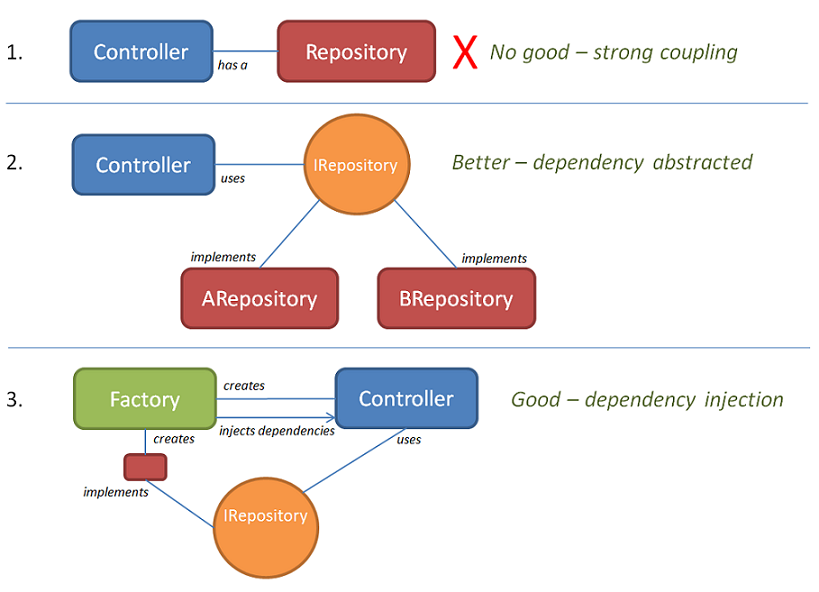

<style>
body, p, li {
   font-size: 15px;
}
</style>

---

# 1.1. IoC의 필요성

IoC/DI 개념을 적용하면 객체관리의 주체가 개발자에서 프레임워크로 이관된다. 이해도를 높이기 위해서 왜 이러한 패러다임의 변화가 필요한지 살펴보자.

## 새 프로젝트

쇼핑몰을 만들어서 차를 팔기로 했다고 치자. 주문을 처리하는 담당자가 필요하다. 차량의 구매는 현대자동차와 거래한다. 차를 주문할 때 돈을 지불하고 차를 받는다. 새 프로젝트를 만들어서 시작해 보자.

```
STS >> New >> Spring Starter Project

Project Name : spring-ioc-di
Type : Maven
Packaging : Jar
Java : 8
Package : com.example.demo

Project Dependencies : Web, Lombok
```

#### pom.xml

```java
<?xml version="1.0" encoding="UTF-8"?>
<project xmlns="http://maven.apache.org/POM/4.0.0"
    xmlns:xsi="http://www.w3.org/2001/XMLSchema-instance"
    xsi:schemaLocation="http://maven.apache.org/POM/4.0.0 http://maven.apache.org/xsd/maven-4.0.0.xsd">
    <modelVersion>4.0.0</modelVersion>

    <groupId>com.example</groupId>
    <artifactId>1-spring-ioc-di</artifactId>
    <version>0.0.1-SNAPSHOT</version>
    <packaging>jar</packaging>

    <name>1-spring-ioc-di</name>
    <description></description>

    <parent>
        <groupId>org.springframework.boot</groupId>
        <artifactId>spring-boot-starter-parent</artifactId>
        <version>2.0.6.RELEASE</version>
        <relativePath /> <!-- lookup parent from repository -->
    </parent>

    <properties>
        <project.build.sourceEncoding>UTF-8</project.build.sourceEncoding>
        <project.reporting.outputEncoding>UTF-8</project.reporting.outputEncoding>
        <java.version>1.8</java.version>
    </properties>

    <dependencies>
        <dependency>
            <groupId>org.springframework.boot</groupId>
            <artifactId>spring-boot-starter-web</artifactId>
        </dependency>
        <dependency>
            <groupId>org.springframework.boot</groupId>
            <artifactId>spring-boot-starter-test</artifactId>
            <scope>test</scope>
        </dependency>
        <dependency>
            <groupId>org.projectlombok</groupId>
            <artifactId>lombok</artifactId>
            <scope>compile</scope>
        </dependency>
    </dependencies>

    <build>
        <plugins>
            <plugin>
                <groupId>org.springframework.boot</groupId>
                <artifactId>spring-boot-maven-plugin</artifactId>
            </plugin>
        </plugins>
    </build>
</project>
```

## Step 1. 객체지향 설계

#### Car.java

```java
package com.example.demo.ioc1;

import lombok.AllArgsConstructor;
import lombok.Data;

@Data
@AllArgsConstructor
public class Car {
    private String name;
}
```

#### Money.java

```java
package com.example.demo.ioc1;

import lombok.AllArgsConstructor;
import lombok.Data;

@Data
@AllArgsConstructor
public class Money {
    private int amount;
}
```

#### HyundaiMaker.java

```java
package com.example.demo.ioc1;

public class HyundaiMaker {
    public Car sell(Money money) {
        System.out.println("HyundaiMaker # " + money.getAmount() + "원을 차 값으로 받는다.");

        Car car = new Car("Sonata");
        System.out.println("HyundaiMaker # " + car.getName() + "를 만들어서 판다.");

        return car;
    }
}
```

#### KiaMaker.java

```java
package com.example.demo.ioc1;

public class KiaMaker {
    public Car sell(Money money) {
        System.out.println("KiaMaker # " + money.getAmount() + "원을 차 값으로 받는다.");

        Car car = new Car("K9");
        System.out.println("KiaMaker # " + car.getName() + "를 만들어서 판다.");

        return car;
    }
}
```

#### OrderManager.java

```java
package com.example.demo.ioc1;

public class OrderManager {
    // 운영정책에 따라 KiaMaker 에게 주문을 해야 합니다.
    // 개발자가 어떻게 대응해야 할까요?
    // 1. 새 클래스 KiaMaker를 만든다.
    // 2. OrderManager가 KiaMaker를 사용하도록 코드를 수정합니다.

    // OrderManager가 사용하는 클래스가 매일 변경되어야 합니다.
    // 개발자가 어떻게 대응해야 할까요?
    // 상황에 따라 코드 수정이 빈번하다면 해당 클래스는 
    // 개발이 완료된 클래스라고 볼 수 없습니다.
    // 상황에 따라 코드를 수정하지 않고도 운영자가 직접 
    // 로직의 변경을 선택해서 사용할 수 있도록 조치해야 합니다.
    // 즉, 클래스의 수정이 없이도 OrderManager가 사용하는 
    // 대상 객체의 변경이 적용되어야 합니다.

    private HyundaiMaker maker = new HyundaiMaker();
//    private KiaMaker maker = new KiaMaker();

    public void order() {
        Money money = new Money(1000);
        System.out.println("OrderManager # " + money.getAmount() + "원을 만든다.");

        Car car = maker.sell(money);
        System.out.println("OrderManager # 돈을주고 " + car.getName() + "를 산다.");
    }
}
```

#### 개방-폐쇄 원칙 (Open/Closed Principle)
> “소프트웨어 요소는 확장에는 열려 있으나 변경에는 닫혀 있어야 한다.”

어떤 기능이 필요한지 미리 예측하기란 실로 어려운일입니다. 따라서 프로그램을 사용하다가 발생한 니즈에 따라서 기능을 추가하는 작업은 자연스러운 현상입니다. 하지만, 이미 존재하는 기능들을 바꾸어 가면서 사용하는 작업 시 코드를 수정해야하는 것은 피해야 할 일입니다. 예를 들어 기능의 변경 시 코드가 수정되야 한다면 해당 로직은 개발이 완료된 것이 아니므로 변경 작업을 위해서 개발자가 항시 대기해야 합니다. 이런 개발방식으로는 절대 패키지 프로그램을 제작할 수 없습니다.

#### Test.java

```java
package com.example.demo.ioc1;

public class Test {

    public static void main(String[] args) {
        OrderManager manager = new OrderManager(); // 객체 생성
        manager.order(); // 필요한 시점에 로직을 실행
    }

}
```

Test가 직접 OrderManager 객체를 생성한 후 order 메소드를 호출하는 것으로 프로그램을 시작한다. 고객(Test)이 딜러(OrderManager)에게 차를 주문하면 딜러가 자동차회사(HyundaiMaker)에 돈(Money)을 주고 차(Car)를 얻게 되는 흐름이다.

개발자가 클래스 내부에서 직접 객체를 생성하여 사용하고 있다. 개발자가 객체관리를 직접처리하는 능동적인 객체관리 방식이다. 
 
OrderManager에게서 HyundaiMaker를 분리한다면 OrderManager는 제대로 작동하지 않는다. 따라서 두 클래스는 결합되어 있다고 볼 수 있다. OrderManager와 HyundaiMaker 객체간의 관계는 둘의 관계를 떼어 놓을 수 없기 때문에 강결합 결합도를 띄고 있다고 말한다. 강결합 결합도를 갖게 되면 OrderManager가 HyundaiMaker 객체 말고 다른 객체를 사용해야 할 때 코드를 수정해야만 변화를 적용할 수 있게 된다.

현재로선 OrderManager와 HyundaiMaker를 떼어 놓을 방법이 없다. 이 두 클래스는 정적으로 강하게 결합(Tight Coupling) 되어 있다. 다른 한편으로 완벽하게 분리된 코드는 아무일도 수행하지 못한다.

#### Class Diagram

클래스 다이어그램은 `ObjectAid UML Explorer` 플러그인으로 작성되었다.
다이어그램을 보고 다음 관계를 파악할 수 있다.
* Test use OrderManager.
* OrderManager use Money.
* OrderManager user Car.
* OrderManager has HyundaiMaker.
* HyundaiMaker use Money.
* HyundaiMaker use Car.


Money, Car 클래스는 데이터를 보관, 전송하기 위해 사용하는 Value Object이다. 
OrderManager가 HyundaiMaker를 사용하기 위해서 멤버변수로 갖고 있다. Has-A 관계다.

한 클래스가 다른 클래스를 사용하는 것은 달리 말하면 의존하는 것이라 볼 수 있다. 의존관계 주입(DI)이라는 용어에서 의존이라는 단어는 이러한 관계에서 파생됬다. 서비스 로직을 제공하는 객체를 전략객체라고 부르기도 한다.

> OrderManager는 HyundaiMaker를 사용한다. = OrderManager는 HyundaiMaker에 의존한다.

결합도는 클래스 A가 사용하는 클래스 B를 C로 변경할 때 얼마나 많은 클래스 A의 코드가 수정되어야 하는지를 갖고 구분한다. 결합도가 강결합이라면 전략객체 B를 C로 변경할 때 클래스 A의 코드변화가 있어야 하는 것이고 약결합이라면 코드의 변화가 없는 것이다.

클래스의 결합도가 강결합이라면 변화의 취약하게 된다. 많은 부분을 수정해야 하므로 쉽게 변화를 적용하지 못하고 실수할 확률도 늘어나게 된다.

## Step 2. Interface 도입

자바에서 결합도를 떨어뜨리는 일반적인 방법은 인터페이스를 도입하여 구현을 인터페이스 뒤로 숨기는 인터페이스 기반 프로그래밍을 적용하는 것이다. 이를 통해 클라이언트 클래스에 영향을 주지 않고도 쉽게 구현 클래스가 교체될 수 있도록 처리할 수 있다.

#### CarMaker.java

```java
package com.example.demo.ioc2;

public interface CarMaker {
        public Car sell(Money money);
}
```

인터페이스 CarMaker를 구현한다.

#### HyundaiMaker.java

```java
package com.example.demo.ioc2;

public class HyundaiMaker implements CarMaker {
    @Override
    public Car sell(Money money) {
        System.out.println("HyundaiMaker # " + money.getAmount() + "원을 차 값으로 받는다.");

        Car car = new Car("Sonata");
        System.out.println("HyundaiMaker # " + car.getName() + "를 만들어서 판다.");

        return car;
    }
}
```

인터페이스 CarMaker를 구현한다.

#### KiaMaker.java

```java
package com.example.demo.ioc2;

public class KiaMaker implements CarMaker {
    @Override
    public Car sell(Money money) {
        System.out.println("KiaMaker # " + money.getAmount() + "원을 차 값으로 받는다.");

        Car car = new Car("K9");
        System.out.println("KiaMaker # " + car.getName() + "를 만들어서 판다.");

        return car;
    }
}
```

#### OrderManager.java

```java
package com.example.demo.ioc2;

// OrderManager has CarMaker.
// OrderManager use CarMaker.
// OrderManager depend CarMaker. ==> Dependency Injection
public class OrderManager {
    // OrderManager가 사용하는 클래스가 매일 변경되어야 합니다.
    // 개발자가 어떻게 대응해야 할까요?
    // 상황에 따라 코드 수정이 빈번하다면 해당 클래스는 개발이 완료된 클래스라고 볼 수 없습니다.
    // 상황에 따라 코드를 수정하지 않고도 운영자가 직접 로직의 변경을 선택해서 사용할 수 있도록 조치해야 합니다.
    // 즉, 클래스의 수정이 없이도 OrderManager가 사용하는 클래스의 변경이 적용되어야 합니다.

    // 해결방법
    // 1. 인터페이스를 도입한다. (객체지향 격언: 변화가 있다면 인터페이스를 도입해라)
    // 인터페이스 자료형으로 사용 객체를 지칭한다.
    // 멤버변수는 코드변경 없이 그대로 사용할 수 있게 되었습니다.
    // 2. OrderManager가 사용하는 대상 객체를 가리키는 자료형이 코드에서 노출되지 않도록 조치합니다.
    // 객체지향 격언: 코드의 수정에는 닫혀 있고(배포 버전) 기능의 확장(패키지 버전을 통한 확장)에 열려 있도록 코딩하라.

    // OrderManager 클래스내에서 이 클래스가 사용하는 대상 객체를 지칭하는 
    // 모든 단어를 추방해서 변화가 있어도 이 클래스의 코드 수정은 없도록 만들었습니다.

    private CarMaker maker;

    public OrderManager() {
//        maker = new HyundaiMaker();
//        maker = new KiaMaker();
    }

    public void order() {
        Money money = new Money(1000);
        System.out.println("OrderManager # " + money.getAmount() + "원을 만든다.");

        Car car = maker.sell(money);
        System.out.println("OrderManager # 돈을주고 " + car.getName() + "를 산다.");
    }

    public void setMaker(CarMaker maker) {
        this.maker = maker;
    }

}
```

인터페이스를 사용하지 않는다면 HyundaiMaker 자료형을 다른 메이커 자료형으로 교체해야 된다. 인터페이스를 사용한다면 new HyundaiMaker 부분만 수정하면 된다.

#### DIP(Dependency Inversion Principle)

* 자주 변경되는 구상클래스(Concrete class)에 의존하지 말라.

* 어떤 클래스를 상속받아야 한다면 , 기반 클래스를 추상 클래스 또는 인터페이스로 만들어서 구현하라.

* 어떤 클래스의 참조를 가져야 한다면 참조 대상이 되는 클래스를 추상 클래스, 인터페이스로  정의하라.

* 인터페이스를 만들어서 이 인터페이스에 의존하라.

#### 객체 생성의 권리를 포기: 직접 객체를 생성하지 않고 받아서 사용하기

인스턴스를 생성하는 방법의 문제를 해결하기 위해 스프링 프레임워크의 세터주입을 이용하자. setter 메소드를 통해 CarMaker 타입 객체를 주입 받는다.

인터페이스 자료형인 CarMaker가 멤버변수와 세터메소드 파라미터 부분에 사용되고 있다. 메소드 파라미터 자리에 인터페이스 자료형으로 업캐스팅해서 정의하면 파라미터로 그 인터페이스를 구현한 어떠한 객체도 전달될 수 있다. 이것이 파라미터 정의 시 업캐스팅해서 사용하는 이유다.

#### Test.java

```java
package com.example.demo.ioc2;

public class Test {

    // 3. Test 클래스에서 직접 KiaMaker/HyundaiMaker 단어가 노출되므로
    // 이 클래스는 변화에 취약하고 코드 수정이 불가피합니다.
    // OrderManager 클래스에 적용했던 #2을 이 클래스에도 적용해야 합니다.
    // 위 모습은 모든 클래스가 동일하므로 결국 맨 앞에 클래스는 프로그램에서 사용하는
    // 모든 객체와 의존하는 객체를 설정하는 코드를 수행해야 합니다.
    // 이러한 코딩을 설정파일을 통해 프레임워크에게 위임하면 편리합니다.

    public static void main(String[] args) {
//        CarMaker maker = new KiaMaker(); // 객체 생성
        CarMaker maker = new HyundaiMaker(); // 객체 생성

        OrderManager manager = new OrderManager(); // 객체 생성
        // OrderManager가 사용해야 하는 대상 객체를 먼저 알려주어야 합니다.
        manager.setMaker(maker); 
        manager.order(); // 필요한 시점에 로직을 실행
    }

}
```

OrderManager 객체의 order 메소드를 호출하기전에 OrderManager가 사용해야 할 CarMaker의 구현체를 미리 알려주어야 한다.

#### 정리

이제 OrderManager 클래스는 자기가 사용하는 전략이 변경되어도 OrderManager 클래스 내 코드를 수정할 필요가 없게 되었다. 이 점이 개발자가 얻은 값진 열매다. 이 열매를 얻기 위해 개발자는 다음 2가지 작업을 수행했어야 했다.

1. 인터페이스를 도입한다.
2. 인터페이스의 구현체가 무엇인지 언급되는 코딩방식을 피한다.

변화가 있는 경우 자료형을 업캐스팅해서 사용한다. 클래스 내 구현체의 실체 이름이 직접 언급되는 것을 피하기 위해서 직접 new 연산자로 객체를 생성하는 작업을 포기하고 대신 받아서 사용하는 수동적인  객체관리 프로그래밍을 방식을 적용했다.

즉, 개발자는 변화가 있는경우 클래스의 결합도를 약결합으로 유지하기 위해서 직접 객체생성을 하지 않는다. 인터페이스를 적용한 약결합 관계의 두 객체는 붙였다 뗏다 하는 작업 시 코드 수정이 필요없다는 점에서 레고 블록과 비슷하다고 볼 수 있다. 두개의 블록을 붙이는데 본드를 사용했다면 두 블록은 강결합 관계라고 볼 수 있다.

## Step 3. Spring XML 설정

우리는 앞서서 개발자가 직접 객체를 관리하는 방식에서 직접 관리하지 않고 대신 받아서 사용하는 수동적인 방식으로 변화하는 모습을 살펴보았다. 이를 검증하는 데 Test 클래스를 사용했다. 

만약 Test 클래스가 사용하는 OrderManager가 다른 클래스로 변경되어야 한다고 하면 Test 클래스 내 코드가 수정되어야 한다. 이렇게 클래스 내에서 직접 객체를 생성하면 변화의 취약하게 된다. 따라서, Test 클래스도 클래스 내에서 직접 객체를 생성하지 않고 받아서 사용하는 수동적인 방식의 코딩스타일을 적용하고 싶어지게 된다.

우리는 많은 클래스들에서 이러한 모습을 여러군데에서 발견할 수 있다. 클래스가 사용하는 전략객체가 변경되더라도 클래스 내 코드를 바꿀 필요가 없도록 하기 위해서 개발자는 다음 작업을 피해야 한다.

1. 객체 생성
2. 관계 설정(주입)

직접 객체를 생성하고자 하면 실체가 노출되어야 하고 직접 대입하고자 하면 실체가 무엇인지 판단해야 하므로 역시 실체가 노출된다. 이러한 코딩방식은 변화의 취약하다. 이를 피하기 위해서 개발자들은 더 이상 직접 객체를 관리하고 싶어하지 않게 되었다. 이 지점에서 프레임워크가 대신 객체를 관리하는 업무를 맡는다. 자바진영에서 가장 인기 있는 객체관리 프레임워크가 바로 스프링이다. 객체관리를 개발자가 하지 않고 프레임워크가 하는 모습을 제어의 역전(Inversion of Control)이라고 부른다. 개발자 대신 객체를 관리하는 기능은 프레임워크의 핵심기능이다. 프레임워크는 컨테이너를 두고 그 안에서 객체를 관리한다. 프레임워크는 개발자가 요청한 클래스들을 대신 생성하여 관리해 준다.



1. 강결합
Controller가 Repository를 직접 생성하여 멤버변수로 갖고 있다. 전략객체가 변경되어야 할 때 코드의 수정은 불가피하다.

2. 추상화된 의존성
인터페이스를 도입했다. 하지만 Controller가 객체를 직접 생성하여 사용함으로 부분적인 강결합이다. 멤버변수는 인터페이스 자료형을 사용하여 약결합을 띄지만 객체 생성을 직접하게 되면 구현 클래스의 노출은 피할 수 없으므로 부분적인 강결합 성질을 갖게된다.

3. 의존관계 주입
Repository 구현체를 스프링이 생성하여 빈 컨테이너에 보관한다. Controller가 필요 시 스프링이 구현체를 주입해 준다. Controller 클래스 내부에 Repository 구현 클래스명이 존재하지 않으므로 약결합이 되었다. 전략객체가 변경될 때 코드를 바꿀 필요가 없어졌다. 스프링은 BeanFactory 인터페이스 구현체를 사용하여 개발자가 요청한 객체를 대신 생성, 주입해 주는 서비스를 제공한다.

이제 개발자가 원하는 객체들을 프레임워크가 대신 관리하도록 요청하는 방법을 살펴 볼 차례이다. 먼저 XML을 작성하여 처리하는 방법을 살펴보자.

#### Test.java

```java
package com.example.demo.ioc3;

import org.springframework.context.ApplicationContext;
import org.springframework.context.support.ClassPathXmlApplicationContext;

public class Test {

    public static void main(String[] args) {
//        CarMaker maker = new KiaMaker(); // 객체 생성
//        CarMaker maker = new com.example.demo.ioc3.HyundaiMaker(); // 객체 생성
//        
//        OrderManager manager = new OrderManager(); // 객체 생성
//        manager.setMaker(maker); // DI: 의존 관계 설정
//        manager.order(); // 필요한 시점에 로직을 실행

        /*
         * 스프링에게 객체생성 및 의존 관계 설정을 위임하는 방법
         * 1. XML
         * 2. Annotation
         * 3. Java Configuration Class
         */

        ApplicationContext context = new ClassPathXmlApplicationContext(
                "car-config.xml");

        // 빈 id로 객체를 구한다.
//        OrderManager manager = (OrderManager) context.getBean("manager");

        // 자료형으로 객체를 구한다.
        OrderManager manager = (OrderManager) context.getBean(OrderManager.class);

        manager.order();

        OrderManager manager2 = (OrderManager) context.getBean(OrderManager.class);

        // Singleton: 컨테이너 안에 해당 자료형의 객체가 하나만 존재합니다.
        // 요청할 때마다 이미 만들어 놓은 객체를 전달합니다.
        System.out.println(manager == manager2); // true
    }

}
```

#### car-config.xml

```java
<?xml version="1.0" encoding="UTF-8"?>
<beans xmlns="http://www.springframework.org/schema/beans"
    xmlns:xsi="http://www.w3.org/2001/XMLSchema-instance"
    xsi:schemaLocation="http://www.springframework.org/schema/beans http://www.springframework.org/schema/beans/spring-beans.xsd">

<!-- 
//        CarMaker maker = new KiaMaker(); // 객체 생성
        CarMaker maker = new HyundaiMaker(); // 객체 생성

        OrderManager manager = new OrderManager(); // 객체 생성
        manager.setMaker(maker); // DI: 의존 관계 설정
        manager.order(); // 필요한 시점에 로직을 실행 : 스프링 프레임워크가 판단하지 못합니다.
 -->

    <bean id="kiaMaker" class="com.example.demo.ioc3.KiaMaker"></bean>
    <bean id="hyundaiMaker" class="com.example.demo.ioc3.HyundaiMaker"></bean>

    <bean id="manager" class="com.example.demo.ioc3.OrderManager">
        <!-- 
            setMaker 세터메소드를 사용하여 빈 아이디 hyundaiMaker가 가리키는 객체를 DI 합니다.
            세터메소드를 사용하지만 설정은 name="maker" 방식처럼 멤버변수를 사용합니다.
         -->
        <!-- <property name="maker" ref="hyundaiMaker"></property> -->

        <constructor-arg ref="kiaMaker"></constructor-arg>
    </bean>

</beans>
```

## Step 4. Spring Annotation 설정

#### Car.java

```java
package com.example.demo.ioc4;

import javax.annotation.PostConstruct;

import org.springframework.beans.factory.annotation.Value;
import org.springframework.context.annotation.Scope;
import org.springframework.stereotype.Component;

import lombok.AllArgsConstructor;
import lombok.Data;
import lombok.NoArgsConstructor;

@Data
@AllArgsConstructor
@NoArgsConstructor // 디폴트 생성자
@Component
@Scope("prototype")
public class Car {
    @Value("${car.default.name:자동차}")
    private String name;

    // 빈 컨테이너 등록된 후에 프레임워크에 의해서 메소드가 기동합니다.
    @PostConstruct
    public void init() {
        System.out.println(">>> this.name = " + this.name);
        this.name = "Good Car";
    }

    @Override
    public String toString() {
        return super.toString();
    }

    @Override
    public boolean equals(Object obj) {
        return super.equals(obj);
    }

    @Override
    public int hashCode() {
        return super.hashCode();
    }
}
```

#### Money.java

```java
package com.example.demo.ioc4;

import lombok.AllArgsConstructor;
import lombok.Data;

// DTO(Data Transfer Object)
// 여러 상태정보를 하나로 취급하기 위해서 사용하는 객체
// 이러한 객체는 상태가 mutable 하기 때문에 일반적으로 스프링 빈 컨테이너에 등록하지 않고
// 필요 시, 객발자가 new 연산자로 직접 객체를 생성해서 사용하고 필요없으면 바로 G.C 대상이 되도록 한다.
@Data
@AllArgsConstructor
public class Money {
    private int amount;
}
```

#### CarMaker.java

```java
package com.example.demo.ioc4;

// 인터페이스를 사용하여 객체를 만들 수 없으므로 이 클래스는 빈 컨테이너에 등록 대상이 아니다.
// 인터페이스의 구현클래스가 빈 컨테이너에 등록될 수 있는 대상이다.
public interface CarMaker {
    public Car sell(Money money);
}
```

#### HyundaiMaker.java

```java
package com.example.demo.ioc4;

import org.springframework.beans.factory.annotation.Autowired;
import org.springframework.context.annotation.Primary;
import org.springframework.stereotype.Component;

// <bean id="hyundaiMaker" class="com.example.demo.ioc4.HyundaiMaker"></bean>

@Primary
@Component("hyundaiMaker")
public class HyundaiMaker implements CarMaker {
    @Autowired
    private Car car;

    @Override
    public Car sell(Money money) {
        System.out.println("HyundaiMaker # " + money.getAmount() + "원을 차 값으로 받는다.");

//        Car car = new Car("Sonata");
        car.setName("Sonata");
        System.out.println("HyundaiMaker # " + car.getName() + "를 만들어서 판다.");

        return car;
    }
}
```

#### KiaMaker.java

```java
package com.example.demo.ioc4;

import org.springframework.beans.factory.annotation.Autowired;
import org.springframework.beans.factory.annotation.Required;
import org.springframework.stereotype.Component;

@Component // 빈 id를 생략하면 클래스명을 사용합니다. 단, id는 소문자로 시작합니다.
public class KiaMaker implements CarMaker {
//    @Autowired
    private Car car;

    @Override
    public Car sell(Money money) {
        System.out.println("KiaMaker # " + money.getAmount() + "원을 차 값으로 받는다.");

//        Car car = new Car("K9");
        car.setName("K9");
        System.out.println("KiaMaker # " + car.getName() + "를 만들어서 판다.");

        return car;
    }


    public Car getCar() {
        return car;
    }

    @Autowired
    @Required // 주로 XML 설정 시 깜박하고 setter주입을 하지 않으면 바로 에러메시지를 출력한다.
    public void setCar(Car car) {
        this.car = car;
    }

}
```

#### OrderManager.java

```java
package com.example.demo.ioc4;

import org.springframework.beans.factory.annotation.Autowired;
import org.springframework.beans.factory.annotation.Qualifier;
import org.springframework.stereotype.Service;

// @Service 애노테이션은 @Component 애노테이션의 확장(상속)입니다.
// 빈 객체를 역할에 따라서 구분해 놓으면 나중에 객체들을 조작할 때 역할별로 그룹핑해서 처리할 수 있습니다.
@Service("manager")
public class OrderManager {
    // 자료형이 CarMaker인 빈 객체를 찾아서 변수에 주입합니다.
    @Autowired
    // @Autowired로 대상을 찾았는데 대상이 2개 이상이면 그 중에서 어는 것을 사용할지 결정합니다.
    // 에러메시지: expected single matching bean but found 2: hyundaiMaker,kiaMaker
//    @Qualifier("hyundaiMaker")
    private CarMaker maker;

    public OrderManager() {}

    public OrderManager(CarMaker maker) {
        super();
        this.maker = maker;
    }

    public void order() {
        Money money = new Money(1000);
        System.out.println("OrderManager # " + money.getAmount() + "원을 만든다.");

        Car car = maker.sell(money);
        System.out.println("OrderManager # 돈을주고 " + car.getName() + "를 산다.");
    }

    // 빈 id가 kiaMaker인 객체를 찾아서 파라미터로 전달합니다.
//    @Resource(name="kiaMaker")
    public void setMaker(CarMaker maker) {
        this.maker = maker;
    }

}
```

#### car-config2.xml

```java
<?xml version="1.0" encoding="UTF-8"?>
<beans xmlns="http://www.springframework.org/schema/beans"
    xmlns:xsi="http://www.w3.org/2001/XMLSchema-instance"
    xmlns:context="http://www.springframework.org/schema/context"
    xsi:schemaLocation="http://www.springframework.org/schema/beans http://www.springframework.org/schema/beans/spring-beans.xsd
        http://www.springframework.org/schema/context http://www.springframework.org/schema/context/spring-context.xsd">

    <!-- 
        base-package 에서부터 클래스 안에 설정된 애노테이션을 scan 하여 처리한다.
        component-scan 태그는 annotation-config 태그 설정을 내포합니다.
        1. 대상을 찾아서 빈 컨테이너에 등록
        2. 빈 컨테이너에 등록된 객체들의 의존 관계를 설정
     -->
    <context:component-scan base-package="com.example.demo.ioc4"/>

    <!-- 빈 컨테이너에 등록되어 있는 객체들 안에 설정된 애노테이션을 처리한다. -->
    <!-- <context:annotation-config/> -->

    <context:property-placeholder location="my.properties"/>

</beans>
```

#### Test.java

```java
package com.example.demo.ioc4;

import org.springframework.context.ApplicationContext;
import org.springframework.context.support.ClassPathXmlApplicationContext;

public class Test {

    public static void main(String[] args) {
//        CarMaker maker = new KiaMaker(); // 객체 생성
//        CarMaker maker = new com.example.demo.ioc3.HyundaiMaker(); // 객체 생성
//        
//        OrderManager manager = new OrderManager(); // 객체 생성
//        manager.setMaker(maker); // DI: 의존 관계 설정
//        manager.order(); // 필요한 시점에 로직을 실행

        /*
         * 스프링에게 객체생성 및 의존 관계 설정을 위임하는 방법
         * 1. XML
         * 2. Annotation
         * 3. Java Configuration Class
         */

        ApplicationContext context = new ClassPathXmlApplicationContext(
                "car-config2.xml");

        OrderManager manager = (OrderManager) context.getBean("manager");
        manager.order();

        Car car1 = context.getBean(Car.class);
        System.out.println(car1);
        System.out.println(car1.getName());

        Car car2 = context.getBean(Car.class);
        System.out.println(car2);
        System.out.println(car2.getName());

        System.out.println(car1 == car2); // false

        KiaMaker kiaMaker = context.getBean("kiaMaker", KiaMaker.class);
        System.out.println(kiaMaker.getCar());
    }

}
```

## Step 5. Spring Java Configuration

#### CarConfig.java

```java
package com.example.demo.ioc5;

import org.springframework.context.annotation.Bean;
import org.springframework.context.annotation.ComponentScan;
import org.springframework.context.annotation.Configuration;
import org.springframework.context.annotation.Primary;

//<context:component-scan base-package="com.example.demo.ioc5"/>
@ComponentScan(basePackages="com.example.demo.ioc5")

// 빈 설정정보가 클래스안에 있을 때 사용합니다.
@Configuration
public class CarConfig {

//    CarMaker maker = new KiaMaker(); // 객체 생성
//    CarMaker maker = new com.example.demo.ioc3.HyundaiMaker(); // 객체 생성
//    OrderManager manager = new OrderManager(); // 객체 생성
//    manager.setMaker(maker); // DI: 의존 관계 설정

//    <bean id="kiaMaker" class="com.example.demo.ioc3.KiaMaker"></bean>
//    <bean id="hyundaiMaker" class="com.example.demo.ioc3.HyundaiMaker"></bean>
//    <bean id="manager" class="com.example.demo.ioc3.OrderManager">
//        <property name="maker" ref="hyundaiMaker"></property>
//    </bean>

    @Bean(name="kiaMaker")
    public KiaMaker kiaMaker() {
        KiaMaker maker = new KiaMaker();
        return maker;
    }

    @Primary
    @Bean // 빈 id를 생략하면 메소드명을 id로 사용합니다.
    public HyundaiMaker hyundaiMaker() {
        HyundaiMaker maker = new HyundaiMaker();
        return maker;
    }

    @Bean
    public OrderManager manager() {
        OrderManager manager = new OrderManager();
        manager.setMaker(kiaMaker());
        return manager;
    }
}
```

#### Test.java

```java
package com.example.demo.ioc5;

import org.springframework.context.ApplicationContext;
import org.springframework.context.annotation.AnnotationConfigApplicationContext;
import org.springframework.context.support.ClassPathXmlApplicationContext;

public class Test {

    public static void main(String[] args) {
//        CarMaker maker = new KiaMaker(); // 객체 생성
//        CarMaker maker = new com.example.demo.ioc3.HyundaiMaker(); // 객체 생성
//        
//        OrderManager manager = new OrderManager(); // 객체 생성
//        manager.setMaker(maker); // DI: 의존 관계 설정
//        manager.order(); // 필요한 시점에 로직을 실행

        /*
         * 스프링에게 객체생성 및 의존 관계 설정을 위임하는 방법
         * 1. XML
         * 2. Annotation
         * 3. Java Configuration Class
         */

        ApplicationContext context = new AnnotationConfigApplicationContext(
                CarConfig.class);

        OrderManager manager = (OrderManager) context.getBean("manager");
        manager.order();

        CarMaker maker = context.getBean(CarMaker.class);
        System.out.println(maker);
    }

}
```
