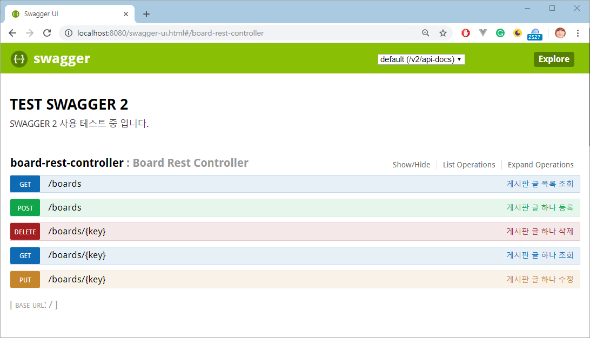
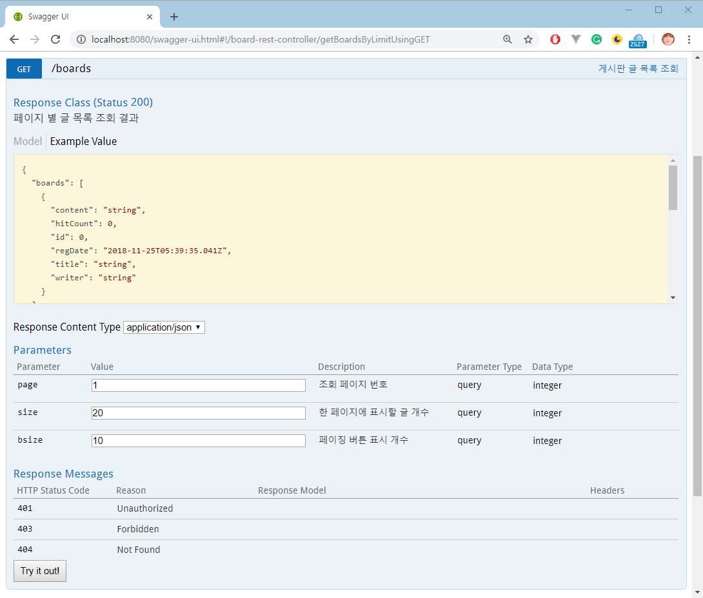
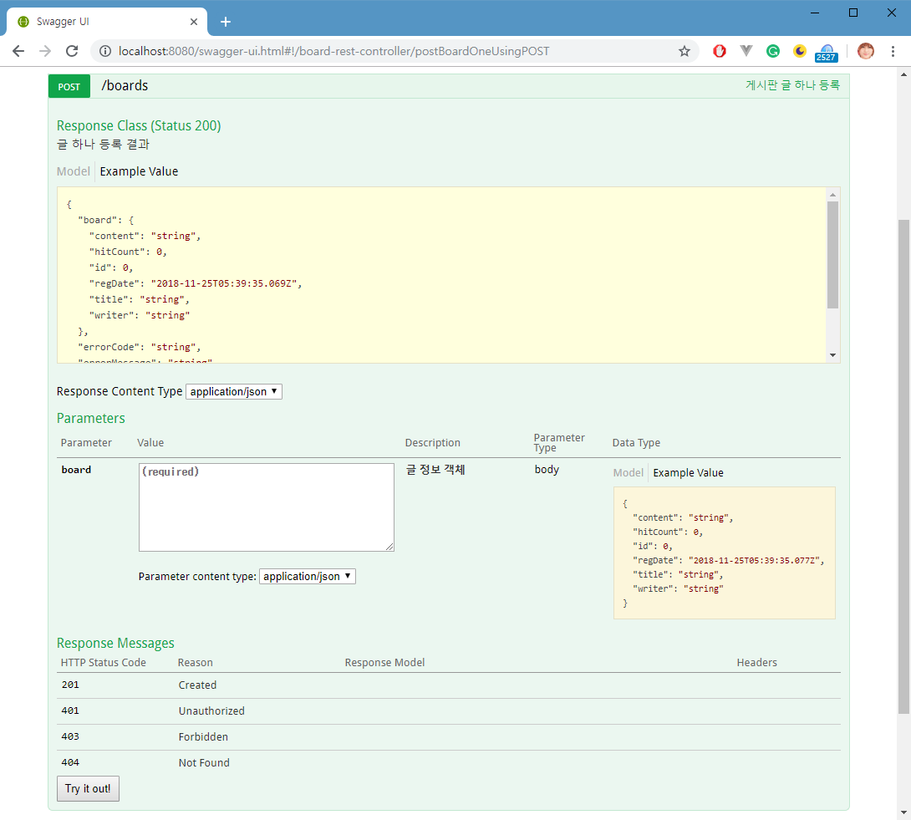
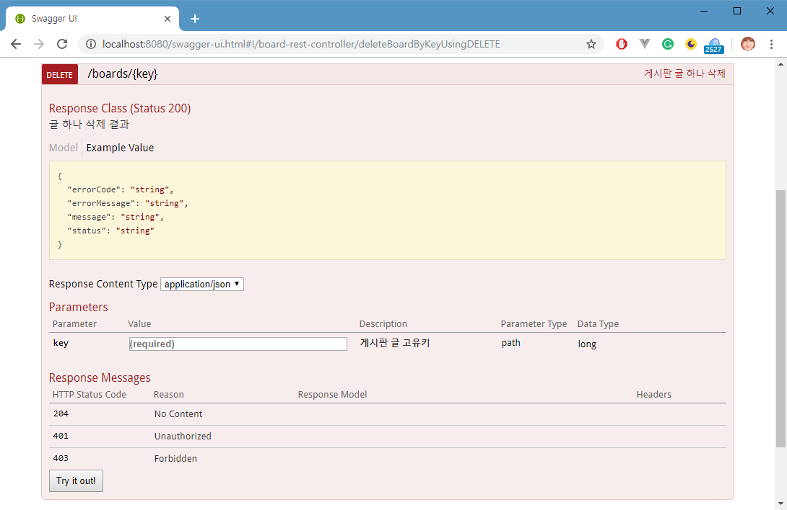
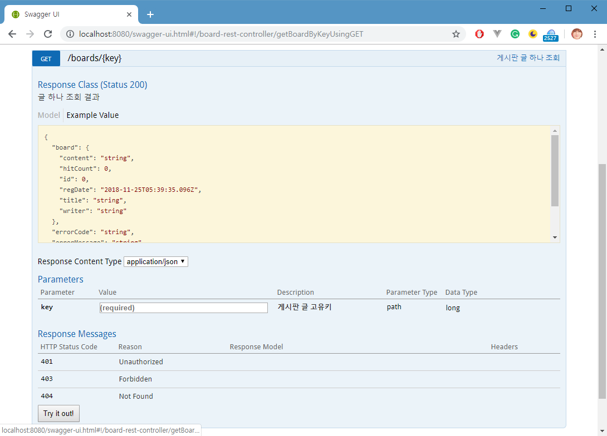
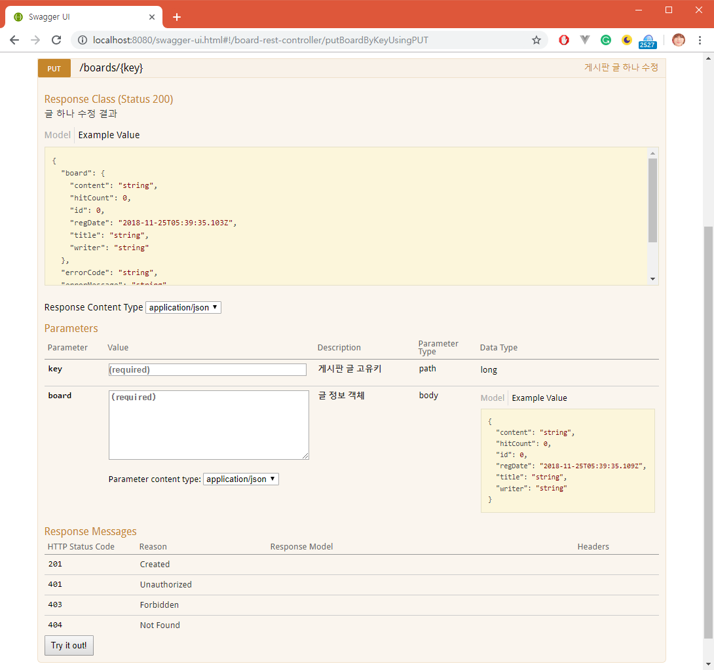

***

# 부록 F. Swagger 사용법

Swagger는 개발자가 RESTful 웹 서비스를 설계, 빌드, 문서화 및 사용하는 데 도움이되는 대규모 에코 시스템 도구를 기반으로하는 오픈 소스 프레임워크입니다.

## 소스코드 다운로드

https://github.com/softcontext/spring1107/tree/master/spring-boot-mybatis-restful-angular

## Dependency

#### pom.xml

```xml
<dependency>
  <groupId>io.springfox</groupId>
  <artifactId>springfox-swagger2</artifactId>
  <version>2.6.1</version>
</dependency>

<dependency>
  <groupId>io.springfox</groupId>
  <artifactId>springfox-swagger-ui</artifactId>
  <version>2.6.1</version>
</dependency>
```

## 환경설정

#### Application.java

```java
package com.example.demo;

import java.nio.charset.Charset;

import org.springframework.boot.SpringApplication;
import org.springframework.boot.autoconfigure.SpringBootApplication;
import org.springframework.context.annotation.Bean;
import org.springframework.http.HttpHeaders;
import org.springframework.http.MediaType;
import org.springframework.web.servlet.config.annotation.ResourceHandlerRegistry;
import org.springframework.web.servlet.config.annotation.WebMvcConfigurerAdapter;

import springfox.documentation.builders.ApiInfoBuilder;
import springfox.documentation.builders.PathSelectors;
import springfox.documentation.builders.RequestHandlerSelectors;
import springfox.documentation.service.ApiInfo;
import springfox.documentation.spi.DocumentationType;
import springfox.documentation.spring.web.plugins.Docket;
import springfox.documentation.swagger2.annotations.EnableSwagger2;

@SpringBootApplication
@EnableSwagger2
public class Application extends WebMvcConfigurerAdapter {

	public static void main(String[] args) {
		SpringApplication.run(Application.class, args);
	}
	
	@Bean
	public HttpHeaders headers() {
		HttpHeaders headers = new HttpHeaders();
		headers.setContentType(new MediaType(MediaType.APPLICATION_JSON, Charset.forName("UTF-8")));
		return headers;
	}

	@Bean
	public Docket api() {
		return new Docket(DocumentationType.SWAGGER_2)
				.select()
				.apis(RequestHandlerSelectors.basePackage(
        "com.example.demo.web.controller"))
//				.paths(PathSelectors.ant("/api/*"))
				.paths(PathSelectors.any())
				.build()
				.apiInfo(apiInfo());
	}
	
	@Override
    public void addResourceHandlers(ResourceHandlerRegistry registry) {
        registry.addResourceHandler("/resources/**")
                .addResourceLocations("/WEB-INF/resources/");

        /*
         * 스프링 시큐리티가 적용되어 있다면 swagger에서 사용하는 URL에 대한 예외 처리가 필요하다.
         * application.yml 설정에 spring.resources.add-mappings=false로 되어 있다면 
         * true로 변경해야 swagger-ui.html 페이지 호출이 가능하다.
         */

        registry.addResourceHandler("swagger-ui.html")
                .addResourceLocations("classpath:/META-INF/resources/");

        registry.addResourceHandler("/webjars/**")
                .addResourceLocations("classpath:/META-INF/resources/webjars/");
    }
	
	private ApiInfo apiInfo() {
		return new ApiInfoBuilder()
				.title("TEST SWAGGER 2")
				.description("SWAGGER 2 사용 테스트 중 입니다.")
				.build();
	}
	
}
```

## 표준 응답을 위한 DTO

응답 데이터의 자료형에 따라 응답을 위한 DTO를 세분하여 사용하면 스웨거가 응답 데이터의 JSON 포맷을 정확하게 표현합니다. 예제에서 사용하는 응답 데이터의 유형은 다음과 같습니다.

* `List<Board> boards`
* `Board`
* `없음` 성공 또는 실패 관련 정보만 응답 함

#### ServerResponse.java

```java
package com.example.demo.web.dto;

import lombok.Data;

@Data
public class ServerResponse {
	
	private String status = "Success";
	private String message;
	private String errorCode;
	private String errorMessage;

	public ServerResponse() {
		// Default Constructor
	}

}
```

#### ServerResponseBoardMulti.java

```java
package com.example.demo.web.dto;

import java.util.List;

import com.example.demo.board.model.Board;
import com.example.demo.common.dto.Pager;

import lombok.Data;

@Data
public class ServerResponseBoardMulti {

	private String status = "Success";
	private String message;

	private List<Board> boards;
	private Pager pager;

	private String errorCode;
	private String errorMessage;

	public ServerResponseBoardMulti() {
		// Default Constructor
	}

	public ServerResponseBoardMulti(List<Board> boards) {
		this.boards = boards;
	}

	public ServerResponseBoardMulti(List<Board> boards, Pager pager) {
		this.boards = boards;
		this.pager = pager;
	}

}
```

#### ServerResponseBoardOne.java

```java
package com.example.demo.web.dto;

import com.example.demo.board.model.Board;

import lombok.Data;

@Data
public class ServerResponseBoardOne {
	
	private String status = "Success";
	private String message;
	
	private Board board;
	
	private String errorCode;
	private String errorMessage;

	public ServerResponseBoardOne() {
		// Default Constructor
	}

	public ServerResponseBoardOne(Board board) {
		this.board = board;
	}

}
```

## Swagger Annotation 설정

#### BoardRestController.java

```java
package com.example.demo.web.controller;

import javax.servlet.http.HttpServletRequest;

import org.springframework.beans.factory.annotation.Autowired;
import org.springframework.http.HttpHeaders;
import org.springframework.http.HttpStatus;
import org.springframework.http.ResponseEntity;
import org.springframework.web.bind.annotation.DeleteMapping;
import org.springframework.web.bind.annotation.GetMapping;
import org.springframework.web.bind.annotation.PathVariable;
import org.springframework.web.bind.annotation.PostMapping;
import org.springframework.web.bind.annotation.PutMapping;
import org.springframework.web.bind.annotation.RequestBody;
import org.springframework.web.bind.annotation.RequestMapping;
import org.springframework.web.bind.annotation.RequestParam;
import org.springframework.web.bind.annotation.RestController;

import com.example.demo.board.mapper.BoardMapper;
import com.example.demo.board.model.Board;
import com.example.demo.board.service.BoardService;
import com.example.demo.common.dto.Pager;
import com.example.demo.web.dto.ServerResponse;
import com.example.demo.web.dto.ServerResponseBoardMulti;
import com.example.demo.web.dto.ServerResponseBoardOne;

import io.swagger.annotations.ApiImplicitParam;
import io.swagger.annotations.ApiImplicitParams;
import io.swagger.annotations.ApiOperation;
import io.swagger.annotations.ApiResponse;
import io.swagger.annotations.ApiResponses;

@RestController
@RequestMapping("/boards")
public class BoardRestController {
	
	@Autowired
	private BoardMapper boardMapper;
	@Autowired
	private BoardService boardService;
	@Autowired
	private HttpHeaders headers = new HttpHeaders();
	
	@GetMapping
	@ApiOperation(value = "게시판 글 목록 조회", produces = "application/json")
	@ApiImplicitParams({
		@ApiImplicitParam(name = "page", value = "조회 페이지 번호", required = false, 
    dataType = "int", paramType = "query", defaultValue = "1"),
		@ApiImplicitParam(name = "size", value = "한 페이지에 표시할 글 개수", required = false, 
    dataType = "int", paramType = "query", defaultValue = "20"),
		@ApiImplicitParam(name = "bsize", value = "페이징 버튼 표시 개수", required = false, 
    dataType = "int", paramType = "query", defaultValue = "10")
	})
	@ApiResponses({
		@ApiResponse(code = 200, message = "페이지 별 글 목록 조회 결과", 
    response = ServerResponseBoardMulti.class)
	})	
	public Object getBoardsByLimit(
			@RequestParam(name="page", required=false, defaultValue="1") int page,
			@RequestParam(name="size", required=false, defaultValue="20") int size,
			@RequestParam(name="bsize", required=false, defaultValue="10") int bsize,
			HttpServletRequest req) {
		
		ServerResponseBoardMulti serverResponse = new ServerResponseBoardMulti();
		serverResponse.setMessage("페이지 별 글 목록 조회 결과");
		serverResponse.setBoards(boardMapper.findByLimit(page, size));
		serverResponse.setPager(new Pager(page, size, bsize, boardMapper.count(), req));
		
		return new ResponseEntity<ServerResponseBoardMulti>(serverResponse, headers, HttpStatus.OK);
	}

	@GetMapping("/{key}")
	@ApiOperation(value = "게시판 글 하나 조회", produces = "application/json")
    @ApiImplicitParams({
    	@ApiImplicitParam(name = "key", value = "게시판 글 고유키", required = true, 
      dataType = "long", paramType = "path", defaultValue = "")
    })
	@ApiResponses({
		@ApiResponse(code = 200, message = "글 하나 조회 결과", 
    response = ServerResponseBoardOne.class)
	})
	public Object getBoardByKey(@PathVariable Long key) {
		ServerResponseBoardOne serverResponse = new ServerResponseBoardOne(
    boardService.findByIdAfterIncrementHitCount(key));
		serverResponse.setMessage("글 하나 조회 결과");
		
		return new ResponseEntity<ServerResponseBoardOne>(serverResponse, headers, HttpStatus.OK);
	}

	@PostMapping
	@ApiOperation(value = "게시판 글 하나 등록", produces = "application/json")
    @ApiImplicitParams({
    	@ApiImplicitParam(name = "board", value = "글 정보 객체", required = true, 
      dataType = "Board", paramType = "body", defaultValue = "")
    })
	@ApiResponses({
		@ApiResponse(code = 200, message = "글 하나 등록 결과", response = ServerResponseBoardOne.class)
	})
	public Object postBoardOne(@RequestBody Board board) {
		boardMapper.insert(board);
		
		ServerResponseBoardOne serverResponse = new ServerResponseBoardOne(board);
		serverResponse.setMessage("글 하나 등록 결과");
		
		return new ResponseEntity<ServerResponseBoardOne>(serverResponse, headers, HttpStatus.OK);
	}

	@PutMapping("/{key}")
	@ApiOperation(value = "게시판 글 하나 수정", produces = "application/json")
	@ApiImplicitParams({
		@ApiImplicitParam(name = "key", value = "게시판 글 고유키", required = true, 
    dataType = "long", paramType = "path", defaultValue = ""),
		@ApiImplicitParam(name = "board", value = "글 정보 객체", required = true, 
    dataType = "Board", paramType = "body", defaultValue = "")
	})
	@ApiResponses({
		@ApiResponse(code = 200, message = "글 하나 수정 결과", response = ServerResponseBoardOne.class)
	})
	public Object putBoardByKey(@PathVariable Long key, @RequestBody Board board) {
		board.setId(key);
		
		boardMapper.update(board);
		
		ServerResponseBoardOne serverResponse = new ServerResponseBoardOne(board);
		serverResponse.setMessage("글 하나 수정 결과");
		
		return new ResponseEntity<ServerResponseBoardOne>(serverResponse, headers, HttpStatus.OK);
	}

	@DeleteMapping("/{key}")
	@ApiOperation(value = "게시판 글 하나 삭제", produces = "application/json")
	@ApiImplicitParams({
		@ApiImplicitParam(name = "key", value = "게시판 글 고유키", required = true, 
    dataType = "long", paramType = "path", defaultValue = "")
	})
	@ApiResponses({
		@ApiResponse(code = 200, message = "글 하나 삭제 결과", response = ServerResponse.class)
	})
	public Object deleteBoardByKey(@PathVariable Long key) {
		boardMapper.delete(key);
		
		ServerResponse serverResponse = new ServerResponse();
		serverResponse.setMessage("글 하나 삭제 결과");
		
		return new ResponseEntity<ServerResponse>(serverResponse, headers, HttpStatus.OK);
	}
	
}
```

## swagger-ui.html

  

  

  

  

  

  
