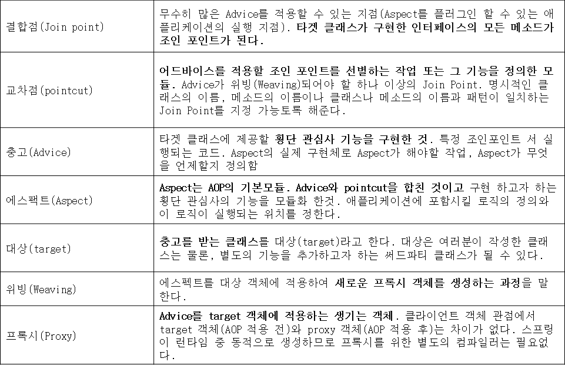
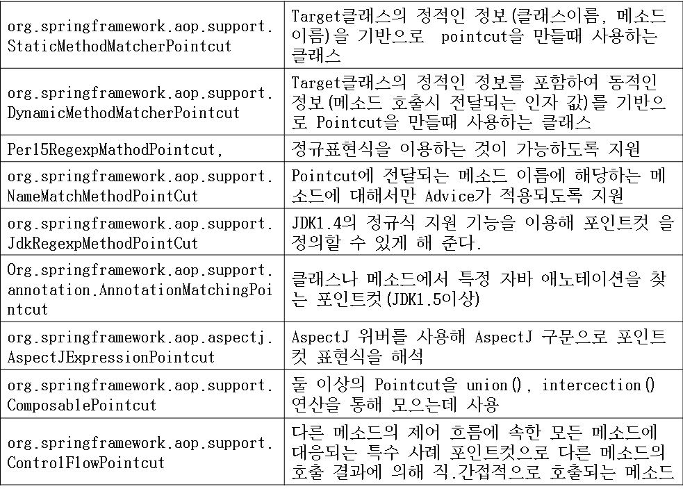

# 2. Spring AOP

---

* IoC를 이용하여 협력하는 객체를 쉽게 연결가능지만 때로는 전체 애플리케이션에 걸쳐 사용되어야 하는 공통적인 기능(횡단 관심사)이 필요할 수도 있다.
* DI의 목적이 Application간 결합도를 떨어뜨리는 것이 목표라면 AOP의 목적은 횡단관심사(Cross-Cutting Concerns, 예외처리, 로깅, 인증, 보안, 트랜잭션)와 이에 영향을 받는 객체간에 결합도를 떨어뜨리는 것이다. 즉 AOP는 횡단관심사를 모듈화하는 프로그래밍 기법으로 공통적인 기능을 Aspect라 불리는 한곳에서 정의한다.
* 새로운 기능을 적용하려고 하는 클래스를 수정할 필요 없이  그런 기능을 어디에 어떻게 적용할 것인지 선언적 또는 어노테이션으로 정의가 가능하다.
* 각 횡단관심사에 관한 로직이 애플리케이션 전체에 걸쳐 관리되지 않고 Aspect라고 하는 곳에서 관리되고 어플리케이션은 고유의 비지니스로직 처리에 충실할 수 있다.
* Logging은 시스템 내에서 거의 모든 경우에 적용하긴 하지만 특정한 비즈니스 로직과는 전혀 관련이 없다. 만일 AOP방식으로 구현한다면 실제 비즈니즈 로직의 구현을 담당하는 객체는 아무런 로그 관련 객체 정보가 없고 이 객체의 특정 메소드를 호출하는 시점에 지정된 다른 서비스(로깅)가 실행된다.
* 횡단 관심사(Cross-Cutting Concern) : 여러 개의 모듈에 걸치는 시스템 전체적인 부가적인 요구사항을 다룬다. 대표적인 횡단 관심사의 일부 예들 든다면 인증 ,로깅,트랜잭션  무결성, 오류검사, 정책시행 등이 있다.
* 핵심 관심사(Primary Concern) : 각 모듈에서 수행해야 하는  기본적이고 대표적인 업무처리 기능

## Spring AOP 구현 방법

* 소스코드에서 직접 AOP 구현 : ProxyFactory 기반 AOP
* 선언(XML, 어노테이션)적 AOP 설정 메커니즘
  * ProxyFactoryBean 사용 : 스프링 ApplicationContext를 XML에 선언적으로 선언하여 빈 정의를 기반으로 AOP 프록시 생성한다.
  * Spring aop 네임스페이스 : aop 네임스페이스를 이용하여 Aspect 및 DI 요구사항을 간단히 정의. Aop 네임스페이스도 내부적으로 ProxyFactoryBean 사용한다.
  * @ApectJ Annotation : @AspectJ방식의 어노테이션을 사용하여  클래스 내에서 AOP 설정이 가능하다, 이 방식은 AspectJ를 기반으로 하고 있으며 AspectJ 라이브러리가 필요하다. 이 역시 스프링에서는 프록시 메커니즘을 이용하는데 ApplicationContext를 부트스트랩 할 때 타겟에 대해 프록시를 생성한다.

* Spring AOP는 메소드 가로채기로 제한, 만약 그이상의 기능
(생성자 또는 멤버변수에 대한 가로채기)을 필요로 하는 경우 Proxy 기반 AOP
대신 AspectJ를 이용해서 Aspect를 구현해야 한다.

* 스프링의 충고(Advice)는 자바로 작성 : Pointcut의 경우 Advice를 어디에 적용할지를 정의하는 데 XML 설정 파일, AspectJ Expression으로 정의한다. AspectJ는 자바언어를 확장한 형태로 구현. 새로운 도구와 문법을 배워야 한다.

* 스프링의 Aspect는 실행시간에 만들어진다. 빈을 감싸는 Proxy 객체를 실행시간에 생성하므로 Aspect가 Spring 관련 빈에 위빙(Weaving)된다. Proxy 객체는 타겟 객체로 위장해서 메소드 호출을 가로채고,  타겟 객체로 호출을 전달한다. 어플리케이션이 실제 Proxy 객체를 필요로 할 때까지 target를 생성하지 않으므로 즉 Proxy가 실시간으로 생성되므로 Aspect를 위빙 하기 위해 별도 컴파일러가 필요 없다.


* 스프링은 AOP연맹의  인터페이스를 구현하며 메소드 호출 결합점(Join Point)만 제공한다.

## 스프링 AOP 용어



## 스프링이 Proxy 객체를 생성하는 2가지 방법

1. 대상 객체가 특정 메소드를 공개하는 인터페이스를 구현한다면 JDK의  java.lang.reflect.Proxy 클래스를 이용하며 이 클래스는 필요한 인터페이스를 구현한 새로운 Proxy 객체를 동적으로 생성할 수 있으며 target 객체의 인터페이스를 통한 호출은 모두 가로채서 Advice를 수행한다.

2. 대상 클래스가 어떤 인터페이스를 구현하고 있지 않다면 CGLIB이라는 라이브러리를 이용하여 대상클래스의 서브클래스를 생성 시킨다. 이 서브클래스를 생성시킴으로써 스프링은 충고를 엮을 수 있으며 서브클래스에 대한 호출을 대상 클래스에 위임 할 수 있다. 이 경우 final 메소드는 충고를 받을 수 없으며(final Method는 대상클래스의 서브클래스를 생성해서 메소드를 재정의 해야 하는데 final인 경우 곤란함) 애플리케이션이 좀 더 느슨하게 결합되게 하기 위해 이 방법보단 인터페이스를 통해 프록시를 만드는 것이 선호된다.

* 스프링 어스팩트 : 스프링 AOP에서 애스팩트는 Advisor 인터페이스를 구현한 클래스의 인스턴스로 표시하는데 Advisor를 구현한 몇 개의 클래스를 제공한다. Advisor의 하위 인터페이스로는 IntroductionAdvisor, PointcutAdvisor등이 있는데 PointcutAdvisor 인터페이스는 포인트컷을 사용하여 조인포인트에 어드바이스를 적용하는 모든 Advisor가 구현한다.

<br/><br/>
# 프록시를 학습하기 위한 새 프로젝트

---

## 새 프로젝트 만들기

```
STS >> New >> Spring Starter Project

Project Name : spring-proxy-to-aop
Type : Maven
Packaging : Jar
Java : 8
Package : com.example.demo

Project Dependencies : Web, Lombok, Aspects
```

## Proxy implements

#### Hello.java

```java
package com.example.demo.proxy1;

public interface Hello {
	public void say();
}
```

#### HelloImpl.java

```java
package com.example.demo.proxy1;

// Target: 핵심로직을 제공하는 객체
public class HelloImpl implements Hello {

	@Override
	public void say() {
		// Primary Concern: 언제나 실행되어야 하는 로직
		System.out.println("핵심로직: Hello~!!!"); 
	}

}
```

Proxy는 Hello 인터페이스 구현체인 HelloImpl의 대리자의 역할을 수행한다. 이해를 돕기위해서 예를 들어보면 HelloImpl은 가수이고 Proxy는 매니저라고 비유를 들 수 있다. 클라이언트는 가수에게 노래를 불러달라고 요청할 수 있고 대신 매니저에게 노래를 불러달라고 요청할 수도 있다. 어느 경우에도 노래를 부르는 것은 가수다.

#### Proxy.java

```java
package com.example.demo.proxy1;

public class Proxy implements Hello {
	
	private Hello hello;
	
	public Proxy(Hello hello) {
		this.hello = hello;
	}
	
	@Override
	public void say() {
		// 상황에 따라 실행되는 로직
		System.out.println("-----전 처리 부가로직-----"); 
		
		hello.say(); // 위임(Delegation): 핵심로직을 호출
		
		// 상황에 따라 실행되는 로직
		System.out.println("=====후 처리 부가로직====="); 
	}

}
```

#### Test.java

```java
package com.example.demo.proxy1;

import org.springframework.beans.factory.annotation.Autowired;
import org.springframework.stereotype.Component;

@Component
public class Test { // Test는 Hello를 사용하는 Client 역할이다.
	@Autowired
	private Hello h;
	
	public void useHello() {
		h.say(); 
		// 위 메소드는 1번, 2번 중에 무엇과 같을까요? 코드만 보고는 모른다. 
		// Hello 인터페이스의 구현체 중 하나일 것이라고 추측만이 가능하다.
		// h 변수가 가리키는 실체는 HelloImpl 객체일 수도 있고, Proxy 객체일 수도 있다.
		// 실체는 런타임시에 결정되므로 코드 레벨에서는 미리 판단할 수 없다.
	}
	
	// 클라이언트 객체가 사용하는 로직이 빈번하게 변경되는 상황입니다.
	// 클라이언트 클래스의 소스코드를 바꾸지 않고도 이를 적용할 수 있는 
	// 방법이 필요합니다.
	public static void main(String[] args) {
		Hello hello = new HelloImpl();
		hello.say(); // 1. 핵심로직만 실행
		
		System.out.println();
		
		Hello proxy = new Proxy(hello);
		proxy.say(); // 2. 핵심로직 + 부가로직을 실행
	}
}
```

클라이언트의 역할을 수행하는 Test가 실체가 HelloImpl인 객체의 say() 메소드를 호출하면 타겟 객체의 핵심로직만이 수행된다.

클라이언트의 역할을 수행하는 Test가 실체가 Proxy인 객체의 say() 메소드를 호출하면 프록시의 메소드가 가진 로직이 수행된다. 더불어서, 프록시가 타겟 객체의 say() 메소드를 호출하면 타겟 객체의 핵심로직이 추가로 수행된다.

엔터프라이즈 환경에서는 핵심로직만 수행되어야 하는 경우만 추가적으로 부가로직도 수행되어야 하는 경우가 많이 발생한다. 더불어서, 프로그램 전역적으로 이러한 현상이 발생한다.

## JDK Dynamic Proxy

---

#### MyAdvice.java

```java
package com.example.demo.proxy1.jdk;

import java.lang.reflect.InvocationHandler;
import java.lang.reflect.Method;

// 개발자가 앞서서 만든 Proxy 클래스는 오로지 HelloImpl 타겟 클래스만 프록싱 할 수 있으나
// InvocationHandler 인터페이스를 구현한 MyAdvice 클래스는 모든 타겟 클래스를 프록싱 할 수 있습니다.
public class MyAdvice implements InvocationHandler {
	private Object target;
	
	public MyAdvice(Object target) {
		this.target = target;
	}
	
	@Override
	public Object invoke(Object proxy, Method method, Object[] args) throws Throwable {
		
		System.out.println("-----Around Before Advice-----"); // 상황에 따라 실행되는 로직
		
//		((HelloImpl)target).say(); // 이렇게 사용하면 범용성을 잃어 버리게 됩니다.
		
		// 타겟 클래스의 핵심로직을 호출하는 방법 또한 범용성을 확보해야 하므로
		// 자바 리플렉션에서 지원하는 Method 클래스의 invoke 메소드를 사용합니다.
		// Method 객체는 내부에 호출해야 하는 메소드 정보를 갖고 있습니다.
		// 다음 코드는 target 객체 안에 메소드를 호출하면서 args 를 파라미터로 전달하는 뜻이 됩니다.
		Object ret = method.invoke(target, args); // 위임(Delegation): 핵심로직을 호출
		
		System.out.println("=====Around After Advice======"); // 상황에 따라 실행되는 로직
		
		return ret;
	}

}
```

#### Builder.java

```java
package com.example.demo.proxy1.jdk;

public interface Builder {
	public boolean build();
}
```

#### BigBuilder.java

```java
package com.example.demo.proxy1.jdk;

public class BigBuilder implements Builder {

	@Override
	public boolean build() {
		System.out.println("큰 건물을 건설한다.");
		return true;
	}

}
```

#### Test.java

```java
package com.example.demo.proxy1.jdk;

import java.lang.reflect.Proxy;

public class Test { // Client

	public static void main(String[] args) {
		
		Hello hello = new HelloImpl();
		hello.say(); // 1. 핵심로직만 실행
		
		System.out.println();
		
		// 프록시 클래스를 타겟클래스의 숫자만큼 만드는 것은 굉장히 번거로운 작업입니다.
		// 그래서 스프링은 개발자 대신 프록시 객체를 자동으로 생성하는 기술을 사용합니다.
		// Proxy 클래스는 개발자가 만들 필요가 없으므로 삭제했습니다.
		// 그런데 어디엔가는 부가로직을 정의해서 갖고 있어야 합니다.
		// 그래서 InvocationHandler 인터페이스를 구현하는 클래스를 만들고
		// invoke 메소드가 부가로직을 갖고 있도록 조치합니다.
		
		// JDK Dynamic Proxy
		Hello proxy = (Hello) Proxy.newProxyInstance(
				Hello.class.getClassLoader(), // 접근방법
				new Class<?>[] {Hello.class}, // 메소드 정보
				new MyAdvice(new HelloImpl())); // 부가로직
		
		proxy.say(); // 2. 핵심로직 + 부가로직을 실행
		
		System.out.println("\n---------------\n");
		
		Builder builder = new BigBuilder();
		builder.build();
		
		System.out.println();
		
		Builder proxyBuilder = (Builder) Proxy.newProxyInstance(
				Builder.class.getClassLoader(),
				new Class<?>[] {Builder.class},
				new MyAdvice(new BigBuilder())); // 어드바이스 클래스를 재사용
		
		proxyBuilder.build();
	}

}
```

# Proxy extends

---

#### Hello.java

```java
package com.example.demo.proxy2;

public class Hello {
	public void say() {
		System.out.println("핵심로직: Hello~!!!"); // 언제나 실행되어야 하는 로직
	}
}
```

#### Proxy.java

```java
package com.example.demo.proxy2;

public class Proxy extends Hello {
	
	@Override
	public void say() {
		System.out.println("-----전 처리 부가로직-----"); // 상황에 따라 실행되는 로직
		
		super.say(); // 위임(Delegation): 핵심로직을 호출
		
		System.out.println("=====후 처리 부가로직====="); // 상황에 따라 실행되는 로직
	}

}
```

#### Test.java

```java
package com.example.demo.proxy2;

import org.springframework.beans.factory.annotation.Autowired;
import org.springframework.stereotype.Component;

@Component
public class Test { // Client
	@Autowired
	private Hello h;
	
	public void useHello() {
		h.say(); 
		// h가 가리키는 실체는 Hello로 만든 객체일 수도 있고,
		// Proxy로 만든 객체일 수도 있다.
		// 스프링이 무엇을 DI하는냐에 따라서 사용하는 실체가 변경되고
		// 수행로직이 달라진다.
	}
	
	public static void main(String[] args) {
		
		Hello hello = new Hello();
		hello.say(); // 1. 핵심로직만 실행
		
		System.out.println();
		
		Hello proxy = new Proxy();
		proxy.say(); // 2. 핵심로직 + 부가로직을 실행

	}

}
```

# CGLIB Dynamic Proxy

---

#### Hello.java

```java
package com.example.demo.proxy2.cglib;

public class Hello {
	public void say() {
		System.out.println("핵심로직: Hello~!!!"); // 언제나 실행되어야 하는 로직
	}
	
	public void bye() {
		System.out.println("핵심로직: Goodbye~!"); // 언제나 실행되어야 하는 로직
	}
}
```

#### MyAdvice.java

```java
package com.example.demo.proxy2.cglib;

import org.aopalliance.intercept.MethodInterceptor;
import org.aopalliance.intercept.MethodInvocation;

public class MyAdvice implements MethodInterceptor {

	@Override
	public Object invoke(MethodInvocation invocation) throws Throwable {
		
		System.out.println("-----Around Before Advice-----"); // 상황에 따라 실행되는 로직
		
		Object ret = invocation.proceed(); // 위임(Delegation): 핵심로직을 호출
		
		System.out.println("=====Around After Advice======"); // 상황에 따라 실행되는 로직
		
		return ret;
	}

}
```

MethodInterceptor는 메소드 호출용 어라운드 어드바이스의 표준 인터페이스이다. MethodInvocation은 어드바이스를 추가하기 위한 메소드 호출을 나타내며 이 객체를 사용하면 메소드 호출이 실행되는 시점(메소드 실행 전 / 후)을 제어할 수 있다.


#### Test.java

```java
package com.example.demo.proxy2.cglib;

import org.aopalliance.aop.Advice;
import org.springframework.aop.framework.ProxyFactory;

public class Test { // Client

	public static void main(String[] args) {
		
		Hello hello = new Hello();
		hello.say(); // 1. 핵심로직만 실행
		hello.bye();
		
		System.out.println();
		
		Advice advice = new MyAdvice();
		
		// CGLIB Dynamic Proxy
		ProxyFactory factory = new ProxyFactory();
		factory.setTarget(hello); // 타겟 객체 지정
		factory.addAdvice(advice); // 어드바이스 객체 설정
		
		// 타겟 객체와 어드바이스 객체만 지정하면 기본적으로
		// 타겟 객체의 모든 메소드를 호출할 때 어드바이스 로직이 작동합니다.
		
//		-----Around Before Advice-----
//		핵심로직: Hello~!!!
//		=====Around After Advice======
		
//		-----Around Before Advice-----
//		핵심로직: Goodbye~!
//		=====Around After Advice======
		
		// 그런데 때때로 타겟 객체의 일부 메소드만 어드바이스를 적용하고 싶을 때가 있습니다.
		// 이를 조절하는 기술로 Pointcut을 추가로 적용해야 합니다.
		
		Hello proxy = (Hello) factory.getProxy();
		proxy.say(); // 2. 핵심로직 + 부가로직을 실행
		proxy.bye();
		
		
	}

}
```

# 대상 선택 전략 : Pointcut

---

* Pointcut은 모든 Join Point중 `Advice가 Weaving 되어야 할 Join Point의 집합(충고가 적용될 메소드)`을 정의한 것이다.
* 교차점(PointCut)은 특정한 클래스의 특정한 메소드가 특정한 기준과 일치하는지를 판단한다. 만약 그 메소드가 실제로 일치한다면 충고가 적용된다.
* 스프링은 충고를 받으려고 하는 클래스와 메소드의 관점에서 교차점을 정의하며 충고는 클래스의 이름과 메소드 시그네처(Method Signature)와 같은 특징에 기초하여 대상 클래스와 메소드에 엮인다.
* 스프링의 교차점 프레임워크를 위한 핵심 인터페이스는 PointCut, PointCut은 메소드와 클래스에 기초하여 충고를 어디에 엮을지 결정한다.
* Pointcut 구현체를 사용하려면 먼저 Advisor 인터페이스의 인스턴스를 생성하거나 좀 더 구체적으로 PointcutAdvisor 인터페이스의 인스턴스를 생성해야 한다.



* 충고자(Advisor)
Aspect는 행동을 정의한 충고와 실행돼야 할 위치를 정의한 교차점(Pointcut)의 조합으로 이루어 진다. 스프링에서는 이를 위해 충고자라는 것을 제공한다. 충고자는 충고(Advice)와 교차점(Pointcut)을 하나의 객체로 합친것 이다.

# AspectJExpressionPointcut

---

#### First.java

```java
package com.example.demo.pointcut1.aspectj;

public class First {
	
	public void one() {
		System.out.println("First # one()");
	}
	
	public void one2() {
		System.out.println("First # one2()");
	}
	
	public void two() {
		System.out.println("First # two()");
	}
	
	public int add(int a, int b) {
		System.out.println("First # add(int a, int b)");
		return a + b;
	}
	
}
```

#### Second.java

```java
package com.example.demo.pointcut1.aspectj;

public class Second {
	
	public void one() {
		System.out.println("Second # one()");
	}
	
	public void one2() {
		System.out.println("Second # one2()");
	}
	
	public void two() {
		System.out.println("Second # two()");
	}
	
	public double add(double a, double b) {
		System.out.println("Second # add(double a, double b)");
		return a + b;
	}
	
}
```

#### MyAdvice.java

```java
package com.example.demo.pointcut1.aspectj;

import org.aopalliance.intercept.MethodInterceptor;
import org.aopalliance.intercept.MethodInvocation;

public class MyAdvice implements MethodInterceptor {

	@Override
	public Object invoke(MethodInvocation invocation) throws Throwable {
		
		System.out.println("-----Around Before Advice-----");
		
		Object ret = invocation.proceed();
		
		System.out.println("=====Around After Advice======");
		
		return ret;
	}

}
```

#### Test.java

```java
package com.example.demo.pointcut1.aspectj;

import org.aopalliance.aop.Advice;
import org.springframework.aop.Advisor;
import org.springframework.aop.aspectj.AspectJExpressionPointcut;
import org.springframework.aop.framework.ProxyFactory;
import org.springframework.aop.support.DefaultPointcutAdvisor;

public class Test {

	public static void main(String[] args) {
		
		Advice advice = new MyAdvice();
		
		/*
		 * 	execution() : 사용하는 표현식 종류
		 * 	* one*(..) : 리턴자료형 메소드명(파라미터)
		 * 	* : all
		 *  one* : 메소드명이 one 문자열로 시작
		 *  (..) : 파라미터 개수가 0~N개 가능, 각 파라미터 자료형은 상관이 없다.
		 *  포인트컷 조합 시 and, or , not을 사용할 수 있다.
		 */
		AspectJExpressionPointcut pointcut = new AspectJExpressionPointcut();
		pointcut.setExpression("execution(* one*(..))");
		
		Advisor advisor = new DefaultPointcutAdvisor(pointcut, advice);
		
		ProxyFactory factory = new ProxyFactory();
		factory.setTarget(new First());
		factory.addAdvisor(advisor);
		
		First f = (First) factory.getProxy();
		f.one();
		f.one2();
		f.two();
		f.add(2, 3);
		
	}

}
```

# AspectJ Expression 설정 예

---

```java
execution(public * *(..))
  public 메소드가 포인트 컷
execution(* onj.spring.aop.*.*(..))
  onj.spring.aop 패키지의 모든 메소드가 포인트 컷
execution(* onj.spring.aop..*.*(..))
  onj.spring.aop 패키지와 하위 패키지의 모든 메소드가 포인트 컷
execution(public void insert*(..))
  public에 리턴값, 패키지명 없고 메서드 이름은 insert로 시작, 인자 값은 0개 이상인 메서드가 포인트 컷
execution(* onj.spring.aop.*.*())
  리턴형 관계없고 onj.spring.aop 패키지의 모든 클래스, 인자 값이 없는 모든 메서드가 포인트 컷
execution(* onj.spring.aop..*.*(..))
  리턴형 관계없고 onj.spring.aop 패키지 및 하위 패키지에 있는 모든 클래스,  인자값이 0개 이상인 메서드가 포인트 컷
execution(* delete*(*))
  메서드 이름이 delete으로 시작하는 인자 값이 1개인 메서드가 포인트 컷
execution(* delete*(*,*))
  메서드 이름이 delete로 시작하는 인자 값이 2개인 메서드가 포인트 컷
execution(* onj*(Integer, ..))
  메서드 이름이 onj로 시작하고 첫번째 인자 값의 타입이 Integer, 1개 이상의 매개변수를 갖는 메서드가 포인트 컷
within(onj.spring.aop.*)
  onj.spring.aop 패키지 내의 모든 메소드가 포인트 컷
within(onj.spring.aop..*)
  onj.spring.aop패키지 및 하위 패키지의 모든 메소드가 포인트 컷
bean(oraclejava*)
  이름이 oraclejava로 시작되는 모든 빈의 메소드가 포인트 컷
bean(*dataSource) || bean(*DataSource)
  빈 이름이 “dataSource” 나 “DataSource” 으로 끝나는 모든 빈의 메소드가 포인트 컷
!bean(onjoraclejava)
  onjoraclejava빈을 제외한 모든 빈의 메소드가 포인트
this(onj.aop.SmallMartInterface)
  현재 실행중인 인스턴스가  SmallMartInterface 이름의 빈과 타입이 같은 경우 포인트컷, SmallMart인터페이스를 구현했다면 모든 메소드가 포인트컷
target(onj.aop.SmallMartInterface)
  타겟 오브젝트가 SmallMartInterface를 구현했다면 모든 메소드가 포인트컷
args(java.io.Serializable)
  메소드가 매개변수가 하나이고 Serializable인터페이스를  타입이라면 포인트컷
@target(org.springframework.transaction.annotation.Transactional)
  타겟 오브젝트가 org.springframework.transaction.annotation.Transactional  어노테이션(@Transactional)을 가진다면 포인트컷
@within(org.springframework.transaction.annotation.Transactional)
  타겟 오브젝트의 선언된 타입이 @Trtansactional 어노테이션을 가진다면 포인트컷
@annotation(org.springframework.transaction.annotation.Transactional)
  실행 메소드가  @Transactional 어노테이션을 가진다면 포인트컷
@args(x.y.AnnotationRequired)
  파라미터를 하나 가지며 넘어오는 아규먼트의 런타임 타입이 @AnnotationRequired 타입이라면  포인트컷
```

# ProxyFactoryBean

---

#### Test.java

```java
package com.example.demo.pointcut2.proxyfactorybean;

import org.aopalliance.aop.Advice;
import org.springframework.aop.Advisor;
import org.springframework.aop.aspectj.AspectJExpressionPointcut;
import org.springframework.aop.framework.ProxyFactory;
import org.springframework.aop.support.DefaultPointcutAdvisor;
import org.springframework.context.ApplicationContext;
import org.springframework.context.support.ClassPathXmlApplicationContext;

public class Test {

	public static void main(String[] args) {
		
//		Advice advice = new MyAdvice();
		
		/*
		 * 	execution() : 사용하는 표현식 종류
		 * 	* one*(..) : 리턴자료형 메소드명(파라미터)
		 * 	* : all
		 *  one* : 메소드명이 one 문자열로 시작
		 *  (..) : 파라미터 개수가 0~N개 가능, 각 파라미터 자료형은 상관이 없다.
		 */
//		AspectJExpressionPointcut pointcut = new AspectJExpressionPointcut();
//		pointcut.setExpression("execution(* one*(..))");
//		
//		Advisor advisor = new DefaultPointcutAdvisor(pointcut, advice);
//		
//		ProxyFactory factory = new ProxyFactory();
//		factory.setTarget(new First());
//		factory.addAdvisor(advisor);
//		
//		First f = (First) factory.getProxy();
//		f.one();
//		f.one2();
//		f.two();
//		f.add(2, 3);
		
		ApplicationContext context = new ClassPathXmlApplicationContext(
				"proxy-factory-bean.xml");
		
		First f = (First) context.getBean("proxyFirst");
		f.one();
		f.one2();
		f.two();
		f.add(2, 3);
	}

}
```

#### proxy-factory-bean.xml

```java
<?xml version="1.0" encoding="UTF-8"?>
<beans xmlns="http://www.springframework.org/schema/beans"
	xmlns:xsi="http://www.w3.org/2001/XMLSchema-instance"
	xmlns:aop="http://www.springframework.org/schema/aop"
	xmlns:context="http://www.springframework.org/schema/context"
	xsi:schemaLocation="http://www.springframework.org/schema/beans http://www.springframework.org/schema/beans/spring-beans.xsd
		http://www.springframework.org/schema/aop http://www.springframework.org/schema/aop/spring-aop.xsd
		http://www.springframework.org/schema/context http://www.springframework.org/schema/context/spring-context.xsd">

<!-- 
	Advice advice = new MyAdvice();
	
	AspectJExpressionPointcut pointcut = new AspectJExpressionPointcut();
	pointcut.setExpression("execution(* one*(..))");
	
	Advisor advisor = new DefaultPointcutAdvisor(pointcut, advice);
 -->

	<bean id="advice" 
		class="com.example.demo.pointcut2.proxyfactorybean.MyAdvice"></bean>
	
	<bean id="pointcut" 
		class="org.springframework.aop.aspectj.AspectJExpressionPointcut">
		<property name="expression" value="execution(* one*(..))"></property>
	</bean>

	<bean id="advisor" 
		class="org.springframework.aop.support.DefaultPointcutAdvisor">
		<constructor-arg ref="pointcut"></constructor-arg>
		<constructor-arg ref="advice"></constructor-arg>
	</bean>
	
<!-- 
	ProxyFactory factory = new ProxyFactory();
	factory.setTarget(new First());
	factory.addAdvisor(advisor);
	
	First f = (First) factory.getProxy();
 -->
	
	<bean id="first" 
		class="com.example.demo.pointcut2.proxyfactorybean.First"></bean>
	
	<!-- 
		ProxyFactoryBean은 자신이 빈컨테이너에 등록되는 것이 아니라
		first 객체를 프록싱하는 프록시객체를 등록합니다. 
		따라서, id는 proxyFirst 라고 부르는 것이 적절하다 하겠습니다.
	 -->
	<bean id="proxyFirst" 
		class="org.springframework.aop.framework.ProxyFactoryBean">
		<property name="target" ref="first"></property>
		<property name="interceptorNames">
			<list>
				<value>advisor</value>
			</list>
		</property>
	</bean>
	
	<!-- 
		ProxyFactoryBean 설정은 1회용입니다. 100개 타겟 객체를 프록싱하는 프록시 객체를
		만들기 위해서 위 설정이 100번 반복되어야 합니다. 이는 매우 번거로운 작업입니다.
		그래서 스프링은 단 한번의 설정으로 다수의 프록시 객체를 사용할 수 있도록 설정할 수 있는 
		aop 네임스페이스 태그를 지원합니다.
	 -->
		
</beans>
```

# AOP 전역설정 : XML

---

## aop:advisor

#### Test.java

```java
package com.example.demo.pointcut3.aopns;

import org.springframework.context.ApplicationContext;
import org.springframework.context.support.ClassPathXmlApplicationContext;

public class Test {

	public static void main(String[] args) {
		
		ApplicationContext context = new ClassPathXmlApplicationContext(
				"pointcut3-aopns.xml");
		
		First f = context.getBean(First.class);
		f.one();
		f.one2();
		f.two();
		f.add(2, 3);
		
		System.out.println();
		
		Second s = context.getBean(Second.class);
		s.one();
		s.one2();
		s.two();
		s.add(2, 3);
	}

}
```

#### pointcut3-aopns.xml

```java
<?xml version="1.0" encoding="UTF-8"?>
<beans xmlns="http://www.springframework.org/schema/beans"
	xmlns:xsi="http://www.w3.org/2001/XMLSchema-instance"
	xmlns:aop="http://www.springframework.org/schema/aop"
	xmlns:context="http://www.springframework.org/schema/context"
	xsi:schemaLocation="http://www.springframework.org/schema/beans http://www.springframework.org/schema/beans/spring-beans.xsd
		http://www.springframework.org/schema/aop http://www.springframework.org/schema/aop/spring-aop.xsd
		http://www.springframework.org/schema/context http://www.springframework.org/schema/context/spring-context.xsd">

	<context:component-scan base-package="com.example.demo.pointcut3.aopns"/>

	<bean id="pointcut" 
		class="org.springframework.aop.aspectj.AspectJExpressionPointcut">
		<property name="expression" value="execution(* one*(..))"/>
	</bean>

	<!-- aop:config 안에 설정은 빈 컨테이너 등록 객체들 모두에게 적용 됩니다. -->
	<aop:config>
		<!-- 
		<bean id="advisor" 
			class="org.springframework.aop.support.DefaultPointcutAdvisor">
			<constructor-arg ref="pointcut"/>
			<constructor-arg ref="myAdvice"/>
		</bean>
		 -->
		
		<!-- 어드바이스, 포인트컷 객체를 이미 갖고 있을 때 aop:advisor 태그를 사용합니다. -->
		<aop:advisor advice-ref="myAdvice" pointcut-ref="pointcut"/>
	</aop:config>

</beans>
```

## aop:pointcut

#### Test.java

```java
package com.example.demo.pointcut4.aopns;

import org.springframework.context.ApplicationContext;
import org.springframework.context.support.ClassPathXmlApplicationContext;

public class Test {

	public static void main(String[] args) {
		
		ApplicationContext context = new ClassPathXmlApplicationContext(
				"pointcut4-aopns.xml");
		
		First f = context.getBean(First.class);
		f.one();
		f.one2();
		f.two();
		f.add(2, 3);
		
		System.out.println();
		
		Second s = context.getBean(Second.class);
		s.one();
		s.one2();
		s.two();
		s.add(2, 3);
	}

}
```

#### pointcut4-aopns.xml

```java
<?xml version="1.0" encoding="UTF-8"?>
<beans xmlns="http://www.springframework.org/schema/beans"
	xmlns:xsi="http://www.w3.org/2001/XMLSchema-instance"
	xmlns:aop="http://www.springframework.org/schema/aop"
	xmlns:context="http://www.springframework.org/schema/context"
	xsi:schemaLocation="http://www.springframework.org/schema/beans http://www.springframework.org/schema/beans/spring-beans.xsd
		http://www.springframework.org/schema/aop http://www.springframework.org/schema/aop/spring-aop.xsd
		http://www.springframework.org/schema/context http://www.springframework.org/schema/context/spring-context.xsd">

	<context:component-scan base-package="com.example.demo.pointcut4.aopns"/>

	<!-- aop:config 안에 설정은 빈 컨테이너 등록 객체들 모두에게 적용 됩니다. -->
	<aop:config>
		<!-- 
		<bean id="pointcut" 
			class="org.springframework.aop.aspectj.AspectJExpressionPointcut">
			<property name="expression" value="execution(* one*(..))"/>
		</bean>
		 -->
		<aop:pointcut expression="execution(* two(..))" id="pointcut"/>
		
		<aop:advisor advice-ref="myAdvice" pointcut-ref="pointcut"/>
	</aop:config>

</beans>
```

## aop:aspect

#### MyAroundAdvice.java

```java
package com.example.demo.pointcut5.aopns;

import org.aopalliance.intercept.MethodInterceptor;
import org.aopalliance.intercept.MethodInvocation;
import org.springframework.stereotype.Component;

@Component
public class MyAroundAdvice implements MethodInterceptor {

	@Override
	public Object invoke(MethodInvocation invocation) throws Throwable {
		
		System.out.println("-----Around Before Advice-----");
		
		Object ret = invocation.proceed(); // 타겟 객체의 핵심로직 메소드를 호출
		
		System.out.println("=====Around After Advice======");
		
		return ret;
	}

}
```

#### MyBeforeAdvice.java

```java
package com.example.demo.pointcut5.aopns;

import java.lang.reflect.Method;

import org.springframework.aop.MethodBeforeAdvice;
import org.springframework.stereotype.Component;

@Component
public class MyBeforeAdvice implements MethodBeforeAdvice {

	@Override
	public void before(Method method, Object[] args, Object target) throws Throwable {
		System.out.println("-----MyBeforeAdvice # before----");	
	}

}
```

#### MyAspect.java

```java
package com.example.demo.pointcut5.aopns;

import org.aspectj.lang.JoinPoint;
import org.aspectj.lang.ProceedingJoinPoint;
import org.springframework.stereotype.Component;

@Component
public class MyAspect {

	// 항상기동: 타겟 메소드 보다 앞서서 수행됩니다.
	public void myBefore(JoinPoint jointPoint) {
		System.out.println("-----MyAspect # myBefore------");
		Object[] args = jointPoint.getArgs();
		if (args != null && args.length > 0) {
			for (Object object : args) {
				System.out.println(">>> " + object);
			}
		}
	}
	
	// 앞은 항상기동, 뒤는 조건기동: 타겟 메소드를 감싼 형태로 앞, 뒤에서 수행됩니다.
	public Object myAround(ProceedingJoinPoint jointPoint) throws Throwable {
		System.out.println("-----MyAspect # myAround : Before------");
		
		// 여기서 타겟 메소드를 호출하자라는 코드가 있어야만
		// 위 코드는 Before로 실행되고 아래 코드는 After로 실행됩니다.
		Object ret = jointPoint.proceed();

		System.out.println("=====MyAspect # myAround : After======");
		
		return ret;
	}
	
	// 조건기동: 타겟 메소드가 정상적으로 처리된 후 수행됩니다.
	public void myAfterReturning(JoinPoint jointPoint, Object result) {
		System.out.println("=====MyAspect # myAfterReturning======");
		System.out.println(">>> " + result);
	}
	
	// 조건기동: 타겟 메소드 처리 시 예외가 발생한 경우 수행됩니다.
	public void myAfterThrowing(JoinPoint jointPoint, Throwable error) {
		System.out.println("=====MyAspect # myAfterThrowing======");
		System.out.println(">>> " + error.getMessage());
	}
	
	// 항상기동: 타겟 메소드가 수행된 다음 뒤에서 수행됩니다.
	public void myAfter(JoinPoint jointPoint) {
		System.out.println("=====MyAspect # myAfter======");
	}

}
```

#### Test.java

```java
package com.example.demo.pointcut5.aopns;

import org.springframework.context.ApplicationContext;
import org.springframework.context.support.ClassPathXmlApplicationContext;

public class Test {

	public static void main(String[] args) {
		
		ApplicationContext context = new ClassPathXmlApplicationContext(
				"pointcut5-aopns.xml");
		
		First f = context.getBean(First.class);
		f.one();
		f.one2();
		f.two();
		f.add(2, 3);
		
		try {
			f.divide(4, 2);
			f.divide(4, 0);
		} catch (Exception ignore) {}
		
		System.out.println();
		
		Second s = context.getBean(Second.class);
		s.one();
		s.one2();
		s.two();
		s.add(2, 3);
	}

}
```

#### pointcut5-aopns.xml

```java
<?xml version="1.0" encoding="UTF-8"?>
<beans xmlns="http://www.springframework.org/schema/beans"
	xmlns:xsi="http://www.w3.org/2001/XMLSchema-instance"
	xmlns:aop="http://www.springframework.org/schema/aop"
	xmlns:context="http://www.springframework.org/schema/context"
	xsi:schemaLocation="http://www.springframework.org/schema/beans http://www.springframework.org/schema/beans/spring-beans.xsd
		http://www.springframework.org/schema/aop http://www.springframework.org/schema/aop/spring-aop.xsd
		http://www.springframework.org/schema/context http://www.springframework.org/schema/context/spring-context.xsd">

	<context:component-scan base-package="com.example.demo.pointcut5.aopns"/>

	<!-- aop:config 안에 설정은 빈 컨테이너 등록 객체들 모두에게 적용 됩니다. -->
	<aop:config>
		<aop:pointcut expression="execution(* two(..))" id="pointcut"/>
		
		<aop:advisor advice-ref="myBeforeAdvice" pointcut-ref="pointcut"/>
		<aop:advisor advice-ref="myAroundAdvice" pointcut-ref="pointcut"/>
		
		<!-- 
			인터페이스를 구현한 클래스를 어드바이스로 사용하는 경우에는 advisor 태그를 사용하고
			그렇지 않은 클래스를 어드바이스로 사용하는 경우에는 aspect 태그를 사용합니다.
		 -->
		<aop:aspect ref="myAspect">
			<!-- 
				빈 아이디 myAspect가 가리키는 객체에 다수의 메소드가 존재합니다.
				스프링은 어느 메소드가 어드바이스 용 메소드인지 모릅니다.
				더불어서 어느 시점에 메소드를 기동시켜야 하는지도 모릅니다.
				따라서, 추가적으로 다음 태그들을 사용하여야 합니다.
				
				aop:before =같은의미= implements MethodBeforeAdvice
				aop:around =같은의미= implements MethodInterceptor
			 -->
			<aop:before method="myBefore" pointcut="execution(* add(..))"/>
			<aop:around method="myAround" pointcut-ref="pointcut"/>
			<aop:after-returning method="myAfterReturning" pointcut="execution(* divide(..))" returning="result"/>
			<aop:after-throwing method="myAfterThrowing" pointcut="execution(* divide(..))" throwing="error"/>
			<aop:after method="myAfter" pointcut-ref="pointcut"/>
		</aop:aspect>
		
	</aop:config>

</beans>
```

## AOP 전역설정 : Annotation

---

#### MyAspect.java

```java
package com.example.demo.pointcut6.aopanno;

import org.aspectj.lang.JoinPoint;
import org.aspectj.lang.ProceedingJoinPoint;
import org.aspectj.lang.annotation.After;
import org.aspectj.lang.annotation.AfterReturning;
import org.aspectj.lang.annotation.AfterThrowing;
import org.aspectj.lang.annotation.Around;
import org.aspectj.lang.annotation.Aspect;
import org.aspectj.lang.annotation.Before;
import org.aspectj.lang.annotation.Pointcut;
import org.springframework.stereotype.Component;

@Component
@Aspect
public class MyAspect {

//<aop:config proxy-target-class="true">
//	<aop:pointcut expression="execution(* two(..))" id="pointcut"/>
//	
//	<aop:aspect ref="myAspect">
//		<aop:before method="myBefore" pointcut="execution(* add(..))"/>
//		<aop:around method="myAround" pointcut-ref="pointcut"/>
//		<aop:after-returning method="myAfterReturning" pointcut="execution(* divide(..))" returning="result"/>
//		<aop:after-throwing method="myAfterThrowing" pointcut="execution(* divide(..))" throwing="error"/>
//		<aop:after method="myAfter" pointcut-ref="pointcut"/>
//	</aop:aspect>
//</aop:config>	
	
	@Pointcut("execution(* two(..))")
	public void pointcut() {}
	
	@Before("execution(* add(..))")
	public void myBefore(JoinPoint jointPoint) {
		System.out.println("-----MyAspect # myBefore------");
		Object[] args = jointPoint.getArgs();
		if (args != null && args.length > 0) {
			for (Object object : args) {
				System.out.println(">>> " + object);
			}
		}
	}
	
	@Around("pointcut()")
	public Object myAround(ProceedingJoinPoint jointPoint) throws Throwable {
		System.out.println("-----MyAspect # myAround : Before------");
		
		Object ret = jointPoint.proceed();

		System.out.println("=====MyAspect # myAround : After======");
		
		return ret;
	}
	
	@AfterReturning(pointcut="execution(* divide(..))", returning="result")
	public void myAfterReturning(JoinPoint jointPoint, Object result) {
		System.out.println("=====MyAspect # myAfterReturning======");
		System.out.println(">>> " + result);
	}
	
	@AfterThrowing(pointcut="execution(* divide(..))", throwing="error")
	public void myAfterThrowing(JoinPoint jointPoint, Throwable error) {
		System.out.println("=====MyAspect # myAfterThrowing======");
		System.out.println(">>> " + error.getMessage());
	}
	
	@After("pointcut()")
	public void myAfter(JoinPoint jointPoint) {
		System.out.println("=====MyAspect # myAfter======");
	}

}
```

#### Test.java

```java
package com.example.demo.pointcut6.aopanno;

import org.springframework.context.ApplicationContext;
import org.springframework.context.support.ClassPathXmlApplicationContext;

public class Test {

	public static void main(String[] args) {
		
		ApplicationContext context = new ClassPathXmlApplicationContext(
				"pointcut6-aopanno.xml");
		
		First f = context.getBean(First.class);
		f.one();
		f.one2();
		f.two();
		f.add(2, 3);
		
		try {
			f.divide(4, 2);
			f.divide(4, 0);
		} catch (Exception ignore) {}
		
		System.out.println();
		
		Second s = context.getBean(Second.class);
		s.one();
		s.one2();
		s.two();
		s.add(2, 3);
	}

}
```

#### pointcut6-aopanno.xml

```java
<?xml version="1.0" encoding="UTF-8"?>
<beans xmlns="http://www.springframework.org/schema/beans"
	xmlns:xsi="http://www.w3.org/2001/XMLSchema-instance"
	xmlns:aop="http://www.springframework.org/schema/aop"
	xmlns:context="http://www.springframework.org/schema/context"
	xsi:schemaLocation="http://www.springframework.org/schema/beans http://www.springframework.org/schema/beans/spring-beans.xsd
		http://www.springframework.org/schema/aop http://www.springframework.org/schema/aop/spring-aop.xsd
		http://www.springframework.org/schema/context http://www.springframework.org/schema/context/spring-context.xsd">

	<context:component-scan base-package="com.example.demo.pointcut6.aopanno"/>

	<!-- AOP 설정을 애노테이션으로 한다고 통보합니다. 항상 CGLIB 방식의 프록시를 사용하라고 설정합니다. -->
	<aop:aspectj-autoproxy proxy-target-class="true"/>

	<!-- 
	<aop:config proxy-target-class="true">
		<aop:pointcut expression="execution(* two(..))" id="pointcut"/>
		
		<aop:aspect ref="myAspect">
			<aop:before method="myBefore" pointcut="execution(* add(..))"/>
			<aop:around method="myAround" pointcut-ref="pointcut"/>
			<aop:after-returning method="myAfterReturning" pointcut="execution(* divide(..))" returning="result"/>
			<aop:after-throwing method="myAfterThrowing" pointcut="execution(* divide(..))" throwing="error"/>
			<aop:after method="myAfter" pointcut-ref="pointcut"/>
		</aop:aspect>
	</aop:config>
	 -->

</beans>
```

\<aop:aspectj-autoproxy\> 태그 대신 @EnableAspectJAutoProxy 애노테이션을 사용할 수 있다.

# AOP Dependency

---

스프링 레가시 프로젝트의 디펜던시 설정은 다음과 같다.

#### pom.xml

```java
<dependency>
	<groupId>org.aspectj</groupId>
	<artifactId>aspectjrt</artifactId>
	<version>1.8.13</version>
</dependency>
<dependency>
	<groupId>org.aspectj</groupId>
	<artifactId>aspectjweaver</artifactId>
	<version>1.8.13</version>
</dependency>
```

aspectjrt는 런타임 프로그램이다. 이 라이브러리는 추가하면 AspectJ의 기능을 사용할 수 있게 된다. AspectJExression을 사용한다면 aspectjweaver가 필요하다. 


# Spring Advices

---

스프링은 어드바이스를 기동 순서와 기동 조건에 따라 다음 5가지로 분류한다.


# AOP XML 설정 vs Annotation 설정

---

* 스프링 애플리케이션이 XML 기반이라면 aop 네임스페이스를 이용 하는것이 적절하다. 이렇게 하면 DI, AOP 설정 방식을 일관되게 유지할 수 있기 때문이다.
* 애플리케이션이  어노테이션 기반이라면 @AspectJ 어노테이션을 사용 한다. @AspectJ 어노테이션을 사용하는 경우 모듈 안에 어스펙트 관련 정보를 캡슐화 할 수 있기 때문에 유지보수가 용이하다.
* aop 네임스페이스와 @AspectJ 어노테이션의 차이
  * 포인트컷 구문이 조금 다르다. (aop 네임스페이스는 “and”, @AspectJ 어노테이션에서는 “&&”)
  * aop 네임스페이스에서는 ‘싱글톤’ 방식의 애스펙트 인스턴스화 모델만 지원
  * @AspectJ 어노테이션 방식에서는 두 개의 포인트컷 정의 (helloExec(intValue) && inMyDependency()) 를 사전충고, 주변 충고에서 조합할 수 있지만 aop 네임스페이스에서는 조건을 조합한 포인트 컷을 새로 생성해야 한다.
