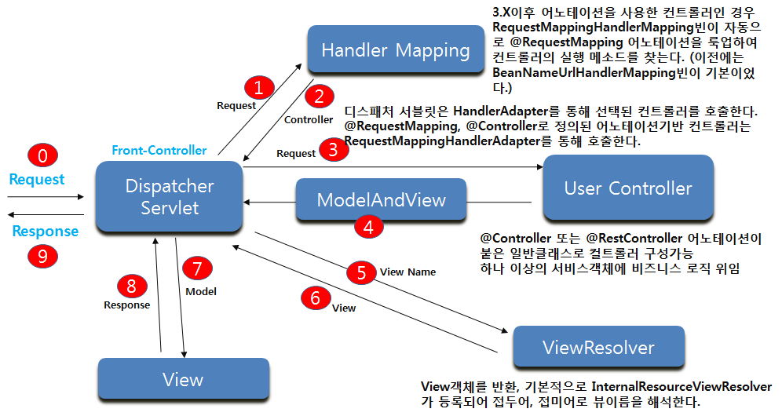

***

# 5. Spring MVC

* 스프링 MVC(Model View Controller) 프레임워크는 디스패처 서블릿이 프론트 컨트롤러로써 사용자의 요청을 받고 이 요청을 백엔드 컨트롤러에 매핑하여 필요한 메소드를 실행시키고, 뷰 이름을 해석하고 파일을 업로드 하는 등의 일을 처리한다.
* 기본적인 애노테이션은 `@Controller`, `@RequestMapping` 등 이며 `@RequestMapping`을 통해 유연한 URI 연동이 가능하며, `@RestController` 메커니즘은 `RESTful` 웹 서비스 구축을 가능하도록 해준다.

## DispatcherServlet

* `HttpServlet` 클래스를 상속받은 서블릿이며 웹 응용프로그램의 `web.xml`에서 정의한다.
* 사용자의 요청을 맨 앞단에서 받아 `Handler Mapping`에게 URL과 요청정보를 넘겨 어떤 컨트롤러의 메소드가 요청을 처리할 지 판단하고 해당 컨트롤러 메소드로 요청을 위임한다.
* 컨트롤러 이후 비즈니스 로직이 처리된 후 컨트롤러로 부터 모델과 뷰를 리턴받고 `ViewResolver`를 통해 뷰 이름을 해석하여 요청을 처리할 뷰로 요청을 `forward` 한다. 이때 모델 데이터를 뷰에게 넘기고 뷰가 만든 최종적인 응답이 클라이언트인 브라우저에 전달한다.
* `DispatcherServlet`이 로드되면 `contextConfigLocation` 파라미터로 설정파일이 지정되어 있지 않다면 `WEB-INF/서블릿이름-servlet.xml` 파일을 찾아서 작업대상을 `WebApplicationContext`에 로딩한다. 그런 다음 `servlet-mapping`을 통해 다루어질 URL을 지정한다.
* `DispatcherServlet`의 설정파일에는 `Controller`, `ViewResolver`, `LocaleResolver`, MVC 기반 인프라와 관련된 빈들을 주로 사용한다.
* 세개의 파라미터를 가진다.
  * contextClass : WebApplicationContext를 구현할 클래스, 기본은 XmlWebApplicationContext 이다.
  * contextConfigLocation : 설정파일 위치
  * namespace : WebApplicationContext의 네임스페이스

#### web.xml

```xml
<servlet>
  <servlet-name>appServlet</servlet-name>
  <servlet-class>org.springframework.web.servlet.DispatcherServlet</servlet-class>
  <!-- 
    init-param은 생략이 가능하며, 생략시 설정파일의 이름은 
    /WEB-INF/appServlet-servlet.xml 이다.
   -->
  <init-param>
    <param-name>contextConfigLocation</param-name>
    <param-value><!-- 설정파일의 위치 --></param-value>
  </init-param>
  <!-- 
    서블릿 컨텍스트가 시작될 때 DispatcherServlet을 미리 시작한다.
    생략 시 최초 요청이 들어올 때 DispatcherServlet을 로드한다.
   -->
  <load-on-startup>1</load-on-startup>
</servlet>

<servlet-mapping>
  <servlet-name>appServlet</servlet-name>
  <url-pattern>/</url-pattern>
</servlet-mapping>
```

#### 자바컨피그

```java
public class MyWebApplicationInitializer implements WebApplicationInitializer {
  public void onStartup(ServletContext container) {
    ServletRegistration.Dynamic registration = container
      .addServlet("appServlet", new DispatcherServlet());
    registration.setLoadOnStartup(1);
    registration.addMapping("/");
  }
}
```

## Spring Web MVC 기본 흐름



* Browser(클라이언트)의 요청이 프론트 컨트롤러인 DispatcherServlet에 전달된다.
* DispatcherServlet은 HandlerMapping에게 의뢰하여 연동해야 할 사용자 컨트롤러가 어느것인지 확인한다. Spring 3 이전에는 HandlerMapping빈을 정의해야 했지만 3.X이후 `@Controller` 애노테이션을 사용한 컨트롤러인 경우 RequestMappingHandlerMapping 빈이 자동으로 `@Request` 애노테이션을 룩업하여 컨트롤러의 실행 메소드를 찾는다.
* DispatcherServlet은 HandlerAdapter를 통해 선택된 컨트롤러를 호출하는데 `@RequestMapping`, `@Controller`로 정의된 애노테이션 기반 컨트롤러는 RequestMappingHandlerAdapter를 통해 호출한다.
* 컨트롤러 메소드에서 비즈니스로직 메소드를 호출/실행하고 처리 결과 정보를 담은 ModelAndView 객체를 DispatcherServlet에 리턴한다. 
* JSP 뷰와 연동하는 경우 InternalResourceViewResolver를 등록하고 접두어, 접미어로 뷰이름을 해석한다.
* 디스패처 서블릿은 전달받은 뷰(주로 JSP) 이름에 해당되는 프로그램을 찾아서 실행시키면서 데이터를 담은 Model 객체를 전달해 준다. 전달 객체는 HttpServletRequest 이다.

## ContextLoaderListener

#### web.xml

```xml
<context-param>
  <param-name>contextConfigLocation</param-name>
  <param-value>
    /WEB-INF/spring/root-context.xml
    /WEB-INF/spring/root-context2.xml
  </param-value>
</context-param>

<listener>
  <listener-class>
    org.springframework.web.context.ContextLoaderListener
  </listener-class>
</listener>

<filter>
  <filter-name>encodingFilter</filter-name>
  <filter-class>
    org.springframework.web.filter.CharacterEncodingFilter
  </filter-class>
  <init-param>
    <param-name>encoding</param-name>
    <param-value>UTF-8</param-value>
  </init-param>
  <init-param>
    <param-name>forceEncoding</param-name>
    <param-value>true</param-value>
  </init-param>
</filter>
<filter-mapping>
  <filter-name>encodingFilter</filter-name>
  <url-pattern>/*</url-pattern>
</filter-mapping>

<servlet>
  <servlet-name>appServlet</servlet-name>
  <servlet-class>
    org.springframework.web.servlet.DispatcherServlet
  </servlet-class>
  <init-param>
    <param-name>contextConfigLocation</param-name>
    <param-value>
      /WEB-INF/spring/appServlet/servlet-context.xml
    </param-value>
  </init-param>
  <load-on-startup>1</load-on-startup>
</servlet>
<servlet-mapping>
  <servlet-name>appServlet</servlet-name>
  <url-pattern>/</url-pattern>
</servlet-mapping>

<servlet>
  <servlet-name>xxx</servlet-name>
  <servlet-class>com.example.demo.HomeServlet</servlet-class>
</servlet>
<servlet-mapping>
  <servlet-name>xxx</servlet-name>
  <url-pattern>/home.do</url-pattern>
</servlet-mapping>

<servlet>
  <servlet-name>yyy</servlet-name>
  <servlet-class>
    org.springframework.web.servlet.DispatcherServlet
  </servlet-class>
  <init-param>
    <param-name>contextConfigLocation</param-name>
    <param-value>
      /WEB-INF/spring/appServlet/servlet-context2.xml
    </param-value>
  </init-param>
  <load-on-startup>1</load-on-startup>
</servlet>
<servlet-mapping>
  <servlet-name>yyy</servlet-name>
  <url-pattern>*.nhn</url-pattern>
</servlet-mapping>
```

1. `/WEB-INF/spring/root-context.xml` 파일을 복사하여 `/WEB-INF/spring/root-context2.xml` 파일을 만든다. 여러개의 XML파일로 설정을 분리할 수 있다는 의미이다. 여러 파일을 설정해도 스프링은 하나로 취급한다. 여러개의 설정파일은 콤마 또는 줄바꿈으로 구분한다.

2. 한글이 깨지는 현상을 막기 위해서 EncodingFilter 설정을 추가한다.

3. `<url-pattern>/</url-pattern>` 설정은 Fall-back URL Handling 처리를 의미한다.

4. 원한다면 직접 만든 서블릿 클래스(HomeServlet)도 사용할 수 있다. 

5. 복수의 DispatcherServlet을 설정할 수 있다. 이 때, `<url-pattern>*.nhn</url-pattern>` 설정처럼 확장자로 구분하거나 URI를 추가적으로 설정하여 처리해야 한다.

6. `<param-value>` 태그를 사용한 XML 설정은 있는데 해당 파일이 없으면 에러가 발생한다.

* ContextLoaderListener는 ServletContextListener를 구현한 클래스로 WAS에서 서블릿 컨텍스트(웹 서비스)가 시작될 때 스프링관련 빈들을 Root WebApplicationContext에 적재하고 서블릿 컨텍스트가 종료될 때 빈들을 제거한다. 

* 설정파일을 `<context-param>`의 contextConfigLocation 속성에서 설정하지 않으면 WEB-INF/applicationContext.xml 파일을 디폴트로 찾는다. 서블릿 컨텍스트에 contextConfigLocation이라는 파라미터를 설정하면 컨텍스트 로더가 로드 할 수 있는 하나 이상의 스프링 설정 파일을 지정할 수 있다.

* ContextLoaderListener와 DispatcherServlet은 각각 WebApplicationContext를 생성하는데 ContextLoaderListener가 생성한 컨텍스트가 루트 WebApplicationContext가 되고 DispatcherServlet이 생성한 컨텍스트는 루트 WebApplicationContext를 부모로 하는 자식 WebApplicationContext가 된다.

* 대부분의 웹개발에서 자바빈 설정은 여러 계층으로 나누어서 이루어지는데 `영속성 계층(Persistence Layer)`, `서비스 계층(Service Layer)`, `웹 계층(Presentation Layer)`이다. DispatcherServlet 설정 파일에는 웹 계층의 요소들 즉 Controller, ViewResolver, LocaleResolver, MVC 기반 인프라와 관련된 빈들을 주로 정의하는데 서비스 계층과 영속성 계층에 속하는 빈 역시  DispatcherServlet의 설정파일에 포함할 수 있지만 별도의 설정파일을 두고 컨텍스트 로더 리스너를 통해 먼저 로드하는 것이 좋다.

* 영속성 계층의 클래스(DAO 클래스, `@Repository`), 서비스 계층의 클래스(`@Service`), 엔티티(`@Entity`)와 같은 클래스들을 주로 로드 한다. 이러한 클래스들은 컨트롤러가 실행되기 전에 미리 메모리에 생성되어 있어야 하는데, 이를 위해 DispatcherServlet이 컨트롤러 클래스(`@Controller`)를 로드하기 전에 ContextLoaderListener를 통해 로드 하는 것이다.

* 프로젝트의 설정 파일이 여러 개라면 모두 로드 되도록 하기 위해 컨텍스트 로더를 설정하며 컨텍스트 로더는 DispatcherServlet이 로드하는 것 이외의 컨텍스트 설정파일을 로드한다.

* DispatcherServlet이 여러 개인 경우, 각각 별도의 WebApplicationContext를 생성하게 되고 이 경우 각 자식 컨텍스트는 독립적이므로 서로 자바빈 공유가 불가능하다. 이 경우 ContextLoaderListener를 이용하여 여러 DispatcherServlet의 설정파일을 한번에 로드하면 된다. 또한 여러 컨트롤러가 공유해야 하는 서비스 계층의 빈이 있다면 ContextLoaderListener를 이용하여 먼저 로드되게 해야 할 것이다.

#### root-context.xml

`src\main\webapp\WEB-INF\spring\root-context.xml` 위치에 파일이다.

```xml
<?xml version="1.0" encoding="UTF-8"?>
<beans xmlns="http://www.springframework.org/schema/beans"
	xmlns:xsi="http://www.w3.org/2001/XMLSchema-instance"
	xsi:schemaLocation="http://www.springframework.org/schema/beans http://www.springframework.org/schema/beans/spring-beans.xsd">
	
	<!-- 
		루트 빈 컨테이너에 등록 대상은 서블리 빈 컨테이너의 빈들이 의존하는 
		Service, Repository 빈들이 된다.
		전역적인 설정을 주로 등록한다.
	 -->
		
</beans>
```

#### servlet-context.xml

`src\main\webapp\WEB-INF\spring\appServlet\servlet-context.xml` 위치에 파일이다.

```xml
<?xml version="1.0" encoding="UTF-8"?>
<beans:beans xmlns="http://www.springframework.org/schema/mvc"
	xmlns:xsi="http://www.w3.org/2001/XMLSchema-instance"
	xmlns:beans="http://www.springframework.org/schema/beans"
	xmlns:context="http://www.springframework.org/schema/context"
	xsi:schemaLocation="
    http://www.springframework.org/schema/mvc 
    http://www.springframework.org/schema/mvc/spring-mvc.xsd
    http://www.springframework.org/schema/beans 
    http://www.springframework.org/schema/beans/spring-beans.xsd
    http://www.springframework.org/schema/context 
    http://www.springframework.org/schema/context/spring-context.xsd">

	<!-- 컨트롤러 설정을 애노테이션으로 처리한다. -->
	<annotation-driven />

	<!-- 정적리소스 폴더를 등록한다. -->
	<resources mapping="/resources/**" location="/resources/" />

	<beans:bean 
        class="org.springframework.web.servlet.view.InternalResourceViewResolver">
		<beans:property name="prefix" value="/WEB-INF/views/" />
		<beans:property name="suffix" value=".jsp" />
	</beans:bean>
	
	<!-- 서블릿 빈 컨테이너에 등록대상은 주로 컨트롤러가 된다. -->
	<context:component-scan base-package="com.example.demo" />
	
	<!-- 인터셉터는 프론트 컨트롤러와 백엔드 컨트롤러 사이에서 작동하는 일종의 필터다. -->
	<interceptors>
		<interceptor>
			<!-- 매핑 설정을 복수로 적용할 수 있다. -->
			<mapping path="/*"/>
			<beans:bean class="com.example.interceptor.MyLogInterceptor"/>
		</interceptor>
	</interceptors>
	
</beans:beans>
```

#### servlet-context2.xml

`src\main\webapp\WEB-INF\spring\appServlet\servlet-context2.xml` 위치에 파일이다.

```xml
<?xml version="1.0" encoding="UTF-8"?>
<beans:beans xmlns="http://www.springframework.org/schema/mvc"
	xmlns:xsi="http://www.w3.org/2001/XMLSchema-instance"
	xmlns:beans="http://www.springframework.org/schema/beans"
	xmlns:context="http://www.springframework.org/schema/context"
	xsi:schemaLocation="
    http://www.springframework.org/schema/mvc 
    http://www.springframework.org/schema/mvc/spring-mvc.xsd
    http://www.springframework.org/schema/beans 
    http://www.springframework.org/schema/beans/spring-beans.xsd
    http://www.springframework.org/schema/context 
    http://www.springframework.org/schema/context/spring-context.xsd">

	<annotation-driven />

	<!-- 
		컨트롤러 return "main"; ==> DS ==> ViewResolver
		==> prefix + "main" + suffix ==> DS
		
		실제 사용할 뷰의 위치: "/WEB-INF/another/main.jsp"
	 -->
	<beans:bean class="org.springframework.web.servlet.view.InternalResourceViewResolver">
		<beans:property name="prefix" value="/WEB-INF/another/" />
		<beans:property name="suffix" value=".jsp" />
	</beans:bean>
	
	<context:component-scan base-package="com.example.another" />
	
	<!-- 다른 XML 파일의 설정을 임포트해서 적용할 수 있다. -->
	<beans:import resource="servlet-context3.xml"/>

</beans:beans>
```

#### MyLogInterceptor.java

```java
package com.example.interceptor;

import javax.servlet.http.HttpServletRequest;
import javax.servlet.http.HttpServletResponse;

import org.springframework.web.servlet.HandlerInterceptor;
import org.springframework.web.servlet.ModelAndView;

/*
 * Request   ==서블릿 Filter 1,2==> DS  ==스프링 Interceptor 1,2==> Controller
 * Response <==서블릿 Filter 1,2==  DS <==스프링 Interceptor 1,2==  Controller
 */
public class MyLogInterceptor implements HandlerInterceptor {

	@Override
	public boolean preHandle(HttpServletRequest request, HttpServletResponse response, Object handler)
			throws Exception {
		System.out.println("DispatcherServlet ==Interceptor==> Controller");
		// 용례: 로깅, 인증(회원여부), 권한체크(접근권한 보유여부) ...
		
		/*
		 * 리턴 값이 true이면 핸들러 실행 체인의 다음 단계로 진행되지만, 
		 * false라면 작업을 중단하고 리턴하므로 남은 인터셉터들과 컨트롤러는 실행되지 않는다.
		 */
		return true;
	}

	@Override
	public void postHandle(HttpServletRequest request, HttpServletResponse response, Object handler,
			ModelAndView modelAndView) throws Exception {
		System.out.println("DispatcherServlet <==Interceptor== Controller");
	}

	@Override
	public void afterCompletion(HttpServletRequest request, HttpServletResponse response, Object handler, Exception ex)
			throws Exception {
		System.out.println("DispatcherServlet <==Interceptor== View");
	}

}
```

#### HomeController.java

```java
package com.example.demo;

import java.text.DateFormat;
import java.util.Date;
import java.util.Locale;

import org.slf4j.Logger;
import org.slf4j.LoggerFactory;
import org.springframework.stereotype.Controller;
import org.springframework.ui.Model;
import org.springframework.web.bind.annotation.RequestMapping;
import org.springframework.web.bind.annotation.RequestMethod;
import org.springframework.web.bind.annotation.ResponseBody;

@Controller
public class HomeController {
	private static final Logger logger = LoggerFactory.getLogger(HomeController.class);
	
	/**
	 * http://localhost:8080/mvc/
	 */
	@RequestMapping(value = "/", method = RequestMethod.GET)
	public String home(Locale locale, Model model) {
		logger.info("Welcome home! The client locale is {}.", locale);
		
		Date date = new Date();
		DateFormat dateFormat = DateFormat.getDateTimeInstance(
				DateFormat.LONG, DateFormat.LONG, locale);
		
		String formattedDate = dateFormat.format(date);
		
		model.addAttribute("serverTime", formattedDate );
		
		return "home"; // 뷰를 가리키는 문자열
	}
	
	@RequestMapping(value = "/one", method = RequestMethod.GET)
	@ResponseBody // 리턴문자열은 뷰가 아니라 응답하는 데이터가 된다.
	public String one() {
		return "one";
	}
}
```

#### HomeController.java

앞선 파일과 이름은 같지만 패키지가 다르다.

```java
package com.example.another;

import org.springframework.stereotype.Controller;
import org.springframework.web.bind.annotation.RequestMapping;

@Controller
public class HomeController {

	@RequestMapping("/home.nhn")
	public String home() {
		return "main";
	}
}
```

#### HomeServlet.java

```java
package com.example.demo;

import java.io.IOException;

import javax.servlet.ServletException;
import javax.servlet.http.HttpServlet;
import javax.servlet.http.HttpServletRequest;
import javax.servlet.http.HttpServletResponse;

// URL 문자열을 클래스에만 설정할 수 있습니다.
//@WebServlet(urlPatterns= {"/home.do"})
public class HomeServlet extends HttpServlet {
	private static final long serialVersionUID = 1L;

	// HTTP 요청방식(GET, POST)에 따라 기동하는 메소드가 결정됩니다.
	@Override
	protected void doGet(HttpServletRequest req, HttpServletResponse res) 
        throws ServletException, IOException {
		
		res.setContentType("text/html;charset=utf-8");
		res.getWriter().write("<h1>Hello, I am Servlet!</h1>");
		
		// 브라우저에 요청에 따라 데이터를 구해오는 로직과 연동한다.
	}
	
	@Override
	protected void doPost(HttpServletRequest req, HttpServletResponse res) 
        throws ServletException, IOException {
		doGet(req, res);
	}
}
```

#### main.jsp

`src\main\webapp\WEB-INF\another\main.jsp` 위체이 파일이다.

```html
<%@ page language="java" contentType="text/html; charset=UTF-8" 
pageEncoding="UTF-8"%>
<!DOCTYPE html>
<html>
<head>
<meta charset="UTF-8">
<title></title>
</head>
<body>
	<h1>main.jsp</h1>
</body>
</html>
```

***

# 애노테이션 기반 컨트롤러 설정

* `@Controller`
  클라이언트의 요청을 접수받는 역할의 클래스를 빈 컨테이너에 등록한다. `@Component` 애노테이션의 확장이다.
  
* `@ResponseBody`
  컨트롤러의 메소드가 리턴하는 값을 그대로 브라우저에게 전달하도록 요청한다. 이것을 사용하지 않으면 리턴하는 문자열은 뷰를 가리키는 키워드가 된다. 메소드가 ResponseEntity 객체를 리턴하면 그 내용을 HTTP 응답에 삽입하는 것은 명확하므로 `@ResponseBody` 설정을 생략할 수 있다.

* `@RestController`
  `@Controller`, `@ResponseBody` 애노테이션을 동시에 설정한 것과 같다. 주로 클라이언트 사이드의 자바스크립트와 대화할 때 또는 다른 서버의 요청에 응답할 때 사용한다. `@Controller` 애노테이션의 확장이다.

<br/>

* `@RequestMapping`
  요청받은 URI에 따라서 기동할 메소드를 결정할 때 사용한다. 클래스와 메소드에 각각 설정할 수 있다. 클래스와 메소드에 동시에 설정한 경우, URI 문자열에서 앞 부분을 클래스 설정값과 매칭한 후 뒷 부분을 메소드 설정값과 매칭하는 방식으로 사용한다.

* `@GetMapping`
  `@RequestMapping(method = RequestMethod.GET)` 설정에 축약형이다.

* `@PostMapping`
  `@RequestMapping(method = RequestMethod.POST)` 설정에 축약형이다.

<br/>

* `@RequestParam`
  클라이언트가 전달하는 파라미터의 값을 키를 사용하여 설정하면 스프링이 해당 값을 메소드의 파라미터로 주입해 준다.

* `@PathVariable`
  URI로 사용한 일부 문자열을 메소드의 파라미터로 받을 수 있다.

* `@RequestBody`
  JSON 포맷의 문자열로 컨트롤러에게 전달되는 문자열을 스프링이 처리하여 자바 객체를 만들고 메소드의 파라미터로 주입해달라는 애노테이션이다.

#### ExampleController.java

```java
package com.example.demo.controller;

import java.util.Locale;
import java.util.Map;

import javax.servlet.http.HttpServletRequest;
import javax.servlet.http.HttpSession;

import org.springframework.stereotype.Controller;
import org.springframework.ui.Model;
import org.springframework.web.bind.annotation.GetMapping;
import org.springframework.web.bind.annotation.PathVariable;
import org.springframework.web.bind.annotation.PostMapping;
import org.springframework.web.bind.annotation.RequestMapping;
import org.springframework.web.bind.annotation.RequestMethod;
import org.springframework.web.bind.annotation.RequestParam;
import org.springframework.web.bind.annotation.ResponseBody;
import org.springframework.web.servlet.ModelAndView;

import com.example.demo.dto.User;

// 이 애노테이션은 브라우저와 대화하는 역할임을 나타낸다.
@Controller
public class ExampleController {

	// 설정 조건을 모두 만족해야 메소드가 기동한다. (AND 연산)
	// value 속성으로 연동할 URI를 설정한다.
	// method 속성으로 연동할 HTTP 프로토콜 방식을 설정한다.
	// produces 속성으로 무엇을 응답하는지 설정한다.
	// consumes 속성으로 무엇을 받는지 설정한다.
	@RequestMapping(value = {"/example1", "/ex1"}, 
			method = RequestMethod.GET, 
			produces = { "text/plain" },
			consumes = { "text/plain", "application/*", "text/html" })
	// 뷰를 거치지 않고 리턴값을 그대로 브라우저에게 전달한다.
	@ResponseBody
	public String example1() {
		return "example1";
	}
	
	// URI가 example2 문자열이라면 메소드가 기동한다.
	// Model 객체는 컨트롤러에서 DS에게 데이터를 전달하는 용도의 객체다.
	// 서블릿처럼 HttpServletRequest, HttpServletResponse 
	// 객체를 파라미터로 받을 수 있다.
	// Locale 객체는 브라우저가 신고한 HTTP 헤더정보에서 구한
	// 클라이언트의 지역정보가 담겨 있다.
	@GetMapping("/example2")
	public String example2(
			HttpServletRequest req, Model model,
			HttpSession session, Locale locale) {
		
		req.setAttribute("value1", 100);
		// DS에서 모델객체에 담긴 데이터를 HttpServletRequest로 옮겨 싫는다.
		// JSP에서 HttpServletRequest 객체에 담긴 값을 EL로 사용한다.
		model.addAttribute("value2", 200);
		
		// Session:
		// 브라우저가 접속하면 자동으로 SESSIONID를 쿠키로 발급한다.
		// 쿠키로 SESSIONID를 신고하면 발급하지 않고 그대로 사용한다.
		// 세션 객체는 사용할 때 만들어진다. req.getSession() 메소드가 
		// 호출될때 세션 객체가 이미 있으면 그대로 사용하고
		// 없으면 새로 만들어서 리턴한다.
		System.out.println(session == req.getSession());
		System.out.println(locale.getCountry() + "," + locale.getLanguage());
		
		return "example2";
	}
	
	// 브라우저가 보내는 데이터를 받고자 할 때 
	// VO를 만들어서 이용하거나 Map 객체를 주로 사용한다.
	@PostMapping("/example3")
	public ModelAndView example3(
			Map<String, String> map,
			User user) {
		// HTML에서 name="id" 설정으로 사용되는 키 값 "id"와 일치하는
		// 멤버변수가 User 클래스안에 존재하는 경우 자동으로 값이 
		// User 객체의 멤버변수에 주입된다.
		System.out.println(map);
		System.out.println(user);
		
		// ModelAndView는 연동할 뷰와 전달할 데이터를 한 번에 
		// 취급하는 객체다.
		ModelAndView mav = new ModelAndView();
		mav.setViewName("example3");
		mav.addObject("map", map);
		mav.addObject("user", user);
		
		return mav;
	}
	
	// @RequestParam 으로 설정했는데 전달되는 파라미터가 없다면
	// 에러가 발생한다. required=false 설정으로 막을 수 있다.
	// http://localhost:8080/example4?id=xx URL과
	// http://localhost:8080/example4?id=xx&a=21 URL을
	// 사용하여 테스트 해 보자.
	@GetMapping("/example4")
	@ResponseBody
	public String example4(
			HttpServletRequest req,
			@RequestParam(required=true) String id,
			@RequestParam(name="a", required=false, defaultValue="100") int age) {
		
		System.out.println(id);
		System.out.println(age);
		
		return req.getRequestURI();
	}
	
	// URI 부분에 {패스홀더} 설정을 하면
	// @PathVariable("패스홀더") 애노테이션을 사용하여
	// URI 패스홀더 자리에 문자열을 메소드에 파라미터로
	// 받을 수 있다.
	@GetMapping("/example5/{id}/devices/{no}")
	@ResponseBody
	public String example5(
			@PathVariable("id") String id,
			@PathVariable int no) {
		
		System.out.println(id);
		System.out.println(no);
		
		return id + "," + no;
	}
}
```

#### example2.jsp

```html
<%@ page language="java" contentType="text/html; charset=UTF-8"
    pageEncoding="UTF-8"%>
<!DOCTYPE html>
<html>
<head>
<meta charset="UTF-8">
<title></title>
</head>
<body>
	<h3>example2.jsp</h3>
	
	<p>${value1 }</p>
	<p>${value2 }</p>
	
	<form action="example3" method="post">
		<input type="text" name="id" value="tom"><br/>
		<input type="password" name="pw" value="1234"><br/>
		<button type="submit">Send</button>
	</form>
</body>
</html>
```

#### example3.jsp

```html
<%@ page language="java" contentType="text/html; charset=UTF-8"
    pageEncoding="UTF-8"%>
<!DOCTYPE html>
<html>
<head>
<meta charset="UTF-8">
<title></title>
</head>
<body>

	<h3>example3.jsp</h3>
	
	<p>${map }</p>
	<p>${user }</p>

</body>
</html>
```

***

# RESTful 서비스

RESTful 서비스를 만드는 가장 큰 이유는 Client Side를 정형화된 플랫폼이 아닌 모바일, PC, 기타 애플리케이션, 다른 서버 등 플렛폼에 제약을 두지 않고 데이터를 주고 받기 위함이다. 

따라서, HTTP의 Response 규약을 지키지 않고 만들어낸 JSON 포맷으로 응답한다면 옳지 않은 개발 방향이다. 표준을 지키지 않게 되었을 때 발생하는 가장 큰 이슈는 HTTPStatus 상태정보가 제대로 응답하지 않게되는 것이고 이런 경우 클라이언트에서는 별도의 방어코드를 짜 넣는 수고가 발생하기 때문이다. 

#### ServerResponse.java

규격화된 응답을 하기위해서 사용하는 클래스이다.

```java
package com.example.demo.dto;

import lombok.AllArgsConstructor;
import lombok.Data;
import lombok.NoArgsConstructor;

@Data
@NoArgsConstructor
@AllArgsConstructor
public class ServerResponse {
	private String status = "Success";
	private String message;
	private Object data;
	private String errorCode;
	private String errorMessage;

	public ServerResponse(Object data) {
		this.data = data;
	}

	public ServerResponse(String status, String message, Object data) {
		this.status = status;
		this.message = message;
		this.data = data;
	}

	public ServerResponse(String status, String message, String errorCode, String errorMessage) {
		this.status = status;
		this.message = message;
		this.errorCode = errorCode;
		this.errorMessage = errorMessage;
	}
}
```

#### Employee.java

```java
package com.example.demo.dto;

import lombok.AllArgsConstructor;
import lombok.Data;
import lombok.NoArgsConstructor;

@Data
@NoArgsConstructor
@AllArgsConstructor
public class Employee {
	private int id;
	private String firstName;
	private String lastName;
}
```

#### EmployeeRestController.java

```java
package com.example.demo.controller;

import java.nio.charset.Charset;
import java.util.ArrayList;
import java.util.Comparator;
import java.util.List;

import javax.annotation.PostConstruct;

import org.springframework.http.HttpHeaders;
import org.springframework.http.HttpStatus;
import org.springframework.http.MediaType;
import org.springframework.http.ResponseEntity;
import org.springframework.web.bind.annotation.DeleteMapping;
import org.springframework.web.bind.annotation.GetMapping;
import org.springframework.web.bind.annotation.PathVariable;
import org.springframework.web.bind.annotation.PostMapping;
import org.springframework.web.bind.annotation.PutMapping;
import org.springframework.web.bind.annotation.RequestBody;
import org.springframework.web.bind.annotation.RequestMapping;
import org.springframework.web.bind.annotation.RestController;

import com.example.demo.dto.Employee;
import com.example.demo.dto.ServerResponse;

@RestController
@RequestMapping("/emps")
public class EmployeeRestController {

	private List<Employee> employees = new ArrayList<Employee>();

	@PostConstruct
	public void init() {
		employees.add(new Employee(1, "Adam", "Sandler"));
		employees.add(new Employee(2, "Bob", "Ross"));
		employees.add(new Employee(3, "Chris", "Evans"));
	}

	@GetMapping
	public Object get() {
		ServerResponse message = new ServerResponse(employees);
		
		HttpHeaders headers = new HttpHeaders();
		headers.setContentType(new MediaType("text", "json", Charset.forName("UTF-8")));
		
		return new ResponseEntity<ServerResponse>(message, headers, HttpStatus.OK);
	}

	@PostMapping
	public Object post(@RequestBody Employee employee) {
		if (employees.size() > 0) {
			Comparator<Employee> comp = (e1, e2) -> Integer
					.compare(e1.getId(), e2.getId());
			Employee emp = employees.stream().max(comp).get();
			employee.setId(emp.getId() + 1);
		} else {
			employee.setId(1);
		}
		employees.add(employee);
		
		ServerResponse message = new ServerResponse(employee);
		return new ResponseEntity<ServerResponse>(message, HttpStatus.OK);
	}

	@DeleteMapping("/{id}")
	public Object delete(@PathVariable int id) {
		Employee emp = employees.stream()
				.filter((e) -> e.getId() == id)
				.findAny().orElse(null);
		if (emp != null) {
			employees.remove(emp);
		}
		
		ServerResponse message = new ServerResponse();
		return new ResponseEntity<ServerResponse>(message, HttpStatus.OK);
	}
	
	@PutMapping("/{id}")
	public Object update(@PathVariable int id, 
			@RequestBody Employee employee) {
		Employee emp = employees.stream()
				.filter((e) -> e.getId() == id)
				.findAny().orElse(null);
		if (emp != null) {
			employees.set(employees.indexOf(emp), employee);
		}
		
		ServerResponse message = new ServerResponse(employee);
		return new ResponseEntity<ServerResponse>(message, HttpStatus.OK);
	}
}
```

## TEST with Postman

#### GET

요청방식 : `GET`
URL : `http://localhost:8080/emps`

응답결과
```json
{
    "status": "Success",
    "message": null,
    "data": [
        {
            "id": 1,
            "firstName": "Adam",
            "lastName": "Sandler"
        },
        {
            "id": 2,
            "firstName": "Bob",
            "lastName": "Ross"
        },
        {
            "id": 3,
            "firstName": "Chris",
            "lastName": "Evans"
        }
    ],
    "errorCode": null,
    "errorMessage": null
}
```

#### POST

요청방식 : `POST`
URL : `http://localhost:8080/emps`
Content-Type : `application/json`
Body(raw) : 
```json
{
    "id": 0,
    "firstName": "Seokwon",
    "lastName": "Song"
}
```

응답결과
```json
{
    "status": "Success",
    "message": null,
    "data": {
        "id": 4,
        "firstName": "Seokwon",
        "lastName": "Song"
    },
    "errorCode": null,
    "errorMessage": null
}
```

변화를 한번 더 확인해 보고 싶다면 다시 GET을 요청해 보자.

#### DELETE

요청방식 : `DELETE`
URL : `http://localhost:8080/emps/4`

응답결과
```json
{
    "status": "Success",
    "message": null,
    "data": null,
    "errorCode": null,
    "errorMessage": null
}
```

변화를 한번 더 확인해 보고 싶다면 다시 GET을 요청해 보자.

#### PUT

요청방식 : `PUT`
URL : `http://localhost:8080/emps/3`
Content-Type : `application/json`
Body(raw) : 
```json
{
    "id": 3,
    "firstName": "Seokwon",
    "lastName": "Song"
}
```

응답결과
```json
{
    "status": "Success",
    "message": null,
    "data": {
        "id": 3,
        "firstName": "Seokwon",
        "lastName": "Song"
    },
    "errorCode": null,
    "errorMessage": null
}
```

변화를 한번 더 확인해 보고 싶다면 다시 GET을 요청해 보자.

***

# CORS

CORS(Cross Origin Resource Sharing)는 한 도메인에서 로드되어 다른 도메인에 있는 리소스와 상호 작용하는 클라이언트 웹 애플리케이션에 대한 접근방법을 제어합니다. 교차 원본 자원 공유(Cross Origin Resource Sharing)는 서버 측에서 동일 원본 정책을 완화할 수 있게 해주는 W3C 표준입니다. CORS를 사용하면 서버가 명시적으로 특정 교차 원본 요청만 허용하고, 다른 요청은 거부할 수 있습니다.

브라우저는 다음과 같이 행동한다.
1. pre-flight
  실제 요청을 하기 전 OPTIONS로 요청을 날려보고 요청이 가능한지 확인한다.
2. 실제 요청을 수행한다.

서버는 브라우저에 다음과 같은 키를 header에 보내줘야 한다.
* `Access-Control-Allow-Orgin`
  요청을 보내는 페이지의 출처 정보 (예: *, 도메인)
* `Access-Control-Allow-Methods`
  요청을 허용하는 메소드 (Default : GET, POST, HEAD)
* `Access-Control-Max-Age`
  클라이언트에서 pre-flight의 요청 결과를 저장할 시간을 지정한다. 해당 시간 동안은 pre-flight를 다시 요청하지 않는다.
* `Access-Control-Allow-Headers` : 요청을 허용하는 헤더

## `@CrossOrigin`

개별적으로 허용하는 방법으로는 간단하게 @CrossOrigin 애노테이션을 사용하면 된다.

```java
@CrossOrigin("*")
@GetMapping("/emps")
public String get() {
    ...
}
```

## WebMvcConfigurer

글로벌하게 설정하는 방법은 다음을 참고하자. WebMvcConfigurer를 빈으로 등록하는 방법이다.

#### Application.java

```java
package com.example.demo;

import org.springframework.boot.SpringApplication;
import org.springframework.boot.autoconfigure.SpringBootApplication;
import org.springframework.context.annotation.Bean;
import org.springframework.context.annotation.ComponentScan;
import org.springframework.web.servlet.config.annotation.CorsRegistry;
import org.springframework.web.servlet.config.annotation.WebMvcConfigurer;
import org.springframework.web.servlet.config.annotation.WebMvcConfigurerAdapter;

@ComponentScan(basePackages= {"com.example.web"})
@SpringBootApplication
public class Application {

	public static void main(String[] args) {
		SpringApplication.run(Application.class, args);
	}
	
  @Bean
	public WebMvcConfigurer corsConfigurer() {
		return new WebMvcConfigurerAdapter() {
			@Override
			public void addCorsMappings(CorsRegistry registry) {
				registry.addMapping("/emps/**")
						.allowedOrigins("*")
						.allowedMethods("GET", "POST", "DELETE", "PUT", "OPTIONS");
			}
		};
	}
}
```

## WebMvcConfigurerAdapter

또는 WebMvcConfigurerAdapter를 상속하는 방식으로 설정할 수도 있다.

```java
package com.example.demo;

import org.springframework.context.annotation.Configuration;
import org.springframework.web.servlet.config.annotation.CorsRegistry;
import org.springframework.web.servlet.config.annotation.WebMvcConfigurerAdapter;

@Configuration
public class WebConfig extends WebMvcConfigurerAdapter {

	@Override
	public void addCorsMappings(CorsRegistry registry) {
		
		registry
			// 접근가능 URL을 설정한다.
			.addMapping("/**")
			// * 는 모든 도메인에 대해 허용하겠다는 의미이다.
			.allowedOrigins("*")
			// 특정 도메인에만 허용할 수 있다.
			.allowedOrigins("http://www.company.co.kr")
			.allowedOrigins("http://test.company.co.kr")
			// 허용하는 요청방식을 설정한다.
			.allowedMethods("HEAD", "POST", "GET", "PUT", "DELETE", "OPTIONS")
			/*
			 * JQuery AJAX는 요청 시 헤더에 x-requested-with를 포함한다. 
			 * 폼을 통한 요청과 AJAX 요청을 구분하기 위해 사용되는 비표준 규약이다. 
			 * 많은 라이브러리에서 이를 채택하여 사용하고 있다. 
			 * HTML5 부터는 폼과 AJAX 요청을 구분할 수 있는 Header가 추가되었다.
			 */
			.allowedHeaders("x-requested-with")
			// 사용자가 계정을 사용하여 접근하는 것을 금지한다.
			.allowCredentials(false)
			/*
			 * Request 요청에 앞서 pre-flight Request를 사용하여 
			 * 해당 서버에서 요청하방식을 지원하는지 확인한다. 
			 * pre-flight Request는 OPTIONS 메서드를 통해 서버에 전달된다. 
			 * Access-Control-Max-Age는 pre-flight request를 캐시할 시간이다. 
			 * 단위는 초단위이며, 3600초는 1시간이다. 
			 * 최소 1시간동안 서버에 재 요청하지 않을 것이다.
			 */
			.maxAge(3600);
	}

}
```

## WebSecurityConfigurerAdapter

스프링 시큐리티를 사용중이라면 다음 내용을 적용하자.

```java
@Configuration
public class SecurityConfig extends WebSecurityConfigurerAdapter {
    @Override
    protected void configure(HttpSecurity http) throws Exception {
//        http.csrf().disable();
        http.cors();
    }

    @Bean
    public CorsConfigurationSource corsConfigurationSource() {
        final CorsConfiguration configuration = new CorsConfiguration();
        configuration.setAllowedOrigins(ImmutableList.of("*"));
        configuration.setAllowedMethods(ImmutableList.of(
        "HEAD", "GET", "POST", "PUT", "DELETE", "PATCH"));
        // setAllowCredentials(true) is important, otherwise:
        // The value of the 'Access-Control-Allow-Origin' header 
        // in the response must not be the wildcard '*' when 
        // the request's credentials mode is 'include'.
        configuration.setAllowCredentials(true);
        // setAllowedHeaders is important! Without it, 
        // OPTIONS preflight request will fail 
        // with 403 Invalid CORS request
        configuration.setAllowedHeaders(ImmutableList.of(
        "Authorization", "Cache-Control", "Content-Type"));
        final UrlBasedCorsConfigurationSource source = new 
        UrlBasedCorsConfigurationSource();
        source.registerCorsConfiguration("/**", configuration);
        return source;
    }
}
```

***

# 브라우저와의 긴 대화방법

#### step1.jsp

```html
<%@ page language="java" contentType="text/html; charset=UTF-8"
    pageEncoding="UTF-8"%>
<!DOCTYPE html>
<html>
<head>
<meta charset="UTF-8">
<title></title>
</head>
<body>

	<h3>step1.jsp</h3>
	
	<p>${member }</p>
	
	<form action="step2" method="post">
	<table>
		<tr>
			<th>Name</th>
			<td><input type="text" name="name"></td>
		</tr>
		<tr>
			<th></th>
			<td><button type="submit">Next</button></td>
		</tr>
	</table>
	</form>

</body>
</html>
```

#### step2.jsp

```html
<%@ page language="java" contentType="text/html; charset=UTF-8"
    pageEncoding="UTF-8"%>
<%@ taglib prefix="form" uri="http://www.springframework.org/tags/form" %>    
<!DOCTYPE html>
<html>
<head>
<meta charset="UTF-8">
<title></title>
<style type="text/css">
	.error {
		color: red;
	}
</style>
</head>
<body>

	<h3>step2.jsp</h3>
	
	<p>${member }</p>
	
	<form action="step3" method="post">
	<h5 class="error">${fail }</h5>
	<table>
		<tr>
			<th>Address</th>
			<td><input type="text" name="address"></td>
		</tr>
		<tr>
			<th></th>
			<td><button type="submit">Send</button></td>
		</tr>
	</table>
	</form>
	
	<hr/>
	
	<form:form action="step3" method="post" commandName="member">
	<!-- 
		commandName="member" : 사용자가 작성한 데이터를 보관하는 객체
		BindingResult 설정없음 자동으로 인식 : 데이터를 검증한 결과(에러정보)를 보관하는 객체
	 -->
	<form:errors path="*" cssClass="error" element="h5"/>
	<table>
		<tr>
			<th>Address</th>
			<td>
				<form:input type="text" path="address"/><br/>
				<form:errors path="address" cssClass="error" element="p"/>
			</td>
		</tr>
		<tr>
			<th></th>
			<td><form:button type="submit">Send</form:button></td>
		</tr>
	</table>
	</form:form>

</body>
</html>
```

#### step4.jsp

```html
<%@ page language="java" contentType="text/html; charset=UTF-8"
    pageEncoding="UTF-8"%>
<!DOCTYPE html>
<html>
<head>
<meta charset="UTF-8">
<title></title>
</head>
<body>

	<h3>step4.jsp</h3>
	
	<p>${member }</p>
	
	<h4>처리결과: ${result }</h4>

</body>
</html>
```

#### MemberValidator.java

```java
package com.example.demo.validator;

import org.springframework.validation.Errors;
import org.springframework.validation.ValidationUtils;
import org.springframework.validation.Validator;

import com.example.demo.dto.Member;

public class MemberValidator implements Validator {

	@Override
	public boolean supports(Class<?> clazz) {
		return Member.class.isAssignableFrom(clazz);
	}
	
//	Member member, BindingResult result
//	valid.validate(member, result);

	@Override
	public void validate(
			Object target, // 사용자가 작성한 데이터를 보관하는 객체
			Errors errors) { // 데이터를 검증한 결과(에러정보)를 보관하는 객체
		
//		ValidationUtils.rejectIfEmptyOrWhitespace(
//				errors, "name", "required.name", "이름이 필요합니다.");
		ValidationUtils.rejectIfEmptyOrWhitespace(
				errors, "address", "required.address", "주소가 필요합니다.");
		
//		Member member = (Member) target;
//		System.out.println("-----------------------");
//		System.out.println(member);
//		System.out.println("=======================");
	}

}
```

#### ExampleController2.java

```java
package com.example.demo.controller;

import javax.servlet.http.HttpSession;

import org.springframework.stereotype.Controller;
import org.springframework.ui.Model;
import org.springframework.validation.BindingResult;
import org.springframework.web.bind.annotation.ModelAttribute;
import org.springframework.web.bind.annotation.RequestMapping;
import org.springframework.web.bind.annotation.SessionAttributes;
import org.springframework.web.bind.support.SessionStatus;
import org.springframework.web.servlet.mvc.support.RedirectAttributes;

import com.example.demo.dto.Member;
import com.example.demo.validator.MemberValidator;

@Controller
// 모델어트리뷰 아이디를 세션어트리뷰의 아이디로 설정하면
// 자동으로 세션객체의 값을 메소드의 파라미터로 전달하고
// 모델 어트리뷰의 값이 메소드의 파라미터로 전달된 후
// 그 결과인 파라미터를 백업하는 행동을 수행합니다.
@SessionAttributes("member")
public class ExampleController2 {
	// 자동으로 모든 뷰에게 전달됩니다.
	@ModelAttribute("member")
	public Member member() {
		return new Member("이름을 입력하세요", "주소를 입력하세요");
	}
	
	@RequestMapping("/step1")
	public String step1() {
		return "step1";
	}
	
	// 1. 세션어트리뷰에 저장된 값을 member 객체에 할당됩니다.
	// 2. step1 화면에서 작성한 name 정보가 member 객체에 할당됩니다.
	// 3. member 객체를 세션어트리뷰에 백업합니다.
	@RequestMapping("/step2")
	public String step2(@ModelAttribute Member member, HttpSession session) { 
		System.out.println("step2: " + member);
		System.out.println(session.getAttribute("member"));
		// Member(name=tom, address=주소를 입력하세요)
		System.out.println(session.getAttribute("member") == member);
		// true
		return "step2";
	}
	
	// 1. 세션어트리뷰에 저장된 값을 member 객체에 할당됩니다.
	//    이 때, name 값이 할당됩니다.
	// 2. step2 화면에서 작성한 address 정보가 member 객체에 할당됩니다.
	// 3. member 객체를 세션어트리뷰에 백업합니다.
	//    이 때, member 객체는 1단계, 2단계에서 작성한 모든 정보를 갖고 있게 됩니다.
	@RequestMapping("/step3")
	public String step3(@ModelAttribute Member member, BindingResult result, 
			HttpSession session, SessionStatus sessionStatus, 
			RedirectAttributes redirectAttributes, Model model) {
		
		System.out.println("step3: " + member);
		System.out.println(session.getAttribute("member"));
		// Member(name=tom, address=seoul)
		System.out.println(session.getAttribute("member") == member);
		// true
		
		//유효성 검사: 에러가 있다면 bindingResult 객체에 결과가 담겨있다.
		MemberValidator valid = new MemberValidator();
		valid.validate(member, result);
		
		if (result.hasErrors()) {
			model.addAttribute("fail", "데이터가 부적합합니다.");
			return "step2";
		}
		
		// ************************************
		// 사용자로부터 받은 name, address 정보가 있는 
		// Member 객체를 DAO 에게 보내어 디비에 저장하는 코드를 
		// 여기에 배치합니다.
		// ************************************
		
		// 세션어트리뷰를 통해 저장한 정보를 파괴합니다.
		sessionStatus.setComplete();
		
		// 처리결과를 사용자에게 안내해야 합니다.
		// POST-REDIRECT-GET Pattern을 적용합니다.
		// https://en.wikipedia.org/wiki/Post/Redirect/Get
		// 처리결과 데이터를 step4.jsp 에게 전달할 방법이 필요합니다.
		redirectAttributes.addFlashAttribute("result", "회원가입성공");
		
		return "redirect:step4";
	}
	
	@RequestMapping("/step4")
	public String step4() {
		return "step4";
	}
}
```
