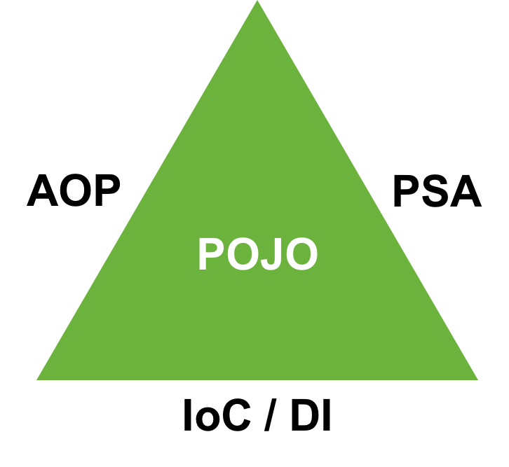
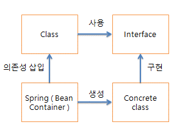
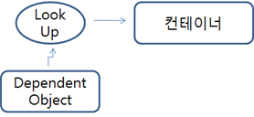
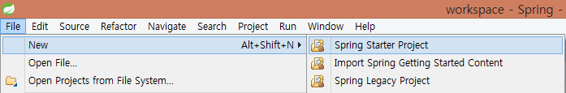
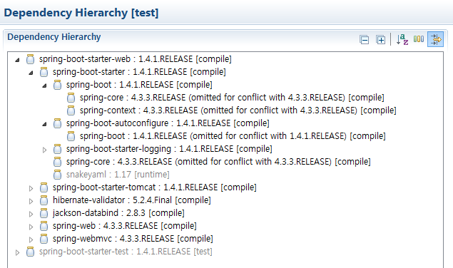
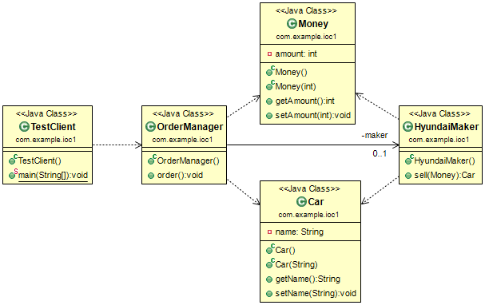
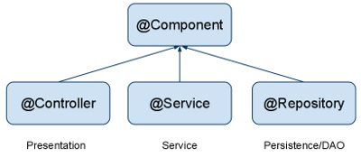
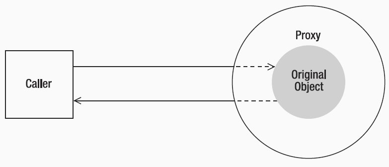
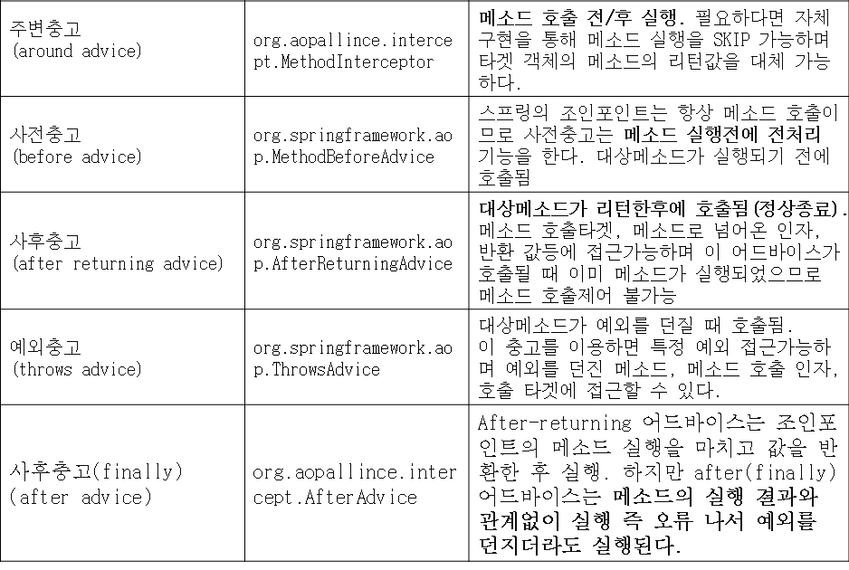
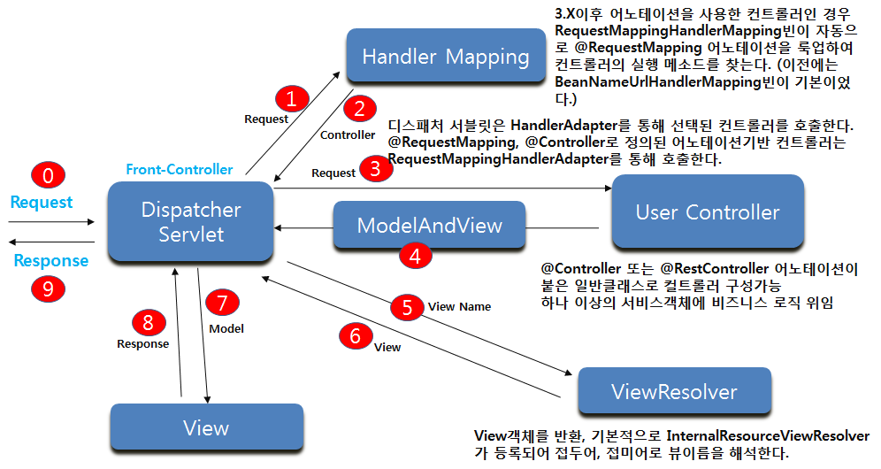

***

# 1. Spring IoC/DI

## Spring Framework

스프링은 2004년 Rod Johnson이 만든 제어 역행과 관점지향 기술을 제공하는 경량의 오픈소스 프레임워크이다. 스프링은 Java 애플리케이션 개발을 위한 포괄적인 인프라 지원을 제공하는 Java 플랫폼으로써 성장했다. 지금은 자바가 필요해서 배우기보다는 스프링 프레임워크를 사용하기 위해서 자바를 배운다고 해도 과언이 아닌 시대가 되었다. 스프링은 인프라 스트럭처를 처리하므로 애플리케이션의 비즈니스 로직에 집중할 수 있도록 도와준다. 스프링을 사용하면 POJO(Plain Old Java Object)로 애플리케이션을 구축하고 비침투성 엔터프라이즈 서비스를 적용할 수 있기 때문에 기능의 확장에 편리함을 제공한다.

<p align="center"></p>

Spring Framework란 Aspect Oriented Programming, Portable Service Abstraction, Inversion of Control / Dependency Injectoin 기술을 바탕으로 Plain Old Java Object를 지향하는 경량의 오픈소스 프레임워크라고 정의할 수 있다. AOP, PSA, IoC/DI 기술은 스프링의 3대 핵심 기반기술이다. 스프링 프레임워크를 제대로 이해하기 위해서는 기반기술을 제대로 이해할 필요가 있다.

**POJO**
개발자가 필요로 하는 코드만 존재하는 순수한 객체다. 반드시 구성해야 하는 환경관련 코드가 없고 특정 기술을 위한 코드 또한 강제되지 않는 상태로써 개발자가 의도한 비즈니스 로직만이 존재하는 상태의 자바 객체를 포조라고 부른다.

**1. 서비스 추상화(Portable Service Abstractions)**
다른 프로그램과의 연동 부분에 추상화 레이어를 제공하여 공통 기능을 적용하거나 연동 프로그램과 관련한 변경작업 시 개발자의 코드를 보호하여 직접적인 코드의 변경을 막아준다.

**2. 객체관리 주체의 역전(Inversion of Control/Dependency Injection)**
개발자가 직접 객체를 생성, 관계설정을 행하는 대신 프레임워크가 개발자의 요청에 따라서 객체를 생성하여 빈 컨테이너에서 관리하고 객체가 사용해야 하는 `의존 객체를 주입(Dependency Injection)`해 주는 서비스를 제공한다. 객체가 의존하는 다른 객체의 변경이 있더라도 변화를 프로그램내 코드로 행하지 않고 외부로 분리한 선언적인 설정으로 처리하여 개발자의 코드의 변경을 막는다.

**3. 관점 지향 프로그래밍(Aspect Oriented Programming)**
전역적으로 다수의 메소드에서 수행해야 하는 공통적인 부가로직을 별도로 분리한다. 선언적인 설정으로 부가로직을 다수의 객체의 다수의 메소드와 엮는 작업을 통해서 적용한다. 이렇게 하면 부가로직의 적용/비적용 또는 변경 작업 시 직접적인 코드의 변경을 막을 수 있다.

* 스프링 프레임워크를 사용하면 연동 프로그램의 변경, 의존 객체의 변경, 공통적인 부가로직의 변경이 있어도 개발자의 코드를 변경하지 않고 이를 처리할 수 있다.

* 프레임워크를 이용하면 프로그램 코드의 작성 분량을 줄일 수 있으며 프로그램의 작성방법에 대한 관습을 강제로 제어할 수 있어서 협업에 유리하다. 가이드와 표준에 의한 개발을 따르도록 제어하며 읽기 쉬운 프로그램 코드를 얻을 수 있다.

* IoC 컨테이너를 사용하여 의존관계를 주입할 수 있으며 AOP를 이용하여 공통 기능을 소스코드 변경없이 필요한 곳에 적용할 수 있다.

* 복잡한 엔터프라이즈 애플리케이션 개발을 겨냥하여 자바빈즈를 사용한다. 선언적 트랜잭션 관리, 웹서비스, RMI등에 원격접근이 가능하며 데이터 영속성 관리를 위한 다양한 옵션을 제공한다.

* 단순성, 테스트 용이성, 느슨한 결합성의 측면에서 스프링을 사용하면 얻을 수 있는 이점이 상당하며 MVC Framework로써 필요한 모든 부분에 대해서 지원하고 있다.

* 최근에는 스프링 부트(Spring Boot)를 제공하여 복잡한 스프링 프로젝트의 구성을 간편화 하도록 지원하고 있어서 더욱 빠른 개발이 가능해졌다.

## 프레임워크 모듈

SpringFramework는 20개 정도의 모듈로 기능을 제공한다. 이러한 모듈은 다음 다이어그램과 같이 Core Container, Data Access/Integration, Web, AOP, Instrumentation, Messaging, and Test 등으로 그룹화되어 있다.


스프링의 선언적인 트랜잭션 관리 기능은 완전한 트랙잭션 기능을 가지게 한다. 모든 커스텀 비즈니스 로직은 간단한 POJO로 구현할 수 있고 스프링의 IoC 컨테이너로 관리할 수 있다. 스프링의 ORM 지원은 JPA, Hibernate, JDO, iBatis와 통합되었다. 예를 들면 하이버네이트를 사용할 때 이미 존재하는 매핑 파일과 표준 하이버네이트 SessionFactory 설정을 계속 사용할 수 있다. 폼(Form) 컨트롤러는 도메인 모델에 대한 값으로 HTTP 파라미터를 전달하는 ActionForms나 다른 클래스에 대한 필요성을 제거함으로써 도메인 모델과 웹 계층을 자연스럽게 통합한다.

## Spring Framework Artifacts

| GroupId | ArtifactId | Description |
| :--- | :--- | :--- |
| org.springframework | spring-aop | Proxy-based AOP support |
| org.springframework | spring-aspects | AspectJ based aspects |
| org.springframework | spring-beans | Beans support, including Groovy |
| org.springframework | spring-context | Application context runtime, including scheduling and remoting abstractions |
| org.springframework | spring-context-support | Support classes for integrating common third-party libraries into a Spring application context |
| org.springframework | spring-core | Core utilities, used by many other Spring modules |
| org.springframework | spring-expression | Spring Expression Language (SpEL) |
| org.springframework | spring-instrument | Instrumentation agent for JVM bootstrapping |
| org.springframework | spring-instrument-tomcat | Instrumentation agent for Tomcat |
| org.springframework | spring-jdbc | JDBC support package, including DataSource setup and JDBC access support |
| org.springframework | spring-jms | JMS support package, including helper classes to send/receive JMS messages |
| org.springframework | spring-messaging | Support for messaging architectures and protocols |
| org.springframework | spring-orm | Object/Relational Mapping, including JPA and Hibernate support |
| org.springframework | spring-oxm | Object/XML Mapping |
| org.springframework | spring-test | Support for unit testing and integration testing Spring components |
| org.springframework | spring-tx | Transaction infrastructure, including DAO support and JCA integration |
| org.springframework | spring-web | Foundational web support, including web client and web-based remoting |
| org.springframework | spring-webmvc | HTTP-based Model-View-Controller and REST endpoints for Servlet stacks |
| org.springframework | spring-websocket | WebSocket and SockJS infrastructure, including STOMP messaging support |

## 용어설명

#### IoC(Inversion of Control)

제어의 역전은 프로그래머가 작성한 프로그램이 재사용 라이브러리의 흐름제어를 받게되는 소프트웨어 디자인패턴을말한다. 줄여서 IoC라고 부른다. 전통적인 프로그래밍에서 흐름은 프로그래머가 작성한 프로그램이 외부 라이브러리의 코드를 호출하는 방식으로 이용한다. 하지만 제어의 역전이 적용된 구조에서는 외부 라이브러리의 코드가 프로그래머가 작성한 코드를 호출한다.

> 제어의 역전이라 객체의 생성 및 관계설정을 개발자가 직접하지 않고 대신 프레임워크가 맡아서 처리하는 것을 말한다. 

#### DI(Dependency Injection)

마틴파울러는 2004년 글에서 제어의 어떤측면이 역전되는 것인지에 대한 의문을 제기하고 의존하는 객체를 역행적으로 취득하는 것이라는 결론을 내렸다. 그는 그와 같은 정의에 기초하여 제어의 역전(IoC)이라는 용어에 좀 더 참신한 의존성 주입(DI)이라는 이름을 지어줬다.

모든 어플리케이션은 비지니스 로직을 수행하기 위해서 서로 협업하는 둘 또는 그 이상의 객체들로 이루어진다. 전통적으로 각 객체는 협업할 객체의 참조를 취득해야 하는 책임이 있다. 이것이 의존성이다.

IoC를 적용함으로써 객체들은 시스템 내의 각 객체를 조정하는 어떤 외부의 존재에 의해 생성 시점에서 의존성을 부여 받는데, 이를 의존성이 객체로 주입된다고 말한다. 따라서, IoC는 한 객체가 협업해야 하는 다른 객체의 참조를 취득하는 방법에 대한 제어의 역행이라는 의미를 갖는다.

<p align="center"></p>

> 의존성 주입이란 A가 객체가 사용하고자 하는 대상 객체를 스스로 선택하지 않고 대상 객체 B, C 중에서 무엇을 사용할지를 외부에서 결정한 후 선택된 객체를 A에게 주면 A는 수동적으로 받은 객체를 사용하는 방식을 말한다. A 객체는 코드적으로 자신이 사용하는 대상 객체가 무엇인지 알지 못하며 알게해서도 안 된다.

#### IoC 분류

일반적으로 IoC는 의존성 주입(DI), 의존성 룩업(DL) 두개의 하위 분류로 나눌 수 있으며 일반적으로 DI를 이야기 할 때는 IoC를 가리키지만 IoC를 이야기 할 때는 DI를 가리키는 것은 아니다. DI도 여러종류(세터주입, 생성자주입, 메소드주입)가 있지만 DL의 경우도 의존성풀(Dependency Pool)과 컨텍스트화된 의존성룩업(Contextualized Dependency Lookup) 두 종류가 있다.

<p align="center"></p>

## Dependency Injection

각 계층 사이, 각 객체 사이에 필요로 하는 의존관계가 있다면 이를 스프링 컨테이너가 자동 적으로 연결시켜 주는 것으로 각 객체 사이의 의존관계를 Bean 설정 정보 또는 애노테이션을 바탕으로 컨테이너가 자동적으로 연결해 주는 것이다.

**1. Setter Injection**
객체 사이의 의존관계를 연결시키기 위해 setter 메소드를 이용하는 방법.

**2. Constructor Injection**
객체 사이의 의존관계를 연결시키기 위해 생성자를 이용하는 방법.

**3. Method Injection**
Method Injection은 Setter Injection과 Constructor Injection이 가지고 있는 한계점을 극복하기 위하여 지원하고 있는 DI의 한 종류이다. 어떤 메소드의 실행을 다른 메소드로 대체한다든지 또는 메소드의 리턴형을 추상클래스로 지정한 후 필요에 따라 추상클래스를 상속받은 임의의 객체를 리턴 하도록 구성할 수 있다.

* 생성자 주입은 컴포넌트를 사용하기 전에 의존 해야하는 클래스의 인스턴스를 가지고 있어야 할 때 유용하며 세터주입은 부모 컴포넌트의 새 인스턴스를 생성하지 않고 동적으로 각기 다른 구현을 사용해 의존성을 대체할 수 있다. 생성자 주입이나 세터주입 모두 의존성을 인터페이스로 선언할 수 있다.

* 기본 생성자만 있는 클래스에 생성자 주입을 정의하면 비 IoC 환경에서 해당 클래스를 사용하는 모든 클래스에 영향을 주게 된다. 하지만 세터 주입의 경우 다른 클래스가 이 클래스와 상호작용 하는데 있어 영향을 덜 주게 된다.

* 일반적으로 세터 주입을 이용하는 것이 좋다. 이 방식은 비 IoC 설정에서 코드를 사용하는데 최소한의 영향만을 주기 때문이다. 생성자 주입은 컴포넌트로 항상 의존성이 전달되게 할 때 적합하다.

## Dependency Lookup

모든 IoC 컨테이너는 각 컨테이너에서 관리해야 하는 객체들을 관리하기 위한 별도의 저장소를 가진다. Bean에 접근하기 위하여 컨테이너에서 제공하는 API를 이용하여 사용하고자 하는 Bean을 Lookup 하는 것으로 컨테이너 API와 의존관계를 많이 가지면 가질수록 어플리케이션 컨테이너에 종속되는 단점이 있다.

#### Dependency Pull

IoC 타입중 가장 익숙한 타입으로 필요할 때 마다 레지스트리에서 의존성을 가지고 온다. EJB의 경우 JNDI API를 통해 EJB 컴포넌트를 룩업 한다.

<p align="center"></p>

#### Contextualized Dependency Lookup

컨테이너는 내부 WAS(톰캣, JBOSS 등)나 스프링 프레임워크에서 제공한다.

<p align="center"></p>

```java
ApplicationContext context = new ClassPathXmlApplicationContext("application-context.xml");
MyBean bean = context.getBean("myBean")
```

## Injection vs Lookup

어떤 IoC 방식을 사용할지는 별로 어렵지 않다. 스프링의 경우 초기 빈 Lookup을 제외하면 의존성이 항상 Injection 형태의 IoC를 사용하게 된다. 대부분의 환경에서 DI를 사용해서 모든 객체를 연결할 수는 없으며 초기 컴포넌트에 접근 시 DL을 사용해야 하는 경우가 많다. 예를 들어 일반 자바 APP에서는 main에서 스프링 컨테이너를 부트스트랩하고 ApplicationContext 인터페이스를 통해 의존객체를 가져와야 한다. 즉 스프링에서는 DI를 사용할 수 있으면 사용하고 그렇지 못한 경우라면 DL을 사용하면 된다.

의존성 풀 방식의 코드는 레지스트리에 대한 참조를 가지고 있어야 하고 레지스트리와 연동해서 의존성 객체를 가지고 와야 한다. 또한 CDL을 사용시 특정 인터페이스를 구현해야 하고 모든 의존성을 직접 가지고 와야 한다. 하지만 의존성 주입(Dependency Injection)을 사용하면 적절한 생성자, 메소드, 세터 등을 통해 의존성을 주입 받기만 하면 된다.

## BeanFactory

* 스프링의 의존성 주입의 핵심 인터페이스

* Bean의 생성과 소멸을 담당(의존성과 생명주기 및 관리 담당), 객체를 관리하는 고급 설정 기법 제공

* DI 지원 기능만 필요하다면 BeanFactory 인터페이스를 이용해 스프링 DI 컨테이너와 직접 연동할 수 있다. 이 경우 애플리케이션은 BeanFactory 인터페이스를 구현한 클래스의 인터페이스를 생성하고 이 인스턴스에 빈과 의존성 설정 정보를 저장해야 한다.

* BeanFactory를 프로그래밍적으로 설정할 수도 있지만 대부분 설정 파일을 통해 외부에서 설정하는 방식을 사용한다.

* 스프링에서 기본적으로 제공하는 두개의 메인 BeanFactory는 BeanDefinitionRegistry를 구현하고 있다. PropertiesBeanDefinitionReader는 프로퍼티 파일에서 Bean정의를 읽고 XmlBeanDefinition Reader는 XML 파일에서 Bean정의를 읽는다.

## ApplicationContext

* BeanFactory의 모든 기능 제공(BeanFactory 인터페이스를 상속)

* 권장하는 방식으로 스프링 DI 뿐 아니라 트랜잭션, AOP 서비스, 국제화를 위한 메시지 소스, 애플리케이션 이벤트 처리

* Spring Framework2.5 이상부터 ApplicationContext 설정시 자바 어노테이션을 지원

* XML 설정 방식을 쓰면 모든 설정을 자바코드로 부터 외부 XML에 둠

* Annotation  방식의 경우 자바코드 내에서 DI 설정을 정의

* XML/Annotation  둘 동시에 사용되는 경우 XML 설정이 우선  
  한다. 주로 데이터소스, 트랜잭션 매니저, JMX, JMS커넥션팩터리등 애플리케이션 인프라 스트럭처에는 XML 파일에 저장하고 DI 설정은 어노테이션에서 정의한다.

* Context 시작 시 모든 Singleton Bean을 미리 로딩(preloading) 시키므로 초기에 설정 및 환경에 대한 에러 발견 가능 함

* 다수의 ApplicationContext 구현 클래스 제공, 다양한 Resource 로딩 방법을 제공한다. XmlWebApplicationContext, FileSystemXmlApplicationContext, ClassPathXmlApplicationContext

* Spring의 AOP기능, 메시지 자원 핸들링, 이벤트 위임, 웹 어플리케이션에서 사용하기 위한 WebApplicationContext와 같은 특정 어플리케이션 컨텍스트를 이용한 통합과 같은 다른 기능을 추가 제공한다  

## Lazy Loading vs Pre Loading

#### Lazy Loading

메소드나 클래스가 요청을 받는 시점에 자바빈의 인스턴스를 만들고 로딩하는 방법이다.

```java
BeanFactory factory = new XmlBeanFactory(new InputStreamResource(
        new FileInputStream("config.xml"))); // 1

TestBean tb = (TestBean) factory.getBean("testBean"); // 2
```

1번에서 BeanFactory 컨테이너에 의해 config.xml 파일이 로드되더라도 어떠한 빈도 인스턴스화 되지 않고 2번에서 testBean이 요청을 받는시점에 인스턴스화 되고 로드된다. 즉, getBean 메소드 호출 시 빈이 로드된다.

#### Pre Loading

모든 빈들이 ApplicationContext 컨테이너에 의해 설정파일이 로드될 때 인스턴스로 만들어지고 로드 된다.

```java
ApplicationContext context = new ClassPathXmlApplicationContext("config.xml"); // 1

TestBean tb = (TestBean) factory.getBean("testBean"); // 2
```

1번에서 모든 싱글톤 빈들이 인스턴스화 된다. 그러므로, 빈이 여러 개라면 시간이 소요될 것이다. 2번에서는 미리 컨테이너에서 만들어진 빈들이 클라이언트로 리턴된다.

스프링 설정파일에 여러개의 자바빈이 정의되었다고 모두 자주 사용되는 것은 아닐 수 있다. 모두 자주 사용되지 않을 수도 있으니 이러한 경우라면 요청이 있을 때 자바 빈을 인스턴스로 만드는 것이 좋을 것이다. 물론, 모두 자주 사용되는 빈이라면 한번에 로드 하는 것이 좋은 방법이다.

## ApplicationContext(Bean Container) 구성

스프링은 개발자 대신 객체를 관리하기 위해서 컨테이너를 갖고 있다. 이를 빈 컨테이너라 부른다. 개발자는 사용하고자 하는 객체들을 스프링에게 미리 알려주어야 한다. 이러한 작업을 빈 설정이라 부르며 다음 세가지 방법이 있다. 

1. XML Configuration
2. Annotation Configuration
3. Java Configuration

일반적으로 세가지 설정방법을 섞어서 사용한다. XML설정은 빈 관리가 한 곳에 모여 있다는 장점이 있으며 애노테이션 방식의 설정은 빠르게 개발할 수 있는 장점을 제공하지만 빈 관리정보가 분산되어 관리성이 떨어진다는 단점이 있게 된다. 자바컨피그 방식은 설정정보를 클래스에서 바로 구현할 수 있다는 장점을 제공한다.

빈 설정은 스프링 프레임워크가 정한 설정방법을 학습하여 사용하면 되는데 그 전에 우리는 왜 객체관리를 개발자가 직접하지 않고 프레임워크에게 맡겨서 사용하는 것이 좋은지 그 필요성을 알아볼 필요가 있다.

---

# Spring Boot

기본적인 프로젝트 스캐폴딩 도구로 빠른개발을 위한 스프링 프레임워크 서브 프로젝트 중에 하나인 스프링 부트를 사용합니다. 스프링 부트는 CoC(Convention over Configuration)개념을 적용하여 개발자가 처리해야 하는 반복적인 성격의 설정작업을 대신 수행하여 개발자의 수고를 덜어주는 기술입니다.

개발 초기단계에서 바로 코드작성을 시작하지는 않습니다. 처음부터 코드를 작성하면 나중에 소스 코드 덩치가 커지거나 협업을 해야 하거나 배포를 해야 할 때 관리상의 문제가 많이 생긴다는 것을 개발자들은 이미 경험으로 알고 있기 때문입니다. 그러한 이유로 코드를 작성하기 전에 먼저 코드의 구조화, 리소스, 디펜던시, 연동환경, 테스팅 및 배포작업을 미리 염두에 두고 구조적으로 프로젝트를 구분하는 스캐폴딩 작업을 선행합니다.

프로젝트 관점에서 살펴보면 실제 코드를 작성하기 전에 해야 할 여러 설정 작업들이 도출됩니다. 스프링부트는 여러 설정작업들 중 개발자를 대신해 관습을 적용하여 자동화 할 수 있는 부분을 자동으로 처리하는 기술로써, 개발자의 수고를 덜어주어 보다 빠른 개발이 진행될 수 있도록 도와줍니다. 여러분이 스프링 핵심개념 학습에 보다 집중할 수 있도록 스프링 부트를 기본적인 스캐폴딩 도구로 사용하겠습니다.

하지만 때때로 수동적으로 환경을 구성해 보아야 무엇이 처리되고 있는지 이해하게 되는 경우도 있습니다. 따라서, 필요하다면 과거에 많이 사용하던 설정방식도 병행하도록 하겠습니다.

## 1. 프로젝트 생성

먼저 스프링 부트에 익숙해지기 위해서 간단한 프로젝트를 하나 만들어 보겠습니다. 프로그래밍 전통을 따라 브라우저가 서버에 요청하면 "Hello World" 메시지를 브라우저에게 보내주는 웹서비스를 만들어 보겠습니다.



#### 프로젝트명: spring-boot-basic

화면의 정보를 살펴봅니다. Maven을 디펜던시 및 빌드 도구로 사용하고 Jar로 패키징해서 배포합니다. 자바버전은 1.8이고 프로젝트 구성 시 패키지가 com.example로 만들어진다는 것있습니다. 기본 설정을 그대로 두고 "Next" 버튼을 클릭합니다.


패키징을 Jar로 선택하면 톰캣서버가 임베디드되어서 배포 시 별도의 WAS 구성없이 빠르게 배포할 수 있습니다. 기존의 구성된 WAS에 업로드하는 방식으로 배포하고자 하는 경우에는 패키징을 War로 선택하시면 됩니다.

War로 선택할 경우, 기존과 같이 외부 WAS에 디플로이 하는 구조로 만들어집니다. Jar로 선택해서 로컬개발 및 테스트를 하다가 나중에 배포할 경우 War로 변경해서 배포를 할 수도 있습니다.

## 2. 디펜던시 선택

화면에서 왼쪽부분 ▶ 대분류 메뉴를 클릭하면 선택할 수 있는 상세 메뉴가 표시됩니다.

`선택 디펜던시 : Web`

`Finish` 버튼을 눌러서 스프링 부트로 프로젝트를 생성하는 작업을 마칩니다. 처음에는 로컬 저장소의 디펜던시 파일들이 없을 것이므로 다운받는 시간이 필요하고 그에 따라 첫 프로젝트는 생성완료까지 시간이 다소 걸릴 수 있습니다. 


## 3. 디펜던시 확인

#### pom.xml

```xml
<?xml version="1.0" encoding="UTF-8"?>
<project xmlns="http://maven.apache.org/POM/4.0.0"
	xmlns:xsi="http://www.w3.org/2001/XMLSchema-instance"
	xsi:schemaLocation="http://maven.apache.org/POM/4.0.0 http://maven.apache.org/xsd/maven-4.0.0.xsd">
	<modelVersion>4.0.0</modelVersion>

	<groupId>com.example</groupId>
	<artifactId>spring-boot-basic</artifactId>
	<version>0.0.1-SNAPSHOT</version>
	<packaging>jar</packaging>

	<name>spring-boot-basic</name>
	<description></description>

	<parent>
		<groupId>org.springframework.boot</groupId>
		<artifactId>spring-boot-starter-parent</artifactId>
		<version>2.0.6.RELEASE</version>
		<relativePath /> <!-- lookup parent from repository -->
	</parent>

	<properties>
		<project.build.sourceEncoding>UTF-8</project.build.sourceEncoding>
		<project.reporting.outputEncoding>UTF-8</project.reporting.outputEncoding>
		<java.version>1.8</java.version>
	</properties>

	<dependencies>
		<dependency>
			<groupId>org.springframework.boot</groupId>
			<artifactId>spring-boot-starter-web</artifactId>
		</dependency>

		<dependency>
			<groupId>org.springframework.boot</groupId>
			<artifactId>spring-boot-starter-test</artifactId>
			<scope>test</scope>
		</dependency>
	</dependencies>

	<build>
		<plugins>
			<plugin>
				<groupId>org.springframework.boot</groupId>
				<artifactId>spring-boot-maven-plugin</artifactId>
			</plugin>
		</plugins>
	</build>
</project>
```

스프링 부트는 web 개발의 필요한 여러 디펜던시들을 하나의 대표 디펜던시 `spring-boot-starter-web`을 사용하는 것으로 한번에 모두 설정할 수 있게 해 줍니다. 더불어 디펜던시들의 버전관리도 스프링 부트가 직접 관리하므로 따로 명기할 필요가 없습니다. <parent> 태그설정으로 설정정보를 상속받습니다. 스프링 부트가 디펜던시들의 버전을 관리함으로써 개발자가 디펜던시의 충돌현상으로 머리 아플 일이 사라지게 되었습니다.

`<artifactId>spring-boot-starter-test</artifactId>`

개발 시 테스트는 항상 수행되어야 하는 업무이므로 자동으로 테스트 디펜던시가 추가됩니다.

`<artifactId>spring-boot-maven-plugin</artifactId>`

메이븐에게 스프링 부트 프로젝트를 빌드하여 실행할 수 있는 능력을 주는 설정이 자동으로 추가되어 있습니다.

#### Dependency Hierarchy

pom.xml의 Dependency Hierarchy 화면을 보면 `spring-boot-starter-web`, `spring-boot-starter-test` 2개의 대표 디펜던시 밑으로 해당 개발 카테고리에 필요한 다수의 디펜던시들이 설정되어 있는 것을 알 수 있습니다. `spring-core` 디펜던시 옆에 버전 부분을 살펴보면 사용하는 스프링 버전을 알 수 있습니다.



## 4. 프로젝트 환경설정

스프링 부트는 기본적으로 XML파일을 사용하지 않습니다. 스프링 부트는 Java-config와 애테이션 방식의 설정을 선호합니다. 스프링 부트는 application.properties 파일이나 application.yml 파일을 자주 사용하는 기술의 설정작업을 위한 설정파일로 제공합니다. 

application.properties 파일안에는 주로 스프링부트가 미리 정한 속성을 사용하여 설정을 합니다. 설정의 처리는 자동으로 수행됩니다. 정해진 속성의 관련한 정보는 다음 사이트를 참조하세요.

#### Appendix A. Common application properties
https://docs.spring.io/spring-boot/docs/current/reference/html/common-application-properties.html

추가로 개발자가 지정한 속성도 선언할 수 있지만 이 속성을 처리하는 것은 개발자가 직접 수행해야 합니다.

#### application.properties

프로퍼티 파일에서 #은 주석기호 입니다.

```properties
#java -jar yourapp.jar -Dserver.contextPath=/your/path/here
server.contextPath=/hello-world
server.port=8080
```

server.port 를 지정하지 않으면 디폴트로 8080 포트를 사용합니다. server.contextPath를 지정했으므로 웹서비스에 접속할 때 사용할 URL은 다음처럼 웹프로젝트를 구분하는 컨텍스트 패스까지 사용해야 합니다. 

http://localhost:8080/hello-world

컨텍스트 패스를 명시적으로 설정하지 않는다면 도메인만 URL로 사용해서 접근해야 합니다. 이는 프로젝트를 Jar로 패키징해서 배포하기 때문입니다. 스프링 부트의 Jar 패키징안에는 임베디드된 톰캣이 포함되어 있습니다. Jar 파일을 사용하여 기동 시 `-Dserver.contextPath=/your/path/here` 옵션을 사용하여 컨텍스트 패스를 변경할 수 있고 웹서버의 포트를 변경하고자 한다면 `-Dserver.port=8090` 처럼 사용하면 됩니다.

부트 프로젝트에서 설정파일로 XML을 사용하고 싶다면 @ImportResource 애노테이션을 사용합니다. 자바컨피그 클래스를 사용하고 싶다면 @Import 애노테이션을 사용합니다. 더불어서, application.properties 파일 외에 별도의 .properties 파일을 사용하고 싶다면 @PropertySource 애노테이션을 사용합니다. 설정한 값은 @Value 애노테이션과 `SpEL`을 사용하여 원하는 곳에서 직접 주입 받을 수 있습니다. 

## 5. Presentation Layer

사용자의 요청 URL을 처리할 URL Handler인 컨트롤러 클래스를 작성합니다. 스프링 프레임워크를 사용한다면 개발자는 URL에 따라 대응하는 메소드를 작성하는 작업에만 신경쓰고 나머지는 모두 스프링이 미리 만들어 놓은 로직을 그대로 이용하는 방식으로 개발이 진행됩니다. 여기서는 컨트롤러가 환영메시지 문자열을 브라우저에게 전달하는 기능을 추가합니다.

#### HomeRestController.java

```java
package com.example.common.controller;

import org.springframework.web.bind.annotation.RequestMapping;
import org.springframework.web.bind.annotation.RestController;

@RestController
public class HomeRestController {
	@RequestMapping("/")
	public String home(){
		return "welcome home";
	}
}
```

컨트롤러 클래스에 @RestController 어노테이션을 붙였으므로 해당 클래스는 빈 컨테이너에 등록되고 URL Handler 역할을 수행합니다. @RequestMapping("/") 어노테이션 설정으로 서버에 루트("/")로 접근 시 "welcome home" 문자열을 그대로 브라우저에 전달합니다.

@RestController는 클래스 내 모든 메소드에 @ResponseBody를 설정한 @Controller입니다.

## 6. TEST

스프링 부트로 프로젝트 생성 시 자동으로 만들어진 클래스 Application.java 파일을 살펴보면 자바의 기동메소드인 main 메소드가 존재합니다. 이 main 메소드가 전체 애플리케이션의 엔트리 포인트입니다. 즉, 프로젝트 시작을 담당하는 클래스가 노출되어 있으므로 웹서비스 시작 시 파라미터를 받을 수 있고 수행이 필요한 로직을 여기에 추가할 수 있습니다. 부트(Boot)라는 용어 자체가 시작이라는 의미를 갖고 있습니다.

`Run As > Java Application` 메뉴를 선택하여 웹서비스 프로그램을 기동합니다. 자바의 main 기동메소드를 사용해 커다란 애플리케이션을 부트하는 것 입니다.

http://localhost:8080/hello-world/ 으로 접근하여 `welcome home` 메시지를 볼 수 있는지 확인합니다.

실제로 개발자가 작업한 부분은 application.properties와 HomeRestController.java가 전부이므로 스프링 부트로 개발하면 빠르게 웹 서비스를 구축할 수 있다는 것을 알 수 있습니다.

부트 프로젝트를 기동하는 방법이 하나 더 있습니다. `프로젝트 > Run As > Spring Boot App` 메뉴를 선택해서 부트 기반 프로젝트를 시작할 수도 있습니다.

## 7. JSP 연동

최근에는 JSP를 대체할 수 있는 기술들이 많이 나와 있어서 전 세계적으로 JSP의 사용비율이 점점 떨어지고 있는 추세입니다. 그러나 JSP가 자바표준 HTML 템플릿 엔진임에는 틀림이 없으므로 학습적인 차원에서는 여전히 중요하다고 볼 수 있습니다. 

스프링 부트에서 JSP 연동작업을 해 보도록 하겠습니다.

#### pom.xml

다음 디펜던시 2개를 설정파일에 추가합니다. 버전은 스프링 부트 프로젝트인 경우 명시하지 않아도 됩니다.

```java
<!-- JSP를 처리한다. -->
<dependency>
	<groupId>org.apache.tomcat.embed</groupId>
	<artifactId>tomcat-embed-jasper</artifactId>
	<scope>provided</scope>
</dependency>
<!-- JSP 내에서 JSTL 확장 태그 라이브러리를 사용한다. -->
<dependency>
	<groupId>javax.servlet</groupId>
	<artifactId>jstl</artifactId>
</dependency>
```

다음 작업으로 JSP 뷰와의 연동처리를 위한 컨트롤러를 하나 추가합니다.

#### HomeController.java

```java
package com.example.common.controller;

import org.springframework.stereotype.Controller;
import org.springframework.web.bind.annotation.RequestMapping;

@Controller
public class HomeController {
	@RequestMapping("/")
	public String home(){
		return "welcome";
	}
}
```

뷰의 실제 위치는 웹 루트 밑으로 여러 폴더들을 두고 그 아래에 배치하는 것이 일반적입니다. 따라서 컨트롤러에서 리턴하는 뷰의 이름은 웹루트/폴더/view.jsp까지 명기해야 합니다. 하지만 여러 뷰를 연동해 보면 패스경로와 .jsp부분은 항상 같으므로 이를 뷰의 이름만으로 짧게 사용해도 되도록 뷰 리졸버를 설정해서 사용하면 편리합니다. 따라서, 스프링 컨트롤러가 리턴하는 문자열을 뷰 리졸버(View resolver)에게 문의하면 뷰가 위치한 전체 경로를 가리키는 문자열을 완성하여 디스패처 서블릿에게 알려주는 역할을 수행하는 뷰 리졸버(View resolver) 설정을 추가합니다.

#### application.properties

```properties
spring.mvc.view.prefix=/WEB-INF/jsp/
spring.mvc.view.suffix=.jsp
```

하나의 URL 요청에 대응하는 메소드를 두 개 설정한 경우, 어느 메소드가 처리해야 할지 판단할 수 없습니다. 현재까지 작업으로 보면 HomeController와 HomeRestController 에 각각 루트("/") 요청에 대응하는 코드가 설정되어 있습니다. 따라서 어느 하나를 수정해야 합니다. 기존 HomeRestController.java 파일을 수정 합니다.

#### HomeRestController.java

```java
package com.example.common.controller;

import org.springframework.web.bind.annotation.RequestMapping;
import org.springframework.web.bind.annotation.RestController;

@RestController
public class HomeRestController {
	@RequestMapping(value={"/"}, params="plain")
	public String homeForPlain(){
		return "welcome home";
	}
	
	@RequestMapping(value={"/"}, params="json")
	public String homeForJson(){
		return "{\"message\" : \"welcome home\"}";
	}
}
```

스프링의 강력한 URL 매핑 기능 중에 전달되는 파라미터에 따라서 대응하는 메소드를 지정할 수 있는 기능을 사용합니다. @RequestMapping 속성으로 여러 설정을 사용하면 모든 설정을 만족하는 경우에만 메소드가 연동됩니다. 이는 자바의 메소드 오버로딩 개념에서 사용하는 메소드 시그너처 개념과 비슷합니다.

다음 작업으로 뷰에 역할을 수행하는 JSP 파일을 작성합니다.

#### src/main/webapp/WEB-INF/jsp/welcome.jsp

```html
<%@ page language="java" contentType="text/html; charset=UTF-8" pageEncoding="UTF-8"%>
<!DOCTYPE html>
<html>
<head>
<meta http-equiv="Content-Type" content="text/html; charset=UTF-8">
<title>Welcome Home</title>
</head>
<body>
	<h2>welcome.jsp</h2>
</body>
</html>
```

## 8. TEST

1. `http://localhost:8080/hello-world/`
컨텍스트 패스까지 URL로 사용해서 서버에 접속하면 JSP 파일과 연동됩니다. 
이 요청은 `@RequestMapping("/")` 설정이 붙어 있는 메소드가 처리합니다. 
브라우저가 받은 결과는 HTML 파일입니다.
`welcome.jsp` 메시지를 볼 수 있는지 확인합니다.

2. `http://localhost:8080/hello-world/?json`
파라미터로 "json" 문자열을 추가하면 결과로 JSON 포맷의 문자열을 받습니다. 
`@RequestMapping(value={"/"}, params="json")` 설정이 붙어 있는 메소드가 처리합니다.
브라우저가 받은 결과는 JSON 포맷의 문자열입니다.
`{ message: "welcome home" }` 데이터를 볼 수 있는지 확인합니다.

3. `http://localhost:8080/hello-world/?plain`
파라미터로 "plain" 문자열을 사용하면 결과로 평범한 문자열을 받습니다. 
`@RequestMapping(value={"/"}, params="plain")` 설정이 붙어 있는 메소드가 처리합니다.
브라우저가 받은 결과는 단순 문자열입니다.
`welcome home` 데이터를 볼 수 있는지 확인합니다.

지금까지 스프링 부트로 프로젝트를 만들어서 사용하는 방법을 간단히 살펴 보았습니다.
> "Let there be code!", "Code be with you!"


***

# 1.1. IoC의 필요성

IoC/DI 개념을 적용하면 객체관리의 주체가 개발자에서 프레임워크로 이관된다. 이해도를 높이기 위해서 왜 이러한 패러다임의 변화가 필요한지 살펴보자.

## 새 프로젝트

쇼핑몰을 만들어서 차를 팔기로 했다고 치자. 주문을 처리하는 담당자가 필요하다. 차량의 구매는 현대자동차와 거래한다. 차를 주문할 때 돈을 지불하고 차를 받는다. 새 프로젝트를 만들어서 시작해 보자.

```
STS >> New >> Spring Starter Project

Project Name : spring-ioc-di
Type : Maven
Packaging : Jar
Java : 8
Package : com.example.demo

Project Dependencies : Web, Lombok
```

#### pom.xml

```java
<?xml version="1.0" encoding="UTF-8"?>
<project xmlns="http://maven.apache.org/POM/4.0.0"
    xmlns:xsi="http://www.w3.org/2001/XMLSchema-instance"
    xsi:schemaLocation="
    http://maven.apache.org/POM/4.0.0 
    http://maven.apache.org/xsd/maven-4.0.0.xsd">
    <modelVersion>4.0.0</modelVersion>

    <groupId>com.example</groupId>
    <artifactId>1-spring-ioc-di</artifactId>
    <version>0.0.1-SNAPSHOT</version>
    <packaging>jar</packaging>

    <name>1-spring-ioc-di</name>
    <description></description>

    <parent>
        <groupId>org.springframework.boot</groupId>
        <artifactId>spring-boot-starter-parent</artifactId>
        <version>2.0.6.RELEASE</version>
        <relativePath /> <!-- lookup parent from repository -->
    </parent>

    <properties>
        <project.build.sourceEncoding>UTF-8</project.build.sourceEncoding>
        <project.reporting.outputEncoding>UTF-8</project.reporting.outputEncoding>
        <java.version>1.8</java.version>
    </properties>

    <dependencies>
        <dependency>
            <groupId>org.springframework.boot</groupId>
            <artifactId>spring-boot-starter-web</artifactId>
        </dependency>
        <dependency>
            <groupId>org.springframework.boot</groupId>
            <artifactId>spring-boot-starter-test</artifactId>
            <scope>test</scope>
        </dependency>
        <dependency>
            <groupId>org.projectlombok</groupId>
            <artifactId>lombok</artifactId>
            <scope>compile</scope>
        </dependency>
    </dependencies>

    <build>
        <plugins>
            <plugin>
                <groupId>org.springframework.boot</groupId>
                <artifactId>spring-boot-maven-plugin</artifactId>
            </plugin>
        </plugins>
    </build>
</project>
```

## Step 1. 객체지향 설계

#### Car.java

```java
package com.example.demo.ioc1;

import lombok.AllArgsConstructor;
import lombok.Data;

@Data
@AllArgsConstructor
public class Car {
    private String name;
}
```

#### Money.java

```java
package com.example.demo.ioc1;

import lombok.AllArgsConstructor;
import lombok.Data;

@Data
@AllArgsConstructor
public class Money {
    private int amount;
}
```

#### HyundaiMaker.java

```java
package com.example.demo.ioc1;

public class HyundaiMaker {
    public Car sell(Money money) {
        System.out.println("HyundaiMaker # " + money.getAmount() + "원을 차 값으로 받는다.");

        Car car = new Car("Sonata");
        System.out.println("HyundaiMaker # " + car.getName() + "를 만들어서 판다.");

        return car;
    }
}
```

#### KiaMaker.java

```java
package com.example.demo.ioc1;

public class KiaMaker {
    public Car sell(Money money) {
        System.out.println("KiaMaker # " + money.getAmount() + "원을 차 값으로 받는다.");

        Car car = new Car("K9");
        System.out.println("KiaMaker # " + car.getName() + "를 만들어서 판다.");

        return car;
    }
}
```

#### OrderManager.java

```java
package com.example.demo.ioc1;

public class OrderManager {
    // 운영정책에 따라 KiaMaker 에게 주문을 해야 합니다.
    // 개발자가 어떻게 대응해야 할까요?
    // 1. 새 클래스 KiaMaker를 만든다.
    // 2. OrderManager가 KiaMaker를 사용하도록 코드를 수정합니다.

    // OrderManager가 사용하는 클래스가 매일 변경되어야 합니다.
    // 개발자가 어떻게 대응해야 할까요?
    // 상황에 따라 코드 수정이 빈번하다면 해당 클래스는 
    // 개발이 완료된 클래스라고 볼 수 없습니다.
    // 상황에 따라 코드를 수정하지 않고도 운영자가 직접 
    // 로직의 변경을 선택해서 사용할 수 있도록 조치해야 합니다.
    // 즉, 클래스의 수정이 없이도 OrderManager가 사용하는 
    // 대상 객체의 변경이 적용되어야 합니다.

    private HyundaiMaker maker = new HyundaiMaker();
//    private KiaMaker maker = new KiaMaker();

    public void order() {
        Money money = new Money(1000);
        System.out.println("OrderManager # " + money.getAmount() + "원을 만든다.");

        Car car = maker.sell(money);
        System.out.println("OrderManager # 돈을주고 " + car.getName() + "를 산다.");
    }
}
```

#### 개방-폐쇄 원칙 (Open/Closed Principle)
> “소프트웨어 요소는 확장에는 열려 있으나 변경에는 닫혀 있어야 한다.”

어떤 기능이 필요한지 미리 예측하기란 실로 어려운일입니다. 따라서 프로그램을 사용하다가 발생한 니즈에 따라서 기능을 추가하는 작업은 자연스러운 현상입니다. 하지만, 이미 존재하는 기능들을 바꾸어 가면서 사용하는 작업 시 코드를 수정해야하는 것은 피해야 할 일입니다. 예를 들어 기능의 변경 시 코드가 수정되야 한다면 해당 로직은 개발이 완료된 것이 아니므로 변경 작업을 위해서 개발자가 항시 대기해야 합니다. 이런 개발방식으로는 절대 패키지 프로그램을 제작할 수 없습니다.

#### Test.java

```java
package com.example.demo.ioc1;

public class Test {

    public static void main(String[] args) {
        OrderManager manager = new OrderManager(); // 객체 생성
        manager.order(); // 필요한 시점에 로직을 실행
    }

}
```

Test가 직접 OrderManager 객체를 생성한 후 order 메소드를 호출하는 것으로 프로그램을 시작한다. 고객(Test)이 딜러(OrderManager)에게 차를 주문하면 딜러가 자동차회사(HyundaiMaker)에 돈(Money)을 주고 차(Car)를 얻게 되는 흐름이다.

개발자가 클래스 내부에서 직접 객체를 생성하여 사용하고 있다. 개발자가 객체관리를 직접처리하는 능동적인 객체관리 방식이다. 
 
OrderManager에게서 HyundaiMaker를 분리한다면 OrderManager는 제대로 작동하지 않는다. 따라서 두 클래스는 결합되어 있다고 볼 수 있다. OrderManager와 HyundaiMaker 객체간의 관계는 둘의 관계를 떼어 놓을 수 없기 때문에 강결합 결합도를 띄고 있다고 말한다. 강결합 결합도를 갖게 되면 OrderManager가 HyundaiMaker 객체 말고 다른 객체를 사용해야 할 때 코드를 수정해야만 변화를 적용할 수 있게 된다.

현재로선 OrderManager와 HyundaiMaker를 떼어 놓을 방법이 없다. 이 두 클래스는 정적으로 강하게 결합(Tight Coupling) 되어 있다. 다른 한편으로 완벽하게 분리된 코드는 아무일도 수행하지 못한다.

#### Class Diagram

클래스 다이어그램은 `ObjectAid UML Explorer` 플러그인으로 작성되었다.
다이어그램을 보고 다음 관계를 파악할 수 있다.
* Test use OrderManager.
* OrderManager use Money.
* OrderManager user Car.
* OrderManager has HyundaiMaker.
* HyundaiMaker use Money.
* HyundaiMaker use Car.



Money, Car 클래스는 데이터를 보관, 전송하기 위해 사용하는 Value Object이다. 
OrderManager가 HyundaiMaker를 사용하기 위해서 멤버변수로 갖고 있다. Has-A 관계다.

한 클래스가 다른 클래스를 사용하는 것은 달리 말하면 의존하는 것이라 볼 수 있다. 의존관계 주입(DI)이라는 용어에서 의존이라는 단어는 이러한 관계에서 파생됬다. 서비스 로직을 제공하는 객체를 전략객체라고 부르기도 한다.

> OrderManager는 HyundaiMaker를 사용한다. = OrderManager는 HyundaiMaker에 의존한다.

결합도는 클래스 A가 사용하는 클래스 B를 C로 변경할 때 얼마나 많은 클래스 A의 코드가 수정되어야 하는지를 갖고 구분한다. 결합도가 강결합이라면 전략객체 B를 C로 변경할 때 클래스 A의 코드변화가 있어야 하는 것이고 약결합이라면 코드의 변화가 없는 것이다.

클래스의 결합도가 강결합이라면 변화의 취약하게 된다. 많은 부분을 수정해야 하므로 쉽게 변화를 적용하지 못하고 실수할 확률도 늘어나게 된다.

## Step 2. Interface 도입

자바에서 결합도를 떨어뜨리는 일반적인 방법은 인터페이스를 도입하여 구현을 인터페이스 뒤로 숨기는 인터페이스 기반 프로그래밍을 적용하는 것이다. 이를 통해 클라이언트 클래스에 영향을 주지 않고도 쉽게 구현 클래스가 교체될 수 있도록 처리할 수 있다.

#### CarMaker.java

```java
package com.example.demo.ioc2;

public interface CarMaker {
        public Car sell(Money money);
}
```

인터페이스 CarMaker를 구현한다.

#### HyundaiMaker.java

```java
package com.example.demo.ioc2;

public class HyundaiMaker implements CarMaker {
    @Override
    public Car sell(Money money) {
        System.out.println("HyundaiMaker # " + money.getAmount() + "원을 차 값으로 받는다.");

        Car car = new Car("Sonata");
        System.out.println("HyundaiMaker # " + car.getName() + "를 만들어서 판다.");

        return car;
    }
}
```

인터페이스 CarMaker를 구현한다.

#### KiaMaker.java

```java
package com.example.demo.ioc2;

public class KiaMaker implements CarMaker {
    @Override
    public Car sell(Money money) {
        System.out.println("KiaMaker # " + money.getAmount() + "원을 차 값으로 받는다.");

        Car car = new Car("K9");
        System.out.println("KiaMaker # " + car.getName() + "를 만들어서 판다.");

        return car;
    }
}
```

#### OrderManager.java

```java
package com.example.demo.ioc2;

// OrderManager has CarMaker.
// OrderManager use CarMaker.
// OrderManager depend CarMaker. ==> Dependency Injection
public class OrderManager {
    // OrderManager가 사용하는 클래스가 매일 변경되어야 합니다.
    // 개발자가 어떻게 대응해야 할까요?
    // 상황에 따라 코드 수정이 빈번하다면 해당 클래스는 개발이 완료된 클래스라고 볼 수 없습니다.
    // 상황에 따라 코드를 수정하지 않고도 운영자가 직접 로직의 변경을 선택해서 사용할 수 있도록 조치해야 합니다.
    // 즉, 클래스의 수정이 없이도 OrderManager가 사용하는 클래스의 변경이 적용되어야 합니다.

    // 해결방법
    // 1. 인터페이스를 도입한다. (객체지향 격언: 변화가 있다면 인터페이스를 도입해라)
    // 인터페이스 자료형으로 사용 객체를 지칭한다.
    // 멤버변수는 코드변경 없이 그대로 사용할 수 있게 되었습니다.
    // 2. OrderManager가 사용하는 대상 객체를 가리키는 자료형이 코드에서 노출되지 않도록 조치합니다.
    // 객체지향 격언: 코드의 수정에는 닫혀 있고(배포 버전) 기능의 확장(패키지 버전을 통한 확장)에 열려 있도록 코딩하라.

    // OrderManager 클래스내에서 이 클래스가 사용하는 대상 객체를 지칭하는 
    // 모든 단어를 추방해서 변화가 있어도 이 클래스의 코드 수정은 없도록 만들었습니다.

    private CarMaker maker;

    public OrderManager() {
//        maker = new HyundaiMaker();
//        maker = new KiaMaker();
    }

    public void order() {
        Money money = new Money(1000);
        System.out.println("OrderManager # " + money.getAmount() + "원을 만든다.");

        Car car = maker.sell(money);
        System.out.println("OrderManager # 돈을주고 " + car.getName() + "를 산다.");
    }

    public void setMaker(CarMaker maker) {
        this.maker = maker;
    }

}
```

인터페이스를 사용하지 않는다면 HyundaiMaker 자료형을 다른 메이커 자료형으로 교체해야 된다. 인터페이스를 사용한다면 new HyundaiMaker 부분만 수정하면 된다.

#### DIP(Dependency Inversion Principle)

* 자주 변경되는 구상클래스(Concrete class)에 의존하지 말라.

* 어떤 클래스를 상속받아야 한다면 , 기반 클래스를 추상 클래스 또는 인터페이스로 만들어서 구현하라.

* 어떤 클래스의 참조를 가져야 한다면 참조 대상이 되는 클래스를 추상 클래스, 인터페이스로  정의하라.

* 인터페이스를 만들어서 이 인터페이스에 의존하라.

#### 객체 생성의 권리를 포기: 직접 객체를 생성하지 않고 받아서 사용하기

인스턴스를 생성하는 방법의 문제를 해결하기 위해 스프링 프레임워크의 세터주입을 이용하자. setter 메소드를 통해 CarMaker 타입 객체를 주입 받는다.

인터페이스 자료형인 CarMaker가 멤버변수와 세터메소드 파라미터 부분에 사용되고 있다. 메소드 파라미터 자리에 인터페이스 자료형으로 업캐스팅해서 정의하면 파라미터로 그 인터페이스를 구현한 어떠한 객체도 전달될 수 있다. 이것이 파라미터 정의 시 업캐스팅해서 사용하는 이유다.

#### Test.java

```java
package com.example.demo.ioc2;

public class Test {

    // 3. Test 클래스에서 직접 KiaMaker/HyundaiMaker 단어가 노출되므로
    // 이 클래스는 변화에 취약하고 코드 수정이 불가피합니다.
    // OrderManager 클래스에 적용했던 #2을 이 클래스에도 적용해야 합니다.
    // 위 모습은 모든 클래스가 동일하므로 결국 맨 앞에 클래스는 프로그램에서 사용하는
    // 모든 객체와 의존하는 객체를 설정하는 코드를 수행해야 합니다.
    // 이러한 코딩을 설정파일을 통해 프레임워크에게 위임하면 편리합니다.

    public static void main(String[] args) {
//        CarMaker maker = new KiaMaker(); // 객체 생성
        CarMaker maker = new HyundaiMaker(); // 객체 생성

        OrderManager manager = new OrderManager(); // 객체 생성
        // OrderManager가 사용해야 하는 대상 객체를 먼저 알려주어야 합니다.
        manager.setMaker(maker); 
        manager.order(); // 필요한 시점에 로직을 실행
    }

}
```

OrderManager 객체의 order 메소드를 호출하기전에 OrderManager가 사용해야 할 CarMaker의 구현체를 미리 알려주어야 한다.

#### 정리

이제 OrderManager 클래스는 자기가 사용하는 전략이 변경되어도 OrderManager 클래스 내 코드를 수정할 필요가 없게 되었다. 이 점이 개발자가 얻은 값진 열매다. 이 열매를 얻기 위해 개발자는 다음 2가지 작업을 수행했어야 했다.

1. 인터페이스를 도입한다.
2. 인터페이스의 구현체가 무엇인지 언급되는 코딩방식을 피한다.

변화가 있는 경우 자료형을 업캐스팅해서 사용한다. 클래스 내 구현체의 실체 이름이 직접 언급되는 것을 피하기 위해서 직접 new 연산자로 객체를 생성하는 작업을 포기하고 대신 받아서 사용하는 수동적인  객체관리 프로그래밍을 방식을 적용했다.

즉, 개발자는 변화가 있는경우 클래스의 결합도를 약결합으로 유지하기 위해서 직접 객체생성을 하지 않는다. 인터페이스를 적용한 약결합 관계의 두 객체는 붙였다 뗏다 하는 작업 시 코드 수정이 필요없다는 점에서 레고 블록과 비슷하다고 볼 수 있다. 두개의 블록을 붙이는데 본드를 사용했다면 두 블록은 강결합 관계라고 볼 수 있다.

<br/>

## Step 3. Spring XML 설정

우리는 앞서서 개발자가 직접 객체를 관리하는 방식에서 직접 관리하지 않고 대신 받아서 사용하는 수동적인 방식으로 변화하는 모습을 살펴보았다. 이를 검증하는 데 Test 클래스를 사용했다. 

만약 Test 클래스가 사용하는 OrderManager가 다른 클래스로 변경되어야 한다고 하면 Test 클래스 내 코드가 수정되어야 한다. 이렇게 클래스 내에서 직접 객체를 생성하면 변화의 취약하게 된다. 따라서, Test 클래스도 클래스 내에서 직접 객체를 생성하지 않고 받아서 사용하는 수동적인 방식의 코딩스타일을 적용하고 싶어지게 된다.

우리는 많은 클래스들에서 이러한 모습을 여러군데에서 발견할 수 있다. 클래스가 사용하는 전략객체가 변경되더라도 클래스 내 코드를 바꿀 필요가 없도록 하기 위해서 개발자는 다음 작업을 피해야 한다.

1. 객체 생성
2. 관계 설정(주입)

직접 객체를 생성하고자 하면 실체가 노출되어야 하고 직접 대입하고자 하면 실체가 무엇인지 판단해야 하므로 역시 실체가 노출된다. 이러한 코딩방식은 변화의 취약하다. 이를 피하기 위해서 개발자들은 더 이상 직접 객체를 관리하고 싶어하지 않게 되었다. 이 지점에서 프레임워크가 대신 객체를 관리하는 업무를 맡는다. 자바진영에서 가장 인기 있는 객체관리 프레임워크가 바로 스프링이다. 객체관리를 개발자가 하지 않고 프레임워크가 하는 모습을 제어의 역전(Inversion of Control)이라고 부른다. 개발자 대신 객체를 관리하는 기능은 프레임워크의 핵심기능이다. 프레임워크는 컨테이너를 두고 그 안에서 객체를 관리한다. 프레임워크는 개발자가 요청한 클래스들을 대신 생성하여 관리해 준다.


1. 강결합
Controller가 Repository를 직접 생성하여 멤버변수로 갖고 있다. 전략객체가 변경되어야 할 때 코드의 수정은 불가피하다.

2. 추상화된 의존성
인터페이스를 도입했다. 하지만 Controller가 객체를 직접 생성하여 사용함으로 부분적인 강결합이다. 멤버변수는 인터페이스 자료형을 사용하여 약결합을 띄지만 객체 생성을 직접하게 되면 구현 클래스의 노출은 피할 수 없으므로 부분적인 강결합 성질을 갖게된다.

3. 의존관계 주입
Repository 구현체를 스프링이 생성하여 빈 컨테이너에 보관한다. Controller가 필요 시 스프링이 구현체를 주입해 준다. Controller 클래스 내부에 Repository 구현 클래스명이 존재하지 않으므로 약결합이 되었다. 전략객체가 변경될 때 코드를 바꿀 필요가 없어졌다. 스프링은 BeanFactory 인터페이스 구현체를 사용하여 개발자가 요청한 객체를 대신 생성, 주입해 주는 서비스를 제공한다.

이제 개발자가 원하는 객체들을 프레임워크가 대신 관리하도록 요청하는 방법을 살펴 볼 차례이다. 먼저 XML을 작성하여 처리하는 방법을 살펴보자.

#### Test.java

```java
package com.example.demo.ioc3;

import org.springframework.context.ApplicationContext;
import org.springframework.context.support.ClassPathXmlApplicationContext;

public class Test {

    public static void main(String[] args) {
//        CarMaker maker = new KiaMaker(); // 객체 생성
//        CarMaker maker = new com.example.demo.ioc3.HyundaiMaker(); // 객체 생성
//        
//        OrderManager manager = new OrderManager(); // 객체 생성
//        manager.setMaker(maker); // DI: 의존 관계 설정
//        manager.order(); // 필요한 시점에 로직을 실행

        /*
         * 스프링에게 객체생성 및 의존 관계 설정을 위임하는 방법
         * 1. XML
         * 2. Annotation
         * 3. Java Configuration Class
         */

        ApplicationContext context = new ClassPathXmlApplicationContext(
                "car-config.xml");

        // 빈 id로 객체를 구한다.
//        OrderManager manager = (OrderManager) context.getBean("manager");

        // 자료형으로 객체를 구한다.
        OrderManager manager = (OrderManager) context.getBean(OrderManager.class);

        manager.order();

        OrderManager manager2 = (OrderManager) context.getBean(OrderManager.class);

        // Singleton: 컨테이너 안에 해당 자료형의 객체가 하나만 존재합니다.
        // 요청할 때마다 이미 만들어 놓은 객체를 전달합니다.
        System.out.println(manager == manager2); // true
    }

}
```

#### car-config.xml

```java
<?xml version="1.0" encoding="UTF-8"?>
<beans xmlns="http://www.springframework.org/schema/beans"
    xmlns:xsi="http://www.w3.org/2001/XMLSchema-instance"
    xsi:schemaLocation="http://www.springframework.org/schema/beans http://www.springframework.org/schema/beans/spring-beans.xsd">

<!-- 
//        CarMaker maker = new KiaMaker(); // 객체 생성
        CarMaker maker = new HyundaiMaker(); // 객체 생성

        OrderManager manager = new OrderManager(); // 객체 생성
        manager.setMaker(maker); // DI: 의존 관계 설정
        manager.order(); // 필요한 시점에 로직을 실행 : 스프링 프레임워크가 판단하지 못합니다.
 -->

    <bean id="kiaMaker" class="com.example.demo.ioc3.KiaMaker"></bean>
    <bean id="hyundaiMaker" class="com.example.demo.ioc3.HyundaiMaker"></bean>

    <bean id="manager" class="com.example.demo.ioc3.OrderManager">
        <!-- 
            setMaker 세터메소드를 사용하여 빈 아이디 hyundaiMaker가 가리키는 객체를 DI 합니다.
            세터메소드를 사용하지만 설정은 name="maker" 방식처럼 멤버변수를 사용합니다.
         -->
        <!-- <property name="maker" ref="hyundaiMaker"></property> -->

        <constructor-arg ref="kiaMaker"></constructor-arg>
    </bean>

</beans>
```

## Step 4. Spring Annotation 설정

#### Car.java

```java
package com.example.demo.ioc4;

import javax.annotation.PostConstruct;

import org.springframework.beans.factory.annotation.Value;
import org.springframework.context.annotation.Scope;
import org.springframework.stereotype.Component;

import lombok.AllArgsConstructor;
import lombok.Data;
import lombok.NoArgsConstructor;

@Data
@AllArgsConstructor
@NoArgsConstructor // 디폴트 생성자
@Component
@Scope("prototype")
public class Car {
    @Value("${car.default.name:자동차}")
    private String name;

    // 빈 컨테이너 등록된 후에 프레임워크에 의해서 메소드가 기동합니다.
    @PostConstruct
    public void init() {
        System.out.println(">>> this.name = " + this.name);
        this.name = "Good Car";
    }

    @Override
    public String toString() {
        return super.toString();
    }

    @Override
    public boolean equals(Object obj) {
        return super.equals(obj);
    }

    @Override
    public int hashCode() {
        return super.hashCode();
    }
}
```

#### Money.java

```java
package com.example.demo.ioc4;

import lombok.AllArgsConstructor;
import lombok.Data;

// DTO(Data Transfer Object)
// 여러 상태정보를 하나로 취급하기 위해서 사용하는 객체
// 이러한 객체는 상태가 mutable 하기 때문에 일반적으로 스프링 빈 컨테이너에 등록하지 않고
// 필요 시, 객발자가 new 연산자로 직접 객체를 생성해서 사용하고 필요없으면 바로 G.C 대상이 되도록 한다.
@Data
@AllArgsConstructor
public class Money {
    private int amount;
}
```

#### CarMaker.java

```java
package com.example.demo.ioc4;

// 인터페이스를 사용하여 객체를 만들 수 없으므로 이 클래스는 빈 컨테이너에 등록 대상이 아니다.
// 인터페이스의 구현클래스가 빈 컨테이너에 등록될 수 있는 대상이다.
public interface CarMaker {
    public Car sell(Money money);
}
```

#### HyundaiMaker.java

```java
package com.example.demo.ioc4;

import org.springframework.beans.factory.annotation.Autowired;
import org.springframework.context.annotation.Primary;
import org.springframework.stereotype.Component;

// <bean id="hyundaiMaker" class="com.example.demo.ioc4.HyundaiMaker"></bean>

@Primary
@Component("hyundaiMaker")
public class HyundaiMaker implements CarMaker {
    @Autowired
    private Car car;

    @Override
    public Car sell(Money money) {
        System.out.println("HyundaiMaker # " + money.getAmount() + "원을 차 값으로 받는다.");

//        Car car = new Car("Sonata");
        car.setName("Sonata");
        System.out.println("HyundaiMaker # " + car.getName() + "를 만들어서 판다.");

        return car;
    }
}
```

#### KiaMaker.java

```java
package com.example.demo.ioc4;

import org.springframework.beans.factory.annotation.Autowired;
import org.springframework.beans.factory.annotation.Required;
import org.springframework.stereotype.Component;

@Component // 빈 id를 생략하면 클래스명을 사용합니다. 단, id는 소문자로 시작합니다.
public class KiaMaker implements CarMaker {
//    @Autowired
    private Car car;

    @Override
    public Car sell(Money money) {
        System.out.println("KiaMaker # " + money.getAmount() + "원을 차 값으로 받는다.");

//        Car car = new Car("K9");
        car.setName("K9");
        System.out.println("KiaMaker # " + car.getName() + "를 만들어서 판다.");

        return car;
    }


    public Car getCar() {
        return car;
    }

    @Autowired
    @Required // 주로 XML 설정 시 깜박하고 setter주입을 하지 않으면 바로 에러메시지를 출력한다.
    public void setCar(Car car) {
        this.car = car;
    }

}
```

#### OrderManager.java

```java
package com.example.demo.ioc4;

import org.springframework.beans.factory.annotation.Autowired;
import org.springframework.beans.factory.annotation.Qualifier;
import org.springframework.stereotype.Service;

// @Service 애노테이션은 @Component 애노테이션의 확장(상속)입니다.
// 빈 객체를 역할에 따라서 구분해 놓으면 나중에 객체들을 조작할 때 역할별로 그룹핑해서 처리할 수 있습니다.
@Service("manager")
public class OrderManager {
    // 자료형이 CarMaker인 빈 객체를 찾아서 변수에 주입합니다.
    @Autowired
    // @Autowired로 대상을 찾았는데 대상이 2개 이상이면 그 중에서 어는 것을 사용할지 결정합니다.
    // 에러메시지: expected single matching bean but found 2: hyundaiMaker,kiaMaker
    // @Qualifier("hyundaiMaker")
    private CarMaker maker;

    public OrderManager() {}

    public OrderManager(CarMaker maker) {
        super();
        this.maker = maker;
    }

    public void order() {
        Money money = new Money(1000);
        System.out.println("OrderManager # " + money.getAmount() + "원을 만든다.");

        Car car = maker.sell(money);
        System.out.println("OrderManager # 돈을주고 " + car.getName() + "를 산다.");
    }

    // 빈 id가 kiaMaker인 객체를 찾아서 파라미터로 전달합니다.
    // @Resource(name="kiaMaker")
    public void setMaker(CarMaker maker) {
        this.maker = maker;
    }

}
```

#### car-config2.xml

```java
<?xml version="1.0" encoding="UTF-8"?>
<beans xmlns="http://www.springframework.org/schema/beans"
    xmlns:xsi="http://www.w3.org/2001/XMLSchema-instance"
    xmlns:context="http://www.springframework.org/schema/context"
    xsi:schemaLocation="http://www.springframework.org/schema/beans http://www.springframework.org/schema/beans/spring-beans.xsd
        http://www.springframework.org/schema/context http://www.springframework.org/schema/context/spring-context.xsd">

    <!-- 
        base-package 에서부터 클래스 안에 설정된 애노테이션을 scan 하여 처리한다.
        component-scan 태그는 annotation-config 태그 설정을 내포합니다.
        1. 대상을 찾아서 빈 컨테이너에 등록
        2. 빈 컨테이너에 등록된 객체들의 의존 관계를 설정
     -->
    <context:component-scan base-package="com.example.demo.ioc4"/>

    <!-- 빈 컨테이너에 등록되어 있는 객체들 안에 설정된 애노테이션을 처리한다. -->
    <!-- <context:annotation-config/> -->

    <context:property-placeholder location="my.properties"/>

</beans>
```

#### Test.java

```java
package com.example.demo.ioc4;

import org.springframework.context.ApplicationContext;
import org.springframework.context.support.ClassPathXmlApplicationContext;

public class Test {

    public static void main(String[] args) {
//        CarMaker maker = new KiaMaker(); // 객체 생성
//        CarMaker maker = new com.example.demo.ioc3.HyundaiMaker(); // 객체 생성
//        
//        OrderManager manager = new OrderManager(); // 객체 생성
//        manager.setMaker(maker); // DI: 의존 관계 설정
//        manager.order(); // 필요한 시점에 로직을 실행

        /*
         * 스프링에게 객체생성 및 의존 관계 설정을 위임하는 방법
         * 1. XML
         * 2. Annotation
         * 3. Java Configuration Class
         */

        ApplicationContext context = new ClassPathXmlApplicationContext(
                "car-config2.xml");

        OrderManager manager = (OrderManager) context.getBean("manager");
        manager.order();

        Car car1 = context.getBean(Car.class);
        System.out.println(car1);
        System.out.println(car1.getName());

        Car car2 = context.getBean(Car.class);
        System.out.println(car2);
        System.out.println(car2.getName());

        System.out.println(car1 == car2); // false

        KiaMaker kiaMaker = context.getBean("kiaMaker", KiaMaker.class);
        System.out.println(kiaMaker.getCar());
    }

}
```

## Step 5. Spring Java Configuration

#### CarConfig.java

```java
package com.example.demo.ioc5;

import org.springframework.context.annotation.Bean;
import org.springframework.context.annotation.ComponentScan;
import org.springframework.context.annotation.Configuration;
import org.springframework.context.annotation.Primary;

//<context:component-scan base-package="com.example.demo.ioc5"/>
@ComponentScan(basePackages="com.example.demo.ioc5")

// 빈 설정정보가 클래스안에 있을 때 사용합니다.
@Configuration
public class CarConfig {

//    CarMaker maker = new KiaMaker(); // 객체 생성
//    CarMaker maker = new com.example.demo.ioc3.HyundaiMaker(); // 객체 생성
//    OrderManager manager = new OrderManager(); // 객체 생성
//    manager.setMaker(maker); // DI: 의존 관계 설정

//    <bean id="kiaMaker" class="com.example.demo.ioc3.KiaMaker"></bean>
//    <bean id="hyundaiMaker" class="com.example.demo.ioc3.HyundaiMaker"></bean>
//    <bean id="manager" class="com.example.demo.ioc3.OrderManager">
//        <property name="maker" ref="hyundaiMaker"></property>
//    </bean>

    @Bean(name="kiaMaker")
    public KiaMaker kiaMaker() {
        KiaMaker maker = new KiaMaker();
        return maker;
    }

    @Primary
    @Bean // 빈 id를 생략하면 메소드명을 id로 사용합니다.
    public HyundaiMaker hyundaiMaker() {
        HyundaiMaker maker = new HyundaiMaker();
        return maker;
    }

    @Bean
    public OrderManager manager() {
        OrderManager manager = new OrderManager();
        manager.setMaker(kiaMaker());
        return manager;
    }
}
```

#### Test.java

```java
package com.example.demo.ioc5;

import org.springframework.context.ApplicationContext;
import org.springframework.context.annotation.AnnotationConfigApplicationContext;
import org.springframework.context.support.ClassPathXmlApplicationContext;

public class Test {

    public static void main(String[] args) {
//        CarMaker maker = new KiaMaker(); // 객체 생성
//        CarMaker maker = new com.example.demo.ioc3.HyundaiMaker(); // 객체 생성
//        
//        OrderManager manager = new OrderManager(); // 객체 생성
//        manager.setMaker(maker); // DI: 의존 관계 설정
//        manager.order(); // 필요한 시점에 로직을 실행

        /*
         * 스프링에게 객체생성 및 의존 관계 설정을 위임하는 방법
         * 1. XML
         * 2. Annotation
         * 3. Java Configuration Class
         */

        ApplicationContext context = new AnnotationConfigApplicationContext(
                CarConfig.class);

        OrderManager manager = (OrderManager) context.getBean("manager");
        manager.order();

        CarMaker maker = context.getBean(CarMaker.class);
        System.out.println(maker);
    }

}
```


***

# 1.2. 다양한 빈 컨테이너 설정

## Collection 설정방법

#### Example.java

```java
package com.example.demo.collection;

import java.util.List;
import java.util.Map;
import java.util.Properties;
import java.util.Set;

import lombok.Data;

@Data
public class Example {
    private Set<Object> set;
    private Map<String, Object> map;
    private List<Object> list;
    private Properties prop;
}
```

#### collection-config.xml

```java
<?xml version="1.0" encoding="UTF-8"?>
<beans xmlns="http://www.springframework.org/schema/beans"
    xmlns:xsi="http://www.w3.org/2001/XMLSchema-instance"
    xmlns:c="http://www.springframework.org/schema/c"
    xmlns:context="http://www.springframework.org/schema/context"
    xmlns:p="http://www.springframework.org/schema/p"
    xmlns:util="http://www.springframework.org/schema/util"
    xsi:schemaLocation="
    http://www.springframework.org/schema/beans 
    http://www.springframework.org/schema/beans/spring-beans.xsd
    http://www.springframework.org/schema/context 
    http://www.springframework.org/schema/context/spring-context.xsd
    http://www.springframework.org/schema/util 
    http://www.springframework.org/schema/util/spring-util.xsd">

    <!-- String who = new String("홍길동"); -->
    <bean id="who" class="java.lang.String">
        <constructor-arg value="홍길동"/>
    </bean>

    <util:list id="myList" list-class="java.util.ArrayList">
        <value>111</value>
        <value>222</value>
        <value>111</value>
        <value>333</value>
        <ref bean="who"/>
    </util:list>

    <bean id="example" class="com.example.demo.collection.Example">
        <property name="list" ref="myList">
            <!-- <list>
                <value>111</value>
                <value>222</value>
                <value>111</value>
                <ref bean="who"/>
            </list> -->
        </property>
        <property name="map">
            <map>
                <entry key="봄">
                    <value>Spring</value>
                </entry>
                <entry key="여름">
                    <value>Summer</value>
                </entry>
                <entry key="who">
                    <ref bean="who"/>
                </entry>
            </map>
        </property>
        <property name="prop">
            <props>
                <prop key="봄">Spring</prop>
                <prop key="여름">Summer</prop>
            </props>
        </property>
        <property name="set">
            <set>
                <value>111</value>
                <value>222</value>
                <value>111</value>
                <ref bean="who"/>
            </set>
        </property>
    </bean>

</beans>
```

#### Test.java

```java
package com.example.demo.collection;

import org.springframework.context.ApplicationContext;
import org.springframework.context.support.ClassPathXmlApplicationContext;

public class Test {

    public static void main(String[] args) {
        ApplicationContext context = new ClassPathXmlApplicationContext(
                "com/example/demo/collection/collection-config.xml");

        Example example = context.getBean(Example.class);

        example.getList().forEach(System.out::println);
        System.out.println();

        example.getMap().forEach((key, value) -> {
            System.out.println(key + ":" + value);
        }); 
        System.out.println();

        example.getProp().forEach((key, value) -> {
            System.out.println(key + ":" + value);
        }); 
        System.out.println();

        example.getSet().forEach(System.out::println);
    }

}
```

## SpEL을 이용한 설정방법

Spring 3.X에서 추가된 기능으로 SpEL을 이용하면 동적으로 표현식을 해석하고 그 결과를 ApplicationContext에서 사용할 수 있다. 결국 동적으로 생성된 값을 다른 자바 빈에 주입할 수  있다. #{빈아이디.멤버변수} 구문에 의해 getter가 호출되고 그 값이 주입된다.

#### User.java

```java
package com.example.demo.etc;

import lombok.Data;

@Data
public class User {
    private String name;
    private int age;
}
```

#### Member.java

```
package com.example.demo.etc;

import lombok.Data;

@Data
public class Member {
    private String name;
    private int age;
}
```

#### etc-config.xml

```java
<?xml version="1.0" encoding="UTF-8"?>
<beans xmlns="http://www.springframework.org/schema/beans"
    xmlns:xsi="http://www.w3.org/2001/XMLSchema-instance"
    xmlns:c="http://www.springframework.org/schema/c"
    xmlns:context="http://www.springframework.org/schema/context"
    xmlns:p="http://www.springframework.org/schema/p"
    xmlns:util="http://www.springframework.org/schema/util"
    xsi:schemaLocation="
    http://www.springframework.org/schema/beans 
    http://www.springframework.org/schema/beans/spring-beans.xsd
    http://www.springframework.org/schema/context 
    http://www.springframework.org/schema/context/spring-context.xsd
    http://www.springframework.org/schema/util 
    http://www.springframework.org/schema/util/spring-util.xsd">

    <bean id="user" class="com.example.demo.etc.User">
        <property name="name" value="일지매">
            <!-- <value>홍길동</value> -->
        </property>
        <property name="age">
            <value>19</value>
        </property>
    </bean>

    <bean id="member" class="com.example.demo.etc.Member">
        <property name="name">
            <value>#{user.name + "님"}</value>
        </property>
        <property name="age">
            <value>#{user.age + 1}</value>
        </property>
    </bean>

    <context:component-scan base-package="com.example.demo.etc"/>
    <!-- <context:property-placeholder location="my.properties"/> -->

</beans>
```

`@Value` 애노테이션은 Spring의 빈의 필드에 값 자체를 주입하는 데 사용할 수 있으며 멤버필드 또는 생성자, 메소드, 매개 변수 수준에서 적용 할 수 있다.

`@PropertySource` 애노테이션은 Spring 3.1 부터 생기기 시작한 통합 프로퍼티 관리 시스템으로 시스템 프로퍼티, 환경변수, JNDI 등을 모두 하나의 공간에 넣고 그 값을 읽고 설정할 수 있게 해준다. &lt;context:property-placeholder location="classpath:app.properties"/&gt; 태그로 대체할 수 있다.

#### Person.java

```java
package com.example.demo.etc;

import org.springframework.beans.factory.annotation.Value;
import org.springframework.context.annotation.PropertySource;
import org.springframework.stereotype.Component;

import lombok.Data;

//<context:property-placeholder location="my.properties"/>
@PropertySource(value = { "my.properties" })

@Component
@Data
public class Person {

    @Value("#{member.name}")
    private String name;
    @Value("#{member.age}")
    private int age;

    @Value("${car.default.name:null}")
    private String carName;
    @Value("${car.default.doors:0}")
    private int carDoors;

    // Run As > Run Configuration > VM arguments > -Duser.region=KR
    @Value("#{systemProperties['user.region'] == null ? 'US' : systemProperties['user.region']}")
    private String defaultLocale;
}
```

#### Test.java

```java
package com.example.demo.etc;

import org.springframework.context.ApplicationContext;
import org.springframework.context.support.ClassPathXmlApplicationContext;

public class Test {

    public static void main(String[] args) {
        ApplicationContext context = new ClassPathXmlApplicationContext(
                "com/example/demo/etc/etc-config.xml");

        User user = context.getBean("user", User.class);
        System.out.println(user);

        Member member = context.getBean("member", Member.class);
        System.out.println(member);

        Person person = context.getBean("person", Person.class);
        System.out.println(person);
    }

}
```


***

# 1.3. Annotation 살펴보기

## 빈 컨테이너 등록 용 애노테이션

스프링 컨테이너는 base-package의 클래스를 검색해서 자동으로 자바 빈으로 등록하는 데 이에 해당하는 것이 `@Component`, `@Repository`, `@Service`, `@Contoroller`, `@RestController`, `@Configuration` 애노테이션이다.

<p align="center"></p>

`@Controller`, `@Service`, `@Repository`는 Presentation, Service, Data Access 계층을 나타내기 위한 `@Component`의 특별한 형태이다.

자동스캔을 위해서 XML 기반의 설정에서는 `<context:component-scan base-package="a.b.c" />` 태그와 같이 base-package를 기술하며, 자바설정 기반인 경우 `@ComponentScan` 애노테이션을 사용하거나 AnnotationConfigApplicationContext#scan() 메소드를 이용하여 직접 스캐닝을 기술할 수 있다.

#### `@Component`

일반적인 용도의 컴포넌트들을 표시하는 기본 스테레오 타입, 멤버변수와 getter, setter만 가지고 있는 DTO, VO 같은 컴포넌트를 지칭한다. 스프링이 `@Component` 붙은 자바 클래스를 클래스패스 경로에서 자동으로 찾아 Application Context안에 이름을 부여하고 빈으로 등록한다. 빈의 기본 Scope는 songleton이며 `@Scope` 애노테이션으로 변경 가능하다.

#### `@Controller`, `@RestController`

프리젠테이션 레이어의 컨트롤러 컴포넌트, Spring MVC의 컨트롤러에 부여한다.

#### `@Service`

비즈니스 로직을 담고 있는 서비스 레이어의 컴포넌트를 가리키며 `@Component` 애노테이션과 동작은 같지만 서비스 계층의 클래스들은 `@Service` 애노테이션을 부여하는 것이 코드 가독성이 좋다.

#### `@Repository`

영속성 계층(Persistence Layer, Data Access Layer, 주로 DB와 관련된 작업을 수행)의 DAO 컴포넌트에 부여하는 애노테이션, `@Component`의 역할과 유사하며 DAO 메소드가 던지는 예외(Unckecked Exception)를 스프링의 DataAccessException으로 변환한다.

## 의존관계 설정 용 애노테이션

#### `@Scope`

일반적으로 `@Component`, `@Service`, `@Repository` 애노테이션이 붙어있어 스프링 IoC 컨테이너가 자동 스캐닝한 자바빈은 싱글톤 형태로 하나만 생성하는데 이를 변경하려면 `@Scope` 애노테이션을 사용하면 된다.

스프링에서 자바빈의 Scope : 스프링 프레임워크의 IoC 컨테이너는 개발자를 대신해서 빈을 생성, 생명주기를 관리해 주고, 스프링 애플리케이션에서 빈이 필요한 시점에 스프링이 빈을 주입(DI, 의존성 주입)해 준다는 것이다. 이 때 기본적으로 모든 빈을 싱글톤으로 컨테이너에 하나만 생성하여 관리한다. 그래서 스프링 컨테이너에게 빈을 제공받으면 언제나 주입받은 빈은 동일한 객체라는 것이다.

* **singleton**: IoC 컨테이너당 하나의 빈을 리턴

* **prototype**: IoC 컨테이너가 요청이 있을 때 마다 새로운 빈을 만들어 리턴

* **request**: HTTP request의 생명주기 안에 단 하나의 객체만 존재

* **session**: HTTP session의 생명주기 안에 단 하나의 객체만 존재

* **globalSession**: 전체 모든 세션에 대해 하나의 빈을 리턴

```
@Scope("prototype") 또는 @Scope(value = ConfigurableBeanFactory.SCOPE_PROTOTYPE)
```

#### `@Autowired`

Spring Framework에 종속적인 애노테이션 이다. 빈의 id, name로 아무거나 맞으면 적용(Type Driven Injection). 여러개의 빈이 검색될 경우 `@Qualifier(name="xxx")` 애노테이션으로 구분한다. 기본적으로 `@Autowired`된 속성은 모두 빈이 주입되어야 한다. 주입될 빈이 없는 경우가 있다면 required=false로 설정하면 오류는 발생하지 않는다. 멤버변수, setter 메소드, 생성자, 일반 메소드에 적용 가능하다.

#### `@Resource`

Spring2.5 이상에서 사용가능하며 Spring Framework에 비종속적으로 권장하는 방식이다. 빈의 name으로 주입될 빈을 찾는다. 멤버변수, setter 메소드에 적용가능. 사용하기 위해서는 jsr250-api.jar가 클래스패스에 추가되야 한다.


#### `@Required`

Setter 메소드 위에 기술하여 필수 프로퍼티를 설정하는 용도로 사용된다. `@Required` 애노테이션이 사용되기 위해서는 RequiredAnnotationBeanPostProcessor 클래스를 빈으로 등록하거나 `<context:annotation-config>` 설정을 추가하면 된다.

#### `@Order`

Spring4에서 새로 소개된 `@Order` 애노테이션은 같은 타입의 빈이 컬렉션(List등)에 Autowired 될 때 그 순서를 지정한다. 낮은 숫자가 우선순위가 높다.

#### `@PostConstruct`

객체가 생성된 후 별도의 초기화 작업을 위해 실행하는 메소드를 선언한다.
 CommonAnnotationBeanPostProcessor 클래스를 빈으로 등록시키거나 `<context:annotation-config>` 태그를 사용하면 된다.

#### `@ContextConfiguration`

Junit 테스트에서 애플리케이션 컨텍스트를 로딩할 때 주로 사용하는 애노테이션으로 설정파일의 위치를 지정한다.


위 그림을 보고 그대로 클래스를 작성하여 그림이 말하는 대로에 결과를 얻을 수 있는지 확인해 보자.


***

# 2. Spring AOP

* `횡단 관심사(Cross-Cutting Concern)` : 
여러 개의 모듈에 걸치는 시스템 전체적으로 부가해야 하는 요구사항을 다룬다. 대표적인 횡단 관심사의 일부 예들 든다면 인증 ,로깅,트랜잭션  무결성, 오류검사, 정책시행 등이 있다.

* `핵심 관심사(Primary Concern)` : 
각 모듈에서 수행해야 하는 기본적이고 대표적인 업무처리 기능을 다룬다.

IoC를 이용하여 협력하는 객체를 쉽게 연결시키는 것이 가능하지만 때때로 전체 애플리케이션에 걸쳐 사용되어야 하는 `공통적인 기능(횡단 관심사)`이 필요할 수도 있다. 

DI의 목적이 객체레벨에서의 결합도를 떨어뜨리는 것이 목표였다면 AOP의 목적은 횡단관심사와 이에 영향을 받는 객체들의 메소드 레벨에서의 결합도를 떨어뜨리는 것이다. 즉, AOP는 횡단관심사를 모듈화하는 프로그래밍 기법으로 공통적인 기능을 Aspect라 불리는 분리된 곳에 정의한다.

새로운 기능을 적용하려고 하는 클래스를 수정할 필요 없이 그런 기능을 어디에 어떻게 적용할 것인지 선언적 또는 애노테이션으로 설정하여 적용할 수 있다. 각 횡단관심사에 관한 로직이 애플리케이션 전체에 걸쳐 관리되지 않고 Aspect라고 하는 곳에서 분리되어 관리되면 애플리케이션은 고유의 비지니스로직 처리에 보다 더 충실할 수 있어서 관리성이 증대된다.

예를 들어 로깅처리는 시스템 내에서 거의 모든 경우에 적용하긴 하지만 특정한 비즈니스 로직과는 전혀 관련이 없다. 만일 AOP방식으로 구현한다면 실제 비즈니즈 로직의 구현을 담당하는 객체는 로그와 관련된 로직 정보가 없고 이 객체의 특정 메소드를 호출하는 시점에 지정된 다른 로깅 서비스 로직이 실행된다.


## Spring AOP 구현 방법

* 소스코드에서 직접 AOP 구현 : ProxyFactory 기반 AOP

* 선언(XML, 애노테이션)적인 AOP 설정 메커니즘
  * `ProxyFactoryBean` 사용 : 스프링 ApplicationContext를 XML에 선언적으로 선언하여 빈 정의를 기반으로 AOP 프록시를 생성한다.
  * `aop 네임스페이스` : aop 네임스페이스를 이용하여 Aspect 및 DI 요구사항을 간단히 정의. aop 네임스페이스도 내부적으로 ProxyFactoryBean을 사용한다.
  * `@ApectJ Annotation` : `@AspectJ` 방식의 애노테이션을 사용하여  클래스 내에서 AOP 설정이 가능하다, 이 방식은 AspectJ를 기반으로 하고 있으며 AspectJ 라이브러리가 필요하다. 이 역시 스프링에서는 프록시 메커니즘을 이용하는데 ApplicationContext를 부트스트랩 할 때 타겟에 대해 프록시를 생성한다.

* Spring AOP는 메소드 가로채기로 제한한다. 만약 그이상의 기능
(생성자 또는 멤버변수에 대한 가로채기)을 필요로 하는 경우 Proxy 기반 AOP
대신 AspectJ를 이용해서 Aspect를 구현해야 한다.

* 스프링의 충고(Advice)는 자바로 작성 : Pointcut의 경우 Advice를 어디에 적용할지를 정의하는 데 XML 설정 파일, AspectJ Expression으로 정의한다. AspectJ는 자바언어를 확장한 형태로 구현되면 이를 사용하기 위해서 새로운 도구와 문법을 배워야 한다.

* 스프링의 Aspect는 실행시간에 만들어진다. 빈을 감싸는 Proxy 객체를 실행시간에 생성하므로 Aspect가 Spring 관련 빈에 위빙(Weaving)된다. Proxy 객체는 타겟 객체로 위장해서 메소드 호출을 가로채고,  타겟 객체로 호출을 전달한다. 어플리케이션이 실제 Proxy 객체를 필요로 할 때까지 target를 생성하지 않으므로 즉 Proxy가 실시간으로 생성되므로 Aspect를 위빙 하기 위해 별도 컴파일러가 필요 없다.

<p align="center"></p>

* 스프링은 AOP연맹의  인터페이스를 구현하며 메소드 호출 결합점(Join Point)만 제공한다.

## 스프링 AOP 용어


## 스프링이 Proxy 객체를 생성하는 2가지 방법

1. 대상 객체가 특정 메소드를 공개하는 인터페이스를 구현한다면 JDK의  java.lang.reflect.Proxy 클래스를 이용하며 이 클래스는 필요한 인터페이스를 구현한 새로운 Proxy 객체를 동적으로 생성할 수 있으며 target 객체의 인터페이스를 통한 호출은 모두 가로채서 Advice를 수행한다.

2. 대상 클래스가 어떤 인터페이스를 구현하고 있지 않다면 CGLIB이라는 라이브러리를 이용하여 대상클래스의 서브클래스를 생성 시킨다. 이 서브클래스를 생성시킴으로써 스프링은 충고를 엮을 수 있으며 서브클래스에 대한 호출을 대상 클래스에 위임 할 수 있다. 이 경우 final 메소드는 충고를 받을 수 없으며(final Method는 대상클래스의 서브클래스를 생성해서 메소드를 재정의 해야 하는데 final인 경우 곤란함) 애플리케이션이 좀 더 느슨하게 결합되게 하기 위해 이 방법보단 인터페이스를 통해 프록시를 만드는 것이 선호된다.

* 스프링 어스팩트 : 스프링 AOP에서 애스팩트는 Advisor 인터페이스를 구현한 클래스의 인스턴스로 표시하는데 Advisor를 구현한 몇 개의 클래스를 제공한다. Advisor의 하위 인터페이스로는 IntroductionAdvisor, PointcutAdvisor등이 있는데 PointcutAdvisor 인터페이스는 포인트컷을 사용하여 조인포인트에 어드바이스를 적용하는 모든 Advisor가 구현한다.

***

# 프록시 연습 프로젝트

## 새 프로젝트 만들기

```
STS >> New >> Spring Starter Project

Project Name : spring-proxy-to-aop
Type : Maven
Packaging : Jar
Java : 8
Package : com.example.demo

Project Dependencies : Web, Lombok, Aspects
```

## Proxy implements Target's Interfaces

타겟 클래스가 인터페이스를 구현하고 있는 경우, 타겟 클래스를 프록싱하는 클래스도 같은 인터페이스를 구현하는 방식으로 프록시 클래스를 만든다.

#### Hello.java

```java
package com.example.demo.proxy1;

public interface Hello {
	public void say();
}
```

#### HelloImpl.java

```java
package com.example.demo.proxy1;

// Target: 핵심로직을 제공하는 객체
public class HelloImpl implements Hello {

	@Override
	public void say() {
		// Primary Concern: 언제나 실행되어야 하는 로직
		System.out.println("핵심로직: Hello~!!!"); 
	}

}
```

Proxy는 Hello 인터페이스 구현체인 HelloImpl의 대리자의 역할을 수행한다. 이해를 돕기위해서 예를 들어보면 HelloImpl은 가수이고 Proxy는 매니저라고 비유를 들 수 있다. 클라이언트는 가수에게 노래를 불러달라고 요청할 수 있고 대신 매니저에게 노래를 불러달라고 요청할 수도 있다. 어느 경우에도 노래를 부르는 것은 가수다.

#### Proxy.java

```java
package com.example.demo.proxy1;

public class Proxy implements Hello {
	
	private Hello hello;
	
	public Proxy(Hello hello) {
		this.hello = hello;
	}
	
	@Override
	public void say() {
		// 상황에 따라 실행되는 로직
		System.out.println("-----전 처리 부가로직-----"); 
		
		hello.say(); // 위임(Delegation): 핵심로직을 호출
		
		// 상황에 따라 실행되는 로직
		System.out.println("=====후 처리 부가로직====="); 
	}

}
```

#### Test.java

```java
package com.example.demo.proxy1;

import org.springframework.beans.factory.annotation.Autowired;
import org.springframework.stereotype.Component;

@Component
public class Test { // Test는 Hello를 사용하는 Client 역할이다.
	@Autowired
	private Hello h;
	
	public void useHello() {
		h.say(); 
		// 위 메소드는 1번, 2번 중에 무엇과 같을까요? 코드만 보고는 모른다. 
		// Hello 인터페이스의 구현체 중 하나일 것이라고 추측만이 가능하다.
		// h 변수가 가리키는 실체는 HelloImpl 객체일 수도 있고, 
		// Proxy 객체일 수도 있다.
		// 실체는 런타임시에 결정되므로 코드 레벨에서는 미리 판단할 수 없다.
	}
	
	// 클라이언트 객체가 사용하는 로직이 빈번하게 변경되는 상황입니다.
	// 클라이언트 클래스의 소스코드를 바꾸지 않고도 이를 적용할 수 있는 
	// 방법이 필요합니다.
	public static void main(String[] args) {
		Hello hello = new HelloImpl();
		hello.say(); // 1. 핵심로직만 실행
		
		System.out.println();
		
		Hello proxy = new Proxy(hello);
		proxy.say(); // 2. 핵심로직 + 부가로직을 실행
	}
}
```

클라이언트의 역할을 수행하는 Test가 실체가 HelloImpl인 객체의 say() 메소드를 호출하면 타겟 객체의 핵심로직만이 수행된다.

클라이언트의 역할을 수행하는 Test가 실체가 Proxy인 객체의 say() 메소드를 호출하면 프록시의 메소드가 가진 로직이 수행된다. 더불어서, 프록시가 타겟 객체의 say() 메소드를 호출하면 타겟 객체의 핵심로직이 추가로 수행된다.

엔터프라이즈 환경에서는 핵심로직만 수행되어야 하는 경우만 추가적으로 부가로직도 수행되어야 하는 경우가 많이 발생한다. 더불어서, 프로그램 전역적으로 이러한 현상이 발생한다.

***

## JDK Dynamic Proxy

자바가 제공하는 기술을 사용하면 동적으로 프록시 객체를 만들 수 있다.

#### MyAdvice.java

```java
package com.example.demo.proxy1.jdk;

import java.lang.reflect.InvocationHandler;
import java.lang.reflect.Method;

// 개발자가 앞서서 만든 Proxy 클래스는 오로지 HelloImpl 타겟 클래스만 
// 프록싱 할 수 있으나 InvocationHandler 인터페이스를 구현한 MyAdvice 
// 클래스는 모든 타겟 클래스를 프록싱 할 수 있습니다.
public class MyAdvice implements InvocationHandler {
	private Object target;
	
	public MyAdvice(Object target) {
		this.target = target;
	}
	
	@Override
	public Object invoke(Object proxy, Method method, Object[] args) throws Throwable {
		
    // 상황에 따라 실행되는 로직
		System.out.println("-----Around Before Advice-----"); 
		
//		((HelloImpl)target).say(); // 이렇게 사용하면 범용성을 잃어 버리게 됩니다.
		
		// 타겟 클래스의 핵심로직을 호출하는 방법 또한 범용성을 확보해야 하므로
		// 자바 리플렉션에서 지원하는 Method 클래스의 invoke 메소드를 사용합니다.
		// Method 객체는 내부에 호출해야 하는 메소드 정보를 갖고 있습니다.
		// 다음 코드는 target 객체 안에 메소드를 호출하면서 args 를 파라미터로 
		// 전달하는 뜻이 됩니다.
		
    // 위임(Delegation): 핵심로직을 호출
		Object ret = method.invoke(target, args); 
		
    // 상황에 따라 실행되는 로직
		System.out.println("=====Around After Advice======"); 
		
		return ret;
	}

}
```

#### Builder.java

```java
package com.example.demo.proxy1.jdk;

public interface Builder {
	public boolean build();
}
```

#### BigBuilder.java

```java
package com.example.demo.proxy1.jdk;

public class BigBuilder implements Builder {

	@Override
	public boolean build() {
		System.out.println("큰 건물을 건설한다.");
		return true;
	}

}
```

#### Test.java

```java
package com.example.demo.proxy1.jdk;

import java.lang.reflect.Proxy;

public class Test { // Client

	public static void main(String[] args) {
		
		Hello hello = new HelloImpl();
		hello.say(); // 1. 핵심로직만 실행
		
		System.out.println();
		
		// 프록시 클래스를 타겟클래스의 숫자만큼 만드는 것은 굉장히 
		// 번거로운 작업입니다. 그래서 스프링은 개발자 대신 프록시 
		// 객체를 자동으로 생성하는 기술을 사용합니다.
		// Proxy 클래스는 개발자가 만들 필요가 없으므로 삭제했습니다.
		// 그런데 어디엔가는 부가로직을 정의해서 갖고 있어야 합니다.
		// 그래서 InvocationHandler 인터페이스를 구현하는 클래스를 만들고
		// invoke 메소드가 부가로직을 갖고 있도록 조치합니다.
		
		// JDK Dynamic Proxy
		Hello proxy = (Hello) Proxy.newProxyInstance(
				Hello.class.getClassLoader(), // 접근방법
				new Class<?>[] {Hello.class}, // 메소드 정보
				new MyAdvice(new HelloImpl())); // 부가로직
		
		proxy.say(); // 2. 핵심로직 + 부가로직을 실행
		
		System.out.println("\n---------------\n");
		
		Builder builder = new BigBuilder();
		builder.build();
		
		System.out.println();
		
		Builder proxyBuilder = (Builder) Proxy.newProxyInstance(
				Builder.class.getClassLoader(),
				new Class<?>[] {Builder.class},
				new MyAdvice(new BigBuilder())); // 어드바이스 클래스를 재사용
		
		proxyBuilder.build();
	}

}
```

***

# Proxy extends Target

타겟 클래스가 인터페이스를 구현하고 있지 않은 경우, 프록시 클래스는 타겟 클래스를 상속하는 방식으로 만든다.

#### Hello.java

```java
package com.example.demo.proxy2;

public class Hello {
	public void say() {
    // 언제나 실행되어야 하는 로직
		System.out.println("핵심로직: Hello~!!!"); 
	}
}
```

#### Proxy.java

```java
package com.example.demo.proxy2;

public class Proxy extends Hello {
	
	@Override
	public void say() {
    // 상황에 따라 실행되는 로직
		System.out.println("-----전 처리 부가로직-----"); 
		
		super.say(); // 위임(Delegation): 핵심로직을 호출
		
    // 상황에 따라 실행되는 로직
		System.out.println("=====후 처리 부가로직====="); 
	}

}
```

#### Test.java

```java
package com.example.demo.proxy2;

import org.springframework.beans.factory.annotation.Autowired;
import org.springframework.stereotype.Component;

@Component
public class Test { // Client
	@Autowired
	private Hello h;
	
	public void useHello() {
		h.say(); 
		// h가 가리키는 실체는 Hello로 만든 객체일 수도 있고,
		// Proxy로 만든 객체일 수도 있다.
		// 스프링이 무엇을 DI하는냐에 따라서 사용하는 실체가 
		// 변경되고 수행로직이 달라진다.
	}
	
	public static void main(String[] args) {
		
		Hello hello = new Hello();
		hello.say(); // 1. 핵심로직만 실행
		
		System.out.println();
		
		Hello proxy = new Proxy();
		proxy.say(); // 2. 핵심로직 + 부가로직을 실행

	}

}
```

***

# CGLIB Dynamic Proxy

CGLIB 라이브러리가 제공하는 기술을 사용하여 타겟 클래스를 상속하는 프록시 객체를 동적으로 만들 수 있다.

#### Hello.java

```java
package com.example.demo.proxy2.cglib;

public class Hello {
	public void say() {
    // 언제나 실행되어야 하는 로직
		System.out.println("핵심로직: Hello~!!!"); 
	}
	
	public void bye() {
    // 언제나 실행되어야 하는 로직
		System.out.println("핵심로직: Goodbye~!"); 
	}
}
```

#### MyAdvice.java

```java
package com.example.demo.proxy2.cglib;

import org.aopalliance.intercept.MethodInterceptor;
import org.aopalliance.intercept.MethodInvocation;

public class MyAdvice implements MethodInterceptor {

	@Override
	public Object invoke(MethodInvocation invocation) throws Throwable {
		
    // 상황에 따라 실행되는 로직
		System.out.println("-----Around Before Advice-----"); 
		
    // 위임(Delegation): 핵심로직을 호출
		Object ret = invocation.proceed(); 
		
    // 상황에 따라 실행되는 로직
		System.out.println("=====Around After Advice======"); 
		
		return ret;
	}

}
```

MethodInterceptor는 메소드 호출용 어라운드 어드바이스의 표준 인터페이스이다. MethodInvocation은 어드바이스를 추가하기 위한 메소드 호출을 나타내며 이 객체를 사용하면 메소드 호출이 실행되는 시점(메소드 실행 전 / 후)을 제어할 수 있다.


#### Test.java

```java
package com.example.demo.proxy2.cglib;

import org.aopalliance.aop.Advice;
import org.springframework.aop.framework.ProxyFactory;

public class Test { // Client

	public static void main(String[] args) {
		
		Hello hello = new Hello();
		hello.say(); // 1. 핵심로직만 실행
		hello.bye();
		
		System.out.println();
		
		Advice advice = new MyAdvice();
		
		// CGLIB Dynamic Proxy
		ProxyFactory factory = new ProxyFactory();
		factory.setTarget(hello); // 타겟 객체 지정
		factory.addAdvice(advice); // 어드바이스 객체 설정
		
		// 타겟 객체와 어드바이스 객체만 지정하면 기본적으로
		// 타겟 객체의 모든 메소드를 호출할 때 어드바이스 로직이 작동합니다.
		
//		-----Around Before Advice-----
//		핵심로직: Hello~!!!
//		=====Around After Advice======
		
//		-----Around Before Advice-----
//		핵심로직: Goodbye~!
//		=====Around After Advice======
		
		// 그런데 때때로 타겟 객체의 일부 메소드만 어드바이스를 적용하고 
		// 싶을 때가 있습니다. 이를 조절하는 기술로 Pointcut을 추가로 
		// 적용해야 합니다.
		
		Hello proxy = (Hello) factory.getProxy();
		proxy.say(); // 2. 핵심로직 + 부가로직을 실행
		proxy.bye();
		
		
	}

}
```

***

# 대상 선택 전략 : Pointcut

* Pointcut은 모든 Join Point중 `Advice가 Weaving 되어야 할 Join Point의 집합(충고가 적용될 메소드)`을 정의한 것이다.
* 교차점(PointCut)은 특정한 클래스의 특정한 메소드가 특정한 기준과 일치하는지를 판단한다. 만약 그 메소드가 실제로 일치한다면 충고가 적용된다.
* 스프링은 충고를 받으려고 하는 클래스와 메소드의 관점에서 교차점을 정의하며 충고는 클래스의 이름과 메소드 시그네처(Method Signature)와 같은 특징에 기초하여 대상 클래스와 메소드에 엮인다.
* 스프링의 교차점 프레임워크를 위한 핵심 인터페이스는 PointCut, PointCut은 메소드와 클래스에 기초하여 충고를 어디에 엮을지 결정한다.
* Pointcut 구현체를 사용하려면 먼저 Advisor 인터페이스의 인스턴스를 생성하거나 좀 더 구체적으로 PointcutAdvisor 인터페이스의 인스턴스를 생성해야 한다.


* 충고자(Advisor)
Aspect는 행동을 정의한 충고와 실행돼야 할 위치를 정의한 교차점(Pointcut)의 조합으로 이루어 진다. 스프링에서는 이를 위해 충고자라는 것을 제공한다. 충고자는 충고(Advice)와 교차점(Pointcut)을 하나의 객체로 합친것 이다.

***

# AspectJExpressionPointcut

#### First.java

```java
package com.example.demo.pointcut1.aspectj;

public class First {
	
	public void one() {
		System.out.println("First # one()");
	}
	
	public void one2() {
		System.out.println("First # one2()");
	}
	
	public void two() {
		System.out.println("First # two()");
	}
	
	public int add(int a, int b) {
		System.out.println("First # add(int a, int b)");
		return a + b;
	}
	
}
```

#### Second.java

```java
package com.example.demo.pointcut1.aspectj;

public class Second {
	
	public void one() {
		System.out.println("Second # one()");
	}
	
	public void one2() {
		System.out.println("Second # one2()");
	}
	
	public void two() {
		System.out.println("Second # two()");
	}
	
	public double add(double a, double b) {
		System.out.println("Second # add(double a, double b)");
		return a + b;
	}
	
}
```

#### MyAdvice.java

```java
package com.example.demo.pointcut1.aspectj;

import org.aopalliance.intercept.MethodInterceptor;
import org.aopalliance.intercept.MethodInvocation;

public class MyAdvice implements MethodInterceptor {

	@Override
	public Object invoke(MethodInvocation invocation) throws Throwable {
		
		System.out.println("-----Around Before Advice-----");
		
		Object ret = invocation.proceed();
		
		System.out.println("=====Around After Advice======");
		
		return ret;
	}

}
```

#### Test.java

```java
package com.example.demo.pointcut1.aspectj;

import org.aopalliance.aop.Advice;
import org.springframework.aop.Advisor;
import org.springframework.aop.aspectj.AspectJExpressionPointcut;
import org.springframework.aop.framework.ProxyFactory;
import org.springframework.aop.support.DefaultPointcutAdvisor;

public class Test {

	public static void main(String[] args) {
		
		Advice advice = new MyAdvice();
		
		/*
		 * 	execution() : 사용하는 표현식 종류
		 * 	* one*(..) : 리턴자료형 메소드명(파라미터) : 필수 항목
		 * 	
		 * 	* : all
		 *  one* : 메소드명이 one 문자열로 시작
		 *  (..) : 파라미터 개수가 0~N개 가능, 각 파라미터 자료형은 상관이 없다.
		 *  
		 *  포인트컷 조합 시 and, or , not을 사용할 수 있다.
		 */
		AspectJExpressionPointcut pointcut = new AspectJExpressionPointcut();
		pointcut.setExpression("execution(* one*(..))");
		
		Advisor advisor = new DefaultPointcutAdvisor(pointcut, advice);
		
		ProxyFactory factory = new ProxyFactory();
		factory.setTarget(new First());
		factory.addAdvisor(advisor);
		
		First f = (First) factory.getProxy();
		f.one();
		f.one2();
		f.two();
		f.add(2, 3);
		
	}

}
```

***

# PCD(Pointcut Designator)

execution PCD는 가장 많이 사용하는 포인트컷 지정자입니다. execution 포인트컷 지정자는 다음 3가지 항목이 필수적으로 선언되어야 합니다. 필수항목의 선언순서는 자바의 메소드 작성 시 사용하는 순서와 같습니다.

**필수적인 선언 항목**
1. 리턴자료형
2. 메소드명
3. 파라미터

**선택적인 선언 항목**
1. 접근제어자
2. 패키지
3. 클래스
4. 예외

XML에서는 `and` 나 `or` 연산자를 이용하여 표현식을 연결할 수 있다. Annotation에서는 `&&` 나 `||` 연산자를 이용하여 표현식을 연결할 수 있다. 인터페이스를 구현하고 있는 대상 객체에 대해서 포인트컷을 지정하려면 인터페이스를 기준으로 포인트컷을 작성한다.

* `execution(public * *(..))`
  execution(접근제어자 리턴자료형 메소드명(파라미터)) 순서로 선언합니다.
  메소드명, 파라미터는 상관이 없고 접근제어자가 public인 메소드가 포인트컷

* `execution(* com.example.*.*(..))`
  com.example 패키지 아래의 모든 클래스의 모든 메소드가 포인트컷

* `execution(* com.example..*.*(..))`
  com.example 패키지 및 하위 패키지의 모든 클래스의 모든 메소드가 포인트컷

* `execution(public void insert*(..))`
  접근제어자는 public이고 리턴은 없고 메서드명은 insert로 시작하며 파라미터는 0~N 개인 메서드가 포인트컷

* `execution(* com.example.*.*())`
  com.example 패키지 아래의 모든 클래스 내 파라미터가 없는 모든 메서드가 포인트컷

* `execution(* delete*(*))`
  메서드명이 delete로 시작하며 파라미터가 1개인 메서드가 포인트컷
  파라미터 부분에 `*`는 자료형이 무엇이든 상관이 없다는 의미입니다.

* `execution(* delete*(*,*))`
  메서드명이 delete로 시작하며 파라미터가 2개인 메서드가 포인트컷

* `execution(* find*(Integer, ..))`
  메서드명은 find로 시작하고 첫 번째 파라미터로 Integer 자료형의 값을 받으며, 그 다음 파라미터는 0~N 개가 올 수 있다.

* `execution(* *(..) throws SQL*)`
  `SQL` 문자열로 시작하는 예외가 메소드 뒤에 선언되어 있다면 포인트컷

단순히 클래스 자료형만을 이용하여 적용대상을 결정하고 싶을 때 within 포인트컷 지정자을 사용합니다.

* `within(org.example.dao.FooDao)`
  org.example.dao.FooDao 클래스 내 모든 메소드가 포인트컷

* `within(com.example.*)`
  com.example 패키지 내의 모든 클래스의 모든 메소드가 포인트컷

* `within(com.example..*)`
  com.example 패키지 및 하위 패키지의 모든 클래스의 모든 메소드가 포인트컷

빈 컨테이너에 등록된 객체들의 빈 이름을 이용하여 적용대상을 결정하고 싶을 때 bean 포인트컷 지정자을 사용합니다.

* `bean(emp*)`
  빈 이름이 emp로 시작되는 모든 객체의 모든 메소드가 포인트컷

* `bean(*dataSource) || bean(*DataSource)`
  빈 이름이 `dataSource` 또는 `DataSource`로 끝나는 모든 객체의 모든 메소드가 포인트컷

* `!bean(empService)`
  빈 이름이 empService인 객체를 제외한 모든 빈 객체의 모든 메소드가 포인트컷

Spring AOP는 프록시 기반 시스템이며 프록시 객체 자체(`this`에 바인딩 됨)와 프록시 뒤의 타겟 객체(`target`에 바인딩 됨)를 구별합니다.

* `this(com.example.dao.EmpDao)`
  다이나믹 하게 생성되는 프록시 객체를 EmpDao 자료형으로 지칭할 수 있을 때 포인트컷
  
* `target(com.example.dao.EmpDao)`
  타겟 객체를 EmpDao 자료형으로 지칭할 수 있을 때 포인트컷

* `args(java.io.Serializable)`
  메소드 파라미터가 한 개이고 Serializable 인터페이스 구현체일 때 포인트컷

`target` 포인트 컷 지정자와 `@target` 포인트 컷 지정자는 다른 의미로 사용합니다.

* `@target(org.springframework.transaction.annotation.Transactional)`
  타겟 객체가 RetentionPolicy.RUNTIME으로 설정된 `@Transactional` 애노테이션을 가진다면 포인트컷

* `@within(org.springframework.transaction.annotation.Transactional)`
  타겟 객체가 RetentionPolicy.CLASS으로 설정된 `@Transactional` 애노테이션을 가진다면 포인트컷. 런타임 시 해당 애노테이션이 없어도 적용대상으로 선택되는 부분이 `@target`과의 차이점 입니다.

* `@annotation(org.springframework.transaction.annotation.Transactional)`
  타겟 객체의 메소드가 `@Transactional` 애노테이션을 가진다면 포인트컷

* `execution(* *(..)) and @annotation(@annotation)`
  `@annotation`이 있는 모든 메소드가 포인트컷
  
* `execution(* *(..,@annotation (*),..))`
  `@annotation`을 파라메터로 갖고 있는 모든 메소드가 포인트컷

* `@args(com.example.AdviceRequired)`
  파라미터인 객체가 `@AdviceRequired` 애노테이션을 가진다면 포인트컷

***

# ProxyFactoryBean

#### Test.java

```java
package com.example.demo.pointcut2.proxyfactorybean;

import org.aopalliance.aop.Advice;
import org.springframework.aop.Advisor;
import org.springframework.aop.aspectj.AspectJExpressionPointcut;
import org.springframework.aop.framework.ProxyFactory;
import org.springframework.aop.support.DefaultPointcutAdvisor;
import org.springframework.context.ApplicationContext;
import org.springframework.context.support.ClassPathXmlApplicationContext;

public class Test {

	public static void main(String[] args) {
		
//		Advice advice = new MyAdvice();
		
		/*
		 * 	execution() : 사용하는 표현식 종류
		 * 	* one*(..) : 리턴자료형 메소드명(파라미터)
		 * 	* : all
		 *  one* : 메소드명이 one 문자열로 시작
		 *  (..) : 파라미터 개수가 0~N개 가능, 각 파라미터 자료형은 상관이 없다.
		 */
//		AspectJExpressionPointcut pointcut = new AspectJExpressionPointcut();
//		pointcut.setExpression("execution(* one*(..))");
//		
//		Advisor advisor = new DefaultPointcutAdvisor(pointcut, advice);
//		
//		ProxyFactory factory = new ProxyFactory();
//		factory.setTarget(new First());
//		factory.addAdvisor(advisor);
//		
//		First f = (First) factory.getProxy();
//		f.one();
//		f.one2();
//		f.two();
//		f.add(2, 3);
		
		ApplicationContext context = new ClassPathXmlApplicationContext(
				"proxy-factory-bean.xml");
		
		First f = (First) context.getBean("proxyFirst");
		f.one();
		f.one2();
		f.two();
		f.add(2, 3);
	}

}
```

#### proxy-factory-bean.xml

```java
<?xml version="1.0" encoding="UTF-8"?>
<beans xmlns="http://www.springframework.org/schema/beans"
	xmlns:xsi="http://www.w3.org/2001/XMLSchema-instance"
	xmlns:aop="http://www.springframework.org/schema/aop"
	xmlns:context="http://www.springframework.org/schema/context"
	xsi:schemaLocation="
    http://www.springframework.org/schema/beans 
    http://www.springframework.org/schema/beans/spring-beans.xsd
    http://www.springframework.org/schema/aop 
    http://www.springframework.org/schema/aop/spring-aop.xsd
    http://www.springframework.org/schema/context 
    http://www.springframework.org/schema/context/spring-context.xsd">

<!-- 
	Advice advice = new MyAdvice();
	
	AspectJExpressionPointcut pointcut = new AspectJExpressionPointcut();
	pointcut.setExpression("execution(* one*(..))");
	
	Advisor advisor = new DefaultPointcutAdvisor(pointcut, advice);
 -->

	<bean id="advice" 
		class="com.example.demo.pointcut2.proxyfactorybean.MyAdvice"></bean>
	
	<bean id="pointcut" 
		class="org.springframework.aop.aspectj.AspectJExpressionPointcut">
		<property name="expression" value="execution(* one*(..))"></property>
	</bean>

	<bean id="advisor" 
		class="org.springframework.aop.support.DefaultPointcutAdvisor">
		<constructor-arg ref="pointcut"></constructor-arg>
		<constructor-arg ref="advice"></constructor-arg>
	</bean>
	
<!-- 
	ProxyFactory factory = new ProxyFactory();
	factory.setTarget(new First());
	factory.addAdvisor(advisor);
	
	First f = (First) factory.getProxy();
 -->
	
	<bean id="first" 
		class="com.example.demo.pointcut2.proxyfactorybean.First"></bean>
	
	<!-- 
		ProxyFactoryBean은 자신이 빈컨테이너에 등록되는 것이 아니라
		first 객체를 프록싱하는 프록시객체를 등록합니다. 
		따라서, id는 proxyFirst 라고 부르는 것이 적절하다 하겠습니다.
	 -->
	<bean id="proxyFirst" 
		class="org.springframework.aop.framework.ProxyFactoryBean">
		<property name="target" ref="first"></property>
		<property name="interceptorNames">
			<list>
				<value>advisor</value>
			</list>
		</property>
	</bean>
	
	<!-- 
		ProxyFactoryBean 설정은 1회용입니다. 100개 타겟 객체를 프록싱하는 프록시 객체를
		만들기 위해서 위 설정이 100번 반복되어야 합니다. 이는 매우 번거로운 작업입니다.
		그래서 스프링은 단 한번의 설정으로 다수의 프록시 객체를 사용할 수 있도록 설정할 수 
		있는 aop 네임스페이스 태그를 지원합니다.
	 -->
		
</beans>
```

***

# Spring Advices

스프링은 어드바이스를 기동 순서와 기동 조건에 따라 다음 5가지로 분류한다.



***

# AOP 전역설정 : XML

## aop:advisor

#### Test.java

```java
package com.example.demo.pointcut3.aopns;

import org.springframework.context.ApplicationContext;
import org.springframework.context.support.ClassPathXmlApplicationContext;

public class Test {

	public static void main(String[] args) {
		
		ApplicationContext context = new ClassPathXmlApplicationContext(
				"pointcut3-aopns.xml");
		
		First f = context.getBean(First.class);
		f.one();
		f.one2();
		f.two();
		f.add(2, 3);
		
		System.out.println();
		
		Second s = context.getBean(Second.class);
		s.one();
		s.one2();
		s.two();
		s.add(2, 3);
	}

}
```

#### pointcut3-aopns.xml

```java
<?xml version="1.0" encoding="UTF-8"?>
<beans xmlns="http://www.springframework.org/schema/beans"
	xmlns:xsi="http://www.w3.org/2001/XMLSchema-instance"
	xmlns:aop="http://www.springframework.org/schema/aop"
	xmlns:context="http://www.springframework.org/schema/context"
	xsi:schemaLocation="
  http://www.springframework.org/schema/beans 
  http://www.springframework.org/schema/beans/spring-beans.xsd
  http://www.springframework.org/schema/aop 
  http://www.springframework.org/schema/aop/spring-aop.xsd
  http://www.springframework.org/schema/context 
  http://www.springframework.org/schema/context/spring-context.xsd">

	<context:component-scan base-package="com.example.demo.pointcut3.aopns"/>

	<bean id="pointcut" 
		class="org.springframework.aop.aspectj.AspectJExpressionPointcut">
		<property name="expression" value="execution(* one*(..))"/>
	</bean>

	<!-- aop:config 안에 설정은 빈 컨테이너 등록 객체들 모두에게 적용 됩니다. -->
	<aop:config>
		<!-- 
		<bean id="advisor" 
			class="org.springframework.aop.support.DefaultPointcutAdvisor">
			<constructor-arg ref="pointcut"/>
			<constructor-arg ref="myAdvice"/>
		</bean>
		 -->
		
		<!-- 어드바이스, 포인트컷 객체를 이미 갖고 있을 때 aop:advisor 태그를 사용합니다. -->
		<aop:advisor advice-ref="myAdvice" pointcut-ref="pointcut"/>
	</aop:config>

</beans>
```

## aop:pointcut

#### Test.java

```java
package com.example.demo.pointcut4.aopns;

import org.springframework.context.ApplicationContext;
import org.springframework.context.support.ClassPathXmlApplicationContext;

public class Test {

	public static void main(String[] args) {
		
		ApplicationContext context = new ClassPathXmlApplicationContext(
				"pointcut4-aopns.xml");
		
		First f = context.getBean(First.class);
		f.one();
		f.one2();
		f.two();
		f.add(2, 3);
		
		System.out.println();
		
		Second s = context.getBean(Second.class);
		s.one();
		s.one2();
		s.two();
		s.add(2, 3);
	}

}
```

#### pointcut4-aopns.xml

```java
<?xml version="1.0" encoding="UTF-8"?>
<beans xmlns="http://www.springframework.org/schema/beans"
	xmlns:xsi="http://www.w3.org/2001/XMLSchema-instance"
	xmlns:aop="http://www.springframework.org/schema/aop"
	xmlns:context="http://www.springframework.org/schema/context"
	xsi:schemaLocation="http://www.springframework.org/schema/beans http://www.springframework.org/schema/beans/spring-beans.xsd
		http://www.springframework.org/schema/aop http://www.springframework.org/schema/aop/spring-aop.xsd
		http://www.springframework.org/schema/context http://www.springframework.org/schema/context/spring-context.xsd">

	<context:component-scan base-package="com.example.demo.pointcut4.aopns"/>

	<!-- aop:config 안에 설정은 빈 컨테이너 등록 객체들 모두에게 적용 됩니다. -->
	<aop:config>
		<!-- 
		<bean id="pointcut" 
			class="org.springframework.aop.aspectj.AspectJExpressionPointcut">
			<property name="expression" value="execution(* one*(..))"/>
		</bean>
		 -->
		<aop:pointcut expression="execution(* two(..))" id="pointcut"/>
		
		<aop:advisor advice-ref="myAdvice" pointcut-ref="pointcut"/>
	</aop:config>

</beans>
```

## aop:aspect

#### MyAroundAdvice.java

```java
package com.example.demo.pointcut5.aopns;

import org.aopalliance.intercept.MethodInterceptor;
import org.aopalliance.intercept.MethodInvocation;
import org.springframework.stereotype.Component;

@Component
public class MyAroundAdvice implements MethodInterceptor {

	@Override
	public Object invoke(MethodInvocation invocation) throws Throwable {
		
		System.out.println("-----Around Before Advice-----");
		
		Object ret = invocation.proceed(); // 타겟 객체의 핵심로직 메소드를 호출
		
		System.out.println("=====Around After Advice======");
		
		return ret;
	}

}
```

#### MyBeforeAdvice.java

```java
package com.example.demo.pointcut5.aopns;

import java.lang.reflect.Method;

import org.springframework.aop.MethodBeforeAdvice;
import org.springframework.stereotype.Component;

@Component
public class MyBeforeAdvice implements MethodBeforeAdvice {

	@Override
	public void before(Method method, Object[] args, Object target) throws Throwable {
		System.out.println("-----MyBeforeAdvice # before----");	
	}

}
```

#### MyAspect.java

```java
package com.example.demo.pointcut5.aopns;

import org.aspectj.lang.JoinPoint;
import org.aspectj.lang.ProceedingJoinPoint;
import org.springframework.stereotype.Component;

@Component
public class MyAspect {

	// 항상기동: 타겟 메소드 보다 앞서서 수행됩니다.
	public void myBefore(JoinPoint jointPoint) {
		System.out.println("-----MyAspect # myBefore------");
		Object[] args = jointPoint.getArgs();
		if (args != null && args.length > 0) {
			for (Object object : args) {
				System.out.println(">>> " + object);
			}
		}
	}
	
	// 앞은 항상기동, 뒤는 조건기동: 타겟 메소드를 감싼 형태로 앞, 뒤에서 수행됩니다.
	public Object myAround(ProceedingJoinPoint jointPoint) throws Throwable {
		System.out.println("-----MyAspect # myAround : Before------");
		
		// 여기서 타겟 메소드를 호출하자라는 코드가 있어야만
		// 위 코드는 Before로 실행되고 아래 코드는 After로 실행됩니다.
		Object ret = jointPoint.proceed();

		System.out.println("=====MyAspect # myAround : After======");
		
		return ret;
	}
	
	// 조건기동: 타겟 메소드가 정상적으로 처리된 후 수행됩니다.
	public void myAfterReturning(JoinPoint jointPoint, Object result) {
		System.out.println("=====MyAspect # myAfterReturning======");
		System.out.println(">>> " + result);
	}
	
	// 조건기동: 타겟 메소드 처리 시 예외가 발생한 경우 수행됩니다.
	public void myAfterThrowing(JoinPoint jointPoint, Throwable error) {
		System.out.println("=====MyAspect # myAfterThrowing======");
		System.out.println(">>> " + error.getMessage());
	}
	
	// 항상기동: 타겟 메소드가 수행된 다음 뒤에서 수행됩니다.
	public void myAfter(JoinPoint jointPoint) {
		System.out.println("=====MyAspect # myAfter======");
	}

}
```

#### JoinPoint 인터페이스

어드바이스에서 호출되는 타겟 객체의 메소드와 관련한 정보를 사용할 수 있다.

* `JoinPoint#getSignature()`
클라이언트가 호출한 메소드의 시그너처(리턴타입, 이름, 매개변수) 정보가 저장된 Signature 객체를 리턴한다.
  * `Signature#getName()`
  클라이언트가 호출한 메소드 이름을 리턴한다.
  * `Signature#toLongString()`
  클라이언트가 호출한 메소드의 리턴타입, 이름, 매개변수를 패키지 경로까지 포함하여 리턴한다.
  * `Signature#toShortString()`
  클라이언트가 호출한 메소드 시그너처를 축약된 문자열로 리턴한다.
* `JoinPoint#getTarget()`
클라이언트가 호출한 메소드를 가지고 있는 타겟 객체를 리턴한다.
* `JoinPoint#getArgs()`
클라이언트가 메소드를 호출할 때 넘겨준 파라미터 정보를 Object 배열로 리턴한다.

#### Test.java

```java
package com.example.demo.pointcut5.aopns;

import org.springframework.context.ApplicationContext;
import org.springframework.context.support.ClassPathXmlApplicationContext;

public class Test {

	public static void main(String[] args) {
		
		ApplicationContext context = new ClassPathXmlApplicationContext(
				"pointcut5-aopns.xml");
		
		First f = context.getBean(First.class);
		f.one();
		f.one2();
		f.two();
		f.add(2, 3);
		
		try {
			f.divide(4, 2);
			f.divide(4, 0);
		} catch (Exception ignore) {}
		
		System.out.println();
		
		Second s = context.getBean(Second.class);
		s.one();
		s.one2();
		s.two();
		s.add(2, 3);
	}

}
```

#### pointcut5-aopns.xml

```java
<?xml version="1.0" encoding="UTF-8"?>
<beans xmlns="http://www.springframework.org/schema/beans"
	xmlns:xsi="http://www.w3.org/2001/XMLSchema-instance"
	xmlns:aop="http://www.springframework.org/schema/aop"
	xmlns:context="http://www.springframework.org/schema/context"
	xsi:schemaLocation="
  http://www.springframework.org/schema/beans 
  http://www.springframework.org/schema/beans/spring-beans.xsd
  http://www.springframework.org/schema/aop 
  http://www.springframework.org/schema/aop/spring-aop.xsd
  http://www.springframework.org/schema/context 
  http://www.springframework.org/schema/context/spring-context.xsd">

	<context:component-scan base-package="com.example.demo.pointcut5.aopns"/>

	<!-- aop:config 안에 설정은 빈 컨테이너 등록 객체들 모두에게 적용 됩니다. -->
	<aop:config>
		<aop:pointcut expression="execution(* two(..))" id="pointcut"/>
		
		<aop:advisor advice-ref="myBeforeAdvice" pointcut-ref="pointcut"/>
		<aop:advisor advice-ref="myAroundAdvice" pointcut-ref="pointcut"/>
		
		<!-- 
			인터페이스를 구현한 클래스를 어드바이스로 사용하는 경우에는 advisor 태그를 사용하고
			그렇지 않은 클래스를 어드바이스로 사용하는 경우에는 aspect 태그를 사용합니다.
		 -->
		<aop:aspect ref="myAspect">
			<!-- 
				빈 아이디 myAspect가 가리키는 객체에 다수의 메소드가 존재합니다.
				스프링은 어느 메소드가 어드바이스 용 메소드인지 모릅니다.
				더불어서 어느 시점에 메소드를 기동시켜야 하는지도 모릅니다.
				따라서, 추가적으로 다음 태그들을 사용하여야 합니다.
				
				aop:before =같은의미= implements MethodBeforeAdvice
				aop:around =같은의미= implements MethodInterceptor
			 -->
			<aop:before method="myBefore" pointcut="execution(* add(..))"/>
			<aop:around method="myAround" pointcut-ref="pointcut"/>
			<aop:after-returning method="myAfterReturning" pointcut="execution(* divide(..))" returning="result"/>
			<aop:after-throwing method="myAfterThrowing" pointcut="execution(* divide(..))" throwing="error"/>
			<aop:after method="myAfter" pointcut-ref="pointcut"/>
		</aop:aspect>
		
	</aop:config>

</beans>
```

***

## AOP 전역설정 : Annotation

#### MyAspect.java

```java
package com.example.demo.pointcut6.aopanno;

import org.aspectj.lang.JoinPoint;
import org.aspectj.lang.ProceedingJoinPoint;
import org.aspectj.lang.annotation.After;
import org.aspectj.lang.annotation.AfterReturning;
import org.aspectj.lang.annotation.AfterThrowing;
import org.aspectj.lang.annotation.Around;
import org.aspectj.lang.annotation.Aspect;
import org.aspectj.lang.annotation.Before;
import org.aspectj.lang.annotation.Pointcut;
import org.springframework.stereotype.Component;

@Component
@Aspect
public class MyAspect {

//<aop:config proxy-target-class="true">
//	<aop:pointcut expression="execution(* two(..))" id="pointcut"/>
//	
//	<aop:aspect ref="myAspect">
//		<aop:before method="myBefore" pointcut="execution(* add(..))"/>
//		<aop:around method="myAround" pointcut-ref="pointcut"/>
//		<aop:after-returning method="myAfterReturning" pointcut="execution(* divide(..))" returning="result"/>
//		<aop:after-throwing method="myAfterThrowing" pointcut="execution(* divide(..))" throwing="error"/>
//		<aop:after method="myAfter" pointcut-ref="pointcut"/>
//	</aop:aspect>
//</aop:config>	
	
	@Pointcut("execution(* two(..))")
	public void pointcut() {}
	
	@Before("execution(* add(..))")
	public void myBefore(JoinPoint jointPoint) {
		System.out.println("-----MyAspect # myBefore------");
		Object[] args = jointPoint.getArgs();
		if (args != null && args.length > 0) {
			for (Object object : args) {
				System.out.println(">>> " + object);
			}
		}
	}
	
	@Around("pointcut()")
	public Object myAround(ProceedingJoinPoint jointPoint) throws Throwable {
		System.out.println("-----MyAspect # myAround : Before------");
		
		Object ret = jointPoint.proceed();

		System.out.println("=====MyAspect # myAround : After======");
		
		return ret;
	}
	
	@AfterReturning(pointcut="execution(* divide(..))", returning="result")
	public void myAfterReturning(JoinPoint jointPoint, Object result) {
		System.out.println("=====MyAspect # myAfterReturning======");
		System.out.println(">>> " + result);
	}
	
	@AfterThrowing(pointcut="execution(* divide(..))", throwing="error")
	public void myAfterThrowing(JoinPoint jointPoint, Throwable error) {
		System.out.println("=====MyAspect # myAfterThrowing======");
		System.out.println(">>> " + error.getMessage());
	}
	
	@After("pointcut()")
	public void myAfter(JoinPoint jointPoint) {
		System.out.println("=====MyAspect # myAfter======");
	}

}
```

#### Test.java

```java
package com.example.demo.pointcut6.aopanno;

import org.springframework.context.ApplicationContext;
import org.springframework.context.support.ClassPathXmlApplicationContext;

public class Test {

	public static void main(String[] args) {
		
		ApplicationContext context = new ClassPathXmlApplicationContext(
				"pointcut6-aopanno.xml");
		
		First f = context.getBean(First.class);
		f.one();
		f.one2();
		f.two();
		f.add(2, 3);
		
		try {
			f.divide(4, 2);
			f.divide(4, 0);
		} catch (Exception ignore) {}
		
		System.out.println();
		
		Second s = context.getBean(Second.class);
		s.one();
		s.one2();
		s.two();
		s.add(2, 3);
	}

}
```

#### pointcut6-aopanno.xml

```java
<?xml version="1.0" encoding="UTF-8"?>
<beans xmlns="http://www.springframework.org/schema/beans"
	xmlns:xsi="http://www.w3.org/2001/XMLSchema-instance"
	xmlns:aop="http://www.springframework.org/schema/aop"
	xmlns:context="http://www.springframework.org/schema/context"
	xsi:schemaLocation="
  http://www.springframework.org/schema/beans 
  http://www.springframework.org/schema/beans/spring-beans.xsd
  http://www.springframework.org/schema/aop 
  http://www.springframework.org/schema/aop/spring-aop.xsd
  http://www.springframework.org/schema/context 
  http://www.springframework.org/schema/context/spring-context.xsd">

	<context:component-scan base-package="com.example.demo.pointcut6.aopanno"/>

	<!-- AOP 설정을 애노테이션으로 한다고 통보합니다. 항상 CGLIB 방식의 프록시를 사용하라고 설정합니다. -->
	<aop:aspectj-autoproxy proxy-target-class="true"/>

	<!-- 
	<aop:config proxy-target-class="true">
		<aop:pointcut expression="execution(* two(..))" id="pointcut"/>
		
		<aop:aspect ref="myAspect">
			<aop:before method="myBefore" pointcut="execution(* add(..))"/>
			<aop:around method="myAround" pointcut-ref="pointcut"/>
			<aop:after-returning method="myAfterReturning" pointcut="execution(* divide(..))" returning="result"/>
			<aop:after-throwing method="myAfterThrowing" pointcut="execution(* divide(..))" throwing="error"/>
			<aop:after method="myAfter" pointcut-ref="pointcut"/>
		</aop:aspect>
	</aop:config>
	 -->

</beans>
```

`<aop:aspectj-autoproxy>` 태그 대신 `@EnableAspectJAutoProxy` 애노테이션을 사용할 수 있다.

***

# AOP Dependency

스프링 레가시 프로젝트에서 AOP 기술을 사용하기 위한 디펜던시 설정은 다음과 같다.

#### pom.xml

```java
<dependency>
	<groupId>org.aspectj</groupId>
	<artifactId>aspectjrt</artifactId>
	<version>1.8.13</version>
</dependency>
<dependency>
	<groupId>org.aspectj</groupId>
	<artifactId>aspectjweaver</artifactId>
	<version>1.8.13</version>
</dependency>
```

aspectjrt는 런타임 프로그램이다. 이 라이브러리는 추가하면 AspectJ의 기능을 사용할 수 있게 된다. AspectJExression을 사용한다면 aspectjweaver가 필요하다. 

***

# AOP XML 설정 vs Annotation 설정

* 스프링 애플리케이션이 XML 기반이라면 aop 네임스페이스를 이용 하는것이 적절하다. 이렇게 하면 DI, AOP 설정 방식을 일관되게 유지할 수 있기 때문이다.

* 애플리케이션이  애노테이션 기반이라면 `@AspectJ` 애노테이션을 사용 한다. `@AspectJ` 애노테이션을 사용하는 경우 모듈 안에 어스펙트 관련 정보를 캡슐화 할 수 있기 때문에 유지보수가 용이하다.

* aop 네임스페이스와 `@AspectJ` 애노테이션의 차이
  * 포인트컷 구문이 조금 다르다. aop 네임스페이스는 `and`, `@AspectJ` 애노테이션에서는 `&&`를 사용한다.
  * aop 네임스페이스에서는 `싱글톤` 방식의 애스펙트 인스턴스화 모델만 지원한다.
  * `@AspectJ` 애노테이션 방식에서는 두 개의 포인트컷 정의 `(helloExec(intValue) && inMyDependency())` 를 사전충고, 주변 충고에서 조합할 수 있지만 aop 네임스페이스에서는 조건을 조합한 포인트 컷을 새로 생성해야 한다.


  
  
  ***
  
  # 3. Spring JDBC
  
  * Spring의 DAO 프레임워크에서는 JDBC의 Connection 객체를 DataSource를 통해서 취득하며 Connection 객체를 프로그래머가 직접 다루지 않는다.
  
  * 스프링은 데이터 접근 프로세스에 있어서 고정된 부분과 가변적인 부분을 명확히 분류하는데 고정적인 부분은 템플릿(template)이며, 가변적인 부분은 콜백(callback)이 된다.
  
  * 템플릿은 프로세스의 고정적인 부분(트랜잭션 관리, 자원관리, 예외처리)을 관리하며 콜백(질의문 생성, 파라미터 바인딩, 결과집합 매핑)은 구체적인 구현을 넣어야 하는 장소이다. 프로그래머는 콜백부분만 구현하면 된다.
  
  * Spring 프레임워크는 JDBC를 추상화한 API를 새롭게 제공하고 있는데 이것이 Spring JDBC이다. Spring JDBC는 기존의 JDBC를 추상화하고 있는 만큼 지금까지 개발자들이 직접 구현해 왔던 Connection 생성, PreparedStatement 생성, SQLException 처리와 같은 반복적인 작업들을 프레임워크가 담당하게 된다.
  
  * Spring의 DAO 프레임워크가 던지는 모든 예외는 DataAccessException 이다. SQLException이나 HibernateException등과 같은 특정 기술에 의존적인 예외를 던지지 않는다. 이것을 `예외전환 서비스`라고 부른다.
  
  * 데이터 접근 인터페이스가 구현에 의존적인 예외가 아닌 스프링의 일반적인 예외를 던짐으로써 특정한 퍼시스턴스 구현에 결합되는 일이 없다.
  
  * DataAccessException은 반드시 직접 처리할 필요는 없다. RuntimeException이기 때문에 Uncheck Exception에 속한다. Checked Exception이 과도한 catch나 throws 절을 야기시켜 코드가 난잡하게 되는 현상을 막기 위해서 Checked Exception을 Uncheck Exception으로 변경한다.
  
  * Unchecked Exception이 발생하는 경우는 대부분 복구가 불가능한 것이므로 직접 처리할 필요는 없다. 비지니스 로직을 수행하는 중 발생하는 비즈니스 로직 오류는 Checked Exception으로 처리하고 그렇지 않으면 Unchecked Exception으로 처리하면 된다.
  
  * SQLErrorCodeSQLExceptionTranslator 상속하여 커스텀 예외전환 클래스를 사용할 수 있다. JdbcTemplate.setExceptionTranslator() 메소드를 통해 설정하면 된다.
  
  <br/>
  
  ## DataSource 설정
  
  #### 자바소스
  
  ```java
  @Configuration
  @ComponentScan("com.example.demo")
  public class SpringJdbcConfig {
      @Bean
      public DataSource mysqlDataSource() {
          DriverManagerDataSource dataSource = new DriverManagerDataSource();
          dataSource.setDriverClassName("com.mysql.jdbc.Driver");
          dataSource.setUrl("jdbc:mysql://localhost:3306/testdb");
          dataSource.setUsername("user_id");
          dataSource.setPassword("user_password");
   
          return dataSource;
      }
  }
  ```
  
  #### 설정파일
  
  ```java
  <bean id="dataSource" 
    class="org.springframework.jdbc.datasource.DriverManagerDataSource">
    <property name="url" value="jdbc:oracle:thin:@192.168.0.27:1521:topcredu"/>
    <property name="driverClassName" value="oracle.jdbc.OracleDriver"/>
    <property name="username" value="scott"/>
    <property name="password" value="tiger"/>
  </bean>
  ```
  
  <br/>
  
  ## DB와 대화하는 방법
  
  * JdbcTemplate : 전형적인 Spring JDBC 접근법으로 SQL을 실행하며 자주 사용된다.
    * 모든 형태의 SQL 구문을 실행해서 원하는 결과 타입을 반환한다.
    * 스프링의 모든 데이터 접근 프레임워크는 템플릿 클래스를 포함하는데 이 경우 템플릿 클래스는 JdbcTemplate 클래스이다.
    * JdbcTemplate 클래스가 작업하기 위해 필요한 것은 DataSource 이며 스프링의 모든 DAO 템플릿 클래스는 스레드에 안전하기 때문에 애플리케이션 내의 각각의 DataSource에 대해서 하나의 JdbcTemplate 인스턴스만을 필요로 한다.
  
  * NamedParameterJdbcTemplate : 전형적인 JDBC의 ?(순서 기반 위치보유자) 대신에 :name(이름 기반 위치보유자) 바인딩 파라미터를 제공하기 위한 것이다.
  
  * SimpleJdbcTemplate : JdbcTemplate + NamedParameterJdbcTemplate 개념으로 도입되었으나 스프링 3.1부터 deprecated 되었다. 대신 JdbcTemplate과 NamedParameterJdbcTemplate이 SimpleJdbcTemplate의 모든 기능을 제공한다.
  
  * SimpleJdbcInsert : 최소한의 구성으로 Insert가 가능하도록 지원하며 DataSource를 가진 클래스를 인스턴스한 직후 withTableName 메소드를 불러 테이블 이름을 지정해야 한다. 디비에서 제너레이트하는 키 값을 리턴하는 메소드를 지원한다.
  
  * SimpleJdbcCall : 최소한의 설정으로 데이터베이스 내에 저장된 저장 프로시저, 함수 등을 호출하도록 지원한다. 
  
  * SqlUpdate : 재사용 가능한 SQL DML(insert, update, delete) 구문을 생성한다. 다수의 쿼리를 수행해야 하는 경우 유리하다.
  
  * StoredProcedure : RDB의 저장 프로시저에 대한 추상 수퍼 클래스, 다양한 execute 메소드를 제공한다. SimpleJdbcCall 보다 설정이 복잡하다.
  
  <br/>
  
  ## 영속화(Persistence) 프로젝트의 개발순서
  
  데이터를 파일 또는 디비에 저장하여 나중에 다시 데이터를 복원할 수 있도록 조치하는 작업을 영속화라고 부른다. 간단히 디비와 연동하는 프로그램을 만드는 것이라 볼 수 있다. 이러한 프로젝트를 개발하는 일반적인 개발순서를 살펴보고 그 순서를 따라서 실습을 해 보자.
  
  **1. 디비 스키마 확인**
  디비접속 정보, 테이블 및 칼럼 정보를 확인한다. 이클립스의 Data Source Explorer 뷰 또는 토드 같은 프로그램을 사용하여 접속가능여부를 테스트한다. 실무에서는 토드를 많이 사용한다. 또는 디비마다 최적화된 GUI 프로그램을 사용하기도 한다.
  
  **2. 디비 연동 기술 선택** 
  스프링프레임워크 기반 프로젝트에서는 다음 기술 중 하나를 주로 사용한다.
  - Spring JDBC  
  - MyBatis  
  - JPA  
  
  **3. 프로젝트 생성, 디펜던시 설정**
  연동하는 디비에 따라서 디비 연결 드라이버, 임베디드 디비 등의 디펜던시를 설정한다.
  스프링이 제공하는 기술말고 써드파티의 기술을 사용하고자 하는 경우, 디비와 연결을 담당할 DataSource 구현 기술의 디펜던시를 추가로 설정한다.
  메이븐 `pom.xml` : 디비 연결 드라이버 디펜던시 설정
  
  **4. 빈 컨테이너 설정**
  스프링 `root-context.xml` : DataSource, JdbcTemplate
  
  **5. Domain 클래스**
  테이블 한 행의 데이터를 자바 객체로 취급하는 클래스인 도메인 클래스를 만든다.
  `Emp.java`
  
  **6. DAO**
  `EmpDao.java` : 디비 연동로직은 관습적으로 인터페이스를 둔다.
  `EmpDaoImpl.java` : 인터페이스를 구현하는 디비 연동로직을 제공하는 클래스
  
  **7. TEST**
  자바 프로그램이 다른 외부 프로그램과 연동할 때 테스트가 필요하다. `JUnit` 테스트 프레임워크를 사용하여 EmpDaoImpl 클래스의 로직을 테스트한다.
  
  **8. Controller**
  컨트롤러는 브라우저의 요청을 접수 받고 DAO에게 부탁하여 데이터를 구한 후 적절한 포맷으로 데이터를 가공하여 브라우저에게 응답하는 역할을 수행한다.
  `EmpController.java` : 브라우저와 대화하는 URL Handler 클래스
  
  **9. JSP**
  서버사이드에서 동적으로 HTML을 만들기 위한 기술 중에 하나를 선택한다. 국내는 대부분의 프로젝트에서 JSP 기술을 주로 사용하고 있다. 스프링 부트는 기본 뷰 처리 기술로써 Thymeleaf를 선택했으므로 JSP를 사용하기 위해서는 별도의 설정이 필요하게 되었다.
  `emp-list.jsp` : 동적으로 HTML을 생성하는 화면처리 기술
  
  **10. TEST**
  자바 프로그램이 다른 외부 프로그램과 연동할 때 테스트가 필요하다. `cURL`, `Postman` 같은 도구를 사용하면 편리하게 테스트를 수행할 수 있다. `JUnit` 테스트 프레임워크를 사용하여 컨트롤러 로직의 테스트를 자동화하면 더욱 좋다.
  
  앞에서 살펴본 개발순서를 프로젝트의 규모에 따라서 여러번 반복한다. 이제 실제로 개발순서에 따라서 예제 프로젝트를 만들어 보자.
  
  ***
  
  # 첫 번째 Spring JDBC Project
  
  앞에서 살펴 본 일반적인 개발순서에 따라 Spring JDBC 기술을 사용하여 디비에서 데이터를 구하는 프로젝트를 만들어 보자.
  
  <br/>
  
  ## 1. 디비 스키마 확인
  
  Oracle11g 데이터베이스, scott 테스트 계정을 사용한다.
  
  <br/>
  
  ## 2. 디비 연동 기술 선택
  
  Spring JDBC 기술을 사용한다.
  
  <br/>
  
  ## 3. 프로젝트 생성, 디펜던시 설정
  
  스프링 레가시 방식으로 프로젝트를 구성한다.
  
  ```
  STS >> New >> Spring Legacy Project
  
  Project Name : spring-jdbc-1
  Templates : Spring MVC Project
  Package : com.example.demo
  ```
  
  스프링 레가시 방식으로 프로젝트를 만들면 3.1 버전을 사용하도록 설정되어 있다. 이를 스프링 4로 업그레이드해서 사용하기로 한다. pom.xml을 살펴보고 있는 부분은 수정하고 없는 부분은 추가한다.
  
  #### pom.xml
  
  ```xml
  <properties>
    <java-version>1.8</java-version>
    <org.springframework-version>4.3.20.RELEASE</org.springframework-version>
  </properties>
  
  <dependencies>
    <dependency>
      <groupId>javax.servlet</groupId>
      <artifactId>javax.servlet-api</artifactId>
      <version>3.1.0</version>
      <scope>provided</scope>
    </dependency>
    
    <dependency>
      <groupId>junit</groupId>
      <artifactId>junit</artifactId>
      <version>4.12</version>
      <scope>test</scope>
    </dependency>
    
    <dependency>
      <groupId>com.oracle.jdbc</groupId>
      <artifactId>ojdbc6</artifactId>
      <version>11.1.0.6.0</version>
      <scope>runtime</scope>
    </dependency>
      
    <dependency>
        <groupId>org.projectlombok</groupId>
        <artifactId>lombok</artifactId>
        <version>1.16.22</version>
        <scope>compile</scope>
    </dependency>
  
    <dependency>
      <groupId>org.springframework</groupId>
      <artifactId>spring-jdbc</artifactId>
      <version>${org.springframework-version}</version>
    </dependency>
    
    <dependency>
      <groupId>org.springframework</groupId>
      <artifactId>spring-test</artifactId>
      <version>${org.springframework-version}</version>
    </dependency>
    
    <dependency>
      <groupId>org.aspectj</groupId>
      <artifactId>aspectjweaver</artifactId>
      <version>${org.aspectj-version}</version>
    </dependency>
  </dependencies>
  
  <!-- 
    메이븐 JAR 추적 순서 : 
    1. 로컬 리파지토리 > 2. 센트럴 리파지토리 > 3. 추가지정 리파지토리
   -->
  <repositories>
    <repository>
      <id>ojdbc6</id>
      <url>http://repo.boundlessgeo.com/main/</url>
    </repository>
  </repositories>
  ```
  
  springframework 디펜던시의 버전을 올린다면 그에 따라서 servlet, junit 디펜던시의 버전도 동반상승해야 한다. 자세한 버전 정보는 스프링 부트로 만든 프로젝트의 세부 디펜던시 버전정보를 참고하자.
  
  오라클 디비 연결 드라이버 디펜던시는 불행하게도 메이븐 센트럴 리파지토리에 존재하지 않는다. 이는 오라클의 회사정책에 따른 결과다. 따라서, 오라클 디비 연결 드라이버를 다운 받을 수 있는 별도의 리파지토리를 메이븐에게 알려주어야 한다.
  
  <br/>
  
  ## 4. 빈 컨테이너 설정
  
  디비연결 정보는 별도의 프로퍼티 파일을 두어 관리한다. XML 설정에서 context:property-placeholder 태그를 사용하여 프로퍼티 파일을 스프링에게 알려준다.
  
  #### src\main\resources\jdbc.properties
  
  ```java
  jdbc.url = jdbc:oracle:thin:@192.168.0.27:1521:topcredu
  jdbc.driverClassName = oracle.jdbc.OracleDriver
  jdbc.username = scott
  jdbc.password = tiger
  ```
  
  #### src\main\webapp\WEB-INF\spring\root-context.xml
  
  ```xml
  <?xml version="1.0" encoding="UTF-8"?>
  <beans xmlns="http://www.springframework.org/schema/beans"
  	xmlns:xsi="http://www.w3.org/2001/XMLSchema-instance"
  	xmlns:context="http://www.springframework.org/schema/context"
  	xmlns:tx="http://www.springframework.org/schema/tx"
  	xmlns:aop="http://www.springframework.org/schema/aop"
  	xsi:schemaLocation="
    http://www.springframework.org/schema/beans 
    http://www.springframework.org/schema/beans/spring-beans.xsd
    http://www.springframework.org/schema/context 
    http://www.springframework.org/schema/context/spring-context.xsd
    http://www.springframework.org/schema/aop 
    http://www.springframework.org/schema/aop/spring-aop.xsd
    http://www.springframework.org/schema/tx 
    http://www.springframework.org/schema/tx/spring-tx.xsd">
  
  	<bean id="dataSource" 
  		class="org.springframework.jdbc.datasource.DriverManagerDataSource">
  		<property name="url" value="${jdbc.url}"/>
  		<property name="driverClassName" value="${jdbc.driverClassName}"/>
  		<property name="username" value="${jdbc.username}"/>
  		<property name="password" value="${jdbc.password}"/>
  	</bean>
  	
  	<context:property-placeholder location="classpath:jdbc.properties"/>
  
  	<context:component-scan base-package="com.example.demo"/>
  	
  	<bean id="jdbcTemplate" class="org.springframework.jdbc.core.JdbcTemplate">
  		<constructor-arg ref="dataSource"/>
  	</bean>
  
  </beans>
  ```
  
  DAO 구현 객체에 JdbcTemplate 객체를 주입하기 위해서 빈으로 미리 등록해 놓는다.
  
  <br/>
  
  ## 5. Domain 클래스
  
  롬복을 사용하여 장황하고 뻔한 코드를 컴파일 타임 시 자동으로 제너레이트 되어 추가되는 방식을 이용하면 도메인 클래스를 깔끔하게 관리할 수 있다.
  
  #### Emp.java
  
  ```java
  package com.example.demo.model;
  
  import lombok.Data;
  
  @Data
  public class Emp {
  	private int empno;
  	private String ename;
  	private String job;
  	private double sal;
  }
  ```
  
  도메인 클래스는 데이터베이스의 테이블과 1:1 대응되는 관계입니다. 테이블 내 한 줄의 데이터들을 객체에서 취급하기 위한 일종의 Value Object입니다. 때때로 취급하는 데이터의 개수가 다른 경우 별도의 DTO 클래스를 추가로 사용하기도 합니다. 
  
  자바빈 규약에 따라 클래스의 필드변수는 private 접근제어자를 두고 getter, setter 메소드를 제공하는 형태로 작성합니다. 이러한 클래스를 계속 만들다 보면 단순하고 반복적인 작업을 계속하고 있다고 생각하게 됩니다. 이 부분에서 Lombok이 제공하는 기술을 사용하면 개발자는 필드변수만 선언하고 생성자, getter, setter 메소드를 만드는 작업은 롬복이 대신 제너레이트하게 할 수 있습니다. 자세한 사용법은 부록을 참고하세요.
  
  <br/>
  
  ## 6. DAO
  
  데이터베이스와 대화하는 로직을 취급하는 클래스를 작성합니다. 우선 인터페이스를 만들고 간단하게 CRUD(Create Read Update Delete) 메소드를 설계합니다.
  
  #### EmpDao.java
  
  ```java
  package com.example.demo.dao;
  
  import java.util.List;
  
  import com.example.demo.model.Emp;
  
  public interface EmpDao {
  	// 리턴자료형 int: 작업결과로 영향받은 row의 개수를 의미합니다.
  	public int insert(Emp emp);
  	public int update(Emp emp);
  	public int delete(int empno);
  	
  	public List<Emp> findAll();
  	public int count();
  	public Emp findOne(int empno);
  }
  ```
  
  경험으로 데이터베이스 처리 로직은 자주 변경된다는 것을 알고 있기에 일반적으로 DAO 구현 클래스를 만들기 전에 인터페이스를 작성합니다. 이는 행안부가 지정한 전자정부표준 프레임워크의 권고사항이기도 합니다.
  
  #### EmpDaoImpl.java
  
  ```java
  package com.example.demo.dao;
  
  import java.sql.ResultSet;
  import java.sql.SQLException;
  import java.util.List;
  
  import javax.sql.DataSource;
  
  import org.springframework.beans.factory.annotation.Autowired;
  import org.springframework.jdbc.core.JdbcTemplate;
  import org.springframework.jdbc.core.RowMapper;
  import org.springframework.stereotype.Repository;
  
  import com.example.demo.model.Emp;
  
  @Repository
  public class EmpDaoImpl implements EmpDao {
  	@Autowired
  	public JdbcTemplate jdbcTemplate;
  	
  //	Row(테이블 행) 정보를 <Emp> 객체에 Mapper(매핑) 하기 위한 로직
  //	어느 칼럼의 데이터를 어느 멤버변수에 넣어야 하는지 알려주는 로직
  	private RowMapper<Emp> rowMapper = new RowMapper<Emp>() {
  		@Override
  		public Emp mapRow(ResultSet rs, int rowNum) throws SQLException {
  			Emp e = new Emp();
  			e.setEmpno(rs.getInt("empno"));
  			e.setEname(rs.getString("ename"));
  			e.setJob(rs.getString("job"));
  			e.setSal(rs.getDouble("sal"));
  			
  			return e;
  		}
  	};	
  	
  //	빈 컨테이너에 JdbcTemplate이 없을 때 대신 DataSource를 받아서 처리하는 방식
  //	@Autowired
  //	public void setDataSource(DataSource dataSource) {
  //		this.jdbcTemplate = new JdbcTemplate(dataSource);
  //	}
  	
  //	메소드마다 반복적으로 사용되는 부분을 밖으로 빼내는 방법을 고려해 보자.
  	@Override
  	public int insert(Emp emp) {
  		String sql = "insert into EMP9(empno, ename, job, sal) values(?, ?, ?, ?)";
  		int affected = jdbcTemplate.update(sql, 
  				emp.getEmpno(), emp.getEname(), emp.getJob(), emp.getSal());
  		
  		return affected;	
  	}
  
  	@Override
  	public int update(Emp emp) {
  		String sql = "update EMP9 set ename=?, job=?, sal=? where empno=?";
  		return jdbcTemplate.update(sql, 
  				emp.getEname(), emp.getJob(), emp.getSal(), emp.getEmpno());
  	}
  
  	@Override
  	public int delete(int empno) {
  		String sql = "delete EMP9 where empno=?";
  		return jdbcTemplate.update(sql, empno);
  	}
  
  	@Override
  	public List<Emp> findAll() {
  		String sql = "select empno, ename, job, sal from EMP9 order by empno asc";
  		return jdbcTemplate.query(sql, rowMapper);
  	}
  
  	@Override
  	public int count() {
  		String sql = "select count(*) from EMP9";
  		return jdbcTemplate.queryForObject(sql, Integer.class);
  	}
  
  	@Override
  	public Emp findOne(int empno) {
  		String sql = "select empno, ename, job, sal from EMP9 where empno=?";
  		return jdbcTemplate.queryForObject(sql, rowMapper, empno);
  	}
  
  }
  ```
  
  각 메소드의 파라미터 정보는 이클립스의 도움말을 참고하자.
  
  새 로우의 추가, 수정, 삭제 시 jdbcTemplate.update() 메소드를 사용한다.
  
  프로젝트 자바 버전이 1.8이상이면 테이블 한 행의 데이터를 모델 객체에 옮겨 담는 바인딩로직 RowMapper의 로직을 람다표현식을 사용하여 짧게 줄여서 작성할 수 있다.
  
  데이터의 조회 시 사용해야 하는 메소드는 원하는 데이터의 구조의 따라서 메소드를 선택하면 된다. 달리 말하자면 메소드의 리턴자료형을 보고 사용해야 하는 메소드를 고르면 된다는 뜻이다.
  
  **원시타입(래퍼타입)을 리턴하는 경우**
  
  * 리턴 int : jdbcTemplate.queryForObject(sql, Integer.class)
  * 리턴 long : jdbcTemplate.queryForObject(sql, Long.class)
  * 리턴 double : jdbcTemplate.queryForObject(sql, Double.class)
  
  **참조타입을 리턴하는 경우**
  
  * 리턴 Emp : jdbcTemplate.queryForObject(sql, rowMapper, empno)
  * 리턴 List<Emp> : jdbcTemplate.query(sql, rowMapper)
  
  <br/>
  
  ## 7. TEST
  
  디비와의 연동로직은 다양한 이유로 예외가 발생할 수 있다. 필수적으로 테스트를 수행해야만 DAO 로직이 제대로 작동함을 확신할 수 있게 된다. 자바 클래스 사이에 연동로직이 아닌 자바 클래스와 타 프로그램과의 연동로직인 경우 반드시 테스트 코드가 필요함을 상기하자.
  
  #### EmpDaoImplTest.java
  
  ```java
  package com.example.demo.dao;
  
  import static org.junit.Assert.assertEquals;
  import static org.junit.Assert.assertThat;
  import static org.junit.Assert.fail;
  
  import java.util.List;
  
  import org.junit.Test;
  import org.junit.runner.RunWith;
  import org.springframework.beans.factory.annotation.Autowired;
  import org.springframework.test.context.ContextConfiguration;
  import org.springframework.test.context.junit4.SpringJUnit4ClassRunner;
  
  import com.example.demo.model.Emp;
  
  @RunWith(SpringJUnit4ClassRunner.class)
  @ContextConfiguration(locations= {
    "file:src/main/webapp/WEB-INF/spring/root-context.xml"})
  public class EmpDaoImplTest {
  	@Autowired
  	private EmpDao dao;
  	
  	@Test
  	public void testDi() {
  		System.out.println(dao);
  		System.out.println(((EmpDaoImpl)dao).jdbcTemplate);
  	}
  
  	@Test
  	public void testInsert() {
  		Emp emp = new Emp();
  		emp.setEmpno(3201);
  		emp.setEname("홍길동");
  		emp.setJob("도둑");
  		emp.setSal(999);
  		
  		int affected = dao.insert(emp);
  		System.out.println("affected = " + affected);
  	}
  
  	@Test
  	public void testUpdate() {
  		fail("Not yet implemented");
  	}
  
  	@Test
  	public void testDelete() {
  		fail("Not yet implemented");
  	}
  
  	@Test
  	public void testFindAll() {
  		List<Emp> emps = dao.findAll();
  		System.out.println(emps.size());
  		
  		for (Emp emp : emps) {
  			System.out.println(emp);
  		}
  	}
  
  }
  ```
  
  미 구현 테스트 메소드의 로직은 실습 시 직접 작성해 보자. 테스트 방법이 친숙해 졌다면 println() 메소드를 사용하여 개발자가 직접 눈으로 테스트 결과를 확인하는 대신 JUnit이 제공하는 단정메소드와 매처 라이브러리가 제공하는 매처메소드를 사용하여 테스트의 자동화를 꾀해 보자.
  
  <br/>
  
  ## 8. Controller
  
  사용자(주로 브라우저)의 요청을 접수 받아서 적절한 데이터를 응답해 주는 컨트롤러를 만든다. 컨트롤러에 대한 자세한 설명은 Spring MVC 파트에서 설명한다.
  
  #### EmpController.java
  
  ```java
  package com.example.demo.web;
  
  import java.util.List;
  
  import org.springframework.beans.factory.annotation.Autowired;
  import org.springframework.stereotype.Controller;
  import org.springframework.ui.Model;
  import org.springframework.web.bind.annotation.RequestMapping;
  import org.springframework.web.bind.annotation.RequestMethod;
  
  import com.example.demo.dao.EmpDao;
  import com.example.demo.model.Emp;
  
  @Controller
  public class EmpController {
  	@Autowired
  	private EmpDao empDao;
  
  //	http://localhost:8080/demo/emps
  	@RequestMapping(value="/emps", method=RequestMethod.GET)
  	public String getAll(Model model) {
  		// DAO에게 데이터를 구해달라고 요청한다.
  		List<Emp> emps = empDao.findAll();
  		// Model 객체에 데이터를 추가하면 
  		// 스프링이 HttpServletRequest 객체로 옮긴다.
  		// HttpServletRequest 객체에 존재하는 데이터는 
  		// JSP에서 접근하여 사용할 수 있다.
  		model.addAttribute("emps", emps);
  		// 다음으로 연동할 JSP 뷰 파일명을 리턴한다.
  		return "emp-list";
  	}
  	
  }
  ```
  
  <br/>
  
  ## 9. JSP
  
  브라우저에게 데이터를 HTML로 포장해서 전달하고자 하는 경우 JSP를 사용한다.
  
  #### src\main\webapp\WEB-INF\views\emp-list.jsp
  
  ```html
  <%@ page language="java" contentType="text/html; charset=UTF-8" 
    pageEncoding="UTF-8"%>
  <%@ taglib prefix="c" uri="http://java.sun.com/jsp/jstl/core" %>    
  <!DOCTYPE html>
  <html>
  <head>
  	<meta charset="UTF-8">
  	<title></title>
  <link rel="stylesheet" href="https://maxcdn.bootstrapcdn.com/bootstrap/3.3.7/css/bootstrap.min.css">
  <script src="https://ajax.googleapis.com/ajax/libs/jquery/1.12.4/jquery.min.js"></script>
  <script src="https://maxcdn.bootstrapcdn.com/bootstrap/3.3.7/js/bootstrap.min.js"></script>
  </head>
  <body>
  	<div class="container">
  		<h3>직원정보</h3>
  		<p>직원들의 상세한 정보입니다.</p>
  		
  		<table class="table table-striped table-hover">
  			<thead>
  				<tr>
  					<th>직원번호</th>
  					<th>성명</th>
  					<th>직업</th>
  					<th>월급</th>
  				</tr>
  			</thead>
  			<tbody>
  				<c:forEach var="e" items="${emps }">
  				<tr>
  					<td>${e.empno }</td>
  					<td>${e.ename }</td>
  					<td>${e.job }</td>
  					<td>${e.sal }</td>
  				</tr>
  				</c:forEach>
  			</tbody>
  		</table>
  	</div>
  </body>
  </html>
  ```
  
  <br/>
  
  ## 10. TEST
  
  크롬 브라우저를 사용하여 `http://localhost:8080/demo/emps` 주소로 접근한다.
  
  ***
  
  # JdbcTemplate 메소드 살펴보기
  
  ## execute
  
  * 대개 SQL 문자열로 부터 PreparedStatement를 생성하고 파라미터를 바인딩 하는 작업을 많이 하므로 JdbcTemplate은 execute 메소드를 제공한다.
  * 주로 DDL 처리용으로 아래와 같은 경우 백그라운드에서 JdbcTemplate이 PreparedStatement와 PreparedStatementSetter를 생성 시킨다.
  
  ```java
  public int insertPerson(Person person) {
    String sql = "insert into person (id, firstname, lastname) values (?,?,?)";
  
    Object[] params = new Object[] {
      person.getId(),
      person.getFirstName(),
      person.getLastName()
    };
    
    return jdbcTemplate.execute(sql, params);
  }
  ```
  
  ## update
  
  * 로우의 변화를 주고자 할 때 사용하는 메소드이다. 입력, 수정, 삭제 쿼리가 이에 해당한다.
  * execute에 비해 NULL을 setting할때 이점이 있다.(TYPE을 인자로 받아들임)
  * 주로 DML 처리용(insert, update, delete)으로 파라미터는 가변인자나 객체배열 형태로 제공하면 된다.
  * 실행시 백그라운드에서 JdbcTemplate이 PreparedStatement와 PreparedStatementSetter를 생성 시킨다.
  
  ```java
  public int insert(Emp emp) {
    String sql = "insert into EMP9(empno, ename, job, sal) values(?, ?, ?, ?)";
    int affected = jdbcTemplate.update(sql, 
        emp.getEmpno(), emp.getEname(), emp.getJob(), emp.getSal());
    return affected;	
  }
  
  public int update(Emp emp) {
    String sql = "update EMP9 set ename=?, job=?, sal=? where empno=?";
    return jdbcTemplate.update(sql, 
        emp.getEname(), emp.getJob(), emp.getSal(), emp.getEmpno());
  }
  
  public int delete(int empno) {
    String sql = "delete EMP9 where empno=?";
    return jdbcTemplate.update(sql, empno);
  }
  ```
  
  추가적으로 자료형을 지정할 수 있다. 많이 사용되는 Oracle, MySQL 디비와의 연동 작업 시에는 자료형 지정이 필요하지 않다.
  
  ```java
  public int insertPerson(Person person) {
    String sql = "insert into person (id, firstname, lastname) values (?,?,?)";
  
    Object[] params = new Object[] {
      person.getId(),
      person.getFirstName(),
      person.getLastName()
    };
    int[] types = new int[] { TYPES.INTEGER, TYPES.VARCHAR, TYPES.VARCHAR };
  
    return jdbcTemplate.update(sql, params, types);
  }
  ```
  
  ## RowMapper
  
  * RowMapper 인터페이스
  여러 건의 레코드(여러 person 객체)를 얻을 수 있는 메소드가 필요하다면  RowMapper를 구현해서 데이터를 추출할 수 있는데 RowMapper는 ResultSet의 SELECT된 레코드와 객체를 매핑 시키는 역할을 한다.
  
  ```java
  public class PersonRowMapper implements RowMapper {
    public Object mapRow(ResultSet rs, int index) throws SQLException {
      Person person = new Person();
      person.setId(new Integer(rs.getInt("id")));
      person.setFirstName(rs.getString("firstname"));
      person.setLastName(rs.getString("lastname"));
      
      return person;
    }
  }
  ```
  
  ## queryForObject
  
  한 개의 레코드 처리용, 객체타입으로 결과를 리턴해 준다.
  
  ```java
  public String getLastNameById(Integer id) {
    String sql = "SELECT lastname FROM person WHERE id = ?";
    Object[] args = new Object[] { id };  // ?에 대입되는 매개변수
  
    String lastname = (String)jdbcTemplate.queryForObject(
      sql, args, String.class);
    return lastname;
  }
  ```
  
  ```java
  // 사용 예
  int rowCount = jdbcTemplate.queryForObject(
    "select count(*) from t_actor", Integer.class);
  // 사용 예
  int count = jdbcTemplate.queryForObject(
    "select count(*) from emp where ename = ?", Integer.class, "SMITH");
  // 사용 예
  String lastName = this.jdbcTemplate.queryForObject(
    "select ename from emp where empno = ?", new Object[]{7369L}, String.class);
  // 사용 예
  String sql = "SELECT dateCol FROM Table";
  Date d  = (Date) jdbcTemplate.queryForObject(sql, Date.class);
  ```
  
  ## query
  
  여러 행의 정보를 구할 때 사용한다. 여러 칼럼의 정보를 도메인 클래스에 담기 위한 로직인 RowMapper가 필요하다.
  
  ```java
  private RowMapper<Emp> rowMapper = new RowMapper<Emp>() {
    @Override
    public Emp mapRow(ResultSet rs, int rowNum) throws SQLException {
      Emp e = new Emp();
      e.setEmpno(rs.getInt("empno"));
      e.setEname(rs.getString("ename"));
      e.setJob(rs.getString("job"));
      e.setSal(rs.getDouble("sal"));
      
      return e;
    }
  };
  
  public List<Emp> findAll() {
    String sql = "select empno, ename, job, sal from EMP order by empno asc";
    // RowMapper를 멤버변수나 별도의 클래스로 만들어서 사용하면 재 사용 시 편리하다.
    return jdbcTemplate.query(sql, rowMapper);
  }
  
  public List<Emp> findAll2() {
    String sql = "select * from EMP order by empno asc";
    // 칼럼명과 멤버변수명이 일치할 때 BeanPropertyRowMapper를 사용하면 편리하다.
    return jdbcTemplate.query(sql, new BeanPropertyRowMapper<Emp>(Emp.class));
  }
  ```
  
  ## queryForList
  
  도메인 클래스를 따로 만들지 않고 사용할 때 유리하다. 도메인 클래스로 매핑해야 한다면 그냥 query() 메소드를 사용하자.
  
  ```java
  public List<Emp> findAll3(){
    String sql = "select * from EMP order by empno asc";
    List<Map<String, Object>> rows = jdbcTemplate.queryForList(sql);
    
    List<Emp> emps = new ArrayList<Emp>();
    for (Map<String, Object> row : rows) {
      Emp e = new Emp();
      e.setEmpno((int)row.get("empno"));
      e.setEname((String)row.get("ename"));
      e.setJob((String)row.get("job"));
      e.setSal((double)row.get("sal"));
      
      emps.add(e);
    }
    return emps;
  }
  ```
  
  ***
  
  # 두 번째 Spring JDBC Project
  
  이번에는 스프링 부트 프로젝트에서 Spring JDBC를 사용해 보자. 작업순서를 상기하면서 진행하도록 한다.
  
  <br/>
  
  ## 1. 디비 스키마 확인
  
  H2 디비를 프로젝트 임베디드 방식으로 사용한다. 프로젝트 기동 시 디비와 테이블을 생성해서 사용한다. 일반적으로 개발자의 로컬 컴퓨터에서 개발한 다음 단위 테스트를 거친 후 개발서버로 통합되고 통합 테스트가 끝난 다음 일정에 맞추어 운영 서버에 적용된다. 개발자의 로컬 컴퓨터에서의 빠른 개발을 원할 때 임베디드 방식으로 디비를 사용하는 것이 도움이 된다.
  
  테스트 테이블 및 테스트 데이터를 입력해 놓기 위해서 application.properties 파일이 위치해 있는 src/main/resources 폴더에 다음 파일들을 생성합니다.
  
  #### schema.sql
  
  ```sql
  drop table if exists emp;
  
  create table emp (
  	empno int identity not null primary key,
  	ename varchar(100),
  	job varchar(100),
  	sal double
  );
  ```
  
  조회 쿼리 테스트를 위해서 약간의 데이터를 입력해 놓는다.
  
  #### data.sql
  
  ```sql
  insert into emp(ename, job, sal) values('홍길동', '도적', 800);
  insert into emp(ename, job, sal) values('일지매', '의적', 700);
  insert into emp(ename, job, sal) values('임꺽정', '산적', 900);
  ```
  
  스프링 부트는 기동 시 위 파일들을 발견하면 schema.sql 파일의 DDL쿼리를 실행하고 다음으로 data.sql의 DML쿼리를 수행합니다. 개발 시 매우 편리한 기능입니다.
  
  <br/>
  
  ## 2. 디비 연동 기술 선택
  
  Spring JDBC 기술을 사용한다.
  
  <br/>
  
  ## 3. 프로젝트 생성, 디펜던시 설정
  
  스프링 부트는 프로젝트 생성 시 디펜던시를 미리 선택한다. 물론, 프로젝트 생성 후에도 pom.xml을 수정하는 것으로 추가 및 변경이 가능하다.
  
  ```
  STS >> New >> Spring Starter Project
  
  Project Name : spring-jdbc-2
  Type : Maven
  Packaging : Jar
  Java : 8
  Package : com.example.demo
  
  Project Dependencies : Web, Lombok, JDBC, H2
  ```
  
  #### pom.xml
  
  ```java
  <dependencies>
    <dependency>
      <groupId>org.springframework.boot</groupId>
      <artifactId>spring-boot-starter-jdbc</artifactId>
    </dependency>
    <dependency>
      <groupId>org.springframework.boot</groupId>
      <artifactId>spring-boot-starter-web</artifactId>
    </dependency>
  
    <!-- 
      디비를 별도로 설치해서 사용하지 않고 프로젝트 안에서 추가된 기능으로 
      사용하고 싶을 때, 임베디드 방식으로 h2 디비의 디펜던시를 추가해서 
      사용할 수 있습니다.
     -->
    <dependency>
      <groupId>com.h2database</groupId>
      <artifactId>h2</artifactId>
      <scope>runtime</scope>
    </dependency>
    
    <dependency>
      <groupId>org.projectlombok</groupId>
      <artifactId>lombok</artifactId>
      <optional>true</optional>
    </dependency>
    <dependency>
      <groupId>org.springframework.boot</groupId>
      <artifactId>spring-boot-starter-test</artifactId>
      <scope>test</scope>
    </dependency>
  </dependencies>
  ```
  
  <br/>
  
  ## 4. 빈 컨테이너 설정
  
  DataSource 설정을 위한 디비 연결정보를 등록한다. url 문자열 jdbc:h2:mem:TESTDB 중에서 mem 문자열은 메모리 디비로 H2 디비를 사용한다는 것을 나타낸다.
  웹 브라우저를 이용한 H2 디비 접속 콘솔을 사용하기 위해서 spring.h2.console.path 설정을 추가한다.
  
  #### src\main\resources\application.properties
  
  ```properties
  spring.datasource.url=jdbc:h2:mem:TESTDB;DB_CLOSE_DELAY=-1;
  spring.datasource.driver-class-name=org.h2.Driver
  spring.datasource.username=sa
  spring.datasource.password=
  
  #spring.h2.console.enabled=true
  spring.h2.console.path=/h2-console
  
  # Using for schema.sql, data.sql
  spring.datasource.initialize=true
  ```
  
  spring.datasource.initialize 속성은 기본 값이 true이기 때문에 명시적으로 설정하지 않아도 schema.sql, data.sql 파일이 처리된다.
  
  `spring.datasource.platform=mariadb`
  이 설정은 필수는 아니지만 스프링 부트에서 SQL의 DDL과 DML을 자동생성 하기위한 schema-mariadb.sql, data-mariadb.sql 파일들을 사용할 수 있도록 해주기 때문에 여러 데이터베이스를 사용하는 개발 환경인 경우 설정해 놓으면 편리하다. 기본적으로 부트가 프로젝트 기동 시 처리해 주는 schema.sql, data.sql 파일도 같이 사용할 수 있다.
  
  pom.xml에 spring-boot-starter-jdbc 디펜던시 설정이 있는데 application.properties 파일에 datasource 설정이 없다면 에러가 발생한다. 스프링 부트는 자동환경설정을 진행하려 하는데 datasource 설정에서 꼭 필요한 디비연결 정보가 없기 때문이다. 디비를 당장 사용하지 않는 경우, 스프링부트 기동클래스에 Annotation을 추가함으로써 스프링부트 시작 시 실행되는 Auto Configuration 작업 중 DatatSource 설정부분을 제외시킬 수 있다.
  
  ```java
  @EnableAutoConfiguration(exclude={ DataSourceAutoConfiguration.class })
  @SpringBootApplication
  public class Application {
  	public static void main(String[] args) {
  		SpringApplication.run(Application.class, args);
  	}
  }
  ```
  
  <br/>
  
  ## 5. Domain 클래스
  
  도메인 클래스의 설정은 간단히 롬복으로 해결한다.
  
  #### Emp.java
  
  ```java
  package com.example.demo.domain;
  
  import lombok.Data;
  
  @Data
  public class Emp {
  	private int empno;
  	private String ename;
  	private String job;
  	private double sal;
  }
  ```
  
  <br/>
  
  ## 6. DAO
  
  #### EmpDao.java
  
  ```java
  package com.example.demo.dao;
  
  import java.util.List;
  
  import com.example.demo.domain.Emp;
  
  public interface EmpDao {
  	// 리턴자료형 int: 작업결과로 영향받은 row의 개수를 의미합니다.
  	public int insert(Emp emp);
  	public int update(Emp emp);
  	public int delete(int empno);
  	
  	public List<Emp> findAll();
  	public int count();
  	public Emp findOne(int empno);
  }
  ```
  
  첫 번째 프로젝트에서 사용한 코드와 어떻게 다른지 비교해 보십시오.
  
  #### EmpDaoImpl.java
  
  ```java
  package com.example.demo.dao;
  
  import java.sql.ResultSet;
  import java.sql.SQLException;
  import java.util.ArrayList;
  import java.util.HashMap;
  import java.util.List;
  import java.util.Map;
  
  import javax.annotation.PostConstruct;
  
  import org.springframework.beans.factory.annotation.Autowired;
  import org.springframework.jdbc.core.BeanPropertyRowMapper;
  import org.springframework.jdbc.core.JdbcTemplate;
  import org.springframework.jdbc.core.RowMapper;
  import org.springframework.jdbc.core.namedparam.BeanPropertySqlParameterSource;
  import org.springframework.jdbc.core.namedparam.NamedParameterJdbcTemplate;
  import org.springframework.jdbc.core.namedparam.SqlParameterSource;
  import org.springframework.jdbc.core.simple.SimpleJdbcInsert;
  import org.springframework.stereotype.Repository;
  
  import com.example.demo.domain.Emp;
  
  @Repository
  public class EmpDaoImpl implements EmpDao {
  	@Autowired
  	public JdbcTemplate jdbcTemplate;
  	private SimpleJdbcInsert jdbcInsert;
  	@Autowired
  	private NamedParameterJdbcTemplate nTemplate;
  	
  //	Row(테이블 행) 정보를 <Emp> 객체에 Mapper(매핑) 하기 위한 로직
  //	어는 칼럼의 데이터를 어는 멤버변수에 넣어야 하는지 알려주는 로직
  	private RowMapper<Emp> rowMapper = new RowMapper<Emp>() {
  		@Override
  		public Emp mapRow(ResultSet rs, int rowNum) throws SQLException {
  			Emp e = new Emp();
  			e.setEmpno(rs.getInt("empno"));
  			e.setEname(rs.getString("ename"));
  			e.setJob(rs.getString("job"));
  			e.setSal(rs.getDouble("sal"));
  			
  			return e;
  		}
  	};	
  	
  	@PostConstruct
  	public void init() {
  		jdbcInsert = new SimpleJdbcInsert(jdbcTemplate)
  				.withTableName("EMP").usingGeneratedKeyColumns("empno");
  		// SimpleJdbcInsert를 사용하면 디비가 자동으로 증가시키는 키 값을 얻을 수 있다.
  	}
  	
  //	@Autowired
  //	public void setDataSource(DataSource dataSource) {
  //		this.jdbcTemplate = new JdbcTemplate(dataSource);
  //	}
  	
  	@Override
  	public int insert(Emp emp) {
  
  		if (emp.getEmpno() == 0) {
  			// 도메인 클래스의 멤버변수 이름과 테이블의 칼럼명이 일치하는 경우
  			// 멤버변수를 칼럼명으로 사용하여 자동으로 SQL insert 쿼리문을 작성합니다.
  			// jdbcInsert 객체를 사용할 때 따로 SQL 쿼리문을 알려줄 필요가 없습니다.
  			SqlParameterSource param = new BeanPropertySqlParameterSource(emp);
  			// 자바에서 숫자를 취급하는 Number객체 안에 디비가 제너레이트한 키 값이
  			// 존재합니다.
  			Number number = jdbcInsert.executeAndReturnKey(param);
  			// 디비가 제너레이트한 키 값을 insert() 메소드가 받은 파라미터 객체에 
  			// 추가하면 객체는 참조이기 때문에 이 메소드를 호출한 측에서 바로 객체에서 
  			// 키 값을 꺼내서 사용할 수 있습니다.
  			emp.setEmpno(number.intValue());
  			
  			return 1;
  		} else {
  			// PK인 empno 값을 개발자가 직접 지정해서 저장하는 방식입니다.
  			// 디비가 PK 값을 제너레이트 하는 경우라면 이 방식을 사용하지 않습니다.
  			String sql = "insert into EMP(empno, ename, job, sal) values(?, ?, ?, ?)";
  			return jdbcTemplate.update(sql, 
  					emp.getEmpno(), emp.getEname(), emp.getJob(), emp.getSal());
  		}
  		
  	}
  
  	@Override
  	public int update(Emp emp) {
  //		String sql = "update EMP set ename=?, job=?, sal=? where empno=?";
  //		return jdbcTemplate.update(sql, 
  //				emp.getEname(), emp.getJob(), emp.getSal(), emp.getEmpno());
  		
  		// 순서 기반 위치보유자 ? 대신,
  		// 이름 기반 위치보유자 : 를 사용하면 
  		// 파라미터로 받은 값을 SQL 문자열과 결합할 때,
  		// 순서가 헷갈려서 벌어지는 실수를 예방할 수 있습니다.
  		String sql = "update EMP set ename=:ename, job=:job, sal=:sal "
  				+ "where empno=:key";
  		
  		Map<String, Object> map = new HashMap<>();
  		map.put("key", emp.getEmpno());
  		map.put("ename", emp.getEname());
  		map.put("job", emp.getJob());
  		map.put("sal", emp.getSal());
  		
  		return nTemplate.update(sql, map);
  	}
  
  	@Override
  	public int delete(int empno) {
  		String sql = "delete EMP where empno=?";
  		return jdbcTemplate.update(sql, empno);
  	}
  
  	@Override
  	public List<Emp> findAll() {
  		String sql = "select empno, ename, job, sal from EMP order by empno asc";
  		// RowMapper를 멤버변수나 별도의 클래스로 만들어서 사용하면 재 사용 시 편리하다.
  		return jdbcTemplate.query(sql, rowMapper);
  	}
  	
  	public List<Emp> findAll2() {
  		String sql = "select * from EMP order by empno asc";
  		// 칼럼명과 멤버변수명이 일치할 때 BeanPropertyRowMapper를 사용하면 편리하다.
  		return jdbcTemplate.query(sql, new BeanPropertyRowMapper<Emp>(Emp.class));
  	}
  	
  	public List<Emp> findAll3(){
  		String sql = "select * from EMP order by empno asc";
  		// DTO를 따로 만들지 않고 사용할 때 유리하다.
  		List<Map<String, Object>> rows = jdbcTemplate.queryForList(sql);
  		
  		List<Emp> emps = new ArrayList<Emp>();
  		for (Map<String, Object> row : rows) {
  			Emp e = new Emp();
  			e.setEmpno((int)row.get("empno"));
  			e.setEname((String)row.get("ename"));
  			e.setJob((String)row.get("job"));
  			e.setSal((double)row.get("sal"));
  			
  			emps.add(e);
  		}
  		return emps;
  	}
  
  	@Override
  	public int count() {
  		String sql = "select count(*) from EMP";
  		return jdbcTemplate.queryForObject(sql, Integer.class);
  	}
  
  	@Override
  	public Emp findOne(int empno) {
  		String sql = "select empno, ename, job, sal from EMP where empno=?";
  		return jdbcTemplate.queryForObject(sql, rowMapper, empno);
  	}
  
  }
  ```
  
  insert/update 메소드를 하나로 합친 save 메소드를 사용할 수도 있다. 다음을 참고하자.
  
  ```java
  // save 메소드는 insert/update를 모두 지원하는 upsert 메소드입니다.
  public int save(Emp emp) {
    // 키 값이 없다면(0 값인 상태) 새 로우를 추가하는 insert 쿼리를 수행한다.
    if (emp.getEmpno() == 0) {
      Map<String, Object> paramMap = new HashMap<>();
      paramMap.put("ename", emp.getEname());
      paramMap.put("job", emp.getJob());
      paramMap.put("sal", emp.getSal());
      
      Number number = jdbcInsert.executeAndReturnKey(paramMap);
      emp.setEmpno(number.intValue());
      
      return 1;
    } else {
      // 키 값이 있다면 기존 로우를 수정하는 update 쿼리를 수행한다.
      String sql = "update EMP set ename=:ename, job=:job, sal=:sal where empno=:key";
      
      // 멤버변수와 칼럼명이 다르다면 BeanPropertySqlParameterSource를 
      // 사용할 수 없다. 이 때, MapSqlParameterSource를 사용한다.
      SqlParameterSource paramSource = new MapSqlParameterSource()
          .addValue("ename", emp.getEname())
          .addValue("job", emp.getJob())
          .addValue("sal", emp.getSal())
          .addValue("key", emp.getEmpno());
      
      return nTemplate.update(sql, paramSource);
    }
  }
  ```
  
  테스트 코드를 작성하여 테스트를 수행해 보자. 이해를 돕기위해서 로그에 출력하도록 작성한다. 저장 전, 저장 후/수정 전, 수정 후에 객체 상태를 살펴보자. 저장 전에는 키 값이 0인 상태이지만 저장 후/수정 전 상태에서는 키 값이 존재함을 확인하자.
  
  ```java
  @Test
  public void testSave() {
    Emp emp = new Emp();
    emp.setEname("Tom");
    emp.setJob("Actor");
    emp.setSal(999);
  
    System.out.println("저장 전: " + emp);
    
    // Insert
    int affected = dao.save(emp);
    System.out.println("affected = " + affected);
  
    System.out.println("저장 후/수정 전: " + emp);
  
    emp.setJob("None");
    emp.setSal(0);
  
    // Update
    affected = dao.save(emp);
    System.out.println("affected = " + affected);
  
    // Select
    Emp e = dao.findOne(emp.getEmpno());
    System.out.println("수정 후: " + e);
  }
  ```
  
  <br/>
  
  ## 7. TEST
  
  언제나 테스트는 중요하다. 개발자는 코드로써 말하고 코드로써 증명하는 직업이다.
  
  #### EmpDaoImplTest.java
  
  ```java
  package com.example.demo.dao;
  
  // CoreMatchers 클래스에 is 메소드는 static 메소드입니다.
  // 원래 사용방법은 CoreMatchers.is() 방식인데
  // 클래스를 명시하지 않고 is() 형태로 사용하고 싶어서 
  // import 구문에 static 설정을 추가합니다.
  import static org.hamcrest.CoreMatchers.is;
  import static org.junit.Assert.assertEquals;
  import static org.junit.Assert.assertThat;
  import static org.junit.Assert.fail;
  
  import java.util.List;
  
  import org.junit.Test;
  import org.junit.runner.RunWith;
  import org.springframework.beans.factory.annotation.Autowired;
  import org.springframework.boot.test.context.SpringBootTest;
  import org.springframework.test.context.junit4.SpringRunner;
  
  import com.example.demo.domain.Emp;
  
  @RunWith(SpringRunner.class)
  @SpringBootTest
  public class EmpDaoImplTest {
  	@Autowired
  	private EmpDao dao;
  
  	@Test
  	public void testInsert() {
  		int oldCount = dao.count();
  		
  		Emp emp = new Emp();
  		emp.setEname("Tom");
  		emp.setJob("Actor");
  		emp.setSal(999);
  		
  		System.out.println("전: " + emp);
  		
  		int affected = dao.insert(emp);
  		System.out.println("affected = " + affected);
  		
  		System.out.println("후: " + emp);
  		
  		int nowCount = dao.count();
  		
  		assertThat("한 행이 추가되었으므로 nowCount는 oldCount 보다 1이 커야 합니다.", nowCount, is(oldCount + 1));
  	}
  
  	@Test
  	public void testUpdate() {
  		Emp emp = new Emp();
  		emp.setEname("Tom");
  		emp.setJob("Actor");
  		emp.setSal(999);
  
  		int affected = dao.insert(emp);
  		System.out.println("affected = " + affected);
  		
  		System.out.println("전: " + emp);
  		
  		emp.setJob("None");
  		emp.setSal(0);
  		
  		affected = dao.update(emp);
  		System.out.println("affected = " + affected);
  		
  		Emp e = dao.findOne(emp.getEmpno());
  	
  		System.out.println("후: " + e);
  	}
  
  	@Test
  	public void testDelete() {
  		fail("Not yet implemented");
  	}
  
  	@Test
  	public void testFindAll() {
  		List<Emp> emps = dao.findAll();
  		int count = dao.count();
  		
  		assertEquals("리스트의 사이즈는 카운트 값과 일치해야 한다.",  emps.size(), count);
  		System.out.println("count = " + count);
  		
  		emps.forEach(System.out::println);
  	}
  	
  	@Test
  	public void testFindAll2() {
  		List<Emp> emps = ((EmpDaoImpl)dao).findAll2();
  		int count = dao.count();
  		
  		assertEquals("리스트의 사이즈는 카운트 값과 일치해야 한다.",  emps.size(), count);
  		System.out.println("count = " + count);
  		
  		emps.forEach(System.out::println);
  	}
  	
  	@Test
  	public void testFindAll3() {
  		List<Emp> emps = ((EmpDaoImpl)dao).findAll3();
  		int count = dao.count();
  		
  		assertEquals("리스트의 사이즈는 카운트 값과 일치해야 한다.",  emps.size(), count);
  		System.out.println("count = " + count);
  		
  		emps.forEach(System.out::println);
  	}
  
  	@Test
  	public void testCount() {
  		fail("Not yet implemented");
  	}
  
  	@Test
  	public void testFindOne() {
  		fail("Not yet implemented");
  	}
  
  }
  ```
  
  구현되지 않은 테스트 메소드는 직접 테스트 코드를 작성해 보자.
  
  <br/>
  
  ## 8. Service
  
  서비스는 비즈니스 로직을 배치하는 곳이다. 컨트롤러는 브라우저와 대화하는 역할을 수행한다. DAO는 디비와 대화하는 역할을 수행한다. 추가적으로 비즈니스 로직을 배치해야 할 때, 서비스 클래스를 만든다.
  
  #### EmpService.java
  
  EmpDao 인터페이스와 동일한 상태로 만들었지만 실무에서는 대부분의 경우 비즈니스 업무에 따라서 달라지게 된다.
  
  ```java
  package com.example.demo.service;
  
  import java.util.List;
  
  import com.example.demo.domain.Emp;
  
  public interface EmpService {
  	public int insert(Emp emp);
  	public int update(Emp emp);
  	public int delete(int empno);
  	
  	public List<Emp> findAll();
  	public int count();
  	public Emp findOne(int empno);
  }
  ```
  
  이어서 서비스 인터페이스 구현 클래스를 만든다.
  
  #### EmpServiceImpl.java
  
  ```java
  package com.example.demo.service;
  
  import java.util.List;
  
  import org.springframework.beans.factory.annotation.Autowired;
  import org.springframework.stereotype.Service;
  import org.springframework.transaction.annotation.Isolation;
  import org.springframework.transaction.annotation.Propagation;
  import org.springframework.transaction.annotation.Transactional;
  
  import com.example.demo.dao.EmpDao;
  import com.example.demo.domain.Emp;
  
  @Service
  public class EmpServiceImpl implements EmpService {
  	@Autowired
  	private EmpDao empDao;
  	
  	@Override
  	public int insert(Emp emp) {
  		// 로직을 추가해야 할 때 서비스 클래스의 메소드 공간이 필요합니다.
  		return empDao.insert(emp);
  	}
  
  	@Override
  	public int update(Emp emp) {
  		return empDao.update(emp);
  	}
  
  	@Override
  	public int delete(int empno) {
  		return empDao.delete(empno);
  	}
  
  	@Override
  	public List<Emp> findAll() {
  		return empDao.findAll();
  	}
  
  	@Override
  	public int count() {
  		return empDao.count();
  	}
  
  	@Override
  	public Emp findOne(int empno) {
  		return empDao.findOne(empno);
  	}
  
  }
  ```
  
  서비스 레이어를 두는 것은 현명한 선택입니다. 서비스 레이어의 존재 이유를 현재까지 작성한 코드만을 보고 생각해 내기 어렵지만 실제로 서비스를 구축하게 되면 자연스럽게 여러 비즈니스 로직이 필요하게 되고 그에 따라 서비스 레이어에 여러 로직이 추가됩니다. 
  
  전자정부 표준프레임워크에서도 퍼시스턴스 레이어와 서비스 레이어에는 항상 인터페이스를 두고 개발하기를 권고하고 있습니다. 이는 많은 개발자들이 수많은 프로젝트를 수행하면서 인터페이스를 두고 개발하는 것이 좋다는 결론에 동의한 결과라고 볼 수 있습니다. 
  
  예를 들어 신혼부부가 결혼하면 태어날 아기를 염두에 두고 방 2개 이상의 집을 구하듯이 컨트롤러와 리파지토리가 연동하면 추가될 비즈니스 로직을 염두에 두고 서비스를 만들어 두는 것입니다.
  
  <br/>
  
  ## 9. Controller
  
  이번에는 클라이언트와 JSON 포맷의 문자열로 대화하는 컨트롤러를 작성해 보자.
  
  #### EmpRestController.java
  
  ```java
  package com.example.demo.controller;
  
  import java.util.List;
  import java.util.Map;
  
  import org.springframework.beans.factory.annotation.Autowired;
  import org.springframework.http.HttpStatus;
  import org.springframework.http.ResponseEntity;
  import org.springframework.web.bind.annotation.PathVariable;
  import org.springframework.web.bind.annotation.RequestBody;
  import org.springframework.web.bind.annotation.RequestMapping;
  import org.springframework.web.bind.annotation.RequestMethod;
  import org.springframework.web.bind.annotation.RestController;
  
  import com.example.demo.domain.Emp;
  import com.example.demo.service.EmpService;
  
  @RestController
  public class EmpRestController {
  	@Autowired
  	private EmpService empService;
  	
  	/*
  	 * JavaScript ~~HTTP~~ Controller
  	 * 
  	 * HTTP 요청방식
  	 * 1. GET ==> Select 쿼리
  	 * 2. POST ==> Insert 쿼리
  	 * 3. PUT(PATCH) ==> Update 쿼리
  	 * 로우 전체를 변경하면 PUT, 로우의 일부분을 변경하면 PATCH
  	 * 4. DELETE ==> Delete 쿼리
  	 * 5. OPTIONS : 어떤 요청방식을 제공하는 가 결정, 환경설정으로 처리
  	 */
  	
  	// 1. GET ==> Select 쿼리
  	@RequestMapping(value="/emps", method=RequestMethod.GET)
  	public Object getAll() {
  		List<Emp> emps = empService.findAll();
  		return emps;
  	}
  	
  	// {id} : URI 문자열 부분은 가변적이어도 연동이 된다.
  	// @PathVariable("id") : {id} 부분에 값을 변수에 할당한다.
  	@RequestMapping(value="/emps/{id}", method=RequestMethod.GET)
  	public Object getOne(@PathVariable("id") int empno) {
  		Emp emp = empService.findOne(empno);
  		return emp;
  	}
  	
  	// 2. POST ==> Insert 쿼리
  	// @RequestBody : 클라이언트가 HTML Form 방식(x-www-form-urlencoded)이 
  	// 아닌 JSON 포맷의 문자열로 데이터를 보낼 때 이를 스프링이 처리하도록 
  	// 요청한다. 클라이언트는 추가적으로 Header 부분에 다음 설정을 해야 한다.
  	// Content-Type: application/json
  	@RequestMapping(value="/emps", method=RequestMethod.POST)
  	public Object postOne(@RequestBody Map<String, Object> map) {
  		// 클라이언트가 보내는 파라미터들이 스프링에 의해서 map 객체에 추가된다.
  		Emp emp = new Emp();
  		emp.setEname((String)map.get("ename"));
  		emp.setJob((String)map.get("job"));
  		emp.setSal((Integer)map.get("sal"));
  		
  		int affected = empService.insert(emp);
  		return emp;
  	}
  	
  	// 3. PUT ==> Update 쿼리
  	@RequestMapping(value="/emps/{id}", method=RequestMethod.PUT)
  	public Object putOne(
  			@PathVariable("id") int empno, 
  			@RequestBody Map<String, Object> map) {
  		// PUT 방식은 해당 로우를 전체적으로 모두 수정하는 것이므로
  		// 클라이언트가 수정하지 않는 기존 데이터도 보내주어야 한다.
  		Emp emp = new Emp();
  		emp.setEmpno(empno);
  		emp.setEname((String)map.get("ename"));
  		emp.setJob((String)map.get("job"));
  		emp.setSal((Integer)map.get("sal"));
  		
  		int affected = empService.update(emp);
  		return emp;
  	}
  	
  	// 4. DELETE ==> Delete 쿼리
  	@RequestMapping(value="/emps/{id}", method=RequestMethod.DELETE)
  	public Object deleteOne(@PathVariable("id") int empno) {
  		int affected = empService.delete(empno);
  		
  		// 삭제된 로우는 존재하지 않으므로 삭제작업이 성공했다는 의미만 전달한다.
  		return new ResponseEntity<>(HttpStatus.OK);
  	}
  	
  	// 컨트롤러의 메소드가 정상작동 하는지 Postman을 사용해서 테스트 해 보자.
  }
  ```
  
  <br/>
  
  ## 10. TEST 
  
  크롬 브라우저를 사용하여 `http://localhost:8080/emps` 주소로 접근한다.
  
  브라우저 주소창에 URL을 입력해서 접근할 때는 언제나 GET 요청방식이기 때문에 POST, DELETE, PUT 요청방식과 연동하는 컨트롤러 메소드 테스트를 위해서 Postman을 사용하여 테스트를 진행한다.
  
  #### GET
  
  요청방식 : `GET`
  URL : `http://localhost:8080/emps`
  
  응답결과
  ```json
  [
      {
          "empno": 1,
          "ename": "홍길동",
          "job": "도적",
          "sal": 800
      },
      {
          "empno": 2,
          "ename": "일지매",
          "job": "의적",
          "sal": 700
      },
      {
          "empno": 3,
          "ename": "임꺽정",
          "job": "산적",
          "sal": 900
      }
  ]
  ```
  
  요청방식 : `GET`
  URL : `http://localhost:8080/emps/3`
  
  응답결과
  ```json
  {
      "empno": 3,
      "ename": "임꺽정",
      "job": "산적",
      "sal": 900
  }
  ```
  
  #### POST
  
  요청방식 : `POST`
  URL : `http://localhost:8080/emps`
  Content-Type : `application/json`
  Body(raw) : 
  ```json
  {
      "empno": 0,
      "ename": "송석원",
      "job": "강사",
      "sal": 900
  }
  ```
  
  응답결과
  ```json
  {
      "empno": 4,
      "ename": "송석원",
      "job": "강사",
      "sal": 900
  }
  ```
  
  변화를 한번 더 확인해 보고 싶다면 다시 GET을 요청해 보자.
  
  #### DELETE
  
  요청방식 : `DELETE`
  URL : `http://localhost:8080/emps/4`
  
  응답결과
  ```json
  없음, HTTP 상태코드를 참조: 200 OK
  ```
  
  변화를 한번 더 확인해 보고 싶다면 다시 GET을 요청해 보자.
  
  #### PUT
  
  요청방식 : `PUT`
  URL : `http://localhost:8080/emps/3`
  Content-Type : `application/json`
  Body(raw) : 
  ```json
  {
      "empno": 3,
      "ename": "송석원",
      "job": "강사",
      "sal": 1900
  }
  ```
  
  응답결과
  ```json
  {
      "empno": 3,
      "ename": "송석원",
      "job": "강사",
      "sal": 1900
  }
  ```
  
  변화를 한번 더 확인해 보고 싶다면 다시 GET을 요청해 보자.
  
  <br/>
  
  ***
  
  # 세 번째 Spring JDBC Project
  
  이번에는 Spring JDBC 기술로 디비의 프로시저와 연동하는 방법을 살펴 볼 것이다.
  
  <br/>
  
  ## 1. 디비 스키마 확인
  
  MySQL 디비 계열의 마리아 디비를 사용해 보자. 설치되어 있지 않다면 `부록 C. MariaDB 설치방법`을 참고하여 디비를 설치한 다음 다음을 진행하자. 프로젝트 기동 시 디비와 테이블을 생성해서 사용한다.
  
  #### schema.sql
  
  ```sql
  DROP TABLE IF EXISTS emp;
  
  CREATE TABLE emp (
  	empno INT AUTO_INCREMENT NOT NULL PRIMARY KEY,
  	ename VARCHAR(100),
  	job VARCHAR(100),
  	sal DOUBLE
  ) ENGINE=InnoDB;
  
  DROP TABLE IF EXISTS member;
  
  -- 이미 존재하는 테이블의 정보를 이용하여 새 테이블 member를 만든다.
  -- 필터: 이미 존재하는 테이블의 데이터는 복사하지 않는다.
  -- 주의: 이미 존재하는 테이블의 키 설정은 복사되지 않는다.
  CREATE TABLE member SELECT * FROM emp WHERE 1=0;
  ```
  
  #### data.sql
  
  ```sql
  INSERT INTO emp(ename, job, sal) VALUES('홍길동', '도적', 800);
  INSERT INTO emp(ename, job, sal) VALUES('일지매', '의적', 700);
  INSERT INTO emp(ename, job, sal) VALUES('임꺽정', '산적', 900);
  
  --추가 연습용이다.
  --INSERT INTO emp(ename, job, sal) VALUES('구운몽', '백수', 999);
  --INSERT INTO emp(ename, job, sal) VALUES('온달', '장군', 600);
  ```
  
  #### pro_fn_tri.sql
  
  마리아 디비에 HeidiSQL을 사용하여 접속한 후 다음 프로시저를 생성하자.
  
  ```sql
  --==============================================
  -- # 프로시저
  -- 결과를 resultset으로 처리하기 위해서 함수 대신 프로시저를 사용해야 한다.
  -- (https://dev.mysql.com/doc/refman/8.0/en/create-function-udf.html)
  -- 프로시저에서 사용한 질의문에 기반하여 implicit objects가 리턴된다.
  -- 실행방법:
  -- call pro_find_all;
  --==============================================
  
  DELIMITER //
  
  DROP PROCEDURE IF EXISTS pro_find_all//
  
  CREATE PROCEDURE pro_find_all()
  BEGIN
  	SELECT * FROM emp;
  END
  //
  
  DELIMITER ;
  
  --==============================================
  -- # 프로시저
  -- 실행방법:
  -- call pro_find_one(1, @ename, @job, @sal);
  -- SELECT @ename, @job, @sal;
  --==============================================
  
  DELIMITER //
  
  DROP PROCEDURE IF EXISTS pro_find_one//
  
  CREATE PROCEDURE pro_find_one ( 
    IN in_empno INT, 
    OUT out_ename VARCHAR(100), 
    OUT out_job VARCHAR(100), 
    OUT out_sal DOUBLE) 
  BEGIN 
    SELECT ename, job, sal
    FROM emp WHERE empno = in_empno
    INTO out_ename, out_job, out_sal;
  END
  //
  
  DELIMITER ;
  
  --==============================================
  -- # 프로시저
  -- 실행방법:
  -- call pro_emp_count(@count);
  -- select @count;
  --==============================================
  
  DELIMITER //
  
  DROP PROCEDURE IF EXISTS pro_emp_count//
  
  CREATE PROCEDURE pro_emp_count(OUT out_count INT)
  BEGIN
  	SELECT COUNT(*) FROM emp INTO out_count;
  END
  //
  
  DELIMITER ;
  
  --==============================================
  -- # 함수
  -- 프로시저와 비슷해 보이지만 함수는 결과값을 리턴할 수 있다.
  -- 작성문법: 
  -- CREATE FUNCTION 함수이름(인자 인자타입) RETURNS 반환 타입
  -- BEGIN 
  --	 sql문
  --	 RETURN 반환값 식
  -- END
  --
  -- 실행방법:
  -- SELECT fn_emp_count();
  --==============================================
  
  DELIMITER //
  CREATE FUNCTION fn_emp_count() RETURNS INT
  BEGIN
  	DECLARE result INT;
  	SELECT count(*) FROM emp INTO result;
  	RETURN result;
  END
  //
  DELIMITER ;
  ```
  
  <br/>
  
  ## 2. 디비 연동 기술 선택
  
  Spring JDBC 기술을 사용한다.
  
  <br/>
  
  ## 3. 프로젝트 생성, 디펜던시 설정
  
  스프링 부트로 프로젝트를 생성하여 환경설정 시간을 단축할 것이다.
  
  ```
  STS >> New >> Spring Starter Project
  
  Project Name : spring-jdbc-3
  Type : Maven
  Packaging : Jar
  Java : 8
  Package : com.example.demo
  
  Project Dependencies : Web, Lombok, JDBC, MySQL
  ```
  
  #### pom.xml
  
  ```java
  <parent>
    <groupId>org.springframework.boot</groupId>
    <artifactId>spring-boot-starter-parent</artifactId>
    <version>1.5.17.RELEASE</version>
    <relativePath /> <!-- lookup parent from repository -->
  </parent>
  
  <properties>
    <project.build.sourceEncoding>UTF-8</project.build.sourceEncoding>
    <project.reporting.outputEncoding>UTF-8</project.reporting.outputEncoding>
    <java.version>1.8</java.version>
  </properties>
  
  <dependencies>
    <dependency>
      <groupId>org.springframework.boot</groupId>
      <artifactId>spring-boot-starter-jdbc</artifactId>
    </dependency>
    <dependency>
      <groupId>org.springframework.boot</groupId>
      <artifactId>spring-boot-starter-web</artifactId>
    </dependency>
  
    <dependency>
      <groupId>mysql</groupId>
      <artifactId>mysql-connector-java</artifactId>
      <scope>runtime</scope>
    </dependency>
    <dependency>
      <groupId>org.projectlombok</groupId>
      <artifactId>lombok</artifactId>
      <optional>true</optional>
    </dependency>
    <dependency>
      <groupId>org.springframework.boot</groupId>
      <artifactId>spring-boot-starter-test</artifactId>
      <scope>test</scope>
    </dependency>
  </dependencies>
  ```
  
  <br/>
  
  ## 4. 빈 컨테이너 설정
  
  #### src\main\resources\application.properties
  
  ```java
  spring.datasource.driver-class-name=com.mysql.jdbc.Driver
  spring.datasource.url=jdbc:mysql://localhost:3306/test_spring_jdbc?createDatabaseIfNotExist=true&useUnicode=true&characterEncoding=utf8
  spring.datasource.username=root
  spring.datasource.password=1111
  ```
  
  MariaDB를 설치하면 자동으로 test라는 DB는 존재하지만 `test_spring_jdbc`라는 DB는 존재하지 않습니다. URL 연결구문에서 "createDatabaseIfNotExist=true"라고 추가해 놓으면 연결시도 시 디비가 생성됩니다. password는 디비를 설치할 때 설정한 것을 사용하자.
  
  <br/>
  
  ## 5. Domain 클래스
  
  #### Emp.java
  
  ```java
  package com.example.demo.domain;
  
  import lombok.Data;
  
  @Data
  public class Emp {
  	private int empno;
  	private String ename;
  	private String job;
  	private double sal;
  }
  ```
  
  <br/>
  
  ## 6. DAO
  
  간단히 프로시저와의 연동방법을 살펴보는 것이므로 DAO 인터페이스를 따로 만들지 않을 것이다.
  
  #### EmpDaoWithProc.java
  
  ```java
  package com.example.demo.dao;
  
  import java.sql.ResultSet;
  import java.sql.SQLException;
  import java.util.List;
  import java.util.Map;
  
  import javax.annotation.PostConstruct;
  
  import org.springframework.beans.factory.annotation.Autowired;
  import org.springframework.jdbc.core.JdbcTemplate;
  import org.springframework.jdbc.core.RowMapper;
  import org.springframework.jdbc.core.namedparam.MapSqlParameterSource;
  import org.springframework.jdbc.core.namedparam.SqlParameterSource;
  import org.springframework.jdbc.core.simple.SimpleJdbcCall;
  import org.springframework.stereotype.Repository;
  
  import com.example.demo.domain.Emp;
  
  @Repository
  public class EmpDaoWithProc {
  	@Autowired
  	public JdbcTemplate jdbcTemplate;
  
  	private SimpleJdbcCall procFindEmpAll;
  	private SimpleJdbcCall procFindEmpByEmpno;
  	private SimpleJdbcCall procEmpCount;
  	private SimpleJdbcCall fnEmpCount;
  
  	private RowMapper<Emp> rowMapper = new RowMapper<Emp>() {
  		@Override
  		public Emp mapRow(ResultSet rs, int rowNum) throws SQLException {
  			Emp e = new Emp();
  			e.setEmpno(rs.getInt("empno"));
  			e.setEname(rs.getString("ename"));
  			e.setJob(rs.getString("job"));
  			e.setSal(rs.getDouble("sal"));
  
  			return e;
  		}
  	};
  
  	@PostConstruct
  	public void init() {
  		this.procFindEmpAll = new SimpleJdbcCall(jdbcTemplate)
                    .withProcedureName("pro_find_all")
                    .returningResultSet("returnedEmps", rowMapper);
  		this.procFindEmpByEmpno = new SimpleJdbcCall(jdbcTemplate)
                    .withProcedureName("pro_find_one");
  		this.procEmpCount = new SimpleJdbcCall(jdbcTemplate)
                    .withProcedureName("pro_emp_count");
  		this.fnEmpCount = new SimpleJdbcCall(jdbcTemplate)
                    .withFunctionName("fn_emp_count");
  	}
  
  	@SuppressWarnings("unchecked")
  	public List<Emp> findAll() {
  		Map<String, Object> out = procFindEmpAll.execute();
  		return (List<Emp>) out.get("returnedEmps");
  	}
  
  	public Emp findEmpByEmpno(int empno) {
  		SqlParameterSource parameterSource = new MapSqlParameterSource()
                    .addValue("in_empno", empno);
  		Map<String, Object> out = procFindEmpByEmpno.execute(parameterSource);
  
  		Emp emp = new Emp();
  		emp.setEmpno(empno);
  		emp.setEname((String) out.get("out_ename"));
  		emp.setJob((String) out.get("out_job"));
  		emp.setSal((Double) out.get("out_sal"));
  
  		return emp;
  	}
  
  	public int countUsingProc() {
  		Map<String, Object> out = procEmpCount.execute();
  		return (int) out.get("out_count");
  	}
  
  	public int countUsingFn() {
  		return fnEmpCount.executeFunction(Integer.class);
  	}
  
  }
  ```
  
  <br/>
  
  ## 7. TEST
  
  테스트는 언제나 중요하다. 테스트 코드를 잘 작성할 수록 확신을 갖게 된다. 테스트 코드를 제대로 작성했다면 주말에 전화가 오는 일은 발생하지 않을 것이다.
  
  #### EmpDaoWithProcTest.java
  
  ```java
  package com.example.demo.dao;
  
  import java.util.List;
  
  import javax.annotation.Resource;
  
  import org.junit.Test;
  import org.junit.runner.RunWith;
  import org.springframework.boot.test.context.SpringBootTest;
  import org.springframework.test.context.junit4.SpringRunner;
  
  import com.example.demo.domain.Emp;
  
  @RunWith(SpringRunner.class)
  @SpringBootTest
  public class EmpDaoWithProcTest {
  	@Resource(name="empDaoWithProc")
  	private EmpDaoWithProc dao;
  
  	@Test
  	public void testFindAll() {
  		List<Emp> emps = dao.findAll();
  		emps.forEach(System.out::println);
  	}
  	
  	@Test
  	public void testFindEmpByEmpno() {
  		Emp emp = dao.findEmpByEmpno(1);
  		System.out.println(emp);
  	}
  	
  	@Test
  	public void testCountUsingProc() {
  		int count = dao.countUsingProc();
  		System.out.println("count = " + count);
  	}
  
  	@Test
  	public void testCountUsingFn() {
  		int count = dao.countUsingFn();
  		System.out.println("count = " + count);
  	}
  }
  ```
  
  다음 개발 과정은 앞서서 살펴보았으므로 생략한다. 직접 작성해 보자.
  
  ```
  8. Service
  9. Controller
  10. JSP
  11. TEST : URI
  ```
  
  ***
  
  # 배치작업
  
  갱신(update)을 배치로 그룹핑해서 데이터베이스에 라운드트립하는 수를 줄인다. 같은 프리페어드 스테이트먼트를 여러번 호출하는 배치작업 시 향상된 성능을 제공한다. 
  
  #### EmpDaoBatch.java
  
  ```java
  package com.example.demo.dao;
  
  import java.sql.PreparedStatement;
  import java.sql.SQLException;
  import java.util.List;
  
  import org.springframework.beans.factory.annotation.Autowired;
  import org.springframework.jdbc.core.BatchPreparedStatementSetter;
  import org.springframework.jdbc.core.JdbcTemplate;
  import org.springframework.jdbc.core.ParameterizedPreparedStatementSetter;
  import org.springframework.jdbc.core.namedparam.NamedParameterJdbcTemplate;
  import org.springframework.jdbc.core.namedparam.SqlParameterSource;
  import org.springframework.jdbc.core.namedparam.SqlParameterSourceUtils;
  import org.springframework.stereotype.Repository;
  
  import com.example.demo.domain.Emp;
  
  @Repository
  public class EmpDaoBatch {
  	@Autowired
  	public JdbcTemplate jdbcTemplate;
  	@Autowired
  	public NamedParameterJdbcTemplate nTemplate;
  
  	public int[] batchUpdateUsingJdbcTemplate(List<Emp> emps) {
  		String sql = "INSERT INTO emp (ename, job, sal) VALUES (?, ?, ?)";
  
  		return jdbcTemplate.batchUpdate(sql, new BatchPreparedStatementSetter() {
  			@Override
  			public void setValues(PreparedStatement ps, int i) throws SQLException {
  				Emp emp = emps.get(i);
  				ps.setString(1, emp.getEname());
  				ps.setString(2, emp.getJob());
  				ps.setDouble(3, emp.getSal());
  			}
  
  			@Override
  			public int getBatchSize() {
  				return emps.size();
  			}
  		});
  	}
  	
  	public int[][] batchUpdateUsingJdbcTemplateBatchSize(List<Emp> emps) {
  		String sql = "INSERT INTO emp (ename, job, sal) VALUES (?, ?, ?)";
  
  		// 큰 배치작업일 때, 50개 단위로 잘라서 처리할 수 잇다.
  		return jdbcTemplate.batchUpdate(sql, emps, 50, 
                  new ParameterizedPreparedStatementSetter<Emp>() {
  			@Override
  			public void setValues(PreparedStatement ps, Emp emp) throws SQLException {
  				ps.setString(1, emp.getEname());
  				ps.setString(2, emp.getJob());
  				ps.setDouble(3, emp.getSal());
  			}
  		});
  	}
  
  	public int[] batchUpdateUsingNamedParameterJdbcTemplate(List<Emp> emps) {
  		String sql = "INSERT INTO emp (ename, job, sal) VALUES (:ename, :job, :sal)";
  
  		SqlParameterSource[] batch = SqlParameterSourceUtils
                    .createBatch(emps.toArray());
  		int[] updateCounts = nTemplate.batchUpdate(sql, batch);
  		return updateCounts;
  	}
  }
  ```
  
  #### EmpDaoBatchTest.java
  
  ```java
  package com.example.demo.dao;
  
  import java.util.ArrayList;
  import java.util.Arrays;
  import java.util.List;
  
  import javax.annotation.Resource;
  
  import org.junit.Before;
  import org.junit.Test;
  import org.junit.runner.RunWith;
  import org.springframework.boot.test.context.SpringBootTest;
  import org.springframework.test.context.junit4.SpringRunner;
  
  import com.example.demo.domain.Emp;
  
  @RunWith(SpringRunner.class)
  @SpringBootTest
  public class EmpDaoBatchTest {
  	@Resource(name = "empDaoBatch")
  	private EmpDaoBatch dao;
  	private List<Emp> emps = new ArrayList<>();
  
  	@Before
  	public void setUp() throws Exception {
  		emps.add(new Emp().setEname("Tom").setJob("Actor").setSal(500));
  		emps.add(new Emp().setEname("Chris").setJob("Teacher").setSal(500));
  	}
  
  	@Test
  	public void testBatchUpdateUsingJdbcTemplate() {
  		int[] affecteds = dao.batchUpdateUsingJdbcTemplate(emps);
  		System.out.println(Arrays.toString(affecteds));
  	}
  	
  	@Test
  	public void testBatchUpdateUsingJdbcTemplateBatchSize() {
  		int[][] affecteds = dao.batchUpdateUsingJdbcTemplateBatchSize(emps);
  		for (int[] updates : affecteds) {
  			System.out.println(Arrays.toString(updates));
  		}
  	}
  
  	@Test
  	public void testBatchUpdateUsingNamedParameterJdbcTemplate() {
  		int[] affecteds = dao.batchUpdateUsingNamedParameterJdbcTemplate(emps);
  		System.out.println(Arrays.toString(affecteds));
  	}
  }
  ```
  
  ***
  
  # 정리
  
  Spring JDBC 기술의 핵심은 반복적이고 뻔한 작업은 스프링이 대신 처리하도록 맡기고 개발자는 상황에 따라 변하는 부분인 SQL쿼리 작성과 질의결과의 처리 부분만 작업하면 된다는 것 입니다. 주요 파일의 역할을 다시 점검해서 숙지하시기 바랍니다.
  
  * pom.xml
  프로젝트에서 사용하는 디펜던시를 설정한다.
  
  * application.properties
  데이터베이스 연결정보를 설정한다.
  
  * Emp.java
  테이블의 1 Row 를 자바 객체의 1 Object 로 취급하는 용도의 모델 클래스를 만든다.
  
  * EmpDao.java, EmpDaoImpl.java
  데이터베이스 처리로직을 갖고 있는 DAO 클래스를 작성한다.
  
  * EmpController.java
  사용자의 URL 요청을 받아서 결과를 돌려주는 기능을 수행하는 컨트롤러 클래스를
  생성한다. 필요하다면 JSP 를 별도로 사용하여 HTML과 데이터를 결합한 후 전달한다.
  
  여러 개의 파일을 역할에 따라 체계적으로 만든 후 연동해서 처리합니다. 사실 대부분의 작업은 미래를 위한 일종의 투자였습니다. 로직이 추가되거나 변화될 것을 대비해서 미리 예비작업을 수행했다고 볼 수 있습니다.
  
  데이터베이스와 대화하는 로직을 갖고 있는 EmpDaoImpl 클래스의 메소드를 살펴보면 코드는 두 줄에 불과합니다. 이는 스프링이 반복적으로 사용되는 JDBC의 Connection. Statement, ResultSet 객체들을 대신 처리해 주기 때문에 가능한 일입니다. 
  
  더불어서 스프링은 체크드 예외를 언체크드 예외로 전환해서 던져주기 때문에 논리적으로 의미없는 try-catch 구문을 개발자가 매번 코딩할 필요도 없어졌습니다. 
  
  하지만 데이터베이스 로직만을 개발해서 다른 개발자에게 제공하는 경우에는 사용의 오용을 방지하기 위해서 try구문이 필요할 수도 있습니다. 이런 경우 여러 데이터베이스가 제 각각 다르게 던지는 예외를 일관된 예외로 변경해서 돌려주는 스프링의 예외전환 서비스의 혜택을 느껴 볼 수 있을 것 입니다.


  
  
  ***
  
  # 4. Spring Transaction
  
  * 트랜잭션 관리는 엔터프라이즈 애플리케이션을 개발할 때 데이터 무결성과 일관성을 보장하기 위한 필수적인 기법이다. 
  
  * 스프링의 경우 EJB와 마찬가지로 프로그래밍에 의한 방법과 선언적 방법을 통해 트랜잭션을 관리한다. 스프링 트랜잭션 관리의 목표는 POJO에 트랜잭션 처리 능력을 부여해서 EJB트랜잭션의 대안기능을 제공하는 것이다.
  
  * 프로그래밍적 트랜잭션 관리는 커밋, 롤백등 코드를 프로그램내에 기술하는데 중복된 코드가 클래스마다 존재할 가능성이 있다. AOP에 관한 배경 지식이 있다면 트랜잭션도 하나의 횡단 관심사가 된다는 것을 이해하자.
  
  * 선언적 방식의 트랜잭션 관리는 트랜잭션 관리 코드를 선언적 방식으로 비즈니스 메소드에서 분리하여 기능을 수행한다. 트랜잭션 관리는 하나의 공통 관심사로서 AOP 방식으로 모듈화 될 수 있으며 AOP를 통해 선언적인 방식으로 트랜잭션 관리를 지원한다.
  
  * 스프링 프록시를 사용할 때 성능 저하가 고민된다면 프로그램 방식의 트랜잭션 관리를 사용하고 직접 원시 트랜잭션 코드를 써서 트랜잭션을 관리하도록 한다. TransactionTemplate클래스를 이용하면 되는데 트랜잭션이 시작되어 커밋되는 경계시점과 관련한 템플릿 메소드를 제공한다.
  
  * 스프링의 프로그램에 의한 트랜잭션 관리는 JTA의 구현과 관계가 있는 EJB와는 달리 스프링에서는 트랜잭션을 적용하는 코드로 부터 실제 트랜잭션의 구현을 분리하는 콜백 메커니즘을 사용한다. 사실 스프링에서의 트랜잭션 관리  지원은  JTA의 구현을 필요로 하지 않는다.
  
  * 만약 애플리케이션이 여러 데이터베이스에 걸친 트랜잭션을 사용한다면 스프링은 서드파티의 JTA 구현체를 사용하여 분산트랜잭션을 지원한다.
  
  * 프로그래밍에 의한 방법으로 트랜잭션을 관리하면 코드상에서 정확히 트랜잭션의 범위를 지정 가능 하지만 선언적 트랜잭션은 코드에서의 작업을 트랜잭션 규칙으로 부터 분리할 수 있는 장점이 있다.
  
  
  ## 트랜잭션의 필수 특성 : ACID
  
  **1) 원자성(Atomicity)**
  원자성은 트랜잭션과 관련된 작업들이 부분적으로 실행되다가 중단되지 않는 것을 보장하는 능력이다. 예를 들어, 자금 이체는 성공할 수도 실패할 수도 있지만 보내는 쪽에서 돈을 빼 오는 작업만 성공하고 받는 쪽에 돈을 넣는 작업을 실패해서는 안된다. 원자성은 이와 같이 중간 단계까지 실행되고 실패하는 일이 없도록 하는 것이다.
  
  > 트랜잭션은 연산들을 하나의 작업으로 취급하여 전부 실행하든지 전혀 실행하지 않아야지 일부만 실행해서는 안된다. `All or Nothing!`
  
  **2) 일관성(Consistency)**
  일관성은 트랜잭션이 실행을 성공적으로 완료하면 언제나 일관성 있는 데이터베이스 상태로 유지하는 것을 의미한다. 무결성 제약이 모든 계좌는 잔고가 있어야 한다면 이를 위반하는 트랜잭션은 중단된다.
  
  > 트랜잭션이 성공적으로 실행되면 데이터베이스 상태는 모순되지 않고 일관된 상태가 되어야 한다.
  
  **3) 격리성(Isolation)**
  격리성은 트랜잭션을 수행 시 다른 트랜잭션의 연산 작업이 끼어들지 못하도록 보장하는 것을 의미한다. 이것은 트랜잭션 밖에 있는 어떤 연산도 중간 단계의 데이터를 볼 수 없음을 의미한다. 은행 관리자는 이체 작업을 하는 도중에 쿼리를 실행하더라도 특정 계좌간 이체하는 양 쪽을 볼 수 없다. 공식적으로 격리성은 트랜잭션 실행내역은 연속적이어야 함을 의미한다. 성능관련 이유로 인해 이 특성은 가장 유연성 있는 제약 조건이다. 자세한 내용은 데이터베이스 API 문서를 참조해야 한다.
  
  > 트랜잭션 실행 도중의 연산은 다른 트랜잭션에서 접근할 수 없다.
  
  **4) 영속성(Durability)**
  영속성은 성공적으로 수행된 트랜잭션은 영원히 반영되어야 함을 의미한다. 시스템 문제, DB 일관성 체크 등을 하더라도 유지되어야 함을 의미한다. 전형적으로 모든 트랜잭션은 로그로 남고 시스템 장애 발생 전 상태로 되돌릴 수 있다. 트랜잭션은 로그에 모든 것이 저장된 후에만 commit 상태로 간주될 수 있다.
  
  > 트랜잭션이 성공적으로 완료되면 그 결과는 영속적이어야지 어떠한 천재지변이 발생하더라도 변경되면 안된다.
  
  **알고 있나요!**
  ```
  DDL, DCL
    자동으로 트랜잭션이 완료된다. (자동 커밋)
  
  DML
    자동으로 트랜잭션 완료가 되지 않는다.
    작업이 끝나길 기다리므로 트랜잭션 완료를 해야한다.
       * 실제 DB에 반영 : COMMIT     
       * 원 상태로 복구 : ROLLBACK 
  ```
  
  ***
  
  # Transaction Definition
  
  TransactionDefinition 인터페이스는 트랜잭션의 네 가지 속성(ACID) 중 개발자들이 제어 가능한 부분(Propagation, Isolation, Timeout, Read-only)을 추상화 한 것이다.
  
  ```java
  public interface TransactionDefinition {
  	int getPropagationBehavior();
  	int getIsolationLevel();
  	int getTimeout();
    boolean isReadOnly();
  }
  ```
  
  * getPropagationBehavior() : 트랜잭션의 전달 속성을 리턴한다. 트랜잭션이 실행되어야 하는 범위에 대한 제어 및 여러개의 트랜잭션이 상호작용하는 것에 대한 결정이다.
  * getIsolationLevel() : 트랜잭션의 격리레벨을 리턴한다.
  * getTimeout() : 실행하는 트랜잭션이 시작해서 종료할 때가지의 시간을 초단위 제어
  * isReadOnly() : 실행하는 트랜잭션의 읽기전용 여부를 리턴한다.
  
  ## Isolation
  
  트랜잭션에서 일관성이 없는 데이터를 허용하도록 하는 수준을 정한다.
  
  > **Dirty Read**
  T1 트랜잭션이 수정 중인 데이터를 커밋하기 전에 T2 트랜잭션이 읽어가게 되면 T1이 커밋한 후에 디비에 데이터와 T2가 가진 데이터가 다르게 되는 현상이다.
  대부분의 DBMS가 기본 트랜잭션 고립화 수준을 레벨1 로 설정하고 있어 Dirty Read는 발생하지 않는다.
  
  > **Non-repeatable Read**
  한 트랜잭션 내에서 같은 쿼리를 두번 수행 할 때 그 사이에 다른 트랜잭션이 값을 수정 또는 삭제함으로써 두 쿼리의 결과가 상이하게 나타나는 비일관성이 발생하는 현상이다.
  
  > **Phantom Read**
  한 트랜잭션 안에서 일정 범위의 레코드를 두번 이상 읽을 때, 첫번째 쿼리에서 없던 레코드가 두번째 쿼리에서 나타나는 현상이다. 이는 트랜잭션 도중 새로운 레코드가 삽입되는 것을 허용하기 때문에 발생한다.
  
  * **READ_UNCOMMITTED (level 0)**
    * T1 사용자가 A라는 데이터를 B라는 데이터로 변경하는 동안 T2 사용자는 B라는 아직 완료되지 않은 데이터 B를 읽을 수 있다.
    * 오라클은 이 레벨을 지원하지 않음
  	* Dirty Read, Non-repeatable Read, Phantom Read 현상 발생
  
  * **READ_COMMITTED (level 1)**
    * Dirty Read 현상을 방지한다. 
    * T1 사용자가 A라는 데이터를 B라는 데이터로 변경하는 동안 T2 사용자는 해당 데이터에 접근할 수 없다. 
    * 대부분의 디비가 책택한 디폴트 값이다.
  	* Non-repeatable Read, Phantom Read 현상 발생
  
  * **REPEATABLE_READ (level 2)**
    * T1 트랜잭션이 읽은 데이터는 트랜잭션이 종료될 때까지 T2 트랜잭션이 갱신하거나 삭제하는 것을 불허함으로써 같은 데이터를 두번 쿼리했을 때 일관성 있는 결과를 보장한다.
    * DB2, SQL Server의 경우 트랜잭션 고립화 수준을 Repeatable Read로 변경하면 읽은 데이터에 걸린 공유 Lock을 커밋할 때까지 유지하는 방식으로 구현
    * Oracle은 이 레벨을 명시적으로 지원하지 않지만 for update절을 이용해 구현 가능
    * Phantom Read 현상 발생
  
  * **SERIALIZABLE (level 3)**
    * 선행 트랜잭션이 읽은 데이터를 후행 트랜잭션이 갱신하거나 삭제하지 못할 뿐만 아니라 중간에 새로운 레코드를 삽입하는 것도 막아준다.
    * 완벽한 읽기 일관성 모드를 제공하지만 가장 느리다.
  
  ## Propagation
  
  * **REQUIRED**
  부모 트랜잭션 내에서 실행하며 부모 트랜잭션이 없을 경우 새로운 트랜잭션을 생성
  * **REQUIRES_NEW**
  부모 트랜잭션을 무시하고 무조건 새로운 트랜잭션이 생성
  * **SUPPORT**
  부모 트랜잭션 내에서 실행하며 부모 트랜잭션이 없을 경우 트랜잭션없이 실행
  * **MANDATORY**
  부모 트랜잭션 내에서 실행되며 부모 트랜잭션이 없을 경우 예외가 발생
  * **NOT_SUPPORT**
  트랜잭션없이 실행하며 부모 트랜잭션 내에서 실행될 경우 일시 정지
  * **NEVER**
  트랜잭션없이 실행되며 부모 트랜잭션이 존재한다면 예외가 발생
  * **NESTED**
  해당 메서드가 부모 트랜잭션에서 진행될 경우 별개로 커밋되거나 롤백될 수 있음. 둘러싼 트랜잭션이 없을 경우 REQUIRED와 동일하게 작동. 그러나 이 전파방식은 벤더 의존적이며, 지원이 안되는 경우도 있다.
  
  ***
  
  # 코드 기반 트랜잭션 관리
  
  스프링은 데이터베이스 연동기술과 트랜잭션 서비스 사이의 종속성을 제거하고 스프링이 제공하는 트랜잭션 추상계층을 이용해서 디비 연동기술에 상관없이 동일한 방식의 트랜잭션 기능을 활용하도록 한다. 트랜잭션 서비스의 종류나 환경이 변동하여도 트랜잭션 사용 코드는 그대로 유지할수 있는 유연성을 제공한다. 설정방법에는 선언적 또는 어노테이션 기반 트랜잭션 처리가 있다.
  
  `spring-jdbc-1` 프로젝트에 다음 설정을 추가한 다음 내용을 살펴보자.
  
  #### src\main\webapp\WEB-INF\spring\root-context.xml
  
  ```xml
  <bean id="transactionManager" 
  	class="org.springframework.jdbc.datasource.DataSourceTransactionManager">
  	<property name="dataSource" ref="dataSource"/>
  </bean>
  ```
  
  DataSourceTransactionManager는 Connection의 트랜잭션 API를 이용해서 트랜잭션을 관리해주는 트랜잭션 매니저이고 JDBC API를 이용하여 트랜잭션을 관리하는 데이터 액세스 기술인 JDBC와 Mybatis에 적용이 가능하다.
  
  #### EmpService.java
  
  ```java
  package com.example.demo.service;
  
  import java.util.List;
  
  import com.example.demo.model.Emp;
  
  public interface EmpService {
  	public int insert(Emp emp) throws Exception;
  	public int update(Emp emp) throws Exception;
  	public int delete(int empno) throws Exception;
  	
  	public List<Emp> findAll() throws Exception;
  	public int count() throws Exception;
  	public Emp findOne(int empno) throws Exception;
  }
  ```
  
  #### EmpServiceImpl.java
  
  ```java
  package com.example.demo.service;
  
  import java.util.List;
  
  import org.springframework.beans.factory.annotation.Autowired;
  import org.springframework.jdbc.datasource.DataSourceTransactionManager;
  import org.springframework.stereotype.Service;
  import org.springframework.transaction.TransactionDefinition;
  import org.springframework.transaction.TransactionStatus;
  import org.springframework.transaction.support.DefaultTransactionDefinition;
  
  import com.example.demo.dao.EmpDao;
  import com.example.demo.model.Emp;
  
  @Service
  public class EmpServiceImpl implements EmpService {
  	@Autowired
  	private EmpDao empDao;
  	@Autowired
  	private DataSourceTransactionManager transactionManager;
  
  	@Override
  	public int insert(Emp emp) throws Exception {
  		
  		DefaultTransactionDefinition transactionDefinition = new 
      DefaultTransactionDefinition();
  		// 아래 설정은 모두 디폴트 값을 사용하고 있다.
  		transactionDefinition.setPropagationBehavior(
      TransactionDefinition.PROPAGATION_REQUIRED);
  		transactionDefinition.setIsolationLevel(
      TransactionDefinition.ISOLATION_DEFAULT);
  		transactionDefinition.setTimeout(-1);
  		transactionDefinition.setReadOnly(false);
  
  		TransactionStatus transactionStatus = transactionManager
      .getTransaction(transactionDefinition);
  		
  		int affected = 0;
  		
  		try {
  			// 상단 부분 코드 : Around:Before Advice
  			
  			// ************************************
  			// Delegation: 타겟 메소드의 핵심로직을 호출한다.
  			affected = empDao.insert(emp);
  			// ************************************
  			
  			// 하단 부분 코드 : Around:After Advice
  			
  			transactionManager.commit(transactionStatus);
  		} catch (Exception e) {
  			transactionManager.rollback(transactionStatus);
  			throw e;
  		}
  
  		return affected;
  	}
  
  	@Override
  	public int update(Emp emp) throws Exception {
  		return empDao.update(emp);
  	}
  
  	@Override
  	public int delete(int empno) throws Exception {
  		return empDao.delete(empno);
  	}
  
  	@Override
  	public List<Emp> findAll() throws Exception {
  		return empDao.findAll();
  	}
  
  	@Override
  	public int count() throws Exception {
  		return empDao.count();
  	}
  
  	@Override
  	public Emp findOne(int empno) throws Exception {
  		return empDao.findOne(empno);
  	}
  
  }
  ```
  
  ***
  
  # XML 기반 트랜잭션 관리
  
  #### src\main\webapp\WEB-INF\spring\root-context.xml
  
  ```xml
  <?xml version="1.0" encoding="UTF-8"?>
  <beans xmlns="http://www.springframework.org/schema/beans"
  	xmlns:xsi="http://www.w3.org/2001/XMLSchema-instance"
  	xmlns:context="http://www.springframework.org/schema/context"
  	xmlns:tx="http://www.springframework.org/schema/tx"
  	xmlns:aop="http://www.springframework.org/schema/aop"
  	xsi:schemaLocation="
      http://www.springframework.org/schema/beans 
      http://www.springframework.org/schema/beans/spring-beans.xsd
      http://www.springframework.org/schema/context 
      http://www.springframework.org/schema/context/spring-context.xsd
      http://www.springframework.org/schema/aop 
      http://www.springframework.org/schema/aop/spring-aop.xsd
      http://www.springframework.org/schema/tx 
      http://www.springframework.org/schema/tx/spring-tx.xsd">
  	
  	<bean id="dataSource" 
  		class="org.springframework.jdbc.datasource.DriverManagerDataSource">
  		<property name="url" value="${jdbc.url}"/>
  		<property name="driverClassName" value="${jdbc.driverClassName}"/>
  		<property name="username" value="${jdbc.username}"/>
  		<property name="password" value="${jdbc.password}"/>
  	</bean>
  	
  	<context:property-placeholder location="classpath:jdbc.properties"/>
  	
  	<context:component-scan base-package="com.example.demo"/>
  	
  	<bean id="jdbcTemplate" class="org.springframework.jdbc.core.JdbcTemplate">
  		<constructor-arg ref="dataSource"/>
  	</bean>
  	
  	<!-- 
  		어드바이스 클래스를 만드는 대신 어드바이스 객체를 위한 설정을 한다.
  		트랜잭션 로직은 누가 짜도 똑같은 전형적인 로직이므로 로직은 알려줄 
  		필요가 없다. 대신, DAO 메소드마다 어떻게 트랜잭션 속성을 적용할 
  		것인지를 설정한다.
  	 -->
  	<tx:advice id="txAdvice" transaction-manager="transactionManager">
  		<tx:attributes>
  			<!-- 
  				조회는 테이블의 칼럼의 상태를 변화시키지 않는다.
  				read-only="true" 설정으로 격리시간을 최소화 하는 것이 좋다.
  			 -->
  			<tx:method name="find*" isolation="DEFAULT" propagation="REQUIRED"/>
  			<tx:method name="select*" read-only="false" timeout="-1"/>
  			<!-- 
  				위에서 설정한 속성은 모두 기본값이다.
  			 -->
  			<tx:method name="get*" read-only="true"/>
  			<tx:method name="search*" timeout="30"/>
  			
  			<!-- 
  				입력, 수정, 삭제는 테이블의 칼럼의 상태를 변화시킨다.
  				트랜잭션 범위안에서 RuntimeException(언체크드 예외)이 발생하면 롤백한다.
  				트랜잭션 범위안에서 Exception(체크드 예외)이 발생하면 커밋한다.
  				rollback-for="RuntimeException" 설정은 기본값이다.
  				rollback-for="Exception" 설정을 하게되면 
  				Exception(체크드 예외)이 발생해도 롤백한다.
  			 -->
  			<tx:method name="insert*" rollback-for="Exception"/>
  			<tx:method name="update*" rollback-for="RuntimeException"/>
  			<tx:method name="delete*"/>
  			
  		</tx:attributes>
  	</tx:advice>
  	
  	<aop:config>
  		<!-- 
  			트랜잭션 어드바이스는 어라운드 어드바이스 이므로 aop:advisor 태그를 
  			사용하여 설정한다. 
  		 -->
  		<aop:advisor advice-ref="txAdvice" 
  			pointcut="execution(* com.example.demo.dao..*(..))"/>
  	</aop:config>
  	
  	<bean id="transactionManager" 
  		class="org.springframework.jdbc.datasource.DataSourceTransactionManager">
  		<property name="dataSource" ref="dataSource"/>
  	</bean>
  
  </beans>
  ```
  
  #### EmpDaoImpl.java
  
  트랜잭션을 테스트 해 보자. 코드를 다음처럼 변경하면 새 로우가 인서트 된 후, 예외가 발생할 것이다. 이 때, 메소드 전체를 트랜잭션 어드바이스가 감싸고 있으므로 예외가 발생하면 스프링 트랜잭션 설정에 따라 앞서서 성공한 인서트 작업도 롤백이 되어야 할 것이다.
  
  ```java
  @Override
  public int insert(Emp emp) {
  	String sql = "insert into EMP9(empno, ename, job, sal) values(?, ?, ?, ?)";
  	int affected = jdbcTemplate.update(sql, 
  			emp.getEmpno(), emp.getEname(), emp.getJob(), emp.getSal());
  	
  //		return affected;
  	
  	/*
  	 * 트랜잭션 테스트
  	 */
  	System.out.println("영향받은 로우의 개수 = " + affected);
  	throw new RuntimeException("트랜잭션 테스트 용 언체크드 예외");
  }
  ```
  
  #### EmpDaoImplTest.java
  
  ```java
  @Test
  public void testTransaction() {
  	int oldCount = dao.count();
  	System.out.println("oldCount = " + oldCount);
  	
  	Emp emp = new Emp();
  	emp.setEmpno(3301);
  	emp.setEname("홍길동");
  	emp.setJob("도둑");
  	emp.setSal(999);
  	
  	try {
  		int affected = dao.insert(emp);
  		System.out.println("affected = " + affected);
  	} catch (Exception e) {
  		System.out.println(e.getMessage());
  	}
  	
  	int nowCount = dao.count();
  	System.out.println("nowCount = " + nowCount);
  	
  	assertEquals("insert 메소드에서 예외발생, 트랜잭션 어드바이스 적용, "
  			+ "롤백이 되어야 하기 때문에 oldCount 값과 nowCount 값은 같아야 한다.", 
  			oldCount, nowCount);
  }
  ```
  
  ***
  
  # Annotation 기반 트랜잭션 관리
  
  우선 `@Transactional` 애노테이션을 처리하도록 다음 설정을 추가한다. 스프링 부트 프로젝트라면 환경설정이 자동으로 처리된다.
  
  #### XML 설정
  
  ```xml
  <bean id="transactionManager" 
  	class="org.springframework.jdbc.datasource.DataSourceTransactionManager">
  	<property name="dataSource" ref="dataSource"/>
  </bean>
  
  <tx:annotation-driven proxy-target-class="true" 
    transaction-manager="transactionManager"/>
  ```
  
  #### 자바컨피그 설정
  
  ```java
  @EnableTransactionManagement
  public class AppConfig {
      @Bean
      public PlatformTransactionManager transactionManager() throws URISyntaxException, GeneralSecurityException, ParseException, IOException {
          return new DataSourceTransactionManager(dataSource());
      }
  }
  ```
  
  #### EmpServiceImpl.java
  
  ```java
  package com.example.demo.service;
  
  import java.util.List;
  
  import javax.annotation.Resource;
  
  import org.springframework.stereotype.Service;
  import org.springframework.transaction.annotation.Isolation;
  import org.springframework.transaction.annotation.Propagation;
  import org.springframework.transaction.annotation.Transactional;
  
  import com.example.demo.dao.EmpDao;
  import com.example.demo.domain.Emp;
  
  // 클래스에 트랜잭션 설정을 하면 이 안에 있는 모든 메소드에 트랜잭션이 적용됩니다.
  // 서비스 메소드에서 다수의 DAO 메소드를 호출하면, 그 메소드 모두 하나의 트랜잭션 
  // 단위로 처리됩니다.
  @Transactional(
  		isolation=Isolation.DEFAULT,
  		propagation=Propagation.REQUIRED,
  		timeout=-1,
  		readOnly=false)
  @Service
  public class EmpServiceImpl implements EmpService {
  //	@Autowired
  	@Resource(name = "empDaoImpl")
  	private EmpDao empDao;
  	
  	// 트랜잭션은 일종의 어라운드 어드바이스 입니다.
  	// 이 어드바이스는 try-catch 로직을 갖고 있어서 
  	// 서비스 메소드 또는 서비스 메소드에서 호출하는 DAO 메소드에서 
  	// 예외가 발생하는 경우 어드바이스에 catch 블록이 작동하게 되고
  	// 롤백이 처리됩니다.
  	@Override
  	public int insert(Emp emp) {
  		return empDao.insert(emp);
  	}
  
  	@Override
  	public int update(Emp emp) {
  		return empDao.update(emp);
  	}
  
  	@Override
  	public int delete(int empno) {
  		return empDao.delete(empno);
  	}
  
  	// 메소드 위에 설정이 클래스 위에 한 설정보다 우선적으로 적용됩니다.
  	// 조회 쿼리는 읽기전용임을 통보하여 격리시간을 줄이도록 노력합니다.
  	@Transactional(readOnly=true)
  	@Override
  	public List<Emp> findAll() {
  		return empDao.findAll();
  	}
  
  	@Transactional(readOnly=true)
  	@Override
  	public int count() {
  		return empDao.count();
  	}
  
  	@Transactional(readOnly=true)
  	@Override
  	public Emp findOne(int empno) {
  		return empDao.findOne(empno);
  	}
  
  }
  ```


  
  
  ***
  
  # 5. Spring MVC
  
  * 스프링 MVC(Model View Controller) 프레임워크는 디스패처 서블릿이 프론트 컨트롤러로써 사용자의 요청을 받고 이 요청을 백엔드 컨트롤러에 매핑하여 필요한 메소드를 실행시키고, 뷰 이름을 해석하고 파일을 업로드 하는 등의 일을 처리한다.
  * 기본적인 애노테이션은 `@Controller`, `@RequestMapping` 등 이며 `@RequestMapping`을 통해 유연한 URI 연동이 가능하며, `@RestController` 메커니즘은 `RESTful` 웹 서비스 구축을 가능하도록 해준다.
  
  ## DispatcherServlet
  
  * `HttpServlet` 클래스를 상속받은 서블릿이며 웹 응용프로그램의 `web.xml`에서 정의한다.
  * 사용자의 요청을 맨 앞단에서 받아 `Handler Mapping`에게 URL과 요청정보를 넘겨 어떤 컨트롤러의 메소드가 요청을 처리할 지 판단하고 해당 컨트롤러 메소드로 요청을 위임한다.
  * 컨트롤러 이후 비즈니스 로직이 처리된 후 컨트롤러로 부터 모델과 뷰를 리턴받고 `ViewResolver`를 통해 뷰 이름을 해석하여 요청을 처리할 뷰로 요청을 `forward` 한다. 이때 모델 데이터를 뷰에게 넘기고 뷰가 만든 최종적인 응답이 클라이언트인 브라우저에 전달한다.
  * `DispatcherServlet`이 로드되면 `contextConfigLocation` 파라미터로 설정파일이 지정되어 있지 않다면 `WEB-INF/서블릿이름-servlet.xml` 파일을 찾아서 작업대상을 `WebApplicationContext`에 로딩한다. 그런 다음 `servlet-mapping`을 통해 다루어질 URL을 지정한다.
  * `DispatcherServlet`의 설정파일에는 `Controller`, `ViewResolver`, `LocaleResolver`, MVC 기반 인프라와 관련된 빈들을 주로 사용한다.
  * 세개의 파라미터를 가진다.
    * contextClass : WebApplicationContext를 구현할 클래스, 기본은 XmlWebApplicationContext 이다.
    * contextConfigLocation : 설정파일 위치
    * namespace : WebApplicationContext의 네임스페이스
  
  #### web.xml
  
  서블릿 프로젝트 설정파일인 web.xml에 DispatcherServlet을 등록하는 방법이다.
  
  ```xml
  <servlet>
    <servlet-name>appServlet</servlet-name>
    <servlet-class>org.springframework.web.servlet.DispatcherServlet</servlet-class>
    <!-- 
      init-param은 생략이 가능하며, 생략시 설정파일의 이름은 
      /WEB-INF/appServlet-servlet.xml 이다.
     -->
    <init-param>
      <param-name>contextConfigLocation</param-name>
      <param-value><!-- 설정파일의 위치 --></param-value>
    </init-param>
    <!-- 
      서블릿 컨텍스트가 시작될 때 DispatcherServlet을 미리 시작한다.
      생략 시 최초 요청이 들어올 때 DispatcherServlet을 로드한다.
     -->
    <load-on-startup>1</load-on-startup>
  </servlet>
  
  <servlet-mapping>
    <servlet-name>appServlet</servlet-name>
    <url-pattern>/</url-pattern>
  </servlet-mapping>
  ```
  
  `<url-pattern>/</url-pattern>` 설정은 맨 마지막에 모든 URL을 DispatcherServlet과 연동하도록 만든다. DispatcherServlet은 Front 컨트롤러로써 모든 URL을 받아서 다수의 Backend 컨트롤러의 메소드들에게 클라이언트의 요청을 연결시킨다.
  
  #### 자바컨피그
  
  web.xml에 DispatcherServlet을 등록하는 대신 자바컨피그 방법으로 설정할 수도 있다.
  
  ```java
  public class MyWebApplicationInitializer implements WebApplicationInitializer {
    public void onStartup(ServletContext container) {
      ServletRegistration.Dynamic registration = container
        .addServlet("appServlet", new DispatcherServlet());
      registration.setLoadOnStartup(1);
      registration.addMapping("/");
    }
  }
  ```
  
  ## Spring Web MVC 기본 흐름
  
  
  
  * Browser(클라이언트)의 요청이 프론트 컨트롤러인 DispatcherServlet에 전달된다.
  * DispatcherServlet은 HandlerMapping에게 의뢰하여 연동해야 할 사용자 컨트롤러가 어느것인지 확인한다. Spring 3 이전에는 HandlerMapping빈을 정의해야 했지만 3.X이후 `@Controller` 애노테이션을 사용한 컨트롤러인 경우 RequestMappingHandlerMapping 빈이 자동으로 `@Request` 애노테이션을 룩업하여 컨트롤러의 실행 메소드를 찾는다.
  * DispatcherServlet은 HandlerAdapter를 통해 선택된 컨트롤러를 호출하는데 `@RequestMapping`, `@Controller`로 정의된 애노테이션 기반 컨트롤러는 RequestMappingHandlerAdapter를 통해 호출한다.
  * 컨트롤러 메소드에서 비즈니스로직 메소드를 호출/실행하고 처리 결과 정보를 담은 ModelAndView 객체를 DispatcherServlet에 리턴한다. 
  * JSP 뷰와 연동하는 경우 InternalResourceViewResolver를 등록하고 접두어, 접미어로 뷰이름을 해석한다.
  * 디스패처 서블릿은 전달받은 뷰(주로 JSP) 이름에 해당되는 프로그램을 찾아서 실행시키면서 데이터를 담은 Model 객체를 전달해 준다. 전달 객체는 HttpServletRequest 이다.
  
  ## ContextLoaderListener
  
  #### web.xml
  
  ```xml
  <context-param>
    <param-name>contextConfigLocation</param-name>
    <param-value>
      /WEB-INF/spring/root-context.xml
      /WEB-INF/spring/root-context2.xml
    </param-value>
  </context-param>
  
  <listener>
    <listener-class>
      org.springframework.web.context.ContextLoaderListener
    </listener-class>
  </listener>
  
  <filter>
    <filter-name>encodingFilter</filter-name>
    <filter-class>
      org.springframework.web.filter.CharacterEncodingFilter
    </filter-class>
    <init-param>
      <param-name>encoding</param-name>
      <param-value>UTF-8</param-value>
    </init-param>
    <init-param>
      <param-name>forceEncoding</param-name>
      <param-value>true</param-value>
    </init-param>
  </filter>
  <filter-mapping>
    <filter-name>encodingFilter</filter-name>
    <url-pattern>/*</url-pattern>
  </filter-mapping>
  
  <servlet>
    <servlet-name>appServlet</servlet-name>
    <servlet-class>
      org.springframework.web.servlet.DispatcherServlet
    </servlet-class>
    <init-param>
      <param-name>contextConfigLocation</param-name>
      <param-value>
        /WEB-INF/spring/appServlet/servlet-context.xml
      </param-value>
    </init-param>
    <load-on-startup>1</load-on-startup>
  </servlet>
  <servlet-mapping>
    <servlet-name>appServlet</servlet-name>
    <url-pattern>/</url-pattern>
  </servlet-mapping>
  
  <servlet>
    <servlet-name>xxx</servlet-name>
    <servlet-class>com.example.demo.HomeServlet</servlet-class>
  </servlet>
  <servlet-mapping>
    <servlet-name>xxx</servlet-name>
    <url-pattern>/home.do</url-pattern>
  </servlet-mapping>
  
  <servlet>
    <servlet-name>yyy</servlet-name>
    <servlet-class>
      org.springframework.web.servlet.DispatcherServlet
    </servlet-class>
    <init-param>
      <param-name>contextConfigLocation</param-name>
      <param-value>
        /WEB-INF/spring/appServlet/servlet-context2.xml
      </param-value>
    </init-param>
    <load-on-startup>1</load-on-startup>
  </servlet>
  <servlet-mapping>
    <servlet-name>yyy</servlet-name>
    <url-pattern>*.nhn</url-pattern>
  </servlet-mapping>
  ```
  
  1. `/WEB-INF/spring/root-context.xml` 파일을 복사하여 `/WEB-INF/spring/root-context2.xml` 파일을 만든다. 여러개의 XML파일로 설정을 분리할 수 있다는 의미이다. 여러 파일을 설정해도 스프링은 하나로 취급한다. 여러개의 설정파일은 콤마 또는 줄바꿈으로 구분한다.
  
  2. 한글이 깨지는 현상을 막기 위해서 EncodingFilter 설정을 추가한다.
  
  3. `<url-pattern>/</url-pattern>` 설정은 Fall-back URL Handling 처리를 의미한다.
  
  4. 원한다면 직접 만든 서블릿 클래스(HomeServlet)도 사용할 수 있다. 
  
  5. 복수의 DispatcherServlet을 설정할 수 있다. 이 때, `<url-pattern>*.nhn</url-pattern>` 설정처럼 확장자로 구분하거나 URI를 추가적으로 설정하여 처리해야 한다.
  
  6. `<param-value>` 태그를 사용한 XML 설정은 있는데 해당 파일이 없으면 에러가 발생한다.
  
  * ContextLoaderListener는 ServletContextListener를 구현한 클래스로 WAS에서 서블릿 컨텍스트(웹 서비스)가 시작될 때 스프링관련 빈들을 Root WebApplicationContext에 적재하고 서블릿 컨텍스트가 종료될 때 빈들을 제거한다. 
  
  * 설정파일을 `<context-param>`의 contextConfigLocation 속성에서 설정하지 않으면 WEB-INF/applicationContext.xml 파일을 디폴트로 찾는다. 서블릿 컨텍스트에 contextConfigLocation이라는 파라미터를 설정하면 컨텍스트 로더가 로드 할 수 있는 하나 이상의 스프링 설정 파일을 지정할 수 있다.
  
  * ContextLoaderListener와 DispatcherServlet은 각각 WebApplicationContext를 생성하는데 ContextLoaderListener가 생성한 컨텍스트가 루트 WebApplicationContext가 되고 DispatcherServlet이 생성한 컨텍스트는 루트 WebApplicationContext를 부모로 하는 자식 WebApplicationContext가 된다.
  
  * 대부분의 웹개발에서 자바빈 설정은 여러 계층으로 나누어서 이루어지는데 `영속성 계층(Persistence Layer)`, `서비스 계층(Service Layer)`, `웹 계층(Presentation Layer)`이다. DispatcherServlet 설정 파일에는 웹 계층의 요소들 즉 Controller, ViewResolver, LocaleResolver, MVC 기반 인프라와 관련된 빈들을 주로 정의하는데 서비스 계층과 영속성 계층에 속하는 빈 역시  DispatcherServlet의 설정파일에 포함할 수 있지만 별도의 설정파일을 두고 컨텍스트 로더 리스너를 통해 먼저 로드하는 것이 좋다.
  
  * 영속성 계층의 클래스(DAO 클래스, `@Repository`), 서비스 계층의 클래스(`@Service`), 엔티티(`@Entity`)와 같은 클래스들을 주로 로드 한다. 이러한 클래스들은 컨트롤러가 실행되기 전에 미리 메모리에 생성되어 있어야 하는데, 이를 위해 DispatcherServlet이 컨트롤러 클래스(`@Controller`)를 로드하기 전에 ContextLoaderListener를 통해 로드 하는 것이다.
  
  * 프로젝트의 설정 파일이 여러 개라면 모두 로드 되도록 하기 위해 컨텍스트 로더를 설정하며 컨텍스트 로더는 DispatcherServlet이 로드하는 것 이외의 컨텍스트 설정파일을 로드한다.
  
  * DispatcherServlet이 여러 개인 경우, 각각 별도의 WebApplicationContext를 생성하게 되고 이 경우 각 자식 컨텍스트는 독립적이므로 서로 자바빈 공유가 불가능하다. 이 경우 ContextLoaderListener를 이용하여 여러 DispatcherServlet의 설정파일을 한번에 로드하면 된다. 또한 여러 컨트롤러가 공유해야 하는 서비스 계층의 빈이 있다면 ContextLoaderListener를 이용하여 먼저 로드되게 해야 할 것이다.
  
  #### root-context.xml
  
  `src\main\webapp\WEB-INF\spring\root-context.xml` 위치에 파일이다.
  
  ```xml
  <?xml version="1.0" encoding="UTF-8"?>
  <beans xmlns="http://www.springframework.org/schema/beans"
  	xmlns:xsi="http://www.w3.org/2001/XMLSchema-instance"
  	xsi:schemaLocation="http://www.springframework.org/schema/beans http://www.springframework.org/schema/beans/spring-beans.xsd">
  	
  	<!-- 
  		루트 빈 컨테이너에 등록 대상은 서블리 빈 컨테이너의 빈들이 의존하는 
  		Service, Repository 빈들이 된다.
  		전역적인 설정을 주로 등록한다.
  	 -->
  		
  </beans>
  ```
  
  #### servlet-context.xml
  
  `src\main\webapp\WEB-INF\spring\appServlet\servlet-context.xml` 위치에 파일이다.
  
  ```xml
  <?xml version="1.0" encoding="UTF-8"?>
  <beans:beans xmlns="http://www.springframework.org/schema/mvc"
  	xmlns:xsi="http://www.w3.org/2001/XMLSchema-instance"
  	xmlns:beans="http://www.springframework.org/schema/beans"
  	xmlns:context="http://www.springframework.org/schema/context"
  	xsi:schemaLocation="
      http://www.springframework.org/schema/mvc 
      http://www.springframework.org/schema/mvc/spring-mvc.xsd
      http://www.springframework.org/schema/beans 
      http://www.springframework.org/schema/beans/spring-beans.xsd
      http://www.springframework.org/schema/context 
      http://www.springframework.org/schema/context/spring-context.xsd">
  
  	<!-- 컨트롤러 설정을 애노테이션으로 처리한다. -->
  	<annotation-driven />
  
  	<!-- 정적리소스 폴더를 등록한다. -->
  	<resources mapping="/resources/**" location="/resources/" />
  
  	<beans:bean 
          class="org.springframework.web.servlet.view.InternalResourceViewResolver">
  		<beans:property name="prefix" value="/WEB-INF/views/" />
  		<beans:property name="suffix" value=".jsp" />
  	</beans:bean>
  	
  	<!-- 서블릿 빈 컨테이너에 등록대상은 주로 컨트롤러가 된다. -->
  	<context:component-scan base-package="com.example.demo" />
  	
  	<!-- 인터셉터는 프론트 컨트롤러와 백엔드 컨트롤러 사이에서 작동하는 일종의 필터다. -->
  	<interceptors>
  		<interceptor>
  			<!-- 매핑 설정을 복수로 적용할 수 있다. -->
  			<mapping path="/*"/>
  			<beans:bean class="com.example.interceptor.MyLogInterceptor"/>
  		</interceptor>
  	</interceptors>
  	
  </beans:beans>
  ```
  
  #### servlet-context2.xml
  
  `src\main\webapp\WEB-INF\spring\appServlet\servlet-context2.xml` 위치에 파일이다.
  
  ```xml
  <?xml version="1.0" encoding="UTF-8"?>
  <beans:beans xmlns="http://www.springframework.org/schema/mvc"
  	xmlns:xsi="http://www.w3.org/2001/XMLSchema-instance"
  	xmlns:beans="http://www.springframework.org/schema/beans"
  	xmlns:context="http://www.springframework.org/schema/context"
  	xsi:schemaLocation="
      http://www.springframework.org/schema/mvc 
      http://www.springframework.org/schema/mvc/spring-mvc.xsd
      http://www.springframework.org/schema/beans 
      http://www.springframework.org/schema/beans/spring-beans.xsd
      http://www.springframework.org/schema/context 
      http://www.springframework.org/schema/context/spring-context.xsd">
  
  	<annotation-driven />
  
  	<!-- 
  		컨트롤러 return "main"; ==> DS ==> ViewResolver
  		==> prefix + "main" + suffix ==> DS
  		
  		실제 사용할 뷰의 위치: "/WEB-INF/another/main.jsp"
  	 -->
  	<beans:bean class="org.springframework.web.servlet.view.InternalResourceViewResolver">
  		<beans:property name="prefix" value="/WEB-INF/another/" />
  		<beans:property name="suffix" value=".jsp" />
  	</beans:bean>
  	
  	<context:component-scan base-package="com.example.another" />
  	
  	<!-- 다른 XML 파일의 설정을 임포트해서 적용할 수 있다. -->
  	<beans:import resource="servlet-context3.xml"/>
  
  </beans:beans>
  ```
  
  #### MyLogInterceptor.java
  
  ```java
  package com.example.interceptor;
  
  import javax.servlet.http.HttpServletRequest;
  import javax.servlet.http.HttpServletResponse;
  
  import org.springframework.web.servlet.HandlerInterceptor;
  import org.springframework.web.servlet.ModelAndView;
  
  /*
   * Request   ==서블릿 Filter 1,2==> DS  ==스프링 Interceptor 1,2==> Controller
   * Response <==서블릿 Filter 1,2==  DS <==스프링 Interceptor 1,2==  Controller
   */
  public class MyLogInterceptor implements HandlerInterceptor {
  
  	@Override
  	public boolean preHandle(HttpServletRequest request, HttpServletResponse response, Object handler)
  			throws Exception {
  		System.out.println("DispatcherServlet ==Interceptor==> Controller");
  		// 용례: 로깅, 인증(회원여부), 권한체크(접근권한 보유여부) ...
  		
  		/*
  		 * 리턴 값이 true이면 핸들러 실행 체인의 다음 단계로 진행되지만, 
  		 * false라면 작업을 중단하고 리턴하므로 남은 인터셉터들과 컨트롤러는 실행되지 않는다.
  		 */
  		return true;
  	}
  
  	@Override
  	public void postHandle(HttpServletRequest request, HttpServletResponse response, Object handler,
  			ModelAndView modelAndView) throws Exception {
  		System.out.println("DispatcherServlet <==Interceptor== Controller");
  	}
  
  	@Override
  	public void afterCompletion(HttpServletRequest request, HttpServletResponse response, Object handler, Exception ex)
  			throws Exception {
  		System.out.println("DispatcherServlet <==Interceptor== View");
  	}
  
  }
  ```
  
  #### HomeController.java
  
  ```java
  package com.example.demo;
  
  import java.text.DateFormat;
  import java.util.Date;
  import java.util.Locale;
  
  import org.slf4j.Logger;
  import org.slf4j.LoggerFactory;
  import org.springframework.stereotype.Controller;
  import org.springframework.ui.Model;
  import org.springframework.web.bind.annotation.RequestMapping;
  import org.springframework.web.bind.annotation.RequestMethod;
  import org.springframework.web.bind.annotation.ResponseBody;
  
  @Controller
  public class HomeController {
  	private static final Logger logger = LoggerFactory.getLogger(HomeController.class);
  	
  	/**
  	 * http://localhost:8080/mvc/
  	 */
  	@RequestMapping(value = "/", method = RequestMethod.GET)
  	public String home(Locale locale, Model model) {
  		logger.info("Welcome home! The client locale is {}.", locale);
  		
  		Date date = new Date();
  		DateFormat dateFormat = DateFormat.getDateTimeInstance(
  				DateFormat.LONG, DateFormat.LONG, locale);
  		
  		String formattedDate = dateFormat.format(date);
  		
  		model.addAttribute("serverTime", formattedDate );
  		
  		return "home"; // 뷰를 가리키는 문자열
  	}
  	
  	@RequestMapping(value = "/one", method = RequestMethod.GET)
  	@ResponseBody // 리턴문자열은 뷰가 아니라 응답하는 데이터가 된다.
  	public String one() {
  		return "one";
  	}
  }
  ```
  
  #### HomeController.java
  
  앞선 파일과 이름은 같지만 패키지가 다르다.
  
  ```java
  package com.example.another;
  
  import org.springframework.stereotype.Controller;
  import org.springframework.web.bind.annotation.RequestMapping;
  
  @Controller
  public class HomeController {
  
  	@RequestMapping("/home.nhn")
  	public String home() {
  		return "main";
  	}
  }
  ```
  
  #### HomeServlet.java
  
  ```java
  package com.example.demo;
  
  import java.io.IOException;
  
  import javax.servlet.ServletException;
  import javax.servlet.http.HttpServlet;
  import javax.servlet.http.HttpServletRequest;
  import javax.servlet.http.HttpServletResponse;
  
  // URL 문자열을 클래스에만 설정할 수 있습니다.
  //@WebServlet(urlPatterns= {"/home.do"})
  public class HomeServlet extends HttpServlet {
  	private static final long serialVersionUID = 1L;
  
  	// HTTP 요청방식(GET, POST)에 따라 기동하는 메소드가 결정됩니다.
  	@Override
  	protected void doGet(HttpServletRequest req, HttpServletResponse res) 
          throws ServletException, IOException {
  		
  		res.setContentType("text/html;charset=utf-8");
  		res.getWriter().write("<h1>Hello, I am Servlet!</h1>");
  		
  		// 브라우저에 요청에 따라 데이터를 구해오는 로직과 연동한다.
  	}
  	
  	@Override
  	protected void doPost(HttpServletRequest req, HttpServletResponse res) 
          throws ServletException, IOException {
  		doGet(req, res);
  	}
  }
  ```
  
  #### main.jsp
  
  `src\main\webapp\WEB-INF\another\main.jsp` 위체이 파일이다.
  
  ```html
  <%@ page language="java" contentType="text/html; charset=UTF-8" 
  pageEncoding="UTF-8"%>
  <!DOCTYPE html>
  <html>
  <head>
  <meta charset="UTF-8">
  <title></title>
  </head>
  <body>
  	<h1>main.jsp</h1>
  </body>
  </html>
  ```
  
  ***
  
  # 애노테이션 기반 컨트롤러 설정
  
  * `@Controller`
    클라이언트의 요청을 접수받는 역할의 클래스를 빈 컨테이너에 등록한다. `@Component` 애노테이션의 확장이다.
    
  * `@ResponseBody`
    컨트롤러의 메소드가 리턴하는 값을 그대로 브라우저에게 전달하도록 요청한다. 이것을 사용하지 않으면 리턴하는 문자열은 뷰를 가리키는 키워드가 된다. 메소드가 ResponseEntity 객체를 리턴하면 그 내용을 HTTP 응답에 삽입하는 것은 명확하므로 `@ResponseBody` 설정을 생략할 수 있다.
  
  * `@RestController`
    `@Controller`, `@ResponseBody` 애노테이션을 동시에 설정한 것과 같다. 주로 클라이언트 사이드의 자바스크립트와 대화할 때 또는 다른 서버의 요청에 응답할 때 사용한다. `@Controller` 애노테이션의 확장이다.
  
  <br/>
  
  * `@RequestMapping`
    요청받은 URI에 따라서 기동할 메소드를 결정할 때 사용한다. 클래스와 메소드에 각각 설정할 수 있다. 클래스와 메소드에 동시에 설정한 경우, URI 문자열에서 앞 부분을 클래스 설정값과 매칭한 후 뒷 부분을 메소드 설정값과 매칭하는 방식으로 사용한다.
  
  * `@GetMapping`
    `@RequestMapping(method = RequestMethod.GET)` 설정에 축약형이다.
  
  * `@PostMapping`
    `@RequestMapping(method = RequestMethod.POST)` 설정에 축약형이다.
  
  <br/>
  
  * `@RequestParam`
    클라이언트가 전달하는 파라미터의 값을 키를 사용하여 설정하면 스프링이 해당 값을 메소드의 파라미터로 주입해 준다.
  
  * `@PathVariable`
    URI로 사용한 일부 문자열을 메소드의 파라미터로 받을 수 있다.
  
  * `@RequestBody`
    JSON 포맷의 문자열로 컨트롤러에게 전달되는 문자열을 스프링이 처리하여 자바 객체를 만들고 메소드의 파라미터로 주입해달라는 애노테이션이다.
  
  #### ExampleController.java
  
  ```java
  package com.example.demo.controller;
  
  import java.util.Locale;
  import java.util.Map;
  
  import javax.servlet.http.HttpServletRequest;
  import javax.servlet.http.HttpSession;
  
  import org.springframework.stereotype.Controller;
  import org.springframework.ui.Model;
  import org.springframework.web.bind.annotation.GetMapping;
  import org.springframework.web.bind.annotation.PathVariable;
  import org.springframework.web.bind.annotation.PostMapping;
  import org.springframework.web.bind.annotation.RequestMapping;
  import org.springframework.web.bind.annotation.RequestMethod;
  import org.springframework.web.bind.annotation.RequestParam;
  import org.springframework.web.bind.annotation.ResponseBody;
  import org.springframework.web.servlet.ModelAndView;
  
  import com.example.demo.dto.User;
  
  // 이 애노테이션은 브라우저와 대화하는 역할임을 나타낸다.
  @Controller
  public class ExampleController {
  
  	// 설정 조건을 모두 만족해야 메소드가 기동한다. (AND 연산)
  	// value 속성으로 연동할 URI를 설정한다.
  	// method 속성으로 연동할 HTTP 프로토콜 방식을 설정한다.
  	// produces 속성으로 무엇을 응답하는지 설정한다.
  	// consumes 속성으로 무엇을 받는지 설정한다.
  	@RequestMapping(value = {"/example1", "/ex1"}, 
  			method = RequestMethod.GET, 
  			produces = { "text/plain" },
  			consumes = { "text/plain", "application/*", "text/html" })
  	// 뷰를 거치지 않고 리턴값을 그대로 브라우저에게 전달한다.
  	@ResponseBody
  	public String example1() {
  		return "example1";
  	}
  	
  	// URI가 example2 문자열이라면 메소드가 기동한다.
  	// Model 객체는 컨트롤러에서 DS에게 데이터를 전달하는 용도의 객체다.
  	// 서블릿처럼 HttpServletRequest, HttpServletResponse 
  	// 객체를 파라미터로 받을 수 있다.
  	// Locale 객체는 브라우저가 신고한 HTTP 헤더정보에서 구한
  	// 클라이언트의 지역정보가 담겨 있다.
  	@GetMapping("/example2")
  	public String example2(
  			HttpServletRequest req, Model model,
  			HttpSession session, Locale locale) {
  		
  		req.setAttribute("value1", 100);
  		// DS에서 모델객체에 담긴 데이터를 HttpServletRequest로 옮겨 싫는다.
  		// JSP에서 HttpServletRequest 객체에 담긴 값을 EL로 사용한다.
  		model.addAttribute("value2", 200);
  		
  		// Session:
  		// 브라우저가 접속하면 자동으로 SESSIONID를 쿠키로 발급한다.
  		// 쿠키로 SESSIONID를 신고하면 발급하지 않고 그대로 사용한다.
  		// 세션 객체는 사용할 때 만들어진다. req.getSession() 메소드가 
  		// 호출될때 세션 객체가 이미 있으면 그대로 사용하고
  		// 없으면 새로 만들어서 리턴한다.
  		System.out.println(session == req.getSession());
  		System.out.println(locale.getCountry() + "," + locale.getLanguage());
  		
  		return "example2";
  	}
  	
  	// 브라우저가 보내는 데이터를 받고자 할 때 
  	// VO를 만들어서 이용하거나 Map 객체를 주로 사용한다.
  	@PostMapping("/example3")
  	public ModelAndView example3(
  			@RequestParam Map<String, String> map,
  			User user) {
  		// HTML에서 name="id" 설정으로 사용되는 키 값 "id"와 일치하는
  		// 멤버변수가 User 클래스안에 존재하는 경우 자동으로 값이 
  		// User 객체의 멤버변수에 주입된다.
  		System.out.println(map);
  		System.out.println(user);
  		
  		// ModelAndView는 연동할 뷰와 전달할 데이터를 한 번에 
  		// 취급하는 객체다.
  		ModelAndView mav = new ModelAndView();
  		mav.setViewName("example3");
  		mav.addObject("map", map);
  		mav.addObject("user", user);
  		
  		return mav;
  	}
  	
  	// @RequestParam 으로 설정했는데 전달되는 파라미터가 없다면
  	// 에러가 발생한다. required=false 설정으로 막을 수 있다.
  	// http://localhost:8080/example4?id=xx URL과
  	// http://localhost:8080/example4?id=xx&a=21 URL을
  	// 사용하여 테스트 해 보자.
  	@GetMapping("/example4")
  	@ResponseBody
  	public String example4(
  			HttpServletRequest req,
  			@RequestParam(required=true) String id,
  			@RequestParam(name="a", required=false, defaultValue="100") int age) {
  		
  		System.out.println(id);
  		System.out.println(age);
  		
  		return req.getRequestURI();
  	}
  	
  	// URI 부분에 {패스홀더} 설정을 하면
  	// @PathVariable("패스홀더") 애노테이션을 사용하여
  	// URI 패스홀더 자리에 문자열을 메소드에 파라미터로
  	// 받을 수 있다.
  	@GetMapping("/example5/{id}/devices/{no}")
  	@ResponseBody
  	public String example5(
  			@PathVariable("id") String id,
  			@PathVariable int no) {
  		
  		System.out.println(id);
  		System.out.println(no);
  		
  		return id + "," + no;
  	}
  }
  ```
  
  #### example2.jsp
  
  ```html
  <%@ page language="java" contentType="text/html; charset=UTF-8"
      pageEncoding="UTF-8"%>
  <!DOCTYPE html>
  <html>
  <head>
  <meta charset="UTF-8">
  <title></title>
  </head>
  <body>
  	<h3>example2.jsp</h3>
  	
  	<p>${value1 }</p>
  	<p>${value2 }</p>
  	
  	<form action="example3" method="post">
  		<input type="text" name="id" value="tom"><br/>
  		<input type="password" name="pw" value="1234"><br/>
  		<button type="submit">Send</button>
  	</form>
  </body>
  </html>
  ```
  
  #### example3.jsp
  
  ```html
  <%@ page language="java" contentType="text/html; charset=UTF-8"
      pageEncoding="UTF-8"%>
  <!DOCTYPE html>
  <html>
  <head>
  <meta charset="UTF-8">
  <title></title>
  </head>
  <body>
  
  	<h3>example3.jsp</h3>
  	
  	<p>${map }</p>
  	<p>${user }</p>
  
  </body>
  </html>
  ```
  
  ***
  
  # RESTful 서비스
  
  RESTful 서비스를 만드는 가장 큰 이유는 Client Side를 정형화된 플랫폼이 아닌 모바일, PC, 기타 애플리케이션, 다른 서버 등 플렛폼에 제약을 두지 않고 데이터를 주고 받기 위함이다. 
  
  따라서, HTTP의 Response 규약을 지키지 않고 만들어낸 JSON 포맷으로 응답한다면 옳지 않은 개발 방향이다. 표준을 지키지 않게 되면 HTTP Status 상태정보가 제대로 응답하지 않게되고 클라이언트에서 별도의 방어코드를 작성해야 하는 수고가 발생한다.
  
  삭제요청의 처리결과를 클라이언트에게 알려주어야 할 때 성공/실패(사유) 정보를 제공하는 것이 좋다. 그러므로 HTTP 프로토콜의 HTTP Status를 제어할 필요가 있다. 
  
  더불어서, HTTP 프로토콜의 상태코드, 상태메시지는 정해진 룰에 따라 사용하기 때문에 커스텀적으로 상태코드, 상태메시지를 사용하고 싶을 때 부가적인 수단이 필요해 진다. 이럴 때, 다음에서 살펴 볼 ServerResponse 클래스 같은 것을 도입하여 서버가 표준화된 포맷으로 응답하도록 조치할 수 있다.
  
  #### ServerResponse.java
  
  규격화된 응답을 하기위해서 사용하는 클래스이다.
  
  ```java
  package com.example.demo.dto;
  
  import lombok.AllArgsConstructor;
  import lombok.Data;
  import lombok.NoArgsConstructor;
  
  @Data
  @NoArgsConstructor
  @AllArgsConstructor
  public class ServerResponse {
  	private String status = "Success";
  	private String message;
  	private Object data;
  	private String errorCode;
  	private String errorMessage;
  
  	public ServerResponse(Object data) {
  		this.data = data;
  	}
  
  	public ServerResponse(String status, String message, Object data) {
  		this.status = status;
  		this.message = message;
  		this.data = data;
  	}
  
  	public ServerResponse(String status, String message, String errorCode, String errorMessage) {
  		this.status = status;
  		this.message = message;
  		this.errorCode = errorCode;
  		this.errorMessage = errorMessage;
  	}
  }
  ```
  
  #### Employee.java
  
  ```java
  package com.example.demo.dto;
  
  import lombok.AllArgsConstructor;
  import lombok.Data;
  import lombok.NoArgsConstructor;
  
  @Data
  @NoArgsConstructor
  @AllArgsConstructor
  public class Employee {
  	private int id;
  	private String firstName;
  	private String lastName;
  }
  ```
  
  #### EmployeeRestController.java
  
  ```java
  package com.example.demo.controller;
  
  import java.nio.charset.Charset;
  import java.util.ArrayList;
  import java.util.Comparator;
  import java.util.List;
  
  import javax.annotation.PostConstruct;
  
  import org.springframework.http.HttpHeaders;
  import org.springframework.http.HttpStatus;
  import org.springframework.http.MediaType;
  import org.springframework.http.ResponseEntity;
  import org.springframework.web.bind.annotation.DeleteMapping;
  import org.springframework.web.bind.annotation.GetMapping;
  import org.springframework.web.bind.annotation.PathVariable;
  import org.springframework.web.bind.annotation.PostMapping;
  import org.springframework.web.bind.annotation.PutMapping;
  import org.springframework.web.bind.annotation.RequestBody;
  import org.springframework.web.bind.annotation.RequestMapping;
  import org.springframework.web.bind.annotation.RestController;
  
  import com.example.demo.dto.Employee;
  import com.example.demo.dto.ServerResponse;
  
  @RestController
  @RequestMapping("/emps")
  public class EmployeeRestController {
  
  	private List<Employee> employees = new ArrayList<Employee>();
  
  	@PostConstruct
  	public void init() {
  		employees.add(new Employee(1, "Adam", "Sandler"));
  		employees.add(new Employee(2, "Bob", "Ross"));
  		employees.add(new Employee(3, "Chris", "Evans"));
  	}
  
  	@GetMapping
  	public Object get() {
  		ServerResponse message = new ServerResponse(employees);
  		
  		HttpHeaders headers = new HttpHeaders();
  		headers.setContentType(new MediaType("text", "json", Charset.forName("UTF-8")));
  		
  		return new ResponseEntity<ServerResponse>(message, headers, HttpStatus.OK);
  	}
  
  	@PostMapping
  	public Object post(@RequestBody Employee employee) {
  		if (employees.size() > 0) {
  			Comparator<Employee> comp = (e1, e2) -> Integer
  					.compare(e1.getId(), e2.getId());
  			Employee emp = employees.stream().max(comp).get();
  			employee.setId(emp.getId() + 1);
  		} else {
  			employee.setId(1);
  		}
  		employees.add(employee);
  		
  		ServerResponse message = new ServerResponse(employee);
  		return new ResponseEntity<ServerResponse>(message, HttpStatus.OK);
  	}
  
  	@DeleteMapping("/{id}")
  	public Object delete(@PathVariable int id) {
  		Employee emp = employees.stream()
  				.filter((e) -> e.getId() == id)
  				.findAny().orElse(null);
  		if (emp != null) {
  			employees.remove(emp);
  		}
  		
  		ServerResponse message = new ServerResponse();
  		return new ResponseEntity<ServerResponse>(message, HttpStatus.OK);
  	}
  	
  	@PutMapping("/{id}")
  	public Object update(@PathVariable int id, 
  			@RequestBody Employee employee) {
  		Employee emp = employees.stream()
  				.filter((e) -> e.getId() == id)
  				.findAny().orElse(null);
  		if (emp != null) {
  			employees.set(employees.indexOf(emp), employee);
  		}
  		
  		ServerResponse message = new ServerResponse(employee);
  		return new ResponseEntity<ServerResponse>(message, HttpStatus.OK);
  	}
  }
  ```
  
  ## TEST with Postman
  
  #### GET
  
  요청방식 : `GET`
  URL : `http://localhost:8080/emps`
  
  응답결과
  ```json
  {
      "status": "Success",
      "message": null,
      "data": [
          {
              "id": 1,
              "firstName": "Adam",
              "lastName": "Sandler"
          },
          {
              "id": 2,
              "firstName": "Bob",
              "lastName": "Ross"
          },
          {
              "id": 3,
              "firstName": "Chris",
              "lastName": "Evans"
          }
      ],
      "errorCode": null,
      "errorMessage": null
  }
  ```
  
  #### POST
  
  요청방식 : `POST`
  URL : `http://localhost:8080/emps`
  Content-Type : `application/json`
  Body(raw) : 
  ```json
  {
      "id": 0,
      "firstName": "Seokwon",
      "lastName": "Song"
  }
  ```
  
  응답결과
  ```json
  {
      "status": "Success",
      "message": null,
      "data": {
          "id": 4,
          "firstName": "Seokwon",
          "lastName": "Song"
      },
      "errorCode": null,
      "errorMessage": null
  }
  ```
  
  변화를 한번 더 확인해 보고 싶다면 다시 GET을 요청해 보자.
  
  #### DELETE
  
  요청방식 : `DELETE`
  URL : `http://localhost:8080/emps/4`
  
  응답결과
  ```json
  {
      "status": "Success",
      "message": null,
      "data": null,
      "errorCode": null,
      "errorMessage": null
  }
  ```
  
  변화를 한번 더 확인해 보고 싶다면 다시 GET을 요청해 보자.
  
  #### PUT
  
  요청방식 : `PUT`
  URL : `http://localhost:8080/emps/3`
  Content-Type : `application/json`
  Body(raw) : 
  ```json
  {
      "id": 3,
      "firstName": "Seokwon",
      "lastName": "Song"
  }
  ```
  
  응답결과
  ```json
  {
      "status": "Success",
      "message": null,
      "data": {
          "id": 3,
          "firstName": "Seokwon",
          "lastName": "Song"
      },
      "errorCode": null,
      "errorMessage": null
  }
  ```
  
  변화를 한번 더 확인해 보고 싶다면 다시 GET을 요청해 보자.
  
  ***
  
  # CORS
  
  CORS(Cross Origin Resource Sharing)는 한 도메인에서 로드되어 다른 도메인에 있는 리소스와 상호 작용하는 클라이언트 웹 애플리케이션에 대한 접근방법을 제어합니다. 교차 원본 자원 공유(Cross Origin Resource Sharing)는 서버 측에서 동일 원본 정책을 완화할 수 있게 해주는 W3C 표준입니다. CORS를 사용하면 서버가 명시적으로 특정 교차 원본 요청만 허용하고, 다른 요청은 거부할 수 있습니다.
  
  브라우저는 다음과 같이 행동한다.
  1. pre-flight
    실제 요청을 하기 전 OPTIONS로 요청을 날려보고 요청이 가능한지 확인한다.
  2. 실제 요청을 수행한다.
  
  서버는 브라우저에 다음과 같은 키를 header에 보내줘야 한다.
  * `Access-Control-Allow-Orgin`
    요청을 보내는 페이지의 출처 정보 (예: *, 도메인)
  * `Access-Control-Allow-Methods`
    요청을 허용하는 메소드 (Default : GET, POST, HEAD)
  * `Access-Control-Max-Age`
    클라이언트에서 pre-flight의 요청 결과를 저장할 시간을 지정한다. 해당 시간 동안은 pre-flight를 다시 요청하지 않는다.
  * `Access-Control-Allow-Headers` : 요청을 허용하는 헤더
  
  ## `@CrossOrigin`
  
  개별적으로 허용하는 방법으로는 간단하게 @CrossOrigin 애노테이션을 사용하면 된다.
  
  ```java
  @CrossOrigin("*")
  @GetMapping("/emps")
  public String get() {
      ...
  }
  ```
  
  ## WebMvcConfigurer
  
  글로벌하게 설정하는 방법은 다음을 참고하자. WebMvcConfigurer를 빈으로 등록하는 방법이다.
  
  #### Application.java
  
  ```java
  package com.example.demo;
  
  import org.springframework.boot.SpringApplication;
  import org.springframework.boot.autoconfigure.SpringBootApplication;
  import org.springframework.context.annotation.Bean;
  import org.springframework.context.annotation.ComponentScan;
  import org.springframework.web.servlet.config.annotation.CorsRegistry;
  import org.springframework.web.servlet.config.annotation.WebMvcConfigurer;
  import org.springframework.web.servlet.config.annotation.WebMvcConfigurerAdapter;
  
  @ComponentScan(basePackages= {"com.example.web"})
  @SpringBootApplication
  public class Application {
  
  	public static void main(String[] args) {
  		SpringApplication.run(Application.class, args);
  	}
  	
    @Bean
  	public WebMvcConfigurer corsConfigurer() {
  		return new WebMvcConfigurerAdapter() {
  			@Override
  			public void addCorsMappings(CorsRegistry registry) {
  				registry.addMapping("/emps/**")
  						.allowedOrigins("*")
  						.allowedMethods("GET", "POST", "DELETE", "PUT", "OPTIONS");
  			}
  		};
  	}
  }
  ```
  
  ## WebMvcConfigurerAdapter
  
  또는 WebMvcConfigurerAdapter를 상속하는 방식으로 설정할 수도 있다.
  
  ```java
  package com.example.demo;
  
  import org.springframework.context.annotation.Configuration;
  import org.springframework.web.servlet.config.annotation.CorsRegistry;
  import org.springframework.web.servlet.config.annotation.WebMvcConfigurerAdapter;
  
  @Configuration
  public class WebConfig extends WebMvcConfigurerAdapter {
  
  	@Override
  	public void addCorsMappings(CorsRegistry registry) {
  		
  		registry
  			// 접근가능 URL을 설정한다.
  			.addMapping("/**")
  			// * 는 모든 도메인에 대해 허용하겠다는 의미이다.
  			.allowedOrigins("*")
  			// 특정 도메인에만 허용할 수 있다.
  			.allowedOrigins("http://www.company.co.kr")
  			.allowedOrigins("http://test.company.co.kr")
  			// 허용하는 요청방식을 설정한다.
  			.allowedMethods("HEAD", "POST", "GET", "PUT", "DELETE", "OPTIONS")
  			/*
  			 * JQuery AJAX는 요청 시 헤더에 x-requested-with를 포함한다. 
  			 * 폼을 통한 요청과 AJAX 요청을 구분하기 위해 사용되는 비표준 규약이다. 
  			 * 많은 라이브러리에서 이를 채택하여 사용하고 있다. 
  			 * HTML5 부터는 폼과 AJAX 요청을 구분할 수 있는 Header가 추가되었다.
  			 */
  			.allowedHeaders("x-requested-with")
  			// 사용자가 계정을 사용하여 접근하는 것을 금지한다.
  			.allowCredentials(false)
  			/*
  			 * Request 요청에 앞서 pre-flight Request를 사용하여 
  			 * 해당 서버에서 요청하방식을 지원하는지 확인한다. 
  			 * pre-flight Request는 OPTIONS 메서드를 통해 서버에 전달된다. 
  			 * Access-Control-Max-Age는 pre-flight request를 캐시할 시간이다. 
  			 * 단위는 초단위이며, 3600초는 1시간이다. 
  			 * 최소 1시간동안 서버에 재 요청하지 않을 것이다.
  			 */
  			.maxAge(3600);
  	}
  
  }
  ```
  
  ## WebSecurityConfigurerAdapter
  
  스프링 시큐리티를 사용중이라면 다음 내용을 적용하자.
  
  ```java
  @Configuration
  public class SecurityConfig extends WebSecurityConfigurerAdapter {
      @Override
      protected void configure(HttpSecurity http) throws Exception {
  //        http.csrf().disable();
          http.cors();
      }
  
      @Bean
      public CorsConfigurationSource corsConfigurationSource() {
          final CorsConfiguration configuration = new CorsConfiguration();
          configuration.setAllowedOrigins(ImmutableList.of("*"));
          configuration.setAllowedMethods(ImmutableList.of(
          "HEAD", "GET", "POST", "PUT", "DELETE", "PATCH"));
          // setAllowCredentials(true) is important, otherwise:
          // The value of the 'Access-Control-Allow-Origin' header 
          // in the response must not be the wildcard '*' when 
          // the request's credentials mode is 'include'.
          configuration.setAllowCredentials(true);
          // setAllowedHeaders is important! Without it, 
          // OPTIONS preflight request will fail 
          // with 403 Invalid CORS request
          configuration.setAllowedHeaders(ImmutableList.of(
          "Authorization", "Cache-Control", "Content-Type"));
          final UrlBasedCorsConfigurationSource source = new 
          UrlBasedCorsConfigurationSource();
          source.registerCorsConfiguration("/**", configuration);
          return source;
      }
  }
  ```
  
  ***
  
  # 브라우저와의 긴 대화방법
  
  #### step1.jsp
  
  ```html
  <%@ page language="java" contentType="text/html; charset=UTF-8"
      pageEncoding="UTF-8"%>
  <!DOCTYPE html>
  <html>
  <head>
  <meta charset="UTF-8">
  <title></title>
  </head>
  <body>
  
  	<h3>step1.jsp</h3>
  	
  	<p>${member }</p>
  	
  	<form action="step2" method="post">
  	<table>
  		<tr>
  			<th>Name</th>
  			<td><input type="text" name="name"></td>
  		</tr>
  		<tr>
  			<th></th>
  			<td><button type="submit">Next</button></td>
  		</tr>
  	</table>
  	</form>
  
  </body>
  </html>
  ```
  
  #### step2.jsp
  
  ```html
  <%@ page language="java" contentType="text/html; charset=UTF-8"
      pageEncoding="UTF-8"%>
  <%@ taglib prefix="form" uri="http://www.springframework.org/tags/form" %>    
  <!DOCTYPE html>
  <html>
  <head>
  <meta charset="UTF-8">
  <title></title>
  <style type="text/css">
  	.error {
  		color: red;
  	}
  </style>
  </head>
  <body>
  
  	<h3>step2.jsp</h3>
  	
  	<p>${member }</p>
  	
  	<form action="step3" method="post">
  	<h5 class="error">${fail }</h5>
  	<table>
  		<tr>
  			<th>Address</th>
  			<td><input type="text" name="address"></td>
  		</tr>
  		<tr>
  			<th></th>
  			<td><button type="submit">Send</button></td>
  		</tr>
  	</table>
  	</form>
  	
  	<hr/>
  	
  	<form:form action="step3" method="post" commandName="member">
  	<!-- 
  		commandName="member" : 사용자가 작성한 데이터를 보관하는 객체
  		BindingResult 설정없음 자동으로 인식 : 데이터를 검증한 결과(에러정보)를 보관하는 객체
  	 -->
  	<form:errors path="*" cssClass="error" element="h5"/>
  	<table>
  		<tr>
  			<th>Address</th>
  			<td>
  				<form:input type="text" path="address"/><br/>
  				<form:errors path="address" cssClass="error" element="p"/>
  			</td>
  		</tr>
  		<tr>
  			<th></th>
  			<td><form:button type="submit">Send</form:button></td>
  		</tr>
  	</table>
  	</form:form>
  
  </body>
  </html>
  ```
  
  #### step4.jsp
  
  ```html
  <%@ page language="java" contentType="text/html; charset=UTF-8"
      pageEncoding="UTF-8"%>
  <!DOCTYPE html>
  <html>
  <head>
  <meta charset="UTF-8">
  <title></title>
  </head>
  <body>
  
  	<h3>step4.jsp</h3>
  	
  	<p>${member }</p>
  	
  	<h4>처리결과: ${result }</h4>
  
  </body>
  </html>
  ```
  
  #### MemberValidator.java
  
  ```java
  package com.example.demo.validator;
  
  import org.springframework.validation.Errors;
  import org.springframework.validation.ValidationUtils;
  import org.springframework.validation.Validator;
  
  import com.example.demo.dto.Member;
  
  public class MemberValidator implements Validator {
  
  	@Override
  	public boolean supports(Class<?> clazz) {
  		return Member.class.isAssignableFrom(clazz);
  	}
  	
  //	Member member, BindingResult result
  //	valid.validate(member, result);
  
  	@Override
  	public void validate(
  			Object target, // 사용자가 작성한 데이터를 보관하는 객체
  			Errors errors) { // 데이터를 검증한 결과(에러정보)를 보관하는 객체
  		
  //		ValidationUtils.rejectIfEmptyOrWhitespace(
  //				errors, "name", "required.name", "이름이 필요합니다.");
  		ValidationUtils.rejectIfEmptyOrWhitespace(
  				errors, "address", "required.address", "주소가 필요합니다.");
  		
  //		Member member = (Member) target;
  //		System.out.println("-----------------------");
  //		System.out.println(member);
  //		System.out.println("=======================");
  	}
  
  }
  ```
  
  #### ExampleController2.java
  
  ```java
  package com.example.demo.controller;
  
  import javax.servlet.http.HttpSession;
  
  import org.springframework.stereotype.Controller;
  import org.springframework.ui.Model;
  import org.springframework.validation.BindingResult;
  import org.springframework.web.bind.annotation.ModelAttribute;
  import org.springframework.web.bind.annotation.RequestMapping;
  import org.springframework.web.bind.annotation.SessionAttributes;
  import org.springframework.web.bind.support.SessionStatus;
  import org.springframework.web.servlet.mvc.support.RedirectAttributes;
  
  import com.example.demo.dto.Member;
  import com.example.demo.validator.MemberValidator;
  
  @Controller
  // 모델어트리뷰 아이디를 세션어트리뷰의 아이디로 설정하면
  // 자동으로 세션객체의 값을 메소드의 파라미터로 전달하고
  // 모델 어트리뷰의 값이 메소드의 파라미터로 전달된 후
  // 그 결과인 파라미터를 백업하는 행동을 수행합니다.
  @SessionAttributes("member")
  public class ExampleController2 {
  	// 자동으로 모든 뷰에게 전달됩니다.
  	@ModelAttribute("member")
  	public Member member() {
  		return new Member("이름을 입력하세요", "주소를 입력하세요");
  	}
  	
  	@RequestMapping("/step1")
  	public String step1() {
  		return "step1";
  	}
  	
  	// 1. 세션어트리뷰에 저장된 값을 member 객체에 할당됩니다.
  	// 2. step1 화면에서 작성한 name 정보가 member 객체에 할당됩니다.
  	// 3. member 객체를 세션어트리뷰에 백업합니다.
  	@RequestMapping("/step2")
  	public String step2(@ModelAttribute Member member, HttpSession session) { 
  		System.out.println("step2: " + member);
  		System.out.println(session.getAttribute("member"));
  		// Member(name=tom, address=주소를 입력하세요)
  		System.out.println(session.getAttribute("member") == member);
  		// true
  		return "step2";
  	}
  	
  	// 1. 세션어트리뷰에 저장된 값을 member 객체에 할당됩니다.
  	//    이 때, name 값이 할당됩니다.
  	// 2. step2 화면에서 작성한 address 정보가 member 객체에 할당됩니다.
  	// 3. member 객체를 세션어트리뷰에 백업합니다.
  	//    이 때, member 객체는 1단계, 2단계에서 작성한 모든 정보를 갖고 있게 됩니다.
  	@RequestMapping("/step3")
  	public String step3(@ModelAttribute Member member, BindingResult result, 
  			HttpSession session, SessionStatus sessionStatus, 
  			RedirectAttributes redirectAttributes, Model model) {
  		
  		System.out.println("step3: " + member);
  		System.out.println(session.getAttribute("member"));
  		// Member(name=tom, address=seoul)
  		System.out.println(session.getAttribute("member") == member);
  		// true
  		
  		//유효성 검사: 에러가 있다면 bindingResult 객체에 결과가 담겨있다.
  		MemberValidator valid = new MemberValidator();
  		valid.validate(member, result);
  		
  		if (result.hasErrors()) {
  			model.addAttribute("fail", "데이터가 부적합합니다.");
  			return "step2";
  		}
  		
  		// ************************************
  		// 사용자로부터 받은 name, address 정보가 있는 
  		// Member 객체를 DAO 에게 보내어 디비에 저장하는 코드를 
  		// 여기에 배치합니다.
  		// ************************************
  		
  		// 세션어트리뷰를 통해 저장한 정보를 파괴합니다.
  		sessionStatus.setComplete();
  		
  		// 처리결과를 사용자에게 안내해야 합니다.
  		// POST-REDIRECT-GET Pattern을 적용합니다.
  		// https://en.wikipedia.org/wiki/Post/Redirect/Get
  		// 처리결과 데이터를 step4.jsp 에게 전달할 방법이 필요합니다.
  		redirectAttributes.addFlashAttribute("result", "회원가입성공");
  		
  		return "redirect:step4";
  	}
  	
  	@RequestMapping("/step4")
  	public String step4() {
  		return "step4";
  	}
  }
  ```


  
  
  ***
  
  # 6. MyBatis
  
  마이바티스는 데이터베이스와 대화할 때 사용할 수 있는 기술 중에 하나입니다. SQL쿼리를 DAO클래스로부터 분리함으로써 SQL관리성을 증대시켜주는 데이터베이스 연동기술 입니다.
  
  Spring JDBC 기술을 사용하는 경우 개발자는 2가지 종류의 로직만 기술합니다. 첫 번째는 SQL쿼리작성이고 두 번째는 결과를 처리하는 로직입니다. 
  
  그런데 변하는 것과 변하지 않는 것이 같이 있다면 분리하는 것이 좋습니다. SQL 쿼리는 시간이 지남에 따라 변경될 가능성이 높습니다. 변하는 부분만 따로 떼서 분리해 놓으면 그 만큼 관리성이 증대됩니다. 이 개념을 멋지게 구현한 기술이 마이바티스라고 할 수 있습니다.
  
  마이바티스는 학습비용도 높지 않아서 국내외에서 널리 사용되고 있습니다. 프로젝트를 개발단계에만 초점을 맞추지 않고 운영 및 업그레이드 단계에도 초점을 맞추어 보면 Spring JDBC 기술보다 마이바티스를 선호하게 됩니다. 
  
  또한 쿼리 작성자와 이를 이용해서 DAO 로직을 만드는 개발자를 분리할 수 있다는 점에서 분업화에 유리하기 때문에 국내의 대형 SI프로젝트에서 많이 사용되고 있습니다. 마이바티스는 자바 표준 데이터베이스 처리기술인 JDBC를 바탕으로 동작한다는 점에서 Spring JDBC 기술과 비슷합니다. 마치 뿌리는 하나인데 가지가 두개인 모습입니다.
  
  * 마이바티스는 자바 코드와 SQL 문자열을 분리합니다. Spring JDBC는 SQL 문자열을 자바 코드와 같은 메소드 안에서 작성합니다. 마이바티스에서는 별도의 매퍼 파일에 SQL 구문을 작성하고 DAO에서 필요할 때 가져와서 사용합니다.
  
  * 개발자가 작성 할 코드가 줄어들어 생산성이 향상됩니다.
  
  * SQL 문자열을 변경할 때 매퍼 파일만 변경하면 되므로 유지보수성이 향상됩니다. DAO 파일은 변경할 필요가 없습니다.
  
  ## 마이바티스 표현식
  
  매퍼 XML에서 파라미터를 쿼리문에 매핑할 때 마이바티스 표현식을 사용한다. 마이바티스 표현식에는 2가지 종류가 있으면 쿼리문을 캐싱하는 방식에서 약간의 차이점이 있다. 자주 사용하는 쿼리문을 캐싱하여 재활용을 극대화하기 위한 선택을 하면 된다.
  
  **1. ${} : EAGER 매핑**
  
  ```xml
    select * from emp where empno=${empno}
    // select * from emp where empno=1 형태로 쿼리문이 캐싱된다.
  ```
  
  **2. #{} : LAZY 매핑**
  
  ```xml
    select * from emp where empno=#{empno}
    // select * from emp where empno=? 형태로 쿼리문이 캐싱된다.
  ```
  
  마이바티스 표현식은 다음처럼 파라미터 값을 SQL 구문에 매핑할 수 있다.
  
  1. #{단일 값인 파라미터의 이름} 
  2. #{객체형인 파라미터의 멤버변수명} 
  3. #{Map 자료형인 객체가 가진 요소의 키값} 
  4. #{`@Param` 애노테이션으로 설정한 이름}
  
  ***
  
  # 첫 번째 프로젝트
  
  ## 프로젝트 생성
  
  ```
  STS >> New >> Spring Starter Project
  
  Project Name : spring-mybatis-1
  Type : Maven
  Packaging : Jar
  Java : 8
  Package : com.example.demo
  
  Project Dependencies : Web, Lombok, MyBatis, H2
  ```
  
  마이바티스 개발자들의 노력으로 스프링 부트 디펜던시 목록에 마이바티스가 추가되었습니다. 간단하게 디펜던시를 선택하는 것 만으로 설정작업이 자동으로 처리됩니다. 이전에는 마이바티스를 위한 환경설정을 개발자가 직접 처리해야 스프링 부트 프로젝트에서 사용할 수 있었습니다.
  
  보다 자세한 내용은 다음 사이트를 참고하세요.
  http://www.mybatis.org/spring-boot-starter/mybatis-spring-boot-autoconfigure/
  
  ## 환경설정
  
  #### application.properties
  
  ```properties
  # DataSource(JDBC Connection) Configuration
  spring.datasource.url=jdbc:h2:mem:TESTDB;DB_CLOSE_DELAY=-1;
  spring.datasource.driver-class-name=org.h2.Driver
  spring.datasource.username=sa
  spring.datasource.password=
  
  #spring.h2.console.enabled=true
  spring.h2.console.path=/h2-console
  
  # Use schema.sql, data.sql
  spring.datasource.initialize=true
  
  # SQL Holder File
  mybatis.mapper-locations=/mybatis/mapper/*-mapper.xml
  ```
  
  #### schema.sql
  
  ```sql
  drop table if exists emp;
  
  create table emp (
  	empno bigint identity not null primary key,
  	ename varchar(100),
  	job varchar(100),
  	sal bigint
  );
  ```
  
  #### data.sql
  
  ```sql
  insert into emp(ename, job, sal) values('홍길동', '도적', 800);
  insert into emp(ename, job, sal) values('일지매', '의적', 700);
  insert into emp(ename, job, sal) values('임꺽정', '산적', 900);
  ```
  
  ## 도메인 클래스
  
  #### Emp.java
  
  ```java
  package com.example.demo.domain;
  
  import lombok.Data;
  
  @Data
  public class Emp {
  	private int empno;
  	private String ename;
  	private String job;
  	private double sal;
  }
  ```
  
  ## DAO 클래스 : Annotation으로 SQL 설정 
  
  `@Mapper` 어노테이션을 인터페이스 클래스에 붙이면 마이바티스가 인터페이스 구현체를 만들고 그 객체를 빈 컨테이너에 등록합니다. 인터페이스를 작성한 것 만으로 개발자가 해야 할 작업은 끝났습니다. 나머지는 마이바티스와 스프링이 협력해서 개발자 대신 처리해 줄 것입니다. 마이바티스가 만드는 인터페이스 구현체의 로직은 정적이지 않고 동적입니다. 이 말에 뜻은 메소드가 사용하는 쿼리는 실제로 메소드가 호출되는 시점에 구해서 사용된다는 얘기입니다. 따라서, 객체를 빈 컨테이너에 등록하는 시점에 메소드가 사용하는 쿼리문이 없어도 예외는 발생하지 않습니다.
  
  #### EmpDao.java
  
  ```java
  package com.example.demo.dao;
  
  import java.util.List;
  
  import org.apache.ibatis.annotations.Mapper;
  import org.apache.ibatis.annotations.Select;
  
  import com.example.demo.domain.Emp;
  
  // 인터페이스의 구현체 역할을 수행할 수 있는 객체(일종의 프록시)를 
  // 마이바티스가 빈 컨테이너에 등록합니다.
  @Mapper
  public interface EmpDao {
  	// 리턴자료형 int: 작업결과로 영향받은 row의 개수를 의미합니다.
  //	@Insert("insert into EMP (ename, job, sal) values (#{ename}, #{job}, #{sal})")
  //	@SelectKey(statement = "select LAST_INSERT_ID()", 
  //		before = false, keyProperty = "empno", resultType = Integer.class)
  	public int insert(Emp emp);
  
  //	@Update("update EMP set ename=#{ename}, job=#{job}, sal=#{sal} where empno=#{empno}")
  	public int update(Emp emp);
  
  //	@Delete("delete from EMP where empno=#{empno}")
  	public int delete(int empno);
  	
  	// 마이바티스가 제공하는 애노테이션으로 사용할 SQL을 설정할 수 있다.
  	@Select("select * from emp order by empno asc")
  /*
  	- emp-mapper.xml에 정의한 <resultMap id="empRowMapper">을 사용할 수 있다.
  	- 클래스내에서 정의한 @Results(id="empRowMapper")를 사용할 수 있다.
  	@ResultMap("empRowMapper")
   */
  	public List<Emp> findAll();
  
  //	@Select("select count(*) from emp")
  	public int count();
  
  	/*
  	 * 1. 칼럼명들 == 멤버변수명들, 마이바티스 알아서 처리
  	 * 2. 칼럼명 != 멤버변수명, 마이바티스에게 매핑로직을 알려주어야 한다.
  	 */
  //	@Select("select * from emp where empno=#{empno}")
  
  //	// #1: 생략가능, 생략하면 이 방식을 사용한다.
  //	//@ResultType(Emp.class) 
  
  //	// #2: 칼럼명과 멤버변수명이 상이할 때, 명시적으로 매핑방법을 설정한다.
  //	@Results(id="empRowMapper", value={
  //		@Result(property="empno", column="empno"),
  //		@Result(property="ename", column="ename"),
  //		@Result(property="job", column="job"),
  //		@Result(property="sal", column="sal"),
  //	})
  	public Emp findOne(int empno);
  }
  ```
  
  findAll() 메소드가 사용해야 할 SQL 구문을 `@Select`으로 설정한다. `@Mapper` 애노테이션을 설정했기 때문에 빈 컨테이너에 EmpDao 자료형의 객체가 존재하고 이를 주입받아서 사용할 수 있다. findAll() 메소드는 제대로 작동하지만 다른 메소드들은 사용해야 할 SQL 구문을 설정하지 않았기 때문에 제대로 작동하지 않을 것이다.
  
  일반적으로 SQL 쿼리는 예제처럼 짧지 않기 때문에 별도의 Mapper XML에 쿼리를 작성해 놓고 해당 인터페이스와 연계되어 사용되도록 설정한 후 사용하는 것을 선호합니다. SQL 문자열을 자바코드와 분리하기 위해서라도 애노테이션 방식보다는 Mapper XML 파일을 사용하는 것이 유리하다.
  
  #### TEST : EmpDaoTest.java
  
  ```java
  package com.example.demo.dao;
  
  import static org.junit.Assert.fail;
  
  import java.util.List;
  
  import javax.annotation.Resource;
  
  import org.junit.Test;
  import org.junit.runner.RunWith;
  import org.springframework.beans.factory.annotation.Autowired;
  import org.springframework.boot.test.context.SpringBootTest;
  import org.springframework.test.context.junit4.SpringRunner;
  
  import com.example.demo.domain.Emp;
  
  @RunWith(SpringRunner.class)
  @SpringBootTest
  public class EmpDaoTest {
  //	@Autowired
  	@Resource(name="empDao")
  	private EmpDao dao;
  
  	@Test
  	public void testFindAll() {
  		List<Emp> emps = dao.findAll();
  		System.out.println(emps.size());
  		
  		for (Emp emp : emps) {
  			System.out.println(emp);
  		}
  	}
  }
  ```
  
  testFindAll() 메소드는 성공할 것이다. 하지만, testCount() 메소드는 실패할 것이다. 왜냐하면 해당 메소드 처리 시 사용해야 할 SQL 구문을 설정하지 않았기 때문이다.
  
  EmpDao 인터페이스의 메소드들이 사용해야 할 SQL 구문을 애노테이션으로 설정해도 되지만 별도의 XML파일에 설정할 수도 있다. 이어서 매퍼 파일을 작성해 보자.
  
  ## Mapper XML로 SQL 설정
  
  #### emp-mapper.xml
  
  `src\main\resources\mybatis\mapper\emp-mapper.xml` 위치에 만든다.
  
  ```xml
  <?xml version="1.0" encoding="UTF-8"?>
  <!DOCTYPE mapper PUBLIC "-//mybatis.org//DTD Mapper 3.0//EN" 
  "http://mybatis.org/dtd/mybatis-3-mapper.dtd">
  <mapper namespace="com.example.demo.dao.EmpDao">
  
  <!-- 
  	EmpDao 인터페이스에 정의된 추상메소드 정보를 바탕으로 매퍼설정을 진행한다.
  	public int insert(Emp emp);
  	public int update(Emp emp);
  	public int delete(int empno);
  	
  	인터페이스의 풀패스 정보를 namespace 속성의 값으로 설정한다.
  	메소드명을 id 속성의 값으로 설정한다.
  	메소드가 받는 파라미터의 자료형을 parameterType 속성의 값으로 설정한다.
   -->
  
  	<!-- 
  		insert/update/delete 수행결과인 영향받은 로우의 개수 값은 자동으로 리턴된다.
  	 -->
  	<insert id="insert" parameterType="com.example.demo.domain.Emp">
  		insert into emp(ename, job, sal) values(#{ename}, #{job}, #{sal})
  		<!-- 
  			insert 작업을 수행하는 본 쿼리가 수행된 후에 
  			디비가 제너레이트 한 키 값이 무엇인지 알고 싶다.
  			이 때, selectKey 태그로 제너레이트 된 키 값을 구하고
  			그 값을 파라미터로 받은 객체의 멤버변수에 저장한다.
  			파라미터로 받은 객체는 호출 측에서 넘겨준 객체이기 때문에
  			호출 측에서 키 값을 꺼내어 사용할 수 있게 된다.
  		 -->
  		<selectKey resultType="int" order="AFTER" keyProperty="empno">
  			select LAST_INSERT_ID() as empno
  		</selectKey>
  	</insert>
  
  	<update id="update" parameterType="com.example.demo.domain.Emp">
  		update emp set ename=#{ename}, job=#{job}, sal=#{sal} where empno=#{empno}
  	</update>
  	
  	<delete id="delete" parameterType="int">
  		delete from emp where empno=#{empno}
  	</delete>
  
  <!-- 
  	public List<Emp> findAll();
  	
  	- 칼럼명들 == 멤버변수명들, 마이바티스가 알아서 처리
  	- 칼럼명 != 멤버변수명, 별도로 매핑 로직을 명시적으로 제공해야 함
  
  	<select id="findAll" resultMap="empRowMapper">
  		select * from emp order by empno asc
  	</select>
   -->
   
  <!-- 
  	public int count();
  	public Emp findOne(int empno);
  	메소드의 리턴타입을 resultType 속성에 설정한다.
   -->
  
  	<!-- 조회 쿼리는 결과를 어떻게 처리해서 리턴할 지 설정해야 한다. -->
  	<select id="count" resultType="int">
  		select count(*) from emp
  	</select>
  
  	<!-- 
  		하나의 값이 아니라 복수의 값을 묶어서 리턴하기 위해서 
  		도메인 클래스를 설정한다. 칼럼명과 멤버변수명이 같은 경우 
  		resultType 속성에 Emp 도메인 클래스를 설정하면 된다.
  	 -->
  	<select id="findOne" parameterType="int" resultType="com.example.demo.domain.Emp">
  		select * from emp where empno=#{empno}
  	</select>
  
  </mapper>
  ```
  
  `<mapper namespace="com.example.demo.dao.EmpDao">`
  
  매퍼 XML을 마이바티스가 인식하도록 알려줄 필요가 있습니다. 네임 스페이스에 인터페이스
  를 풀패스로 지정하면 마이바티스는 이 파일 안에 담긴 쿼리들을 어떤 인터페이스의 추상메
  소드들이 사용해야 하는지 알게 됩니다.
  
  `<select id="count" resultType="int">`
  
  id로 추상 메소드명을 그대로 사용해서 설정하면 해당 메소드가 사용해야 하는 쿼리가 무엇
  인지 파악하게 됩니다. 더불어서 select 태그와 resultType의 자료형으로 마이바티스는 쿼리의 종류를 파악하고 쿼리 결과를 어떻게 처리해야 하는지 판단할 수 있습니다.
  
  `<select id="findOne" parameterType="int" resultType="Emp">`
  
  resultType의 자료형으로 모델클래스를 사용할 수 있습니다. 클래스의 풀패스를 써야 합니다. 풀패스를 클래스명만 짧게 써도 인식되게 만들려면 마이바티스에게 미리 알려주어야 합니다. 패키지명까지 써야 하는 모델클래스 이름을 클래스명만으로 간단하게 줄여 쓰기 위한 앨리어스 설정을 스프링 부트 설정파일 application.properties에 추가합니다.
  
  ```properties
  mybatis.type-aliases-package=com.example.demo.domain
  ```
  
  type-aliases-package 설정으로 해당 패키지에 있는 모든 클래스들은 매퍼 XML에서 클래스명만으로 설정해도 마이바티스는 풀패스가 무엇인지 파악할 수 있게 됩니다. 어노테이션 방식으로 SQL 쿼리를 알려주고 사용할 때는 mybatis.type-aliases-package 설정은 필요하지 않습니다.
  
  * 앞서서 작성한 매퍼파일을 마이바티스가 인식할 수 있도록 `application.properties` 파일에 `mybatis.mapper-locations=/mybatis/mapper/*-mapper.xml` 설정을 추가한다.
  * `/mybatis/mapper/*-mapper.xml` 패스 앞에 존재하는 `spring-mybatis/src/main/resources` 패스는 생략한다.
  * `*` 기호를 사용하여 다수의 파일을 인식하도록 할 수 있다.
  * `**` 기호를 사용하여 다수의 폴더를 인식하도록 할 수 있다.
  
  EmpDao 인터페이스 안에 정의된 모든 메소드가 사용해야 할 SQL 구문을 설정했으니 잘 작동하는지 테스트를 수행할 차례다.
  
  #### TEST : EmpDaoTest.java
  
  ```java
  package com.example.demo.dao;
  
  import static org.junit.Assert.fail;
  
  import java.util.List;
  
  import javax.annotation.Resource;
  
  import org.junit.Test;
  import org.junit.runner.RunWith;
  import org.springframework.beans.factory.annotation.Autowired;
  import org.springframework.boot.test.context.SpringBootTest;
  import org.springframework.test.context.junit4.SpringRunner;
  
  import com.example.demo.domain.Emp;
  
  @RunWith(SpringRunner.class)
  @SpringBootTest
  public class EmpDaoTest {
  //	@Autowired
  	@Resource(name="empDao")
  	private EmpDao dao;
  
  	@Test
  	public void testInsert() {
  		fail("Not yet implemented");
  	}
  
  	@Test
  	public void testUpdate() {
  		Emp emp = new Emp();
  		emp.setEname("Tom");
  		emp.setJob("Programmer");
  		emp.setSal(700);
  		
  		System.out.println("전: " + emp);
  		
  		int affected = dao.insert(emp);
  		System.out.println("affected = " + affected);
  		
  		// 수정을 위해서는 키 값인 empno 값이 필요합니다.
  		// 별다른 작업을 하지 않는다면 여전히 0 값이 상태이고 
  		// 이러면 수정할 수 없습니다.
  		
  		System.out.println("후: " + emp);
  		
  		emp.setJob("Designer");
  		emp.setSal(900);
  		
  		affected = dao.update(emp);
  		System.out.println("affected = " + affected);
  		
  		Emp e = dao.findOne(emp.getEmpno());
  		System.out.println(e);
  		
  		affected = dao.delete(emp.getEmpno());
  		System.out.println("affected = " + affected);
  	}
  
  	@Test
  	public void testDelete() {
  		fail("Not yet implemented");
  	}
  
  	@Test
  	public void testFindAll() {
  		List<Emp> emps = dao.findAll();
  		System.out.println(emps.size());
  		
  		for (Emp emp : emps) {
  			System.out.println(emp);
  		}
  	}
  
  	@Test
  	public void testCount() {
  		int count = dao.count();
  		System.out.println(count);
  	}
  
  	@Test
  	public void testFindOne() {
  		int empno = 1;
  		Emp emp = dao.findOne(empno);
  		System.out.println(emp);
  	}
  
  }
  ```
  
  ## SqlSessionTemplate
  
  `@Mapper` 애노테이션을 사용하지 않고 개발자가 직접 인터페이스 구현 클래스를 작성한 다음 마이바티스가 제공하는 SqlSessionTemplate을 사용해서 처리할 수도 있다. 과거에 만든 프로젝트에서 많이 사용하던 방식이다.
  
  이를 확인하기 위해서 다음 코드를 작성하자.
  
  #### EmpDaoImpl.java
  
  ```java
  package com.example.demo.dao;
  
  import java.util.List;
  
  import org.apache.ibatis.session.SqlSession;
  import org.springframework.beans.factory.annotation.Autowired;
  import org.springframework.stereotype.Repository;
  
  import com.example.demo.domain.Emp;
  
  @Repository
  public class EmpDaoImpl implements EmpDao {
  	@Autowired
  	private SqlSession sqlSession;
  
  	@Override
  	public int insert(Emp emp) {
  		return session.insert(
  				"com.example.demo.dao.EmpDao.insert", emp);
  	}
  
  	@Override
  	public int update(Emp emp) {
  		return session.update(
  				"com.example.demo.dao.EmpDao.update", emp);
  	}
  
  	@Override
  	public int delete(int empno) {
  		return session.delete(
  				"com.example.demo.dao.EmpDao.delete", empno);
  	}
  
  	@Override
  	public List<Emp> findAll() {
  		// "com.example.demo.dao.EmpDao.findAll" 문자열로 
  		// SQL 문자열을 가지고 있는 매퍼파일을 찾는다.
  		// 리턴자료형을 보고 판단하여 사용해야 할 메소드를 선택한다.
  		return sqlSession.selectList("com.example.demo.dao.EmpDao.findAll");
  	}
  
  	@Override
  	public int count() {
  		return session.selectOne(
  				"com.example.demo.dao.EmpDao.count");
  	}
  
  	@Override
  	public Emp findOne(int empno) {
  		return session.selectOne(
  				"com.example.demo.dao.EmpDao.findOne", empno);
  	}
  
  }
  ```
  
  앞서서 만든 findAll() 메소드가 잘 작동하는지 테스트 해 보자.
  
  #### EmpDaoImplTest.java
  
  ```java
  package com.example.demo.dao;
  
  import static org.junit.Assert.*;
  
  import java.util.List;
  
  import javax.annotation.Resource;
  
  import org.junit.Test;
  import org.junit.runner.RunWith;
  import org.springframework.beans.factory.annotation.Autowired;
  import org.springframework.boot.test.context.SpringBootTest;
  import org.springframework.test.context.junit4.SpringRunner;
  
  import com.example.demo.domain.Emp;
  
  @RunWith(SpringRunner.class)
  @SpringBootTest
  public class EmpDaoImplTest {
  //	@Autowired
  	@Resource(name="empDaoImpl")
  	private EmpDao dao;
  	
  	@Test
  	public void testFindAll() {
  		List<Emp> emps = dao.findAll();
  		System.out.println(emps.size());
  		
  		for (Emp emp : emps) {
  			System.out.println(emp);
  		}
  	}
  
  }
  ```
  
  ***
  
  # 두 번째 프로젝트
  
  ## 프로젝트 생성
  
  앞에서 작성한 프로젝트를 선택한 후 그대로 복사하여 `spring-mybatis-2` 라는 이름으로 두 번째 마이바티스 프로젝트를 만든다. 코드를 살펴서 변화를 적용한다.
  
  ####  EmpDao.java
  
  ```java
  package com.example.demo.dao;
  
  import java.util.List;
  
  import com.example.demo.domain.Emp;
  
  public interface EmpDao {
  	public int insert(Emp emp);
  	public int update(Emp emp);
  	public int delete(int empno);
  	
  	public List<Emp> findAll();
  	public int count();
  	public Emp findOne(int empno);
  	
  	/*
  	 * 테이블의 특정 범위의 로우들만을 조회하고 싶다.
  	 * 
  	 * 전제: 정렬은 이미 되어 있다. 또는 조회 시 마다 order by 구문을 사용한다.
  	 * 기본적으로 거의 대부분의 디비는 PK의 오름차순으로 정렬한 상태로 데이터를 유지한다.
  	 */
  	
  	// start: empno의 시작 값, end: empno의 종료 값
  	public List<Emp> findByStartEnd(int start, int end);
  	
  	// skip: 앞에서부터 얼마나 스킵할 것인지에 대한 값, limit: 구하는 로우의 개수
  	public List<Emp> findBySkipLimit(int skip, int limit);
  	
  	// page: ceil(전체 로우의 개수/size) 후 구해지는 페이지 번호, size: 구하는 로우의 개수
  	/*
  	 * 전체 로우의 개수 = 21
  	 * size = 10
  	 * ceil(21/10) = 3
  	 */
  	public List<Emp> findByPageSize(int page, int size);
  }
  ```
  
  #### emp-mapper.xml
  
  ```xml
  <?xml version="1.0" encoding="UTF-8"?>
  <!DOCTYPE mapper PUBLIC "-//mybatis.org//DTD Mapper 3.0//EN" 
  	"http://mybatis.org/dtd/mybatis-3-mapper.dtd">
  <mapper namespace="com.example.demo.dao.EmpDao">
  
  	<resultMap type="Emp" id="empRowMapper">
  		<result property="empno" column="empno"/>
  		<result property="ename" column="ename"/>
  		<result property="job" column="job"/>
  		<result property="sal" column="sal"/>
  	</resultMap>
  
  	<insert id="insert">
  		insert into EMP (ename, job, sal) 
  		values (#{ename}, #{job}, #{sal})
  		
  		<selectKey order="AFTER" keyProperty="empno" resultType="int" >
  			select LAST_INSERT_ID() as empno
  		</selectKey>
  	</insert>
  	
  	<update id="update">
  		update EMP set ename=#{ename}, job=#{job}, sal=#{sal} 
  		where empno=#{empno}
  	</update>
  	
  	<delete id="delete">
  		delete from EMP where empno=#{empno}
  	</delete>
  	
  	<select id="findAll" resultMap="empRowMapper">
  		select * from emp order by empno asc
  	</select>
  	
  	<select id="count" resultType="int">
  		select count(*) from emp
  	</select>
  
  	<select id="findOne" resultType="Emp">
  		select * from emp where empno=#{empno}
  	</select>
  
  	<!-- 
  		파라미터 매핑 시 사용할 수 있는 예약어가 존재한다.
  		select * from emp order by empno asc limit #{arg0}, #{arg1}
  		select * from emp order by empno asc limit #{param1}, #{param2}
  		
  		인터페이스 추상 메소드 파라미터 부분에서 @Param으로 지정한 키명을 사용할 수 있다.
  	 -->
  	<select id="findBySkipLimit" resultMap="empRowMapper">
  		select * from emp order by empno asc limit #{skip}, #{limit}
  	</select>
  	
  	<select id="findByPageSize" resultMap="empRowMapper">
  	<![CDATA[
  		select * from emp order by empno asc limit #{skip}, #{limit}
  	]]>
  	</select>
  	
  	<!-- 
  		select * from emp 
  		where empno between #{start} and #{end}
  		order by empno asc
  		
  		select * from emp 
  		where empno >= #{start} and empno <= #{end}
  		order by empno asc
  		between 대신 >, < 기호 사용 시 에러가 발생한다.
  		
  		해결 방법 2가지
  		
  		1. 치환기호를 사용한다.
  		select * from emp 
  		where empno &gt;= #{start} and empno &lt;= #{end}
  		order by empno asc
  		
  		2. CDATA Section으로 감싼다. 
  		범위 안에 태그가 존재하지 않는다는 뜻이다.
  	 -->
  	<select id="findByStartEnd" resultMap="empRowMapper">
  	<![CDATA[
  		select * from emp 
  		where empno >= #{start} and empno <= #{end}
  		order by empno asc
  	]]>
  	</select>
  
  </mapper>
  ```
  
  #### EmpDaoImpl.java
  
  ```java
  package com.example.demo.dao;
  
  import java.util.HashMap;
  import java.util.List;
  import java.util.Map;
  
  import org.apache.ibatis.session.SqlSession;
  import org.springframework.beans.factory.annotation.Autowired;
  import org.springframework.stereotype.Repository;
  
  import com.example.demo.domain.Emp;
  
  @Repository
  public class EmpDaoImpl implements EmpDao {
  	// SqlSessionTemplate
  	@Autowired
  	private SqlSession session;
  	
  	@Override
  	public int insert(Emp emp) {
  		return session.insert(
  				"com.example.demo.dao.EmpDao.insert", emp);
  	}
  
  	@Override
  	public int update(Emp emp) {
  		return session.update(
  				"com.example.demo.dao.EmpDao.update", emp);
  	}
  
  	@Override
  	public int delete(int empno) {
  		return session.delete(
  				"com.example.demo.dao.EmpDao.delete", empno);
  	}
  
  	@Override
  	public List<Emp> findAll() {
  		// "com.example.demo.dao.EmpDao.findAll" 문자열로 
  		// SQL 문자열을 가지고 있는 매퍼파일을 찾는다.
  		// 리턴자료형을 보고 판단하여 사용해야 할 메소드를 선택한다.
  		return sqlSession.selectList("com.example.demo.dao.EmpDao.findAll");
  	}
  
  	@Override
  	public int count() {
  		return session.selectOne(
  				"com.example.demo.dao.EmpDao.count");
  	}
  
  	@Override
  	public Emp findOne(int empno) {
  		return session.selectOne(
  				"com.example.demo.dao.EmpDao.findOne", empno);
  	}
  	
  	@Override
  	public List<Emp> findByStartEnd(int start, int end) {
  		Map<String, Integer> map = new HashMap<>();
  		map.put("start", start); // 시작
  		map.put("end", end); // 끝
  	        
  		return session.selectList(
  			"com.example.demo.dao.EmpDao.findByStartEnd", map);
  	}
  
  	@Override
  	public List<Emp> findBySkipLimit(int skip, int limit) {
  		Map<String, Integer> map = new HashMap<>();
  		map.put("skip", skip); // 스킵
  		map.put("limit", limit); // 개수
  	        
  		return session.selectList(
  			"com.example.demo.dao.EmpDao.findBySkipLimit", map);
  	}
  
  	@Override
  	public List<Emp> findByPageSize(int page, int size) {
  		int skip = 0;
  		if (page > 0) {
  			skip = (page - 1) * size;
  		}
  		
  		Map<String, Integer> map = new HashMap<>();
  		map.put("skip", skip); // 스킵
  		map.put("limit", size); // 개수
          
  		return session.selectList(
  			"com.example.demo.dao.EmpDao.findByPageSize", map);
  	}
  
  }
  ```
  
  #### TEST : EmpDaoImplTest.java
  
  ```java
  package com.example.demo.dao;
  
  import static org.junit.Assert.fail;
  
  import java.util.List;
  
  import org.junit.Test;
  import org.junit.runner.RunWith;
  import org.springframework.beans.factory.annotation.Autowired;
  import org.springframework.boot.test.context.SpringBootTest;
  import org.springframework.test.context.junit4.SpringRunner;
  
  import com.example.demo.domain.Emp;
  
  @RunWith(SpringRunner.class)
  @SpringBootTest
  public class EmpDaoImplTest {
  	@Autowired
  	private EmpDao dao;
  
  	@Test
  	public void testInsert() {
  		fail("Not yet implemented");
  	}
  
  	@Test
  	public void testUpdate() {
  		fail("Not yet implemented");
  	}
  
  	@Test
  	public void testDelete() {
  		fail("Not yet implemented");
  	}
  
  	@Test
  	public void testFindAll() {
  		System.out.println(dao instanceof EmpDaoImpl);
  		dao.findAll().forEach(System.out::println);
  	}
  
  	@Test
  	public void testCount() {
  		fail("Not yet implemented");
  	}
  
  	@Test
  	public void testFindOne() {
  		fail("Not yet implemented");
  	}
  
  	@Test
  	public void testFindBySkipLimit() {
  		int skip = 10;
  		int limit = 10;
  		List<Emp> emps = dao.findBySkipLimit(skip, limit);
  		emps.forEach(System.out::println);
  	}
  	
  	@Test
  	public void testFindByPageSize() {
  		int page = 2;
  		int size = 10;
  		List<Emp> emps = dao.findByPageSize(page, size);
  		emps.forEach(System.out::println);
  	}
  	
  	@Test
  	public void testFindByStartEnd() {
  		int start = 11;
  		int end = 20;
  		List<Emp> emps = dao.findByStartEnd(start, end);
  		emps.forEach(System.out::println);
  	}
  }
  ```
  
  ***
  
  # 레가시 프로젝트의 마이바티스 빈 설정
  
  스프링 레가시 프로젝트에서는 개발자가 직접 마이바티스와 관련한 빈 설정을 해야 한다. 트랜잭션 처리는 스프링이 맡는다.
  
  #### mybatis-config.xml
  
  ```xml
  <?xml version="1.0" encoding="UTF-8"?>
  <!DOCTYPE configuration PUBLIC "-//mybatis.org//DTD Config 3.0//EN" 
  "http://mybatis.org/dtd/mybatis-3-config.dtd">
  <configuration>
  	<settings>
  		<setting name="cacheEnabled" value="true"/>
  		<setting name="mapUnderscoreToCamelCase" value="true" />
  		<setting name="defaultFetchSize" value="100" />
  		<setting name="defaultStatementTimeout" value="30" />
  	</settings>
  
  	<typeAliases>
  		<package name="com.example.board.model" />
  		<package name="com.example.user.model" />
  	</typeAliases>
  </configuration>
  ```
  
  설정이 직관적이라서 코드를 보면 해당 설정이 무엇을 위한 것인지 파악할 수 있다.
  
  #### root-context.xml
  
  ```xml
  <?xml version="1.0" encoding="UTF-8"?>
  <beans xmlns="http://www.springframework.org/schema/beans"
  	xmlns:xsi="http://www.w3.org/2001/XMLSchema-instance"
  	xmlns:tx="http://www.springframework.org/schema/tx"
  	xmlns:context="http://www.springframework.org/schema/context"
  	xsi:schemaLocation="
  	http://www.springframework.org/schema/beans 
  	http://www.springframework.org/schema/beans/spring-beans.xsd
  	http://www.springframework.org/schema/context 
  	http://www.springframework.org/schema/context/spring-context-4.3.xsd
  	http://www.springframework.org/schema/tx 
  	http://www.springframework.org/schema/tx/spring-tx-4.3.xsd">
  
  	<context:property-placeholder
  		location="classpath:jdbc.properties" />
  
  	<bean id="dataSource"
  		class="org.springframework.jdbc.datasource.DriverManagerDataSource">
  		<property name="driverClassName"
  			value="${jdbc.driverClassName}" />
  		<property name="url" value="${jdbc.url}" />
  		<property name="username" value="${jdbc.username}" />
  		<property name="password" value="${jdbc.password}" />
  	</bean>
  
  	<bean id="SqlSessionFactory"
  		class="org.mybatis.spring.SqlSessionFactoryBean">
  		<property name="dataSource" ref="dataSource" />
  		<property name="configLocation"
  			value="classpath:/mybatis/mybatis-config.xml" />
  		<property name="mapperLocations"
  			value="classpath:/mybatis/mapper/**/*.xml" />
  	</bean>
  
  	<bean class="org.mybatis.spring.mapper.MapperScannerConfigurer">
  		<property name="basePackage"
  			value="com.example.board.repository,com.example.user.repository" />
  	</bean>
  
  	<bean id="sqlSession"
  		class="org.mybatis.spring.SqlSessionTemplate"
  		destroy-method="clearCache">
  		<constructor-arg name="sqlSessionFactory"
  			ref="SqlSessionFactory" />
  	</bean>
  
  	<bean id="transactionManager"
  		class="org.springframework.jdbc.datasource.DataSourceTransactionManager">
  		<property name="dataSource" ref="dataSource" />
  	</bean>
  
  	<tx:annotation-driven
  		transaction-manager="transactionManager" />
  </beans>
  ```
  
  ***
  
  # 정리
  
  마이바티스는 SQL 쿼리를 분리할 수 있는 유용한 기술입니다. 클래스 안에 쿼리를 기술하는 경우, 이를 수정하려면 코드를 이해하는 개발자가 필요하겠지만 별도의 파일로 분리해 놓았다면 굳이 개발자가 아니더라도 수정할 수 있게 됩니다.
  
  마이바티스는 DAO 인터페이스의 추상메소드의 파라미터, 리턴자료형, SQL 쿼리의 종류를 보고서 처리해야 하는 로직을 판단할 수 있으므로 개발자 대신 인터페이스 구현체를 만들어 주는 서비스를 제공합니다. 
  
  따라서 마이바티스를 사용하면 개발자가 해야 하는 업무는 DAO 인터페이스 생성, 추상 메소드 작성, 추상 메소드가 사용하는 쿼리 지정 입니다. 개발자가 구현 클래스를 직접 만들지 않아도 되는 점에서 Spring JDBC 보다 편리합니다.


  
  
  ***
  
  # 7. 회원전용 게시판 프로젝트
  
  앞에서 배운 내용을 종합적으로 사용하는 간단한 프로젝트를 만들어 보자. 구현할 기능들은 다음과 같다.
  
  * 첫 화면
  * 회원가입
  * 로그인
  * 게시판
    * 비 회원은 글 조회만 가능하다.
    * 새 글을 작성하려면 로그인을 선행해야 한다.
  
  다음 소스를 참고하자.
  https://github.com/softcontext/spring-board


  
  ***
    
  # 부록 A. 개발환경 구성하기
  
  ## Java
  
  1. Java 설치
      1. 검색 : `java 8 download`
      2. 오라클 자바사이트 접속 후 다운로드
      3. 디폴트 설정으로 설치
      4. 설치확인 : 콘솔 >> `java -version`
  
  2. 윈도우 전역패스 환경설정
      1. `제어판\시스템 및 보안\시스템` >> `고급 시스템 설정` 클릭
      2. `시스템 속성` 창 >> `환경변수` 클릭
      3. `시스템 변수` >> `새로 만들기` 클릭
      4. 시스템 변수 편집 창에서 다음 변수 등록
      변수 이름 : `JAVA_HOME`
      변수 값 : `C:\Program Files\Java\jdk1.8.0_111`
      주의 : `변수 값`은 설치된 자바의 패스정보를 사용하세요.
      5. Path 선택 >> `편집` 클릭
      6. `새로 만들기` >> `%JAVA_HOME%\bin` 등록
      7. `%JAVA_HOME%\bin` 선택 >> `위로 이동` 클릭하여 맨 위로 이동
      8. 설정확인 : 콘솔 >> `java -version`
  
  ## IDE Tool
  
  1. STS 설치
      1. 검색 : `sts download`
      2. 스프링 사이트 접속 후 OS에 맞게 다운로드
      3. 압축해제
      4. `\sts-bundle\sts-3.8.3.RELEASE\STS.exe` 클릭
  
  2. 플러그인 설치
      1. `Help` >> `Eclipse Marketplace`
      2. `SQL Development Tools` 설치
      3. `MyBatipse` 설치
  
  ## WAS
  
  1. Tomcat 설치
      1. 검색 : `tomcat 8 download`
      2. 아파치 사이트 접속 후 다운로드
      3. 압축해제
      4. STS에서 서버로 등록
  
  ## URL 연동 테스팅 도구
  
  1. Postman 설치
      1. 검색 : `postman download`
      2. 사이트 접속 후 OS에 맞게 다운로드
      3. 인스톨 후 로그인


      
      ***
      
      # 부록 B. Lombok 사용법
      
      롬복은 코드 작성양을 줄여주는 기능을 제공한다. 롬복은 이클립스 플러그인이다. 롬복은 ~.java 파일에 설정한 롬복 애노테이션을 컴파일 할 때 실제 코드로 대체해 주는 역할을 수행한다. 
      
      ## 1. 다운로드
      
      ```
      Google >> lombok download >> Site >> download
      ```
      
      ## 2. 설치
      
      STS를 종료한 상태에서 다음 명령을 실행한다.
      
      ```
      java -jar lombok-1.18.2.jar
      
      Installer 뷰 >> Specify Location >> 사용하는 STS.exe 선택 >> Install 클릭
      ```
      
      ## 3. 프로젝트에서 사용하기
      
      프로젝트의 디펜던시에 롬복을 추가한다. 스프링 부트 프로젝트가 아니고 Spring Legacy Project 인 경우, version 항목도 설정해야 한다.
      
      #### pom.xml
      
      ```java
      <dependency>
          <groupId>org.projectlombok</groupId>
          <artifactId>lombok</artifactId>
          <scope>compile</scope>
      </dependency>
      ```
      
      <br/>
      
      ## Step 1. 롬복을 사용하지 않을 때에 모습
      
      #### NonLombokModel.java
      
      ```java
      package com.example.demo.lombok.step1;
      
      // @Data : 
      // @Getter, @Setter, @RequiredArgsConstructor, 
      // @ToString, @EqualsAndHashCode 애노테이션들을 붙이는 대신 사용한다.
      public class NonLombokModel {
      
          private String name;
          private int age;
          private String address;
      
          // @NoArgsConstructor
          public NonLombokModel() {}
      
          // @AllArgsConstructor 
          // 또는
          // @RequiredArgsConstructor
          // @NonNull String name;
          // @NonNull Integer age;
          // @NonNull String address;
          public NonLombokModel(String name, int age, String address) {
              super();
              this.name = name;
              this.age = age;
              this.address = address;
          }
      
          // @Builder
          public static NonLombokModelBuilder builder() {
              NonLombokModel lombokModel = new NonLombokModel();
              return lombokModel.new NonLombokModelBuilder();
          }
      
          // @Builder
          class NonLombokModelBuilder {
              public NonLombokModelBuilder name(String name) {
                  NonLombokModel.this.name = name;
                  return this;
              }
      
              public NonLombokModelBuilder age(int age) {
                  NonLombokModel.this.age = age;
                  return this;
              }
      
              public NonLombokModelBuilder address(String address) {
                  NonLombokModel.this.address = address;
                  return this;
              }
      
              public NonLombokModel build() {
                  return NonLombokModel.this;
              }
          }
      
          // @ToString
          @Override
          public String toString() {
              return "NonLombokModel [name=" + name + ", age=" + age + ", address=" + address + "]";
          }
      
          // @Getter
          public String getName() {
              return name;
          }
      
          // @Setter
          public void setName(String name) {
              this.name = name;
          }
      
          // @Getter
          public int getAge() {
              return age;
          }
      
          // @Setter
          public void setAge(int age) {
              this.age = age;
          }
      
          // @Getter
          public String getAddress() {
              return address;
          }
      
          // @Setter
          public void setAddress(String address) {
              this.address = address;
          }
      
          // @EqualsAndHashCode
          @Override
          public int hashCode() {
              final int prime = 31;
              int result = 1;
              result = prime * result + ((address == null) ? 0 : address.hashCode());
              result = prime * result + age;
              result = prime * result + ((name == null) ? 0 : name.hashCode());
              return result;
          }
      
          // @EqualsAndHashCode
          @Override
          public boolean equals(Object obj) {
              if (this == obj)
                  return true;
              if (obj == null)
                  return false;
              if (getClass() != obj.getClass())
                  return false;
              NonLombokModel other = (NonLombokModel) obj;
              if (address == null) {
                  if (other.address != null)
                      return false;
              } else if (!address.equals(other.address))
                  return false;
              if (age != other.age)
                  return false;
              if (name == null) {
                  if (other.name != null)
                      return false;
              } else if (!name.equals(other.name))
                  return false;
              return true;
          }
      
      }
      ```
      
      #### NonLombokModelTest.java
      
      ```java
      package com.example.demo.lombok.step1;
      
      public class NonLombokModelTest {
      
          public static void main(String[] args) {
              NonLombokModel model1 = new NonLombokModel("Tom", 56, "NY");
      
              System.out.println(model1);
              System.out.println(model1.hashCode());
      
              NonLombokModel model2 = NonLombokModel.builder().name("Tom").age(56).address("NY").build();
      
              System.out.println(model2);
              System.out.println(model2.hashCode());
      
              // false : 동일비교
              System.out.println(model1 == model2);
      
              // true : 동등비교
              System.out.println(model1.equals(model2));
          }
      
      }
      ```
      
      ## Step 2. Domain 클래스를 위한 롬복 애노테이션
      
      * @Getter: getter 메소드 코드를 제너레이트 한다.
      
      * @Setter: setter 메소드 코드를 제너레이트 한다.
      
      * @RequiredArgsConstructor: @NonNull이 설정된 멤버변수를 파라미터로 받는 생성자를 만든다.
      
      * @ToString: toString() 메소드를 재 정의 한다.
      
      * @EqualsAndHashCode: hashCode(), equals() 메소드를 재 정의 한다.
      
      * @Data: 위 애노테이션들을 설정하는 대신 이 애노테이션을 사용할 수 있다. 설정 결과는 동일한다.
      
      * @Builder: 새 객체를 빌더로직을 통해서 만들 수 있는 코드를 제너레이트 한다.
      
      * @NoArgsConstructor: 디폴트 생성자 코드를 제너레이트 한다.
      
      * @AllArgsConstructor: 멤버변수들 모두를 파라미터로 받는 생성자 코드를 제너레이트 한다.
      
      #### LombokModel.java
      
      ```java
      package com.example.demo.lombok.step2;
      
      import lombok.Builder;
      import lombok.EqualsAndHashCode;
      import lombok.Getter;
      import lombok.NonNull;
      import lombok.RequiredArgsConstructor;
      import lombok.Setter;
      import lombok.ToString;
      
      @Getter
      @Setter
      @RequiredArgsConstructor
      @ToString
      @EqualsAndHashCode
      // @Data
      @Builder
      public class LombokModel {
          private @NonNull String name;
          private @NonNull Integer age;
          private @NonNull String address;
      }
      ```
      
      #### LombokModelTest.java
      
      ```java
      package com.example.demo.lombok.step2;
      
      public class LombokModelTest {
      
          public static void main(String[] args) {
              // @RequiredArgsConstructor
              // @NonNull String name;
              // @NonNull Integer age;
              // @NonNull String address;
              LombokModel model1 = new LombokModel("Tom", 56, "NY");
      
              // @ToString
              System.out.println(model1);
              // @EqualsAndHashCode
              System.out.println(model1.hashCode());
      
              // @Builder : 빌더를 사용하여 새 객체를 생성한다.
              LombokModel model2 = LombokModel.builder().name("Tom").age(56).address("NY").build();
      
              // @ToString
              System.out.println(model2);
              // @EqualsAndHashCode
              System.out.println(model2.hashCode());
      
              // false : 동일비교
              System.out.println(model1 == model2); 
      
              // @EqualsAndHashCode
              // true : 동등비교
              System.out.println(model1.equals(model2));
          }
      
      }
      ```
      
      ## Step 3. @Accessors
      
      #### LoginResult.java
      
      ```java
      package com.example.demo.lombok.step3;
      
      import lombok.Getter;
      import lombok.NonNull;
      import lombok.RequiredArgsConstructor;
      import lombok.Setter;
      import lombok.ToString;
      import lombok.experimental.Accessors;
      
      @RequiredArgsConstructor
      @Accessors(fluent = true, chain = true)
      @Getter
      @Setter
      @ToString(exclude = { "id" }) // 멤버변수 id는 제외한다.
      public class LoginResult {
          private String id;
          private @NonNull String firstName;
          private @NonNull String lastName;
      }
      ```
      
      #### LoginResultTest.java
      
      ```java
      package com.example.demo.lombok.step3;
      
      public class LoginResultTest {
      
          public static void main(String[] args) {
              // @RequiredArgsConstructor : @NonNull이 있는 멤버변수를 생성자로 받는다.
              // @NonNull String firstName;
              // @NonNull String lastName;
              LoginResult loginResult = new LoginResult("Tom", "Cruise");
      
              // @Accessors(fluent = true) : 멤버변수명을 그대로 메소드명으로 사용한다.
              System.out.println(loginResult.id());
              System.out.println(loginResult.firstName());
              System.out.println(loginResult.lastName());
      
              // @Accessors(chain = true) : setter 메소드가 this를 리턴하여 메소드 체이닝 기법을 사용할 수 있다.
              loginResult.id("tom.cruise@actor.org").firstName("TOM").lastName("CRUISE");
      
              // @ToString(exclude = { "id" }) : 멤버변수 id는 제외한다.
              System.out.println(loginResult);
          }
      
      }
      ```
      
      ## Step 4. @Slf4j, @Cleanup, @SneakyThrows
      
      #### example.txt
      
      ```
      -----------
      I love you!
      ===========
      ```
      
      #### CheckedExceptionExample.java
      
      ```java
      package com.example.demo.lombok.step4;
      
      import java.io.BufferedReader;
      import java.io.IOException;
      import java.io.InputStream;
      import java.io.InputStreamReader;
      import java.nio.charset.UnsupportedCharsetException;
      import java.util.stream.Collectors;
      
      import org.slf4j.Logger;
      import org.slf4j.LoggerFactory;
      
      import lombok.Cleanup;
      import lombok.SneakyThrows;
      import lombok.extern.slf4j.Slf4j;
      
      @Slf4j
      public class CheckedExceptionExample {
      
          // @Slf4j 애노테이션으로 대신할 수 있다.
      //    private static Logger log = LoggerFactory.getLogger(CheckedExceptionExample.class);
      
          public static void main(String[] args) {
              CheckedExceptionExample demo = new CheckedExceptionExample();
      
              String file = "example.txt";
      
              String data = demo.resourceAsString(file);
              System.out.println(data);
      
              String dataAnother = demo.resourceAsStringAnother(file);
              System.out.println(dataAnother);
          }
      
          public String resourceAsString(String file) {
              StackTraceElement[] elements = new Throwable().getStackTrace();
              log.info("Callee : {}", elements[0].getClassName() + "." + elements[0].getMethodName());
      
              // @Cleanup("close") : InputStream 객체를 사용하고 난 후, close() 메소드가 
              // 호출되게 만든다.
              try (InputStream is = this.getClass().getResourceAsStream(file)) {
                  BufferedReader br = new BufferedReader(new InputStreamReader(is, "UTF-8"));
                  return br.lines().collect(Collectors.joining("\n"));
              } 
              // @SneakyThrows : 체크드 익셉션을 언체크드 익셉션으로 변경하여 던진다.
              catch (IOException | UnsupportedCharsetException ex) {
                  throw new RuntimeException(ex);
              }
          }
      
          @SneakyThrows
          public String resourceAsStringAnother(String file) {
              StackTraceElement[] elements = new Throwable().getStackTrace();
              log.info("Caller : {}", elements[0].getClassName() + "." + elements[0].getMethodName());
      
              @Cleanup("close") InputStream is = this.getClass().getResourceAsStream(file);
              BufferedReader br = new BufferedReader(new InputStreamReader(is, "UTF-8"));
              return br.lines().collect(Collectors.joining("\n"));
          }
      
      }
      ```


      
      ***
      
      # 부록 C. MariaDB 설치방법
      
      ## 1. MariaDB 설치
      
      #### MariaDB 소개
      
      MariaDB는 오픈 소스의 관계형 데이터베이스 관리 시스템(RDBMS)이다. MySQL과 동일한 소스 코드를 기반으로 하며, GPL v2 라이선스를 따른다. 오라클 소유의 현재 불확실한 MySQL의 라이선스 상태에 반발하여 만들어졌으며, 배포자는 몬티 프로그램 AB(Monty Program AB)와 저작권을 공유해야 한다. 이것은 MySQL과 높은 호환성을 유지하기 위함이며, MySQL APIs와 명령에 정확히 매칭하여, 라이브러리 바이너리와 상응함을 제공하여 교체 가능성을 높이고자 함이다. 마리아 DB에는 새로운 저장 엔진인 아리아(Aria)뿐만 아니라, InnoDB를 교체할 수 있는 XtraDB 저장 엔진을 포함하고 있다. 이것은 트랜잭션과 비트랜잭션 엔진 그리고 미래에 나올 MySQL 판에 대응하고자 함일 것이다.
      
      마리아 DB의 주요 개발자는 MySQL과 몬티 프로그램 AB를 설립한 마이클 몬티 와이드니어스(Michael Monty Widenius)이다. 그는 이전에 자신의 회사, MySQL AB를 썬마이크로시스템즈에 10억 달러에 판매를 한 적이 있으며, 마리아 DB는 그의 둘째 딸인 마리아의 이름을 딴 것이다.
      
      마리아 DB는 디비 연결 드라이버로 MySQL 용을 같이 사용할 수 있다.
      
      #### 다운로드
      
      사이트: `https//download.mariadb.org`
      
      #### 설치
      
      특별한 사유가 없다면 인스톨 버전으로 설치하는 것이 보다 편리하다.
      
      ##### 1. 인스톨 버전으로 설치
      
      사용하는 컴퓨터의 OS에 맞게 ~.msi 파일을 다운받아 설치한다. 설치 시 인스톨 위저드를 지원하므로 편리하다. 한글을 사용하기 위해서 설치 중에 뜨는 위저드 화면에서 `Use UTF8 as default server's character set` 항목이 있다면 체크한다. 다른 항목은 그대로 유지하면서 설치를 진행하면 된다.
      
      ##### 2. 압축 버전으로 설치
      
      사용하는 컴퓨터의 OS에 맞게 ~.zip 파일을 다운받는다. `C:/mariadb` 폴더를 만들고 다운로드 받은 zip 파일을 폴더 하부에서 압축을 푼다.그리고 관리자 권한으로 콘솔창을 열고 bin 디렉토리로 이동해서 다음 명령어를 실행한다. 
      
      ```console
      mysql_install_db –datadir=C:/mariadb/data –service=MySQL –port=3306 –password=1111
      ```
      
      실행 후 윈도우 서비스를 열면 서비스명이 MySQL인 서비스가 등록된 것을 확인할 수 있다. 서비스를 선택해서 MySQL 서비스를 진행한다.
      
      #### 한글처리
      
      만약 한글이 깨진다면, 한글처리를 위해 데이터베이스가 설치된 폴더 밑으로 존재하는 `C:/Program Files/MariaDB 10.3/data/my.ini` 파일을 수정한다. 리눅스일 경우 설정파일은 my.cnf 파일이다.
      
      ```ini
      [mysqld]
      datadir=C:/Program Files/MariaDB 10.3/data
      port=3306
      sql_mode="STRICT_TRANS_TABLES,NO_ENGINE_SUBSTITUTION"
      default_storage_engine=innodb
      innodb_buffer_pool_size=255M
      innodb_log_file_size=50M
      init_connect = "SET collation_connection = utf8_general_ci"
      init_connect = "SET NAMES utf8"
      character-set-server = utf8
      collation-server = utf8_general_ci
      
      [client]
      default-character-set = utf8
      
      [mysqldump]
      default-character-set = utf8
      
      [mysql]
      default-character-set = utf8
      ```
      
      생성된 디비의 캐릭터 셋을 확인하고자 할 때 HeidiSQL을 사용하여 접속한 후 다음 쿼리를 실행해 본다. 실행결과에서 `latin` 이라는 글자가 보인다면 한글을 쓸 수 없는 상태이므로 새로 디비를 만들거나 다음 항목인 test 디비의 한글처리 부분을 참조하자.
      
      ```sql
      show variables like 'c%';
      ```
      
      #### test 디비의 한글처리
      
      마리아디비를 설치하면 생기는 test 디비는 위 설정에 영향을 받지 않는다. test 디비에서 한글을 사용하기 위해서 다음 중에 하나를 선택해서 작업하자.
      
      * test 디비를 삭제하고 다시 만든다.
      * 또는 테이블을 생설할 때 추가적으로 다음 옵션을 설정하자. 
        `CHARACTER SET 'utf8' COLLATE 'utf8_general_ci'`
        
      다음은 테이블 레벨에서 인코딩 방식을 설정하는 예이다.
      
      ```sql
      CREATE TABLE emp (
      	empno INT AUTO_INCREMENT NOT NULL PRIMARY KEY,
      	ename VARCHAR(100),
      	job VARCHAR(100),
      	sal DOUBLE
      ) ENGINE=InnoDB CHARACTER SET 'utf8' COLLATE 'utf8_general_ci';
      ```
      
      <br/>
      
      ## 2. HeidiSQL 설치
      
      DB에 접속해서 데이터 등을 확인하기 위해서 사용하는 GUI 클라이언트 프로그램이다. 대체 프로그램으로 `Toad For MySQL`, `MySQL Workbench` 등이 있다. 
      
      또는 콘솔로 접근하여 명령어 기반으로 사용하는 `MySQL Client`를 사용할 수도 있다.
      mysql -u root -p –port=3306명령어를 실행하고 패스워드를 입력하면 아래와 같이 마리아데이터베이스에 접속할 수 있다
      
      ```sql
      show database
      ```
      
      #### 다운로드
      
      사이트: `https://www.heidisql.com/download.php`
      
      다운로드 받은 파일을 클릭하여 디폴트 설정으로 설치한다. 특별히 변경해야 할 설정은 없다. 설치 후, 실행하면 뜨는 화면에서 신규 버튼을 클릭한 후 마리아디비 설치 시 정한 패스워드를 사용하여 접속한다. 
      
      ## 3. 테스트 용 테이블 생성
      
      다음 쿼리는 MySQL, MariaDB에서 사용할 수 있다. 연습을 위한 테스트 용도의 테이블 및 데이터이다.
      
      #### schema.sql
      
      ```sql
      CREATE TABLE IF NOT EXISTS `dept` (
        `deptno` INT(11) NOT NULL,
        `dname` VARCHAR(14) NOT NULL,
        `loc` VARCHAR(13) NULL DEFAULT NULL,
        PRIMARY KEY (`deptno`)
      ) ENGINE=InnoDB;
      
      CREATE TABLE IF NOT EXISTS `emp` (
        `empno` INT(11) NOT NULL,
        `comm` DOUBLE NULL DEFAULT NULL,
        `ename` VARCHAR(10) NOT NULL,
        `hiredate` DATE NULL DEFAULT NULL,
        `job` VARCHAR(9) NULL DEFAULT NULL,
        `sal` DOUBLE NULL DEFAULT NULL,
        `deptno` INT(11) NULL DEFAULT NULL,
        `mgr` INT(11) NULL DEFAULT NULL,
        PRIMARY KEY (`empno`),
        INDEX `FKfqt0j25nlvjwt7qt1t3x7v6qf` (`deptno`),
        INDEX `FKfehivfm7m674r8qrrnug1of2q` (`mgr`),
        CONSTRAINT `FKfehivfm7m674r8qrrnug1of2q` FOREIGN KEY (`mgr`)
        REFERENCES `emp` (`empno`),
        CONSTRAINT `FKfqt0j25nlvjwt7qt1t3x7v6qf` FOREIGN KEY (`deptno`)
        REFERENCES `dept` (`deptno`)
      ) ENGINE=InnoDB;
      
      CREATE TABLE IF NOT EXISTS `salgrade` (
        `grade` INT(11) NOT NULL,
        `hisal` DOUBLE NOT NULL,
        `losal` DOUBLE NOT NULL,
        PRIMARY KEY (`grade`)
      ) ENGINE=InnoDB;
      ```
      
      #### data.sql
      
      ```sql
      INSERT INTO SALGRADE(grade, losal, hisal) VALUES (1, 700,1200);
      INSERT INTO SALGRADE(grade, losal, hisal) VALUES (2,1201,1400);
      INSERT INTO SALGRADE(grade, losal, hisal) VALUES (3,1401,2000);
      INSERT INTO SALGRADE(grade, losal, hisal) VALUES (4,2001,3000);
      INSERT INTO SALGRADE(grade, losal, hisal) VALUES (5,3001,9999);
      
      INSERT IGNORE INTO DEPT(deptno, dname, loc) VALUES (10,'ACCOUNTING','NEW YORK');
      INSERT IGNORE INTO DEPT(deptno, dname, loc) VALUES (20,'RESEARCH','DALLAS');
      INSERT IGNORE INTO DEPT(deptno, dname, loc) VALUES (30,'SALES','CHICAGO');
      INSERT IGNORE INTO DEPT(deptno, dname, loc) VALUES (40,'OPERATIONS','BOSTON');
      
      INSERT IGNORE INTO EMP(empno, ename, job, mgr, hiredate, sal, comm, deptno)
      VALUES(7839,'KING','PRESIDENT', NULL,STR_TO_DATE('17-11-1981','%d-%m-
      %Y'),5000,NULL,10);
      INSERT IGNORE INTO EMP(empno, ename, job, mgr, hiredate, sal, comm, deptno)
      VALUES(7566,'JONES','MANAGER', 7839,STR_TO_DATE('2-4-1981', '%d-%m-
      %Y'),2975,NULL,20);
      INSERT IGNORE INTO EMP(empno, ename, job, mgr, hiredate, sal, comm, deptno)
      VALUES(7698,'BLAKE','MANAGER', 7839,STR_TO_DATE('1-5-1981', '%d-%m-
      %Y'),2850,NULL,30);
      INSERT IGNORE INTO EMP(empno, ename, job, mgr, hiredate, sal, comm, deptno)
      VALUES(7782,'CLARK','MANAGER', 7839,STR_TO_DATE('9-6-1981', '%d-%m-
      %Y'),2450,NULL,10);
      
      INSERT IGNORE INTO EMP(empno, ename, job, mgr, hiredate, sal, comm, deptno)
      VALUES(7902,'FORD','ANALYST', 7566,STR_TO_DATE('3-12-1981', '%d-%m-
      %Y'),3000,NULL,20);
      INSERT IGNORE INTO EMP(empno, ename, job, mgr, hiredate, sal, comm, deptno)
      VALUES(7788,'SCOTT','ANALYST', 7566,STR_TO_DATE('13-07-1987', '%d-%m-
      %Y'),3000,NULL,20);
      INSERT IGNORE INTO EMP(empno, ename, job, mgr, hiredate, sal, comm, deptno) 
      VALUES(7499,'ALLEN','SALESMAN', 7698,STR_TO_DATE('20-2-1981', '%d-%m-
      %Y'),1600,300,30);
      INSERT IGNORE INTO EMP(empno, ename, job, mgr, hiredate, sal, comm, deptno)
      VALUES(7521,'WARD','SALESMAN', 7698,STR_TO_DATE('22-2-1981', '%d-%m-
      %Y'),1250,500,30);
      INSERT IGNORE INTO EMP(empno, ename, job, mgr, hiredate, sal, comm, deptno)
      VALUES(7654,'MARTIN','SALESMAN',7698,STR_TO_DATE('28-9-1981', '%d-%m-
      %Y'),1250,1400,30);
      INSERT IGNORE INTO EMP(empno, ename, job, mgr, hiredate, sal, comm, deptno)
      VALUES(7844,'TURNER','SALESMAN',7698,STR_TO_DATE('8-9-1981', '%d-%m-
      %Y'),1500,0,30);
      INSERT IGNORE INTO EMP(empno, ename, job, mgr, hiredate, sal, comm, deptno)
      VALUES(7900,'JAMES','CLERK', 7698,STR_TO_DATE('3-12-1981', '%d-%m-
      %Y'),950,NULL,30);
      INSERT IGNORE INTO EMP(empno, ename, job, mgr, hiredate, sal, comm, deptno)
      VALUES(7934,'MILLER','CLERK', 7782,STR_TO_DATE('23-1-1982', '%d-%m-
      %Y'),1300,NULL,10);
      
      INSERT IGNORE INTO EMP(empno, ename, job, mgr, hiredate, sal, comm, deptno)
      VALUES(7369,'SMITH','CLERK', 7902,STR_TO_DATE('17-12-1980','%d-%m-
      %Y'),800,NULL,20);
      INSERT IGNORE INTO EMP(empno, ename, job, mgr, hiredate, sal, comm, deptno)
      VALUES(7876,'ADAMS','CLERK', 7788,STR_TO_DATE('13-07-1987', '%d-%m-
      %Y'),1100,NULL,20);
      ```
      
      #### Quiz
      
      테스트를 할 겸 다음에 해당하는 데이터를 구해보자.
      
      * CHICAGO에 근무하는 직원정보를 구한다.
      
      ```
      # 힌트: Divide and Conquer: 문제가 복잡하면 분할해서 해답을 구한다.
      # 1 단계: CHICAGO에 있는 부서는 무엇인가?
      select deptno from DEPT where loc='CHICAGO';
      # 결과: 30
      
      select * from EMP where deptno=30;
      # 결과: 6건의 로우
      
      # 2 단계: 위 2개의 쿼리를 묶어서 사용하는 Join 쿼리를 작성한다.
      select * from EMP where deptno=(
      	select deptno from DEPT where loc='CHICAGO'
      );
      ```
      
      테이블 데이터의 상태는 시시각각 변한다. 데이터의 상태에 따라 쿼리의 퍼포먼스도 계속 변한다. 따라서, 여러 방식의 쿼리를 수행하여 최적의 쿼리를 사용하는 것이 좋다. 관리해야 하는 데이터가 큰 경우 DBA가 계속해서 튜닝작을 수행해야 하는 이유가 된다.


      ***
      
      # 부록 D. 스프링 3에서 4로 마이그레이션 하기
      
      Spring Legacy Project 메뉴로 만든 Spring MVC 프로젝트의 스프링 프레임워크의 버전은 3.1.1 입니다. 이것을 4.3.4으로 변경하는 방법을 실습합니다. 
      
      #### AS-IS
      - springframework-version 3.1.1
      - java-version 1.6
      - maven-compiler
        - source 1.6
        - target 1.6
      - servlet-api 2.5
      - jsp-api 2.1
      - junit 3.9
      
      #### TO-BE
      - springframework-version 4.3.4
      - java-version 1.8
      - maven-compiler
        - source 1.8
        - target 1.8
      - servlet-api 3.1
      - jsp-api 2.2
      - junit 4.12
      
      ## pom.xml 수정하기
      
      java-version을 1.6에서 1.8로 org.springframework-version 버전을 3.1.1에서 4.3.4로 변경합니다.
      
      ```xml
      <properties>
          <java-version>1.8</java-version>
          <org.springframework-version>4.3.4.RELEASE</org.springframework-version>
          <org.aspectj-version>1.6.10</org.aspectj-version>
          <org.slf4j-version>1.6.6</org.slf4j-version>
      </properties>
      ```
      
      servlet-api 버전을 2.5에서 3.1.0로 변경합니다. artifactId 이름이 변경되었기 때문에 servlet-api에서 javax.servlet-api로 바꿔주어야 합니다.
      
      ```xml
      <dependency>
        <groupId>javax.servlet</groupId>
        <artifactId>javax.servlet-api</artifactId>
        <version>3.1.0</version>
        <scope>provided</scope>
      </dependency>
      ```
      
      서블릿 버전이 변경되면 web.xml 파일의 DTD도 버전에 맞게 수정되어야 합니다.
      
      ```xml
      <?xml version="1.0" encoding="UTF-8"?>
      <web-app xmlns:xsi="http://www.w3.org/2001/XMLSchema-instance"
      	xmlns="http://java.sun.com/xml/ns/javaee"
      	xsi:schemaLocation="
        http://java.sun.com/xml/ns/javaee 
        http://java.sun.com/xml/ns/javaee/web-app_3_1.xsd"
      	version="3.1">
      	
        <!-- 생략 -->
      
      </web-app>
      ```
      
      jsp-api 버전을 2.1에서 2.2로 변경합니다.
      
      ```xml
      <dependency>
        <groupId>javax.servlet.jsp</groupId>
        <artifactId>jsp-api</artifactId>
        <version>2.2</version>
        <scope>provided</scope>
      </dependency>
      ```
      
      junit 버전을 3.9에서 4.12로 변경합니다.
      
      ```xml
      <dependency>
        <groupId>junit</groupId>
        <artifactId>junit</artifactId>
        <version>4.12</version>
        <scope>test</scope>
      </dependency>
      ```
      
      maven-compiler-plugin 설정에서 source와 target을 1.8로 변경합니다.
      
      ```xml
      <plugin>
        <groupId>org.apache.maven.plugins</groupId>
        <artifactId>maven-compiler-plugin</artifactId>
        <version>2.5.1</version>
        <configuration>
          <source>1.8</source>
          <target>1.8</target>
          <compilerArgument>-Xlint:all</compilerArgument>
          <showWarnings>true</showWarnings>
          <showDeprecation>true</showDeprecation>
        </configuration>
      </plugin>
      ```
      
      ## 프로젝트 속성 수정하기
      
      프로젝트의 `Properties`를 선택합니다. `Java Build Path`를 선택합니다. `Libraries`에서 `JavaSE-1.6`을 `JavaSE-1.8`로 변경합니다.
      
      `Java Compiler` 설정에서 `Compiler compliance level`을 1.8로 변경합니다.
      
      `Project Facets`에서 `Dynamic Web Module`을 3.1로, `Java`는 1.8로 변경합니다. 설정이 변경이 안되는 경우가 있습니다. 이 때는 이클립스를 종료한 후 프로젝트 폴더아래 `.settings` 폴더에 있는 `org.eclipse.wst.common.project.facet.core.xml` 파일을 메모장으로 열어서 직접 수정합니다. 이클립스를 실행하고 변경작업을 수행합니다.
      
      ```xml
      <?xml version="1.0" encoding="UTF-8"?>
      <faceted-project>
        <fixed facet="wst.jsdt.web"/>
        <installed facet="java" version="1.8"/>
        <installed facet="jst.web" version="3.1"/>
        <installed facet="wst.jsdt.web" version="1.0"/>
      </faceted-project>
      ```
      
      프로젝트를 선택한 다음 마우스 오른쭉 키를 누르면 뜨는 팝업 메뉴에서 `Maven >> Update Project`를 선택해서 메이븐이 변경된 설정을 처리하도록 조치합니다.
      
      ## TEST
      
      모든 설정이 적용되었습니다. 프로젝트를 재 기동하여 테스트 합니다. 프로젝트명에 빨간색이 없고, Problems 탭 뷰에 에러가 없다면 스프링 3에서 4로 업그레이드하는 마이그레이션 작업이 잘 적용된 것 입니다. 프로젝트 기동 테스트 시 로그에 에러가 없어야 합니다.
      
      ## XML 설정을 자바컨피그 설정으로 변경
      
      스프링 부트는 환경설정 작업에서 XML을 사용하지 않습니다. 스프링 부트처럼 앞에서 작업한 프로젝트의 XML 환경설정 부분을 모두 없애고 대신 애노테이션 및 자바컨피그로 설정을 변경해 봅니다.
      
      #### Config.java
      
      ```java
      package com.example.demo.config;
      
      import org.springframework.context.annotation.Bean;
      import org.springframework.context.annotation.ComponentScan;
      import org.springframework.context.annotation.Configuration;
      import org.springframework.web.servlet.config.annotation.EnableWebMvc;
      import org.springframework.web.servlet.view.JstlView;
      import org.springframework.web.servlet.view.UrlBasedViewResolver;
      
      @Configuration
      @ComponentScan("com.example.demo") // @Controller
      @EnableWebMvc // @RequestMapping
      public class Config {
      	@Bean
      	public UrlBasedViewResolver viewResolver() {
      		UrlBasedViewResolver viewResolver = new UrlBasedViewResolver();
      		viewResolver.setPrefix("/WEB-INF/views/");
      		viewResolver.setSuffix(".jsp");
      		viewResolver.setViewClass(JstlView.class);
      		
      		return viewResolver;
      	}
      }
      ```
      
      <br/>
      
      ##### context:component-scan
      
      `<context:component-scan base-package="com.example" />` 
      
      위 설정 대신 아래 애노테이션을 사용한다.
      
      `@ComponentScan("com.example.demo")`
      
      <br/>
      
      ##### InternalResourceViewResolver
      
      ```xml
      <beans:bean class="org.springframework.web.servlet.view.InternalResourceViewResolver">
        <beans:property name="prefix" value="/WEB-INF/views/" />
        <beans:property name="suffix" value=".jsp" />
      </beans:bean>
      ```
      
      위 설정 대신 아래 메소드를 사용한다.
      
      ```java
      @Bean
      public UrlBasedViewResolver viewResolver() {
        UrlBasedViewResolver viewResolver = new UrlBasedViewResolver();
        viewResolver.setPrefix("/WEB-INF/views/");
        viewResolver.setSuffix(".jsp");
        viewResolver.setViewClass(JstlView.class);
        
        return viewResolver;
      }
      ```
      
      <br/>
      
      ##### mvc:annotation-driven
      
      <mvc:annotation-driven />
      
      위 설정 대신 아래 애노테이션을 사용한다.
      
      @EnableWebMvc
      
      <br/>
      
      ##### root-context.xml, servlet-context.xml
      
      `webapp\WEB-INF\spring\root-context.xml` 파일을 삭제한다. 프로젝트 생성 시 root-context.xml 안에는 아무런 설정이 없다. 만약 추가한 설정이 있다면 해당 설정을 Config 클래스에 추가하자. `webapp\WEB-INF\spring\appServlet\servlet-context.xml` 파일을 삭제한다.
      
      <br/>
      
      #### pom.xml
      
      servlet-api 버전이 3.0 이상인지 확인하자.
      web.xml이 없어도 에러나지 않도록 아래 플러그인을 추가하자.
      
      ```xml
      <plugin>
        <groupId>org.apache.maven.plugins</groupId>
        <artifactId>maven-war-plugin</artifactId>
        <version>2.6</version>
        <configuration>
          <failOnMissingWebXml>false</failOnMissingWebXml>
        </configuration>
      </plugin>
      ```
      
      #### WebInit.java
      
      ```java
      package com.example.demo.config;
      
      import javax.servlet.ServletContext;
      import javax.servlet.ServletException;
      import javax.servlet.ServletRegistration.Dynamic;
      
      import org.springframework.web.WebApplicationInitializer;
      import org.springframework.web.context.support.AnnotationConfigWebApplicationContext;
      import org.springframework.web.servlet.DispatcherServlet;
      
      public class WebInit implements WebApplicationInitializer {
      
      	@Override
      	public void onStartup(ServletContext servletContext) throws ServletException {
      
      		AnnotationConfigWebApplicationContext ctx = new 
          AnnotationConfigWebApplicationContext();
      		ctx.register(Config.class);
      		ctx.setServletContext(servletContext);
      		
      		Dynamic servlet = servletContext.addServlet(
          "appServlet", new DispatcherServlet(ctx));
      		servlet.addMapping("/");
      		servlet.setLoadOnStartup(1);
      //		servlet.setInitParameter("contextConfigLocation", 
      //		  "/WEB-INF/appServlet-servlet.xml");
      	}
      
      }
      ```
      
      <br/>
      
      ```xml
      <listener>
        <listener-class>org.springframework.web.context.ContextLoaderListener</listener-class>
      </listener>
      ```
      
      위 설정 대신 인터페이스를 구현한다.
      
      ```java
      WebInit implements WebApplicationInitializer
      ```
      
      <br/>
      
      ```xml
      <context-param>
        <param-name>contextConfigLocation</param-name>
        <param-value>/WEB-INF/spring/root-context.xml</param-value>
      </context-param>
      ```
      
      위 설정 대신 다음 코드를 사용한다.
      
      ```java
      AnnotationConfigWebApplicationContext ctx = new 
      AnnotationConfigWebApplicationContext();
      ctx.register(Config.class);
      ctx.setServletContext(servletContext);
      ```
      
      <br/>
      
      ```xml
      <servlet>
        <servlet-name>appServlet</servlet-name>
        <servlet-class>org.springframework.web.servlet.DispatcherServlet</servlet-class>
        <init-param>
          <param-name>contextConfigLocation</param-name>
          <param-value>/WEB-INF/spring/appServlet/servlet-context.xml</param-value>
        </init-param>
        <load-on-startup>1</load-on-startup>
      </servlet>
      <servlet-mapping>
        <servlet-name>appServlet</servlet-name>
        <url-pattern>/</url-pattern>
      </servlet-mapping>
      ```
      
      위 설정 대신 다음 코드를 사용한다.
      
      ```java
      Dynamic servlet = servletContext.addServlet("appServlet", 
      new DispatcherServlet(ctx));
      servlet.addMapping("/");
      servlet.setLoadOnStartup(1);
      //servlet.setInitParameter("contextConfigLocation", 
      //  "/WEB-INF/appServlet-servlet.xml");
      ```
      
      XML 방식의 설정에서는 root-context.xml에 의한 컨텍스트는 부모 컨테이너가 되고 servlet-context.xml에 의한 컨텍스트는 자식 컨테이너가 되어 상속관계를 같는다. 이와 유사하게 자바컨피그로 구성하려면 AnnotationConfigWebApplicationContext 클래스가 지원하는 setParent() 메소드를 사용하면 된다.
      
      <br/>
      
      ##### web.xml
      
      `webapp\WEB-INF\web.xml` 파일을 삭제한다.
      
      ## TEST
      
      프로젝트를 재 기동하여 테스트 해 보자. 스프링 부트는 XML을 기본적으로 사용하지 않지만 개발자가 원한다면 `@ImportResource({"classpath*:context.xml"})` 애노테이션으로 사용할 수 있다.
      
      **`classpath vs classpath* 차이점`**
      
      * classpath : 현재 프로젝트의 resource만 선택 한다.
      * classpath* : 현재 프로젝트에 관련(참조)된 모든 jar를 다 검색하여 리소스를 선택 한다.


      
      ***
      
      # Logback을 이용한 SQL 로깅
      
      # Logback
      
      로그백은 SLF4J 구현체 입니다. 스프링 부트의 web 디펜던시를 선택하면 로그백 디펜던시가 자동으로 추가됩니다. 스프링 레가시인 경우는 디펜던시를 직접 추가하세요.
      
      #### 디펜던시
      
      ```xml
      <dependency>
          <groupId>ch.qos.logback</groupId>
          <artifactId>logback-classic</artifactId>
          <version>1.1.11</version>
      </dependency>
      ```
      
      logback-classic을 디펜던시에 추가하면 관련 디펜던시도 같이 추가됩니다.
      
      ```
      Maven: ch.qos.logback:logback-core:1.1.11
      Maven: org.slf4j:slf4j-api:1.7.25
      ```
      
      #### 로그를 남기는 방법
      
      logback을 사용할 수 있는지 테스트 합니다.
      
      ```java
      public class Tutorial {
          // @Slf4j 설정으로 대신할 수 있다.
          private static final Logger logger = LoggerFactory.getLogger(Tutorial.class);
       
          public static void main(String[] args) {
              logger.trace("trace");
              logger.debug("debug");
              logger.info("info");
              logger.warn("warn");
              logger.error("error");
          }
      }
      ```
      
      Logger와 LoggerFactory는 SLF4J에 있는 interface와 implements입니다. 실제 애플리케이션 코드에서 logger를 정의 할때 로그백 관련 코드를 넣지는 않습니다. 이렇게 사용하면 차후 다른 logging framework로 교체하더라도 코드의 수정이 없이 교체가 가능하게 됩니다.
      
      getLogger() 메소드에 String 대신 .class로 클래스 정보를 넘겨주면 .getName() 메소드를 사용하여 클래스 이름을 사용하게 됩니다.
      
      #### 로깅 Level
      
      로깅레벨 5가지는 `trace`, `debug`, `info`, `warn`, `error` 입니다.
      * trace라고 선언을 하면 모든 Level을 포함합니다.
      * info라고 선언을 하면 info 이상인 info, warn, error들이 포함됩니다.
      
      #### 설정파일 적용순서
      
      설정파일을 다음 순서대로 찾아서 발견하면 적용됩니다.
      
      1. logback.groovy 파일을 찾는다.
      2. logback-test.xml 파일을 찾는다.
      3. logback.xml 파일을 찾는다.
      4. 모두 없다면 기본 설정 전략을 따른다.
      
      메이븐 프로젝트를 사용하는 경우에는 test/resources에 logback-test.xml을 두고 테스트가 실행될때는 logback-test.xml이 우선적으로 적용되도록 사용할 수 있습니다. 
      
      스프링 부트 환경에서는 logback.xml 이름 대신 logback-spring.xml 이라는 이름으로 설정해야 합니다. logback.xml로 설정하면 스프링부트가 설정하기 전에 로그백 관련한 설정을 하기 때문에 제어할 수가 없게 됩니다.
      
      ## Appender
      
      Event마다 Log를 기록하는 기능은 Appender가 처리합니다. Appender를 설정하더래도 로그 출력에 해당되지 않으면 작동하지 않습니다. Appender는 출력될 형식을 직접 가지고 있지 않고, 해당 기능은 Layout과 Encoder에 위임을 합니다.
      
      #### ConsoleAppender
      
      ConsoleAppender는 OutputStreamAppender를 상속합니다. encoder, pattern으로 PatternLayoutEncoder가 생성되서 Appender에 주입됩니다.
      
      ```xml
      <appender name="STDOUT" class="ch.qos.logback.core.ConsoleAppender">
      	<!-- 
      		By default, encoders are assigned the type 
      		ch.qos.logback.classic.encoder.PatternLayoutEncoder
      	 -->
      	<encoder>
      		<pattern>
      			%d{yyyyMMdd HH:mm:ss.SSS} [%thread] %-3level %logger{5} -%msg %n
      		</pattern>
      	</encoder>
      </appender>
      ```
      
      #### RollingFileAppender
      
      로그가 많아지면 파일 하나당 최대 용량 제한도 있고, 로그를 파악하기도 어렵습니다. 이때는 대부분 날짜 기준으로 파일을 남깁니다. 따로 Crontab으로 매일 파일을 rename해서 처리할 수도 있지만, 로그백은 RollingFileAppender로 처리할 수 있습니다. 옵션중 prudent를 true로 선언하면 file에 저장될때 lock을 생성해서 처리합니다. 서로 다른 java vm이 같은 파일을 가리킬때 사용합니다. 
      
      ```xml
      <appender name="FILE" class="ch.qos.logback.core.rolling.RollingFileAppender">
      	<file>c:/logs/spring/boot/mybatis/project.log</file>
      	<prudent>true</prudent>
      	<rollingPolicy class="ch.qos.logback.core.rolling.TimeBasedRollingPolicy">
      		<fileNamePattern>mylog-%d{yyyy-MM-dd}.%i.log</fileNamePattern>
      		<!-- 30일 지난 파일은 삭제한다. -->
      		<maxHistory>30</maxHistory>
      		<timeBasedFileNamingAndTriggeringPolicy 
            class="ch.qos.logback.core.rolling.SizeAndTimeBasedFNATP">
      			<maxFileSize>100MB</maxFileSize>
      		</timeBasedFileNamingAndTriggeringPolicy>
      	</rollingPolicy>
      	<filter class="ch.qos.logback.classic.filter.ThresholdFilter">
      		<level>INFO</level>
      	</filter>
      	<encoder>
      		<pattern>
            %d{yyyy:MM:dd HH:mm:ss.SSS} %-5level --- [%thread] %logger{35} : %msg %n
      		</pattern>
      	</encoder>
      </appender>
      ```
      
      timeBasedFileNamingAndTriggeringPolicy로 파일마다 트리거를 걸어 파일 최대 용량을 설정하면 새로운 index이름으로 파일을 생성합니다. 파일 확장자에 .zip을 선언하면 새로운 file이 생성될때 이전 파일은 .zip으로 압축을 할 수 있습니다.
      
      ## 기타 기능
      
      또한, ch.qos.logback.classic.net.SMTPAppender를 사용해서 에러가 발생하면 관리자에서 메일을 발송하여 리포팅을 하는 기능을 추가할 수 있습니다. 
      
      [Logback Site](https://logback.qos.ch/)
      
      profile 설정에 따라서 설정을 변경해서 적용할 수 있습니다.
      
      ```xml
      <!--  -->
      <springProfile name="local">
        <root level="DEBUG">
          <appender-ref ref="FILE" />
          <appender-ref ref="STDOUT" />
        </root>
      </springProfile>
      <springProfile name="dev">
        <root level="INFO">
          <appender-ref ref="FILE" />
          <appender-ref ref="STDOUT" />
        </root>
      </springProfile>
      ```
      
      # SQL 로깅을 위한 설정
      
      개발 시 마이바티스나 JPA 기술을 사용하는 경우 SQL 쿼리문이 실제로 어떻게 디비에 질의되는지 확인할 수 있다면 도움이 된다. SQL관련 로깅처리를 어떻게 하는지 살펴보자.
      
      logback 은 logback-core, logback-classic, logback-access의 3개의 모듈이 있습니다. core는 classic과 access의 공통라이브러리입니다. maven repository를 쓴다면 classic만 추가하면 관련 라이브러리가 추가 됩니다.
      
      디비 드라이버를 프록싱하여 SQL 쿼리문을 로그로 출력하는 DriverSpy를 위한 디펜던시를 추가합니다.
      
      #### pom.xml
      
      ```xml
      <dependency>
      	<groupId>org.bgee.log4jdbc-log4j2</groupId>
      	<artifactId>log4jdbc-log4j2-jdbc4.1</artifactId>
      	<version>1.16</version>
      </dependency>
      ```
      
      #### application.properties
      
      H2 디비를 대상으로 설정하는 예입니다. 
      
      ```properties
      #spring.datasource.driverClassName=org.h2.Driver
      spring.datasource.driver-class-name=net.sf.log4jdbc.sql.jdbcapi.DriverSpy
      #spring.datasource.url=jdbc:h2:mem:TESTDB;DB_CLOSE_DELAY=-1;DB_CLOSE_ON_EXIT=FALSE
      spring.datasource.url=jdbc:log4jdbc:h2:mem:TESTDB;DB_CLOSE_DELAY=-1;DB_CLOSE_ON_EXIT=FALSE
      spring.datasource.username=sa
      spring.datasource.password=
      
      logging.config=classpath:logback-spring.xml
      ```
      
      `org.h2.Driver` 대신 `net.sf.log4jdbc.sql.jdbcapi.DriverSpy` 으로 설정합니다. `jdbc:h2` 문자열 사이에 `log4jdbc` 문자열을 집어넣어 `jdbc:log4jdbc:h2` 처럼 설정합니다.
      
      `logging.config=classpath:logback-spring.xml` 설정을 하지 않아도 기본적으로 `logback-spring.xml` 파일을 찾아서 처리합니다.
      
      #### logback-spring.xml
      
      resources 폴더 밑에 파일을 배치합니다.
      
      ```xml
      <?xml version="1.0" encoding="UTF-8"?>
      <!--  
      	jdbc.sqlonly    : Logs only SQL
      	jdbc.sqltiming  : Logs the SQL, post-execution, including timing execution statistics
      	jdbc.audit      : Logs ALL JDBC calls except for ResultSets
      	jdbc.resultset  : all calls to ResultSet objects are logged
      	jdbc.connection : Logs connection open and close events
      	
      	로깅 level 5가지 : trace, debug, info, warn, error
      -->
      <configuration>
      	<!-- 스프링 정해 놓은 기본 환경설정 물려받기 -->
      	<include resource="org/springframework/boot/logging/logback/base.xml"/>
          
          <!-- 변수 지정 -->
          <property name="LOG_DIR" value="c:/logs/spring-mybatis-2/" />
          <property name="LOG_PATH_NAME" value="${LOG_DIR}/project" />
      	
      	<!-- 
      		콘솔 출력 어펜더 설정
      		어펜더를 설정하더래도 출력에 해당되지 않으면 작동하지 않습니다.
      	 -->
      	<appender name="STDOUT" class="ch.qos.logback.core.ConsoleAppender">
      		<!-- 
      			By default, encoders are assigned the type 
      			ch.qos.logback.classic.encoder.PatternLayoutEncoder
      		 -->
      		<encoder>
      			<pattern>
              %d{yyyyMMdd HH:mm:ss.SSS} [%thread] %-3level %logger{5} -%msg %n
      			</pattern>
      		</encoder>
      	</appender>
      
      	<!-- 파일 출력 롤링어펜더 설정 -->
      	<appender name="FILE" class="ch.qos.logback.core.rolling.RollingFileAppender">
      		<file>${LOG_PATH_NAME}</file>
      		<prudent>true</prudent>
      		<rollingPolicy 
            class="ch.qos.logback.core.rolling.TimeBasedRollingPolicy">
      			<fileNamePattern>${LOG_PATH_NAME}.%d{yyyyMMdd}.%i.log</fileNamePattern>
      			<!-- 30일 지난 파일은 삭제한다. -->
      			<maxHistory>30</maxHistory>
      			<timeBasedFileNamingAndTriggeringPolicy 
              class="ch.qos.logback.core.rolling.SizeAndTimeBasedFNATP">
      				<maxFileSize>100MB</maxFileSize>
      			</timeBasedFileNamingAndTriggeringPolicy>
      		</rollingPolicy>
      		<filter class="ch.qos.logback.classic.filter.ThresholdFilter">
      			<level>INFO</level>
      		</filter>
      		<encoder>
      			<pattern>
              %d{yyyy:MM:dd HH:mm:ss.SSS} %-5level --- [%thread] %logger{35} : %msg %n
      			</pattern>
      		</encoder>
      	</appender>
      	
      	<!-- SQL 로깅관련 설정 -->
      	<logger name="jdbc" level="OFF" />
      	<!-- additivity를 false로 설정하면 해당 name에만 logger가 적용됩니다. -->
      	<logger name="jdbc.sqlonly" level="DEBUG" additivity="false">
      		<appender-ref ref="STDOUT" />
      		<appender-ref ref="FILE" />
      	</logger>
      	<logger name="jdbc.resultsettable" level="DEBUG" additivity="false">
      		<appender-ref ref="STDOUT" />
      		<appender-ref ref="FILE" />
      	</logger>
       
       	<!-- 패키지 정보를 이용하여 부분적으로 적용하는 로깅 환경설정 -->
      	<logger name="org.springframework.web" level="INFO"/>
      	<logger name="org.thymeleaf" level="INFO"/>
      	<logger name="org.hibernate.SQL" level="INFO"/>
      	<logger name="org.quartz.core" level="INFO"/>
      	<logger name="org.h2.server.web" level="INFO"/>
      
      	<!-- 프로젝트 전역적으로 적용하는 로깅 환경설정 -->
      	<root level="INFO">
      		<appender-ref ref="STDOUT" />
      		<appender-ref ref="FILE" />
      	</root>
      	
      </configuration>
      ```
      
      스프링 개발자가 미리 정의한 설정정보를 상속받아서 적용할 수 있습니다. `<include resource="org/springframework/boot/logging/logback/base.xml"/>` 형태로 설정합니다.
      
      [base.xml](https://github.com/spring-projects/spring-boot/blob/master/spring-boot-project/spring-boot/src/main/resources/org/springframework/boot/logging/logback/base.xml)
      
      [defaults.xml](https://github.com/spring-projects/spring-boot/blob/master/spring-boot-project/spring-boot/src/main/resources/org/springframework/boot/logging/logback/defaults.xml)
      
      [console-appender.xml](https://github.com/spring-projects/spring-boot/blob/master/spring-boot-project/spring-boot/src/main/resources/org/springframework/boot/logging/logback/console-appender.xml)
      
      #### log4jdbc.log4j2.properties
      
      `log4jdbc.spylogdelegator.name` 정보를 제공해야 합니다. resources 폴더 밑에 파일을 배치합니다.
      
      ```properties
      log4jdbc.spylogdelegator.name=net.sf.log4jdbc.log.slf4j.Slf4jSpyLogDelegator
      # multi-line query display
      log4jdbc.dump.sql.maxlinelength=0
      ```
